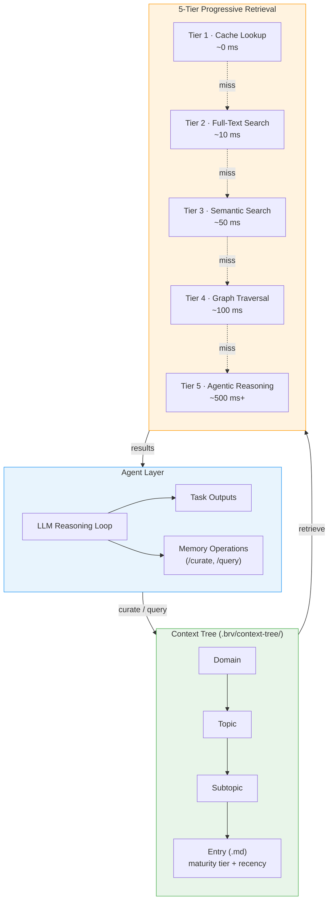
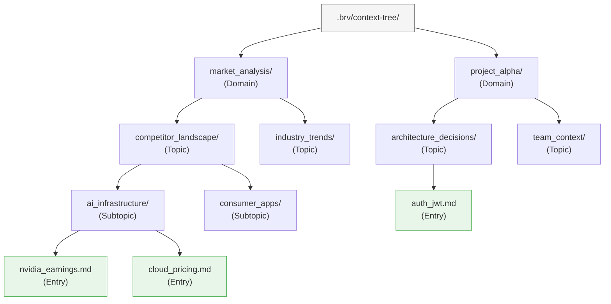
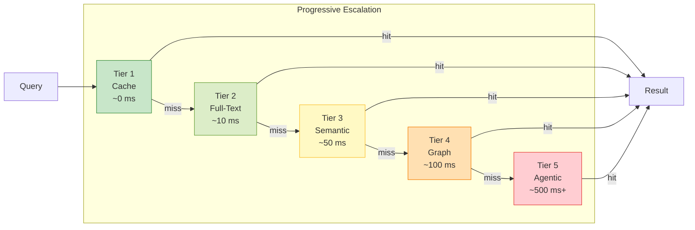

# ByteRover — 智能体原生记忆

**网站：** [byterover.dev](https://www.byterover.dev) | **GitHub：** 4.2K+ stars | **许可证：** 专有 CLI，文档开放 | **论文：** [arXiv:2604.01599](https://arxiv.org/html/2604.01599v1)（2026 年 4 月）

> 推理任务的同一个 LLM 也负责维护你的记忆——没有单独的提取流水线，没有向量数据库，没有图存储。只有目录树中的 markdown 文件。

---

## 架构概览

ByteRover 颠覆了传统的记忆流水线。大多数系统将记忆层*附加*到智能体上，而 ByteRover 让智能体*本身*成为记忆的策展者。架构分为三个逻辑层：智能体层（LLM 推理循环）、上下文树（基于文件的知识图谱）和五级渐进式检索。



关键洞察在于反馈循环：智能体在学到新知识时写入上下文树，需要上下文时从渐进式检索中读取。没有单独的"记忆服务"——LLM 在同一个推理循环中同时充当消费者和策展者。

---

## 上下文树

上下文树是一个完全存储在 `.brv/context-tree/` 目录中的基于文件的知识图谱。它使用四级层次结构：**领域 >> 主题 >> 子主题 >> 条目**。每个条目都是一个带有成熟度和时效性元数据的纯 markdown 文件。



### 条目格式

每个条目是一个 markdown 文件。frontmatter 携带检索系统用于排序的元数据：

```markdown
---
maturity: established        # seed → growing → established → canonical
last_accessed: 2026-04-10
created: 2026-03-15
access_count: 12
tags: [auth, jwt, security]
---

# JWT Authentication

Auth uses JWT with 24h expiry, issued by `src/middleware/auth.ts`.
Refresh tokens stored in HTTP-only cookies with 7d TTL.
```

**成熟度层级**使系统能区分推测性笔记和经过实战验证的知识：

| 层级 | 含义 | 典型时间跨度 |
|------|---------|-------------|
| `seed` | 初始捕获，未验证 | < 1 天 |
| `growing` | 多次访问，部分验证 | 1–7 天 |
| `established` | 频繁引用，稳定 | 1–4 周 |
| `canonical` | 核心知识，极少变化 | 4+ 周 |

条目随着智能体的访问自然晋升到更高层级。长期未被访问的过时条目在检索优先级中衰减，但不会被删除——文件系统作为长期归档。

### 为什么用文件？

全 markdown 方式有三个实际结果：

1. **可审计性。** 任何开发者都可以打开 `.brv/context-tree/` 并准确读取智能体"知道"的内容。没有不透明的嵌入向量，没有序列化的图转储。
2. **版本控制。** 标准的 `git diff` 对记忆变更有效。Pull request 可以将记忆更新与代码变更一起包含。
3. **零基础设施。** 无需管理数据库进程，无需保持嵌入服务运行，无需 schema 迁移。

---

## 五级渐进式检索

当智能体发出 `/query` 时，ByteRover 不会立即触发昂贵的 LLM 调用。相反，它逐级升级五个检索层级，在找到足够自信的答案后立即停止。每一层比上一层更强大——也更昂贵。



| 层级 | 机制 | 延迟 | 成本 | 触发时机 |
|------|-----------|---------|------|---------------|
| 1 | **缓存查找** — 近期查询及其结果的内存 LRU 缓存 | ~0 ms | 免费 | 同一会话中的重复或近似相同查询 |
| 2 | **全文搜索** — 对条目内容和标签的关键词匹配 | ~10 ms | 免费 | 包含特定术语的查询（函数名、配置键、错误码） |
| 3 | **语义搜索** — 对条目内容的嵌入相似度 | ~50 ms | 嵌入调用 | 精确关键词不匹配的概念性查询 |
| 4 | **图遍历** — 沿领域 → 主题 → 子主题层次结构查找相关条目 | ~100 ms | 免费 | 跨多个主题的宽泛查询 |
| 5 | **智能体推理** — 完整 LLM 调用，从多个检索条目中综合答案 | ~500 ms+ | LLM 调用 | 需要交叉引用的复杂或模糊查询 |

实际效果：编码会话中大多数查询在第 1–2 层（缓存和全文搜索）就解决了，使延迟和成本接近零。昂贵的层级仅在真正新颖或复杂的问题时触发。

---

## CLI 和使用方法

### 安装

```bash
# Script install
curl -fsSL https://www.byterover.dev/install.sh | sh

# Or via npm
npm install -g byterover-cli
```

### 交互式 REPL

```bash
cd your/project
brv                     # launches the REPL
```

在 REPL 中，两个核心命令驱动所有记忆操作：

```bash
# Curate: teach the agent something
/curate "Auth uses JWT with 24h expiry, refresh via HTTP-only cookie" @src/middleware/auth.ts

# Query: ask the agent something
/query How is authentication implemented?
```

`/curate` 命令接受一个可选的文件引用（`@path`），将记忆条目链接到特定源文件。这创建了一个双向链接：条目知道它来自哪里，关于该文件的查询也会浮现该条目。

### 批量导入

现有知识可以从 markdown 文件或整个目录导入：

```bash
# Import a single file
brv curate -f ~/notes/MEMORY.md

# Import all files in a directory
brv curate --folder ~/project/docs/
```

智能体处理每个文件，提取不同的事实，并将它们放入上下文树中的适当位置。

### 提供商配置

ByteRover 支持 18 个 LLM 提供商。配置是交互式的：

```bash
brv providers connect    # interactive provider setup
brv providers list       # show configured providers
```

---

## 演练：策划认证知识

为了使架构更具体，让我们追踪一个现实场景。一个编码智能体在项目中首次遇到认证系统。

### 步骤 1 — 智能体策划

开发者（或智能体本身在代码审查期间）运行：

```bash
/curate "Auth uses JWT with 24h expiry. Tokens issued by authMiddleware() \
in src/middleware/auth.ts. Refresh tokens stored in HTTP-only cookies with \
7d TTL. CSRF protection via double-submit cookie pattern." @src/middleware/auth.ts
```

ByteRover 的智能体层处理这条信息：

1. **分类** — LLM 确定这属于 `project/architecture_decisions/authentication/`。
2. **创建** — 创建一个新的条目文件：

```
.brv/context-tree/
└── project/
    └── architecture_decisions/
        └── authentication/
            └── jwt_auth_flow.md     ← new entry
```

3. **标注** — 条目标记为 `maturity: seed`，附带当前时间戳。

### 步骤 2 — 稍后，智能体查询

一周后，智能体在实现新的 API 端点时需要认证上下文：

```bash
/query How should I protect the new /api/billing endpoint?
```

五级检索启动：

- **第 1 层（缓存）：** 未命中——这是一个新查询。
- **第 2 层（全文搜索）：** 命中——术语 "auth" 匹配到 `jwt_auth_flow.md`。但查询是关于*如何应用*认证，而非*什么是*认证。
- **第 3 层（语义搜索）：** 命中——嵌入相似度浮现了 `jwt_auth_flow.md` 和一个相关的 `csrf_protection.md` 条目。
- 返回结果。第 4–5 层永远不会被触及。

智能体基于检索到的条目给出综合答案：

> Apply `authMiddleware()` from `src/middleware/auth.ts`. The JWT has a 24h expiry. Ensure the endpoint also validates the CSRF double-submit cookie. See `.brv/context-tree/project/architecture_decisions/authentication/jwt_auth_flow.md`.

### 步骤 3 — 成熟度晋升

因为 `jwt_auth_flow.md` 已被跨会话多次访问，其成熟度从 `seed` 晋升为 `growing`。再经过几次访问后，它达到 `established`——检索系统现在对它排名更高，缓存保留时间更长。

---

## 类 Git 的记忆版本控制

ByteRover 将上下文树视为一等公民的版本化产物。版本控制系统镜像了 Git 的心智模型，但专门针对记忆操作：

```bash
# Initialize version control for the context tree
brv vc init

# Stage changes (new, modified, or deleted entries)
brv vc add

# Commit with a message
brv vc commit -m "Added auth context and billing requirements"

# Push to a shared remote (team memory)
brv vc push

# Pull team updates
brv vc pull
```

### 分支与合并

```bash
# Create a branch for experimental memory
brv vc branch feature/new-billing-context

# Work on that branch (curate, query, etc.)
/curate "Billing uses Stripe with webhook verification"

# Merge back to main when validated
brv vc checkout main
brv vc merge feature/new-billing-context
```

### 重要意义

版本控制的记忆使传统记忆系统不可能的工作流成为可能：

| 工作流 | 实现方式 |
|----------|-------------|
| **代码审查包含记忆审查** | PR 可以将 `.brv/context-tree/` 的 `git diff` 与代码变更一起展示 |
| **团队知识共享** | `brv vc push` / `brv vc pull` 在开发者之间同步策划的知识 |
| **记忆回滚** | 策划有误？回滚到之前的提交 |
| **按实验分支** | 尝试不同的记忆结构，不污染主树 |
| **新人入职** | 新团队成员通过 `brv vc pull` 继承团队积累的项目上下文 |

因为上下文树只是目录中的文件，它自然融入现有的 Git 工作流。团队甚至可以将 `.brv/` 存储在主仓库中，在同一个提交历史中追踪记忆变更和代码变更。

---

## 沙盒内 LLM 策划

ByteRover 的一个核心架构决策是：执行智能体主要任务的*同一个 LLM 实例*也执行记忆策划。这就是"智能体原生"在实践中的含义。

### 工作原理

在传统记忆系统中，流水线如下：

```
Agent LLM → produces output → separate Memory LLM → extracts facts → stores
```

ByteRover 将其折叠为单一循环：

```
Agent LLM → produces output AND memory operations → stores directly
```

LLM 在一个沙盒化环境中运行，同时拥有任务工具（代码编辑、文件读取、网页搜索）和记忆工具（`/curate`、`/query`）的访问权限。沙盒确保：

1. **原子操作。** 一次策划操作要么完全完成，要么被回滚。不存在部分写入。
2. **隔离性。** 来自一个会话的记忆操作在通过版本控制显式提交前不会干扰另一个会话。
3. **成本意识。** LLM 根据信息的新颖性和重要性来决定*何时*策划。不是每行对话都会变成记忆——只有智能体判断值得保留的洞察才会。

### 权衡

统一方式有明显的优势——没有第二条提取流水线的延迟，智能体理解的内容与存储的内容之间没有语义漂移，没有额外的基础设施。但这也意味着每次策划操作都消耗主 LLM 的 Token。对于昂贵的模型，这是一个实际的成本考量。ByteRover 通过支持 18 个提供商来缓解这一问题，允许团队为记忆密集型工作负载使用更便宜的模型。

---

## MCP 集成

ByteRover 通过 [Model Context Protocol](https://modelcontextprotocol.io/) 暴露其记忆操作，使其可从多个 AI 原生编辑器和工具访问：

| 工具 | 集成方式 |
|------|-------------|
| **Cursor** | 项目设置中的 MCP 服务器 |
| **Claude Code** | 原生 MCP 支持 |
| **OpenClaw** | MCP 插件 |

通过 MCP，`/curate` 和 `/query` 命令可作为任何 MCP 兼容智能体的工具调用使用。这意味着开发者可以在 Cursor 中策划知识，而在同一项目上工作的 Claude Code 智能体可以立即访问该知识。

---

## 基准测试

ByteRover 在 LoCoMo 基准测试中报告了强劲的结果，该测试通过单跳、多跳、时间和开放领域问题来评估长对话记忆：

| 配置 | LoCoMo 得分 | 备注 |
|---------------|-------------|-------|
| 最佳运行 | **92.2%** | 完整五级检索 |
| 轻量运行 | **90.9%** | 仅第 1–3 层（无图遍历、无智能体推理） |
| 论文报告 | **96.1%** | arXiv:2604.01599 |

### 子类别详情（最佳运行）

| 类别 | 得分 |
|----------|-------|
| 单跳 | **95.4%** |
| 多跳 | 88.1% |
| 时间 | **94.4%** |
| 开放领域 | 90.5% |

系统在单跳检索（上下文树层次结构提供直接查找路径）和时间查询（时效性元数据提供自然排序）方面表现尤为突出。

### 参考对比

以下是同一基准测试中相近系统的结果供参考：

| 系统 | LoCoMo 得分 |
|--------|-------------|
| **ByteRover**（论文） | **96.1%** |
| **ByteRover**（最佳运行） | **92.2%** |
| Hindsight（Gemini-3） | 89.6% |
| Mem0 | 66.9% |

---

## 优势

- **人类可读、可审计的记忆。** 上下文树就是 markdown 文件。任何开发者都可以检查、编辑或通过 `grep` 搜索智能体的知识库。
- **零基础设施依赖。** 无需向量数据库、图数据库或嵌入服务的预置和维护。一切在本地运行。
- **强劲的基准表现。** LoCoMo 上 92.2–96.1% 的成绩使 ByteRover 处于当前系统的顶尖或接近顶尖水平。
- **Git 原生工作流。** 记忆的版本控制与现有的开发者工作流集成——PR、分支、合并和回滚都可用。
- **本地优先，保护隐私。** 所有数据保存在磁盘上。除非开发者显式推送，否则不会进行云同步。
- **广泛的 LLM 支持。** 18 个提供商意味着团队不会被锁定到单一供应商。
- **渐进式检索。** 五级系统使大多数查询快速且低成本，同时仍能处理复杂问题。

## 局限性

- **聚焦于编码智能体。** ByteRover 主要为编码工作流设计和测试。其在通用对话智能体或企业知识管理方面的有效性尚未充分验证。
- **CLI 优先的界面。** 系统围绕终端 REPL 和 MCP 集成构建。需要为 Web 应用嵌入 SDK 的团队可能会发现集成面较窄。
- **每次策划的 LLM 成本。** 每次 `/curate` 操作都涉及一次 LLM 调用用于分类和放置。高频策划可能累积成本，特别是使用昂贵模型时。
- **较小的社区。** 4.2K GitHub stars 意味着 ByteRover 的社区动力不如 Mem0（38K+）或 Letta（40K+）。可用的社区贡献集成和示例更少。
- **专有 CLI。** 虽然文档和上下文树格式是开放的，但 CLI 本身是专有的。团队无法 fork 或修改核心工具。
- **扩展上限。** 基于文件的方式适用于项目级别的知识（数百到几千个条目）。对于大规模知识库，缺乏适当的数据库可能成为瓶颈。

## 最佳适用场景

- **编码智能体和开发者工具。** MCP 集成、基于文件的存储和 Git 工作流专为软件开发场景而构建。
- **注重隐私的团队。** 本地优先的存储且无强制性云组件，适合受监管行业和注重安全的组织。
- **需要可审计 AI 知识的团队。** 基于 markdown 的上下文树在透明度上是向量数据库和图存储无法比拟的。
- **多工具工作流。** 使用 Cursor、Claude Code 和/或 OpenClaw 的团队可以在所有工具间共享单一记忆层。
- **中小规模知识库。** 策划的总知识量能舒适地放入文件树中的项目（大多数软件项目都符合条件）。

---

**返回：[第 3 章 — 服务商深入解析](../03_providers.md)**
