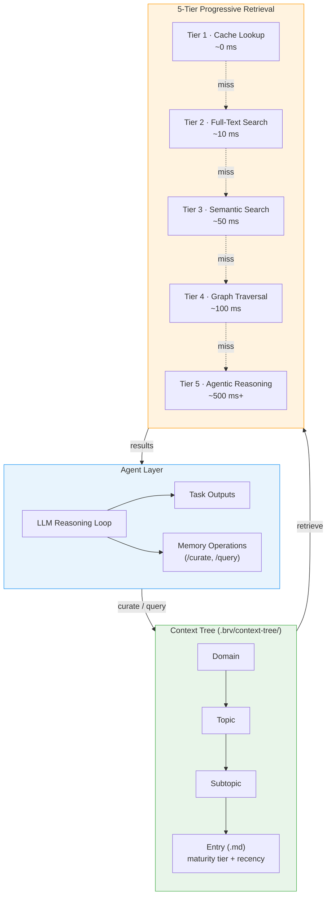
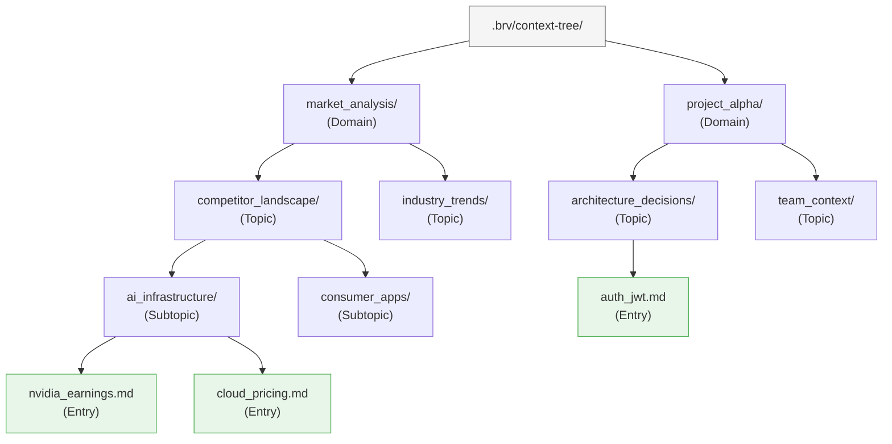
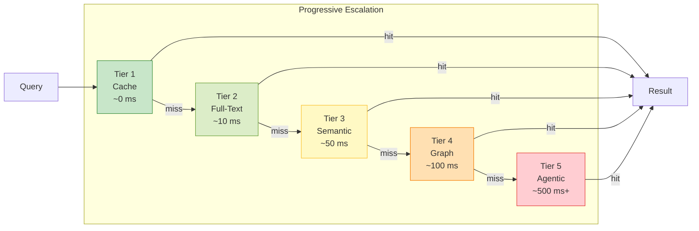

# ByteRover — 智能体原生记忆

**网站：** [byterover.dev](https://www.byterover.dev) | **GitHub：** 4.2K+ stars | **许可证：** 专有 CLI，文档开放 | **论文：** [arXiv:2604.01599](https://arxiv.org/html/2604.01599v1)（2026 年 4 月）

> 跑推理任务的那个 LLM 同时也在维护你的记忆——没有单独的提取流水线，没有向量库，没有图存储。就是目录树里的一堆 markdown 文件。

---

## 架构概览

ByteRover 把传统的记忆流水线反过来了。多数系统是给智能体*旁挂*一个记忆层，ByteRover 让智能体*自己*就是记忆的策展人。架构分三个逻辑层：智能体层（LLM 推理循环）、上下文树（基于文件的知识图谱）、五级渐进式检索。



这里的关键是反馈循环：智能体学到新东西就往上下文树里写，需要上下文就从渐进式检索里读。没有独立的"记忆服务"——LLM 在同一个推理循环里既是消费者也是策展人。

---

## 上下文树

上下文树是一个完全存在 `.brv/context-tree/` 目录里的文件化知识图谱，用四级层次结构组织：**领域 >> 主题 >> 子主题 >> 条目**。每个条目就是一个 markdown 文件，带着成熟度和时效性元数据。



### 条目格式

每个条目就是一个 markdown 文件。frontmatter 里带着检索系统排序用的元数据：

```markdown
---
maturity: established        # seed → growing → established → canonical
last_accessed: 2026-04-10
created: 2026-03-15
access_count: 12
tags: [auth, jwt, security]
---

# JWT Authentication

Auth uses JWT with 24h expiry, issued by `src/middleware/auth.ts`.
Refresh tokens stored in HTTP-only cookies with 7d TTL.
```

**成熟度层级**让系统能区分随手记下的推测和经过实战验证的知识：

| 层级 | 含义 | 典型时间跨度 |
|------|---------|-------------|
| `seed` | 初始捕获，未验证 | < 1 天 |
| `growing` | 多次访问，部分验证 | 1–7 天 |
| `established` | 频繁引用，稳定 | 1–4 周 |
| `canonical` | 核心知识，极少变化 | 4+ 周 |

条目随着被智能体反复访问，会自然晋升到更高层级。长期没人看的过时条目在检索优先级上衰减，但不会被删掉——文件系统本身就是长期归档。

### 为什么用文件？

全 markdown 的做法带来三个实实在在的好处：

1. **可审计。** 任何开发者打开 `.brv/context-tree/` 就能看到智能体"知道"什么。没有不透明的嵌入向量，没有序列化的图转储。
2. **可版本控制。** `git diff` 直接就能看记忆变更。Pull request 里可以把记忆更新和代码变更放在一起审。
3. **零基础设施。** 不用管数据库进程，不用养嵌入服务，不用做 schema 迁移。

---

## 五级渐进式检索

智能体发出 `/query` 时，ByteRover 不会一上来就触发昂贵的 LLM 调用。它沿五个检索层级逐级往上走，一旦找到足够有把握的答案就停下来。每往上一层更强——也更贵。



| 层级 | 机制 | 延迟 | 成本 | 触发时机 |
|------|-----------|---------|------|---------------|
| 1 | **缓存查找** — 近期查询及其结果的内存 LRU 缓存 | ~0 ms | 免费 | 同一会话中的重复或近似相同查询 |
| 2 | **全文搜索** — 对条目内容和标签的关键词匹配 | ~10 ms | 免费 | 包含特定术语的查询（函数名、配置键、错误码） |
| 3 | **语义搜索** — 对条目内容的嵌入相似度 | ~50 ms | 嵌入调用 | 精确关键词不匹配的概念性查询 |
| 4 | **图遍历** — 沿领域 → 主题 → 子主题层次结构查找相关条目 | ~100 ms | 免费 | 跨多个主题的宽泛查询 |
| 5 | **智能体推理** — 完整 LLM 调用，从多个检索条目中综合答案 | ~500 ms+ | LLM 调用 | 需要交叉引用的复杂或模糊查询 |

实际跑起来的效果：编码会话中大多数查询在第 1–2 层（缓存和全文搜索）就解决了，延迟和成本接近零。昂贵的层级只在真正新颖或复杂的问题上才会触发。

---

## CLI 和使用方法

### 安装

```bash
# Script install
curl -fsSL https://www.byterover.dev/install.sh | sh

# Or via npm
npm install -g byterover-cli
```

### 交互式 REPL

```bash
cd your/project
brv                     # launches the REPL
```

REPL 里两个核心命令就能驱动所有记忆操作：

```bash
# Curate: teach the agent something
/curate "Auth uses JWT with 24h expiry, refresh via HTTP-only cookie" @src/middleware/auth.ts

# Query: ask the agent something
/query How is authentication implemented?
```

`/curate` 接受一个可选的文件引用（`@path`），把记忆条目和源文件关联起来。这是一个双向链接：条目知道自己从哪来，查询那个文件时也会把这条记忆浮上来。

### 批量导入

已有的知识可以从 markdown 文件或整个目录批量导入：

```bash
# Import a single file
brv curate -f ~/notes/MEMORY.md

# Import all files in a directory
brv curate --folder ~/project/docs/
```

智能体会逐个处理文件，提取出不同的事实，然后把它们归入上下文树的合适位置。

### 提供商配置

ByteRover 支持 18 个 LLM 提供商。配置是交互式的：

```bash
brv providers connect    # interactive provider setup
brv providers list       # show configured providers
```

---

## 演练：策划认证知识

来看一个具体场景，把架构落到实处。一个编码智能体第一次碰到项目里的认证系统。

### 步骤 1 — 智能体策划

开发者（或者智能体自己在做代码审查时）执行：

```bash
/curate "Auth uses JWT with 24h expiry. Tokens issued by authMiddleware() \
in src/middleware/auth.ts. Refresh tokens stored in HTTP-only cookies with \
7d TTL. CSRF protection via double-submit cookie pattern." @src/middleware/auth.ts
```

ByteRover 的智能体层接手处理：

1. **分类** — LLM 判定这属于 `project/architecture_decisions/authentication/`。
2. **建文件** — 创建一个新条目：

```
.brv/context-tree/
└── project/
    └── architecture_decisions/
        └── authentication/
            └── jwt_auth_flow.md     ← new entry
```

3. **标注** — 条目标记为 `maturity: seed`，附带当前时间戳。

### 步骤 2 — 稍后，智能体查询

一周后，智能体在实现一个新的 API 端点时需要认证方面的上下文：

```bash
/query How should I protect the new /api/billing endpoint?
```

五级检索开始逐级跑：

- **第 1 层（缓存）：** 未命中——这是个新查询。
- **第 2 层（全文搜索）：** 命中了——"auth" 匹配到 `jwt_auth_flow.md`。但查询问的是*怎么应用*认证，不是*什么是*认证。
- **第 3 层（语义搜索）：** 命中——嵌入相似度把 `jwt_auth_flow.md` 和一个相关的 `csrf_protection.md` 条目都浮了上来。
- 返回结果。第 4–5 层根本没机会触发。

智能体根据检索到的条目综合出答案：

> Apply `authMiddleware()` from `src/middleware/auth.ts`. The JWT has a 24h expiry. Ensure the endpoint also validates the CSRF double-submit cookie. See `.brv/context-tree/project/architecture_decisions/authentication/jwt_auth_flow.md`.

### 步骤 3 — 成熟度晋升

`jwt_auth_flow.md` 已经被跨会话多次访问了，成熟度从 `seed` 晋升为 `growing`。再被访问几次后就会到 `established`——检索系统会把它排得更高，缓存里也留得更久。

---

## 类 Git 的记忆版本控制

ByteRover 把上下文树当作一等公民的版本化产物来对待。版本控制系统沿用了 Git 的心智模型，但专门针对记忆操作：

```bash
# Initialize version control for the context tree
brv vc init

# Stage changes (new, modified, or deleted entries)
brv vc add

# Commit with a message
brv vc commit -m "Added auth context and billing requirements"

# Push to a shared remote (team memory)
brv vc push

# Pull team updates
brv vc pull
```

### 分支与合并

```bash
# Create a branch for experimental memory
brv vc branch feature/new-billing-context

# Work on that branch (curate, query, etc.)
/curate "Billing uses Stripe with webhook verification"

# Merge back to main when validated
brv vc checkout main
brv vc merge feature/new-billing-context
```

### 重要意义

有了版本控制的记忆，一些传统记忆系统做不到的工作流就成了可能：

| 工作流 | 实现方式 |
|----------|-------------|
| **代码审查顺带审记忆** | PR 里可以把 `.brv/context-tree/` 的 `git diff` 和代码变更一起展示 |
| **团队知识共享** | `brv vc push` / `brv vc pull` 在开发者之间同步策划的知识 |
| **记忆回滚** | 策划错了？回滚到上一个提交就行 |
| **按实验分支** | 试不同的记忆组织方式，不会污染主树 |
| **新人入职** | 新成员 `brv vc pull` 一下就继承了团队积累的项目上下文 |

因为上下文树就是目录里的文件，天然融入已有的 Git 工作流。团队甚至可以把 `.brv/` 存在主仓库里，在同一个提交历史中同时追踪记忆变更和代码变更。

---

## 沙盒内 LLM 策划

ByteRover 的一个核心架构决策：执行主要任务的*那个 LLM 实例*同时也负责记忆策划。这就是"智能体原生"在实践中的含义。

### 工作原理

传统记忆系统的流水线长这样：

```
Agent LLM → produces output → separate Memory LLM → extracts facts → stores
```

ByteRover 把它折叠成一个循环：

```
Agent LLM → produces output AND memory operations → stores directly
```

LLM 在沙盒环境里运行，同时拿到任务工具（代码编辑、文件读取、网页搜索）和记忆工具（`/curate`、`/query`）。沙盒保证了三件事：

1. **原子性。** 一次策划要么完整执行，要么整体回滚。不存在写了一半的情况。
2. **隔离性。** 一个会话里的记忆操作，在通过版本控制显式提交之前，不会影响到另一个会话。
3. **成本意识。** LLM 会根据信息的新颖程度和重要性来判断*要不要*策划。不是每句对话都会变成记忆——只有智能体觉得值得留下的洞察才会。

### 权衡

统一方式的好处很明显——没有第二条提取流水线带来的延迟，智能体理解的内容和存储的内容之间不会有语义漂移，也不需要额外基础设施。但代价是每次策划都在消耗主 LLM 的 Token。如果用的是贵模型，这就是个实打实的成本问题。ByteRover 的应对办法是支持 18 个 LLM 提供商，团队可以为记忆密集型的工作负载换上便宜的模型。

---

## MCP 集成

ByteRover 通过 [Model Context Protocol](https://modelcontextprotocol.io/) 暴露记忆操作，多个 AI 原生编辑器和工具都能接入：

| 工具 | 集成方式 |
|------|-------------|
| **Cursor** | 项目设置中的 MCP 服务器 |
| **Claude Code** | 原生 MCP 支持 |
| **OpenClaw** | MCP 插件 |

通过 MCP，`/curate` 和 `/query` 变成了任何 MCP 兼容智能体的工具调用。也就是说，开发者可以在 Cursor 里策划知识，而在同一个项目上工作的 Claude Code 智能体可以立即访问到。

---

## 基准测试

ByteRover 在 LoCoMo 基准测试上的成绩相当强。这个基准从单跳、多跳、时间和开放领域四个维度评估长对话记忆：

| 配置 | LoCoMo 得分 | 备注 |
|---------------|-------------|-------|
| 最佳运行 | **92.2%** | 完整五级检索 |
| 轻量运行 | **90.9%** | 仅第 1–3 层（无图遍历、无智能体推理） |
| 论文报告 | **96.1%** | arXiv:2604.01599 |

### 子类别详情（最佳运行）

| 类别 | 得分 |
|----------|-------|
| 单跳 | **95.4%** |
| 多跳 | 88.1% |
| 时间 | **94.4%** |
| 开放领域 | 90.5% |

系统在单跳检索（上下文树的层次结构天然提供直达路径）和时间查询（时效性元数据天然支持排序）上表现尤为突出。

### 参考对比

同一基准上其他相近系统的成绩，供对比参考：

| 系统 | LoCoMo 得分 |
|--------|-------------|
| **ByteRover**（论文） | **96.1%** |
| **ByteRover**（最佳运行） | **92.2%** |
| Hindsight（Gemini-3） | 89.6% |
| Mem0 | 66.9% |

---

## 优势

- **记忆人类可读、可审计。** 上下文树就是 markdown 文件。任何开发者都能打开看、直接改、用 `grep` 搜。
- **零基础设施依赖。** 不用装向量库、图数据库或嵌入服务。一切在本地跑。
- **基准成绩强。** LoCoMo 上 92.2–96.1%，在当前系统中处于顶尖或接近顶尖。
- **Git 原生工作流。** 记忆的版本控制跟开发者已有的工作流无缝衔接——PR、分支、合并、回滚全都能用。
- **本地优先，隐私可控。** 所有数据都在本地磁盘上。开发者不主动推送就不会有云同步。
- **LLM 选择面广。** 支持 18 个提供商，不会被单一供应商锁死。
- **渐进式检索。** 五级体系让大部分查询又快又便宜，同时不丢处理复杂问题的能力。

## 局限性

- **聚焦编码场景。** ByteRover 主要为编码工作流设计和测试过。在通用对话智能体或企业知识管理上的效果还没得到充分验证。
- **CLI 优先。** 系统围绕终端 REPL 和 MCP 集成来构建。如果团队需要在 Web 应用里嵌 SDK，会发现可集成的面比较窄。
- **每次策划都有 LLM 成本。** 每次 `/curate` 都要调一次 LLM 做分类和放置。策划频率高的话，成本会累积，尤其是用贵模型的时候。
- **社区较小。** 4.2K GitHub stars，社区活跃度不如 Mem0（38K+）和 Letta（40K+）。能找到的社区集成和示例也更少。
- **CLI 是专有的。** 文档和上下文树格式是开放的，但 CLI 本身是闭源的。团队没法 fork 或改动核心工具。
- **规模有天花板。** 基于文件的做法适合项目级别的知识量（几百到几千条目）。知识库再大，缺少正经数据库可能就成瓶颈了。

## 最佳适用场景

- **编码智能体和开发者工具。** MCP 集成、文件存储、Git 工作流，就是为软件开发场景量身打造的。
- **注重隐私的团队。** 本地优先存储、没有强制云组件，适合受监管行业和安全要求高的组织。
- **需要 AI 知识可审计的团队。** markdown 上下文树在透明度上，是向量库和图存储比不了的。
- **多工具工作流。** 同时用 Cursor、Claude Code 和/或 OpenClaw 的团队，可以在所有工具间共享同一个记忆层。
- **中小规模知识库。** 策划的知识总量能舒服地放进文件树的项目（绝大多数软件项目都够用）。

---

**返回：[第 3 章 — 服务商深入解析](../03_providers.md)**
