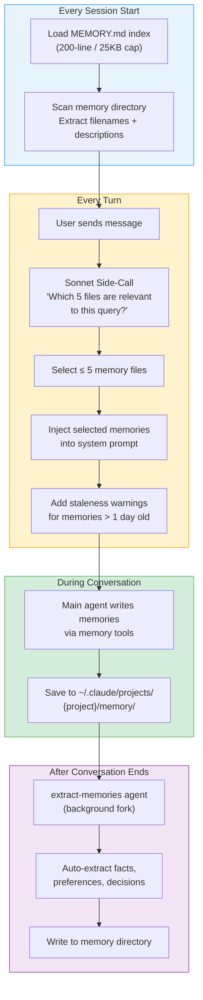
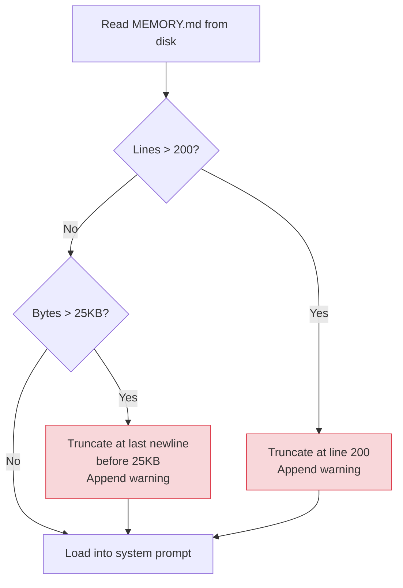
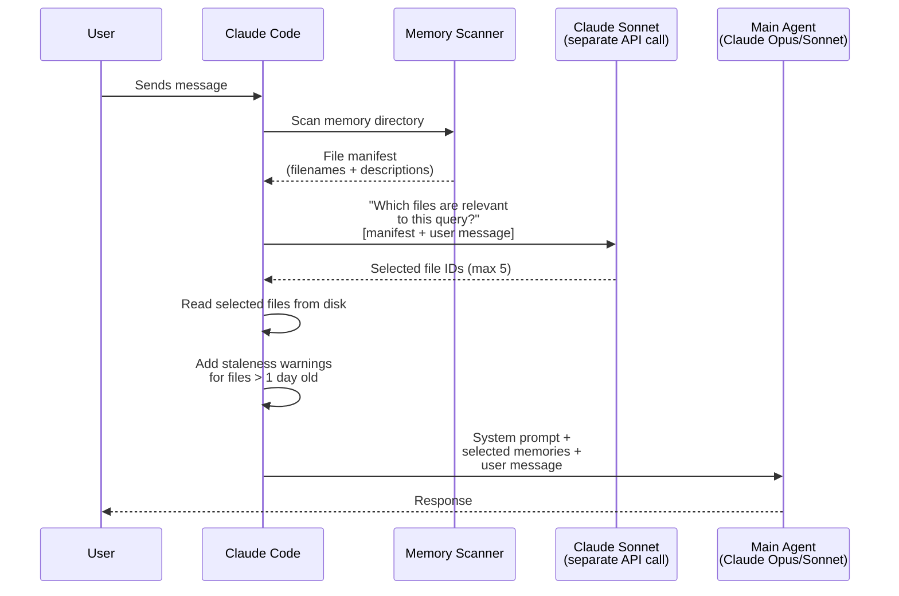
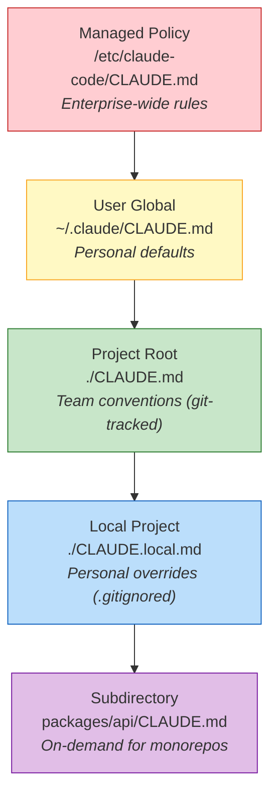
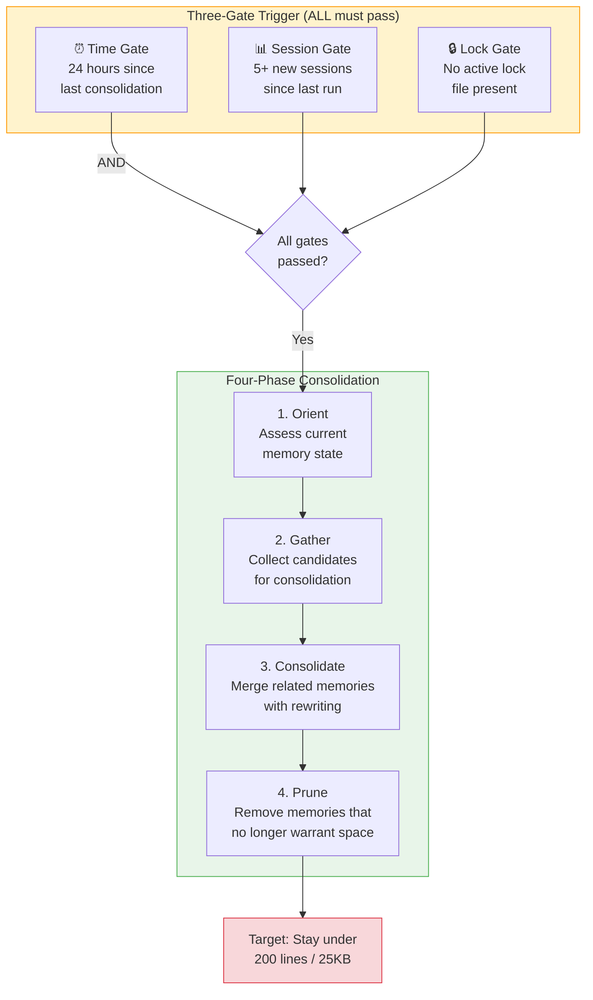
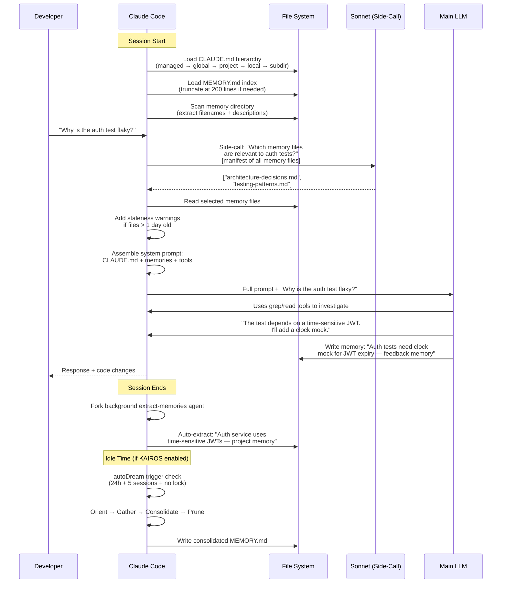

# Claude Code — 深入解析（基于泄露源代码）

> **一句话概括：** 一套基于文件的记忆系统，200 行索引上限、Sonnet 驱动的检索侧调用、一个从未公开的自主守护进程——这一切在 512,000 行 TypeScript 源码随 npm source map 意外流出时浮出水面。

| 统计项 | 值 |
|------|-------|
| **运行时** | 100% TypeScript，运行于 Bun |
| **源码规模** | ~512,000 行，横跨 ~1,900 个文件 |
| **泄露日期** | 2026 年 3 月 31 日（npm v2.1.88） |
| **泄露原因** | `.npmignore` 缺少条目 + Bun 打包器 bug 导致 source map 在生产环境中被提供 |
| **记忆源码** | `src/memdir/`（7 个文件） |
| **索引上限** | 200 行 / 25KB |
| **检索限制** | 每轮 5 个文件 |
| **检索方法** | Sonnet 基于文件名的侧调用（无嵌入） |
| **未发布系统** | KAIROS 守护进程、autoDream 整合、TEAMMEM |

---

## 泄露事件始末

2026 年 3 月 31 日，安全研究员 Chaofan Shou 发现了一件不得了的事：Claude Code 的 npm 包（版本 2.1.88）里藏着一个 59.8 MB 的 source map 文件。Source map 的本职工作是帮开发者调试压缩后的代码——但它同时也意味着，任何人都可以把生产环境中混淆过的代码完整还原为可读的 TypeScript 源码。

这个 `.map` 文件包含了一切：每个模块、每段系统提示词、每个功能标志。

事情的起因是两个 bug 的不幸叠加：`.npmignore` 里漏写了一条规则，而 Bun 打包器恰好有个已知 bug 会在生产构建中保留 source map。代码在数小时内扩散到 GitHub 镜像，其中一个 fork 在 Anthropic 发出（后来部分撤回的）DMCA 通知之前就已斩获 75,700+ stars。

工程师们自然第一时间扑向最刺激的部分——系统提示词、计费逻辑、工具定义。但真正在架构层面最耐人寻味的，反而是一个不那么显眼的角落：`src/memdir/` 目录下仅有的七个文件，构成了 Claude Code 的完整记忆系统。

---

## 架构概览

Claude Code 的记忆系统令人意外地简洁——它本质上就是**一堆 Markdown 文件**，外加一个 **LLM 驱动的检索层**。没有向量数据库、没有嵌入模型、没有知识图谱。磁盘上的纯文本文件，加上一个会读文件名的语言模型，仅此而已。



### 五个核心模块

源码揭示了构成完整记忆系统的五个模块：

| 模块 | 源文件 | 职责 |
|--------|------------|----------|
| **路径解析** | `src/memdir/paths.ts` | 计算记忆存储路径，执行安全校验 |
| **提示词构建** | `src/memdir/memdir.ts` | 将记忆指令和内容注入系统提示词 |
| **记忆扫描** | `src/memdir/memoryScan.ts` | 扫描目录，解析记忆文件的 frontmatter |
| **智能检索** | `src/memdir/findRelevantMemories.ts` | 通过 Sonnet 侧调用选出相关记忆文件 |
| **自动抽取** | `src/services/extractMemories/` | 会话结束后自动提取记忆的后台智能体 |

---

## 记忆目录结构

记忆就是磁盘上的 Markdown 文件，一目了然：

```
~/.claude/
├── CLAUDE.md                          # Global instructions (loaded every session)
├── projects/
│   └── {sanitized-git-root}/
│       └── memory/
│           ├── MEMORY.md              # Index file (200-line cap)
│           ├── user-preferences.md    # User memories
│           ├── architecture-decisions.md  # Project memories
│           ├── testing-patterns.md    # Feedback memories
│           └── external-refs.md       # Reference memories
└── settings.json                      # Permissions, hooks, etc.
```

### 路径解析优先级

源码（`paths.ts`）按以下顺序确定记忆目录的位置：

1. `CLAUDE_COWORK_MEMORY_PATH_OVERRIDE` 环境变量（最高优先级）
2. `settings.json` → `autoMemoryDirectory` 设置
3. 默认值：`~/.claude/projects/{sanitized-git-root}/memory/`

### 安全校验

路径解析器会果断拒绝以下路径：
- 相对路径（`../foo`）
- 根路径或接近根路径（`/`、`/a`）
- Windows 驱动器根路径（`C:\`）
- UNC 网络路径（`\\server\share`）
- 空字节

这里有一个值得注意的安全设计：**项目级别**的 `.claude/settings.json` 无法设置 `autoMemoryDirectory`。这就堵死了一种攻击路径——恶意仓库无法通过配置文件把记忆写入项目外的敏感目录。

---

## MEMORY.md 索引：200 行的硬上限

`MEMORY.md` 是整个记忆系统的入口——一个索引文件，Claude 在每次会话开始时读取它来了解有哪些记忆可用。`memdir.ts` 中的源码设定了两道硬限制：

| 限制 | 值 | 实现方式 |
|-------|-------|-------------|
| **行数上限** | 200 行 | `truncateEntrypointContent()` |
| **字节上限** | 25,000 字节 | 同一函数的二次检查 |

### 截断机制



截断警告会被附加到 Claude 看到的内容里，但用户这边什么都看不到。失败模式是**完全静默**的：第 201 条记录从索引中消失，Claude 不知道它存在过，用户也收不到任何报错或日志。

### 这在实际使用中意味着什么

一个每天使用 Claude Code 三个月的开发者，累积的记忆条数轻松过百。当第 201 条被写入时，事情开始变得微妙：

1. 最早的一批记忆从索引中悄然消失
2. Claude 启动会话时加载的系统提示词里完全不包含这些记忆
3. Claude 可能会做出与之前架构决策相矛盾的建议
4. Claude 可能会重新追问它其实已经"学过"答案的问题
5. 而用户全程不会收到任何提醒

更隐蔽的是，过期警告只对*已加载*的记忆生效。被截断出索引的记忆永远不会被加载，因此也永远不会触发过期提醒——它们就这样无声无息地"蒸发"了。

---

## 四种记忆类型

源码将所有记忆严格限定为四个类别：

| 类型 | 归属 | 存储内容 | 示例 |
|------|-------|---------------|---------|
| **User** | 私有 | 你的角色、专长、偏好、沟通风格 | "Senior backend engineer, prefers concise code reviews" |
| **Feedback** | 私有 | 纠正意见、验证过的方法、该避免的做法 | "Don't use `any` type in TypeScript — use `unknown` instead" |
| **Project** | 共享 | 代码库上下文、截止日期、架构决策 | "Auth service uses JWT with 24h expiry, decided in Jan sprint" |
| **Reference** | 共享 | 外部系统的指引 | "Bug tracker: Linear. Deploy channel: #releases on Slack" |

### 什么不该存为记忆

源码中有一条明确的原则：**如果某个信息可以通过 grep 或 git 从当前代码库中直接获取，那它就不应该成为记忆。** 记忆的价值在于保存代码本身无法承载的上下文——决策背后的考量、个人偏好、外部系统的指引。

---

## 智能检索：Sonnet 侧调用

这是整个记忆系统中最出人意料的设计。每一轮对话，Claude Code 都会向 **Claude Sonnet 发起一次独立的 API 调用**，让它来决定加载哪些记忆文件。没错——是用一个语言模型来做检索。



### 几个关键的设计抉择

1. **没有嵌入。** 检索完全基于文件名和一行描述，而非向量相似度。让语言模型读一个文件列表，直接凭"理解力"做判断。这个选择相当大胆。

2. **每轮最多加载 5 个文件。** 哪怕记忆目录里躺着 20 个文件，每轮也只能选 5 个。好处是上下文窗口保持可控；代价是相关记忆有可能被漏掉。

3. **使用 Sonnet 而非主模型。** 检索侧调用固定使用 Claude Sonnet（更便宜、更快），无论用户主智能体选的是哪个模型。这是一个精打细算的成本优化。

4. **每轮触发，而非仅在会话开始时。** 侧调用在每条消息时都会发生。这意味着当对话主题发生转向时，检索也会随之自适应——而不是死守会话开头加载的那批记忆。

### 记忆新鲜度

`memoryFreshnessText()` 函数负责生成过期警告：

> *"This memory is X days old. Memories are point-in-time observations, not live state. Claims about code behavior or file:line citations may be outdated."*

这段警告在记忆内容被注入系统提示词时一并附上，让模型时刻意识到：旧记忆描述的可能是过去式。

---

## 自动记忆抽取

对话结束后并不是终点。一个**后台 extract-memories 智能体**会作为 fork 进程静静启动，回顾刚才的对话并自动从中提取记忆。


### 功能标志

自动抽取由功能标志控制：
- `EXTRACT_MEMORIES` — 主开关
- `tengu_passport_quail` — 内部代号（做了混淆处理）

并非所有用户都能享受到这个功能。关闭时，只有在对话中通过智能体的记忆工具显式创建的记忆才会被保存。

### 双写入者问题

这里埋着一个微妙的隐患：**两个不同的进程在写同一个记忆目录**。主智能体在会话进行中写入，后台抽取器在会话结束后写入。虽然源码中有基本的文件锁，但竞态条件和写入冲突的风险依然存在。

---

## CLAUDE.md 层级结构：静态上下文层

在动态记忆系统之外，Claude Code 还有一套独立的静态指令体系——从 `CLAUDE.md` 文件中按层级级联加载：



| 层级 | 路径 | 范围 | 是否纳入 Git？ |
|-------|------|-------|-------------|
| 托管策略 | `/etc/claude-code/CLAUDE.md` | 企业范围 | N/A |
| 用户全局 | `~/.claude/CLAUDE.md` | 所有项目 | 否 |
| 项目根目录 | `./CLAUDE.md` | 团队共享 | 是 |
| 本地项目 | `./CLAUDE.local.md` | 个人使用 | 否（`.gitignore`） |
| 子目录 | `packages/*/CLAUDE.md` | 子包 | 是 |

越具体的层级优先级越高，但 Claude 在实际运行中可能会混合引用多个层级的指令。

### 动态边界

系统提示词被 `__SYSTEM_PROMPT_DYNAMIC_BOUNDARY__` 标记一分为二：上半部分是静态内容（CLAUDE.md、工具定义、基础指令），可以跨请求缓存以降低 API 成本；下半部分（记忆、对话上下文）每次请求都会变化。这个设计让提示词缓存成为可能，也是 Anthropic 在成本控制上的又一个精巧手笔。

---

## 源码中发现的未发布系统

泄露的代码里藏着三个重磅的未发布系统。它们的存在揭示了 Anthropic 对 Claude Code 未来形态的构想。

### KAIROS：常驻守护进程

KAIROS 是一个自主守护进程模式——一旦启用，Claude Code 就不再是一个请求-响应式的工具，而是蜕变为一个**常驻后台进程**。源码中的线索透露了它的关键特征：

- 作为长期运行的进程存在，生命周期跨越多个对话会话
- 在数小时乃至数天内持续维护上下文
- 主动监控和行动，无需等待用户输入
- 被内部功能标志锁定，对外部用户完全不可见
- 目标是解决"上下文熵"问题——在长时间交互中，模型的连贯性会逐渐衰减

KAIROS 代表了 Anthropic 对 Claude Code 演进方向的野心：从一个聊天式工具，走向一个常驻的 AI 编程搭档。

### autoDream：睡眠时的记忆整合

autoDream 是 KAIROS 的子系统，灵感直接来自生物学中的睡眠记忆整合——利用空闲时间对记忆进行清理和压缩。源码揭示了一条精心设计的触发-执行管线：



整合提示词（在 `src/services/autoDream/consolidationPrompt.ts` 中发现）指示智能体按四步操作：
1. **定位（Orient）：** 读取当前 MEMORY.md，摸清已有记忆的全貌
2. **收集（Gather）：** 找出冗余、过时或可以合并的记忆
3. **整合（Consolidate）：** 将相关记忆改写为更紧凑、信息密度更高的摘要
4. **修剪（Prune）：** 删除在 200 行预算中不再值得占有一席之地的记忆

这就是 Anthropic 对"记忆悬崖"问题的回答——与其让第 201 条记忆静默消失，不如让 autoDream 在空闲时主动压缩和策划记忆存储，把有限的空间留给最有价值的信息。

### TEAMMEM：共享团队记忆

`TEAMMEM` 功能标志开启的是团队级别的记忆共享：

- **私有记忆：** 个人偏好、沟通风格——只有你自己可见
- **团队记忆：** 项目约定、架构决策——所有团队成员共享
- 启用后，记忆系统会自动将写入分流到私有目录和团队目录

---

## 自愈记忆

泄露的代码还揭示了一个精巧的设计哲学——Claude Code 把自己的记忆视为**线索而非真理**。在依据某条记忆采取行动之前，智能体被明确指示要先对照代码库的当前状态进行验证。

具体来说：
- 记忆说"auth uses JWT tokens"→ Claude 先检查实际的 auth 代码再说
- 记忆说"tests are in `__tests__/`"→ Claude 验证这个目录是否依然存在
- 过期警告进一步强化了这个原则："memories are point-in-time observations, not live state"

这是一个刻意的架构选择——宁可多做一步验证，也不让过时的记忆诱发幻觉。

---

## 全流程：一次完整的会话

下面是根据源码重建的一次典型 Claude Code 会话的完整生命周期——从启动到对话，再到会话结束后的后台处理：



---

## 优势

- **极致简洁。** 纯 Markdown 文件，无数据库、无嵌入流水线、无额外基础设施。
- **人类可读且可编辑。** 用任何编辑器打开 `MEMORY.md`，Claude 记住了什么一目了然。
- **可纳入版本控制。** 记忆文件可以提交到 Git，方便团队共享。
- **自愈设计。** 将记忆视为线索而非真理，有效防止过时记忆引发幻觉。
- **CLAUDE.md 层级体系。** 企业 → 用户 → 项目 → 本地 → 子目录，优雅的级联覆盖。
- **成本精打细算。** 动态边界支持提示词缓存；Sonnet 侧调用成本低廉。

## 局限性

- **200 行硬上限 + 静默截断**——社区批评最多的设计决策，没有之一。
- **无嵌入、无向量搜索。** 检索全靠 Sonnet 读文件名，不支持语义相似度匹配。
- **每轮仅加载 5 个文件。** 记忆较多时，相关信息被漏掉是大概率事件。
- **双写入者竞态。** 主智能体和后台抽取器同时写同一目录，存在冲突风险。
- **autoDream 和 KAIROS 尚未发布。** 解决记忆悬崖的方案就在代码里，但用户还用不上。
- **无跨项目记忆。** 每个项目拥有独立的记忆目录，项目 A 积累的经验不会自动迁移到项目 B（除非使用全局 `~/.claude/CLAUDE.md`）。

## 最佳适用场景

- **个人开发者**：在 200 行记忆预算足够的中小型项目中工作
- **团队协作**：通过 CLAUDE.md 层级结构共享编码约定（甚至不需要记忆系统）
- **注重隐私的部署**——所有数据都留在本地磁盘，不经过任何云端
- **需要外挂增强**的用户——当原生记忆容量触顶，用第三方插件（Mem0、Supermemory、OpenViking）来补位

---

## 与其他记忆系统的对比

| 方面 | Claude Code（默认） | Mem0 | Hindsight | OpenViking |
|--------|----------------------|------|-----------|------------|
| **存储** | 磁盘上的 Markdown 文件 | 向量数据库 + 可选图谱 | 嵌入式 PostgreSQL | 虚拟文件系统 |
| **检索** | Sonnet 基于文件名的侧调用 | 向量相似度搜索 | 4 策略并行 + 重排序 | L0/L1/L2 分层加载 |
| **索引上限** | 200 行 / 25KB | 无 | 无 | 无 |
| **每轮文件数** | 5 | 无限（token 预算控制） | token 预算控制 | token 预算控制 |
| **嵌入** | 否 | 是 | 是 | 是 |
| **时序推理** | 过期警告 | 否 | 是（TEMPR） | 否 |
| **自动抽取** | 是（后台智能体） | 是（抽取阶段） | 是（retain） | 是（会话提交） |
| **整合** | autoDream（未发布） | LLM 驱动更新 | 观察综合 | 提交时记忆去重 |

---

## 链接

| 资源 | URL |
|----------|-----|
| Claude Code 文档 | [code.claude.com/docs](https://code.claude.com/docs) |
| 记忆系统分析 | [mem0.ai/blog/how-memory-works-in-claude-code](https://mem0.ai/blog/how-memory-works-in-claude-code) |
| 源码泄露分析（MindStudio） | [mindstudio.ai/blog/claude-code-source-leak-memory-architecture](https://www.mindstudio.ai/blog/claude-code-source-leak-memory-architecture) |
| 架构分析（Victor Antos） | [victorantos.com/posts/i-pointed-claude-at-its-own-leaked-source](https://victorantos.com/posts/i-pointed-claude-at-its-own-leaked-source-heres-what-it-found/) |
| 泄露的 memdir.ts | [github (mirrors)](https://github.com/liuup/claude-code-analysis/blob/main/src/memdir/memdir.ts) |
| autoDream 整合提示词 | [github (mirrors)](https://github.com/zackautocracy/claude-code/blob/main/src/services/autoDream/consolidationPrompt.ts) |
