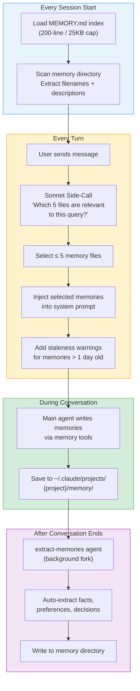
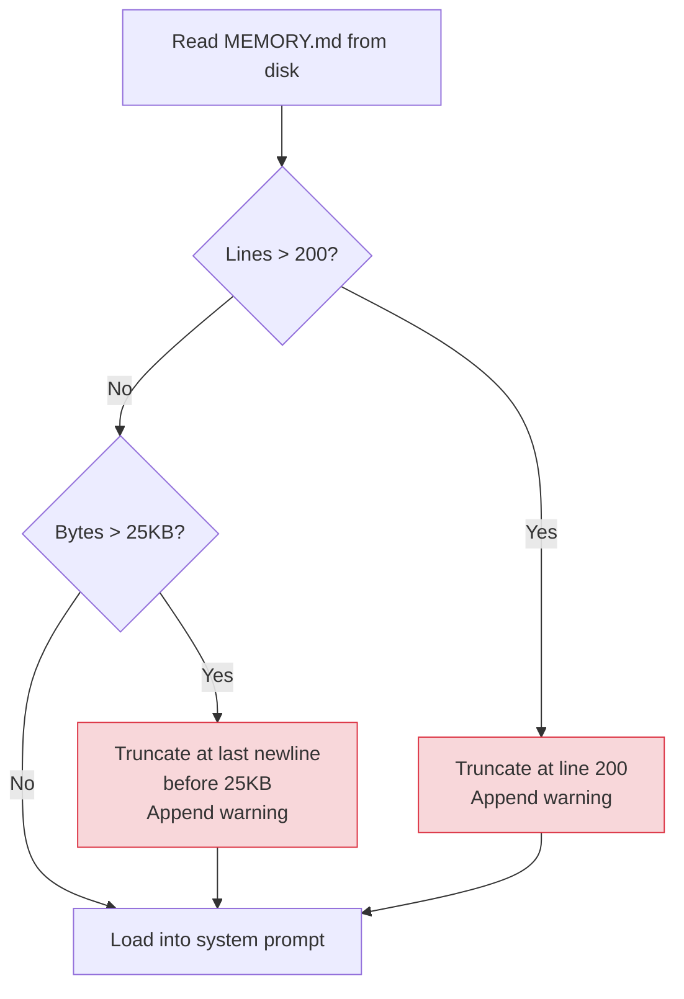
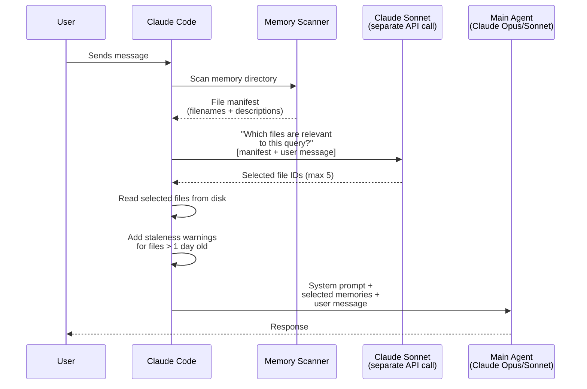
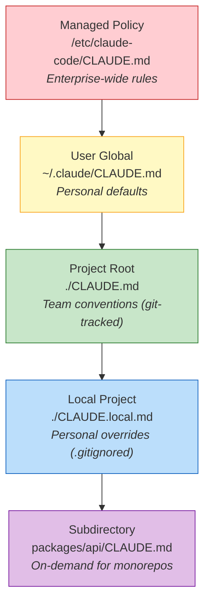
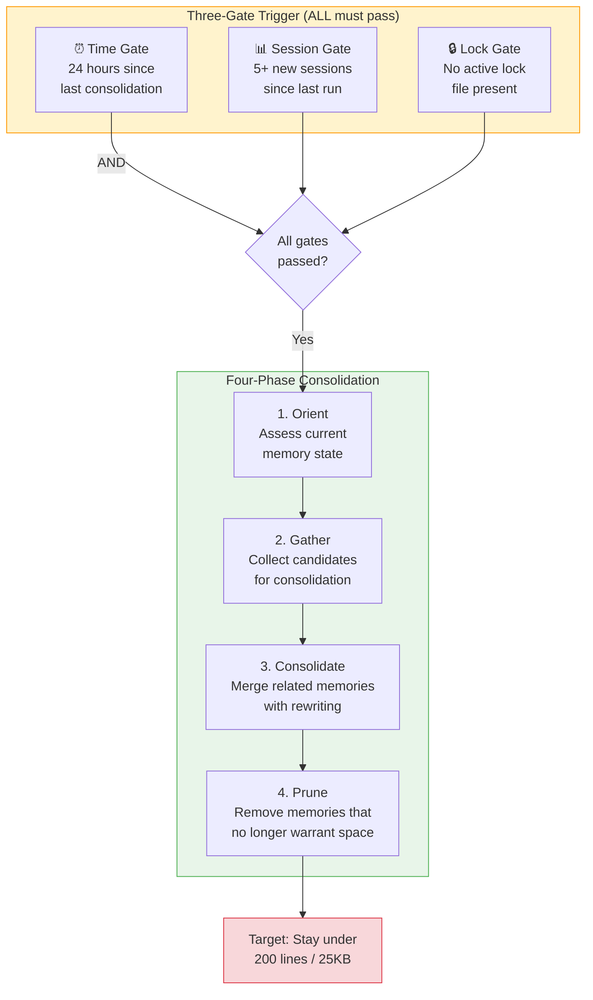
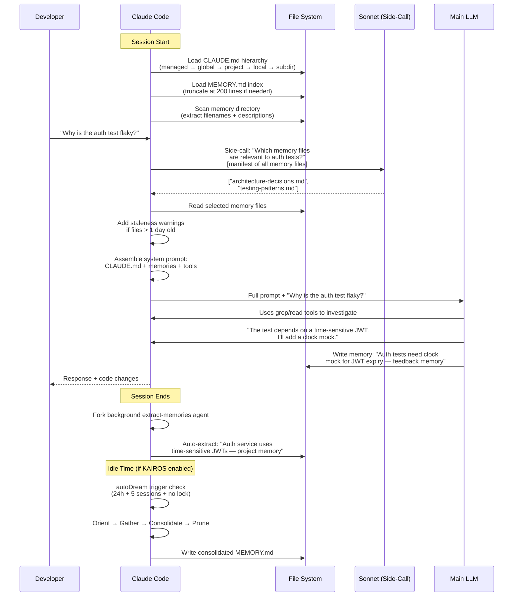

# Claude Code — 深入解析（基于泄露源代码）

> **一句话概括：** 一个基于文件的记忆系统，包含 200 行索引、Sonnet 驱动的检索侧调用，以及一个未发布的自主守护进程——这些都在 512,000 行 TypeScript 代码通过 npm source map 泄露时被揭示。

| 统计项 | 值 |
|------|-------|
| **运行时** | 100% TypeScript，运行于 Bun |
| **源码规模** | ~512,000 行，横跨 ~1,900 个文件 |
| **泄露日期** | 2026 年 3 月 31 日（npm v2.1.88） |
| **泄露原因** | `.npmignore` 缺少条目 + Bun 打包器 bug 导致 source map 在生产环境中被提供 |
| **记忆源码** | `src/memdir/`（7 个文件） |
| **索引上限** | 200 行 / 25KB |
| **检索限制** | 每轮 5 个文件 |
| **检索方法** | Sonnet 基于文件名的侧调用（无嵌入） |
| **未发布系统** | KAIROS 守护进程、autoDream 整合、TEAMMEM |

---

## 泄露事件：发生了什么

2026 年 3 月 31 日，安全研究员 Chaofan Shou 发现 Claude Code 的 npm 包（版本 2.1.88）包含了一个 59.8 MB 的 source map 文件。Source map 可以将压缩混淆的生产代码还原为原始的可读源代码。该 `.map` 文件包含了完整的 TypeScript 源码——每个模块、每段提示词、每个功能标志。

原因是：`.npmignore` 中缺少条目，加上一个已知的 Bun 打包器 bug，导致 source map 在生产模式下被提供。代码在数小时内传播到 GitHub 镜像，其中一个 fork 在 Anthropic 发出（后来部分撤回的）DMCA 通知之前已获得 75,700+ stars。

工程师们立即关注了有趣的部分：提示词、计费逻辑、工具定义。但记忆系统——仅藏在 `src/memdir/` 下的七个文件中——却成为了架构上最具启示性的组件。

---

## 架构概览

Claude Code 的记忆是一个**纯 Markdown 文件系统**，上层覆盖了一个 **LLM 驱动的检索层**。没有向量数据库、没有嵌入、没有知识图谱。只有磁盘上的文件和一个读取文件名的语言模型。



### 五个核心模块

源代码揭示了组成完整记忆系统的五个模块：

| 模块 | 源文件 | 功能 |
|--------|------------|----------|
| **路径解析** | `src/memdir/paths.ts` | 计算记忆存储目录并进行安全验证 |
| **提示词构建** | `src/memdir/memdir.ts` | 将记忆指令和内容注入系统提示词 |
| **记忆扫描** | `src/memdir/memoryScan.ts` | 扫描目录，解析记忆文件的 frontmatter |
| **智能检索** | `src/memdir/findRelevantMemories.ts` | Sonnet 侧调用以选择相关记忆文件 |
| **自动抽取** | `src/services/extractMemories/` | 会话结束后自动抽取记忆的后台智能体 |

---

## 记忆目录结构

记忆以纯 Markdown 文件形式存储在磁盘上：

```
~/.claude/
├── CLAUDE.md                          # Global instructions (loaded every session)
├── projects/
│   └── {sanitized-git-root}/
│       └── memory/
│           ├── MEMORY.md              # Index file (200-line cap)
│           ├── user-preferences.md    # User memories
│           ├── architecture-decisions.md  # Project memories
│           ├── testing-patterns.md    # Feedback memories
│           └── external-refs.md       # Reference memories
└── settings.json                      # Permissions, hooks, etc.
```

### 路径解析优先级

源代码（`paths.ts`）按以下顺序解析记忆目录：

1. `CLAUDE_COWORK_MEMORY_PATH_OVERRIDE` 环境变量（最高优先级）
2. `settings.json` → `autoMemoryDirectory` 设置
3. 默认值：`~/.claude/projects/{sanitized-git-root}/memory/`

### 安全验证

路径解析器会拒绝：
- 相对路径（`../foo`）
- 根路径或接近根路径（`/`、`/a`）
- Windows 驱动器根路径（`C:\`）
- UNC 网络路径（`\\server\share`）
- 空字节

关键的是，**项目级别**的 `.claude/settings.json` 无法设置 `autoMemoryDirectory`。这防止了恶意仓库获得对项目外部敏感目录的写入权限。

---

## MEMORY.md 索引：200 行上限

`MEMORY.md` 文件是入口——一个索引，Claude 在会话开始时读取它以了解存在哪些记忆。`memdir.ts` 中的源代码强制执行两个硬性限制：

| 限制 | 值 | 执行方式 |
|-------|-------|-------------|
| **行数上限** | 200 行 | `truncateEntrypointContent()` |
| **字节上限** | 25,000 字节 | 同一函数，二次检查 |

### 截断工作原理



截断警告会附加到 Claude 看到的内容中，但用户永远不会收到通知。失败模式是**静默的**：第 201 条记录从索引中消失，Claude 不知道该记忆的存在，用户看不到任何错误或日志。

### 这在实践中意味着什么

一个每天使用 Claude Code 三个月的开发者可能已累积了数百条记忆。当第 201 条记录被添加时：

1. 最旧的记忆从索引中静默消失
2. Claude 加载一个干净的系统提示词，没有这些记忆的任何痕迹
3. Claude 可能会与之前的架构决策产生矛盾
4. Claude 可能会重新询问它已经"学过"答案的问题
5. 用户不会看到任何警告

过期警告只对*已加载*的记忆触发。如果一条记忆被截断出索引，它永远不会被加载，因此不会触发警告。

---

## 四种记忆类型

源代码将所有记忆严格限制为四个类别：

| 类型 | 所有者 | 存储内容 | 示例 |
|------|-------|---------------|---------|
| **User** | 私有 | 你的角色、专业知识、偏好、沟通风格 | "Senior backend engineer, prefers concise code reviews" |
| **Feedback** | 私有 | 纠正、验证过的方法、应停止做的事情 | "Don't use `any` type in TypeScript — use `unknown` instead" |
| **Project** | 共享 | 代码库上下文、截止日期、架构决策 | "Auth service uses JWT with 24h expiry, decided in Jan sprint" |
| **Reference** | 共享 | 外部系统的指引 | "Bug tracker: Linear. Deploy channel: #releases on Slack" |

### 什么不应该成为记忆

代码明确指出：**如果信息可以通过 grep 或 git 从当前代码库中获取，就不应该保存为记忆。** 记忆是用来存储代码本身不包含的上下文——决策、偏好、外部指引。

---

## 智能检索：Sonnet 侧调用

每一轮对话，Claude Code 都会向 **Claude Sonnet 发起一次独立的 API 调用**来决定哪些记忆文件是相关的。这是系统中最出人意料的设计选择。



### 关键设计决策

1. **无嵌入。** 检索完全基于文件名和一行描述，而非向量相似度。语言模型读取一个列表并做出判断。

2. **每轮最多 5 个文件。** 即使存在 20 个记忆文件，也只能加载 5 个。这保持了上下文窗口的可管理性，但意味着相关记忆可能被遗漏。

3. **使用 Sonnet，而非主模型。** 检索调用使用 Claude Sonnet（更便宜、更快），无论用户为主智能体选择了哪个模型。这是一个成本优化。

4. **每轮而非每次会话。** 侧调用在每条消息时发生，而不仅是在会话开始时。这意味着检索会随着对话主题的转变而自适应。

### 记忆新鲜度

`memoryFreshnessText()` 函数生成过期警告：

> *"This memory is X days old. Memories are point-in-time observations, not live state. Claims about code behavior or file:line citations may be outdated."*

此警告在 Claude 看到之前直接注入记忆内容中，使模型意识到旧记忆可能已过时。

---

## 自动记忆抽取

对话结束后，一个**后台 extract-memories 智能体**作为 fork 进程运行。该智能体审查对话并自动抽取记忆。


### 功能标志

自动抽取系统通过功能标志控制：
- `EXTRACT_MEMORIES` — 主开关
- `tengu_passport_quail` — 内部代号（混淆处理）

并非所有用户都启用了此功能。禁用时，只有在对话期间通过智能体的记忆工具显式创建的记忆才会被保存。

### 双写入者问题

这产生了一个微妙的问题：**两个不同的进程写入记忆目录**。主智能体在会话期间写入，后台抽取器在会话后写入。存在竞态条件或写入冲突的可能性，尽管源码中包含了基本的文件锁定。

---

## CLAUDE.md 层级结构：静态上下文层

独立于动态记忆系统，Claude Code 从 `CLAUDE.md` 文件中按层级级联加载静态指令：



| 层级 | 路径 | 范围 | 是否纳入 Git？ |
|-------|------|-------|-------------|
| 托管策略 | `/etc/claude-code/CLAUDE.md` | 企业范围 | N/A |
| 用户全局 | `~/.claude/CLAUDE.md` | 所有项目 | 否 |
| 项目根目录 | `./CLAUDE.md` | 团队共享 | 是 |
| 本地项目 | `./CLAUDE.local.md` | 个人使用 | 否（`.gitignore`） |
| 子目录 | `packages/*/CLAUDE.md` | 子包 | 是 |

更具体的规则优先级更高，但 Claude 可能会混合使用多个层级的指令。

### 动态边界

系统提示词被 `__SYSTEM_PROMPT_DYNAMIC_BOUNDARY__` 标记分隔为静态可缓存指令和每次会话的上下文。边界之上的所有内容（CLAUDE.md 内容、工具定义、基础指令）可以跨请求缓存以通过提示词缓存降低 API 成本。边界之下的内容（记忆、对话上下文）每次请求都会变化。

---

## 源码中发现的未发布系统

泄露揭示了三个主要的未发布系统：

### KAIROS：常驻守护进程

KAIROS 是一个自主守护进程模式，将 Claude Code 从请求-响应工具转变为**持久化的后台进程**。源码中的关键特征：

- 作为长期运行的进程，跨越单个对话会话
- 在数小时或数天内维护持久上下文
- 主动监控和行动，无需用户输入
- 被内部功能标志控制，对所有外部用户禁用
- 解决"上下文熵"问题——长时间交互中连贯性的逐渐丧失

KAIROS 代表了 Anthropic 对 Claude Code 从基于聊天的工具演进为常驻 AI 队友的愿景。

### autoDream：睡眠时记忆整合

autoDream 是 KAIROS 的子系统，用于在空闲时间整合记忆，直接受到生物学中基于睡眠的记忆整合的启发。源码揭示了一个复杂的触发-执行管线：



整合提示词（在 `src/services/autoDream/consolidationPrompt.ts` 中找到）指示智能体：
1. **定位（Orient）：** 读取当前 MEMORY.md 并了解已存储的内容
2. **收集（Gather）：** 识别冗余、过时或可合并的记忆
3. **整合（Consolidate）：** 将相关记忆改写为更紧凑、更高信息量的摘要
4. **修剪（Prune）：** 删除不再值得在 200 行预算中占用空间的记忆

这是 Anthropic 对"记忆悬崖"问题的解答——不是静默截断，而是 autoDream 在空闲时间主动压缩和策划记忆存储。

### TEAMMEM：共享团队记忆

`TEAMMEM` 功能标志启用团队范围的记忆：

- **私有记忆：** 用户偏好、个人沟通风格——仅对你可见
- **团队记忆：** 项目约定、架构决策——在所有团队贡献者之间共享
- 启用后，记忆系统将写入分为私有目录和团队目录

---

## 自愈记忆

泄露的代码揭示了一种"自愈记忆"设计模式：Claude Code 将其自身的记忆视为**提示而非真理**。在依据记忆行动之前，智能体被指示要对照代码库的当前状态验证信息。

这意味着：
- 记忆显示"auth uses JWT tokens"→ Claude 在依赖此信息前检查实际的 auth 代码
- 记忆显示"tests are in `__tests__/`"→ Claude 验证该目录是否仍然存在
- 过期警告强化了这一点："memories are point-in-time observations, not live state"

这是一个刻意的架构选择，防止过时记忆导致幻觉。

---

## 全流程：一次完整的会话

以下是从源码中重建的典型 Claude Code 会话的完整流程：



---

## 优势

- **极度简洁。** 纯 Markdown 文件。无数据库、无嵌入流水线、无基础设施。
- **人类可读且可编辑。** 你可以在任何编辑器中打开 `MEMORY.md`，精确查看 Claude 记住了什么。
- **可纳入 Git 管理。** 记忆文件可以提交到版本控制以进行团队共享。
- **自愈模式。** 将记忆视为提示可以防止过时记忆导致幻觉。
- **CLAUDE.md 层级结构。** 优雅的级联系统，覆盖企业 → 用户 → 项目 → 本地 → 子目录上下文。
- **成本优化。** 动态边界支持提示词缓存；Sonnet 侧调用成本低廉。

## 局限性

- **200 行硬性上限**加上静默截断——最受批评的设计决策。
- **无嵌入/无向量搜索。** 检索依赖 Sonnet 读取文件名，而非语义相似度。
- **每轮 5 个文件限制。** 在大型记忆存储中，相关记忆可能被遗漏。
- **双写入者竞态条件。** 主智能体和后台抽取器都写入同一目录。
- **autoDream 和 KAIROS 未发布。** 记忆悬崖问题的解决方案存在于代码中，但用户无法使用。
- **无跨项目记忆。** 每个项目有自己独立的记忆目录。项目 A 的经验不会转移到项目 B（除非使用全局 `~/.claude/CLAUDE.md`）。

## 最佳适用场景

- **个人开发者**：在 200 行记忆足够的项目中工作
- **团队**：使用 CLAUDE.md 层级结构共享约定（无需记忆系统）
- **注重隐私的部署**——所有数据留在本地磁盘
- **需要补充**第三方记忆插件（Mem0、Supermemory、OpenViking）的用户，当达到容量上限时

---

## 与其他记忆系统的对比

| 方面 | Claude Code（默认） | Mem0 | Hindsight | OpenViking |
|--------|----------------------|------|-----------|------------|
| **存储** | 磁盘上的 Markdown 文件 | 向量数据库 + 可选图谱 | 嵌入式 PostgreSQL | 虚拟文件系统 |
| **检索** | Sonnet 基于文件名的侧调用 | 向量相似度搜索 | 4 策略并行 + 重排序 | L0/L1/L2 分层加载 |
| **索引上限** | 200 行 / 25KB | 无 | 无 | 无 |
| **每轮文件数** | 5 | 无限（token 预算控制） | token 预算控制 | token 预算控制 |
| **嵌入** | 否 | 是 | 是 | 是 |
| **时序推理** | 过期警告 | 否 | 是（TEMPR） | 否 |
| **自动抽取** | 是（后台智能体） | 是（抽取阶段） | 是（retain） | 是（会话提交） |
| **整合** | autoDream（未发布） | LLM 驱动更新 | 观察综合 | 提交时记忆去重 |

---

## 链接

| 资源 | URL |
|----------|-----|
| Claude Code 文档 | [code.claude.com/docs](https://code.claude.com/docs) |
| 记忆系统分析 | [mem0.ai/blog/how-memory-works-in-claude-code](https://mem0.ai/blog/how-memory-works-in-claude-code) |
| 源码泄露分析（MindStudio） | [mindstudio.ai/blog/claude-code-source-leak-memory-architecture](https://www.mindstudio.ai/blog/claude-code-source-leak-memory-architecture) |
| 架构分析（Victor Antos） | [victorantos.com/posts/i-pointed-claude-at-its-own-leaked-source](https://victorantos.com/posts/i-pointed-claude-at-its-own-leaked-source-heres-what-it-found/) |
| 泄露的 memdir.ts | [github (mirrors)](https://github.com/liuup/claude-code-analysis/blob/main/src/memdir/memdir.ts) |
| autoDream 整合提示词 | [github (mirrors)](https://github.com/zackautocracy/claude-code/blob/main/src/services/autoDream/consolidationPrompt.ts) |
