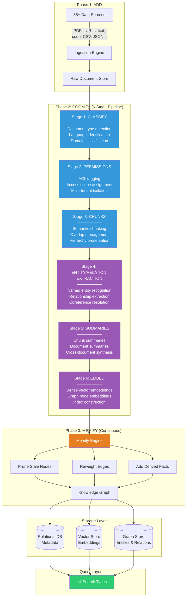
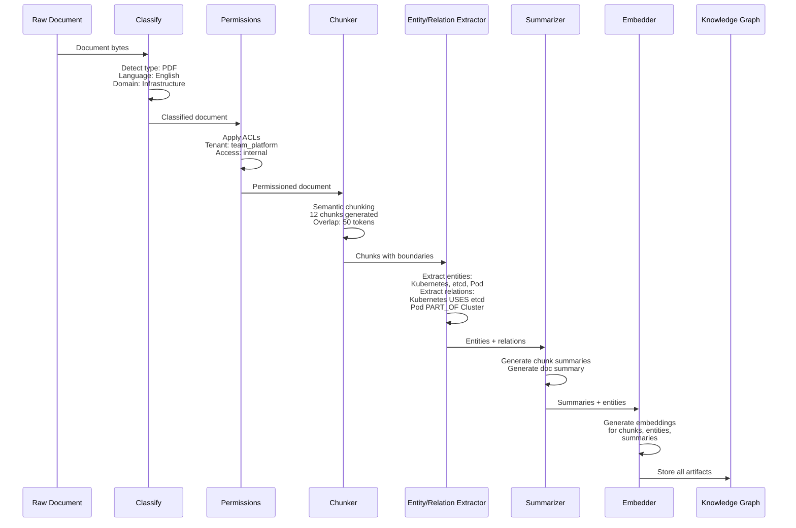
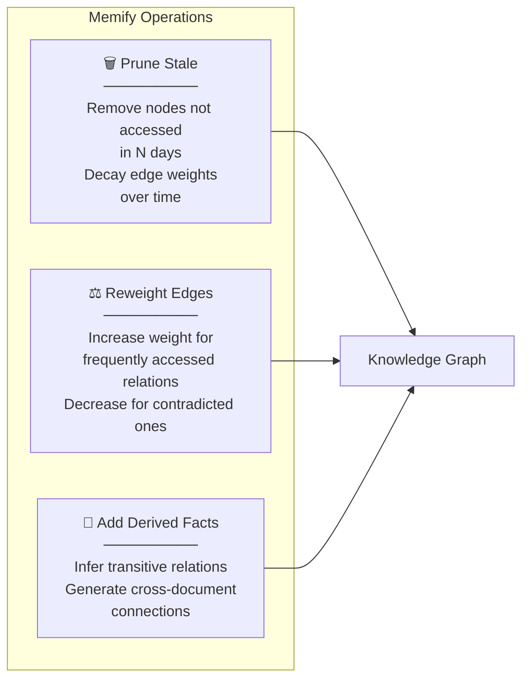
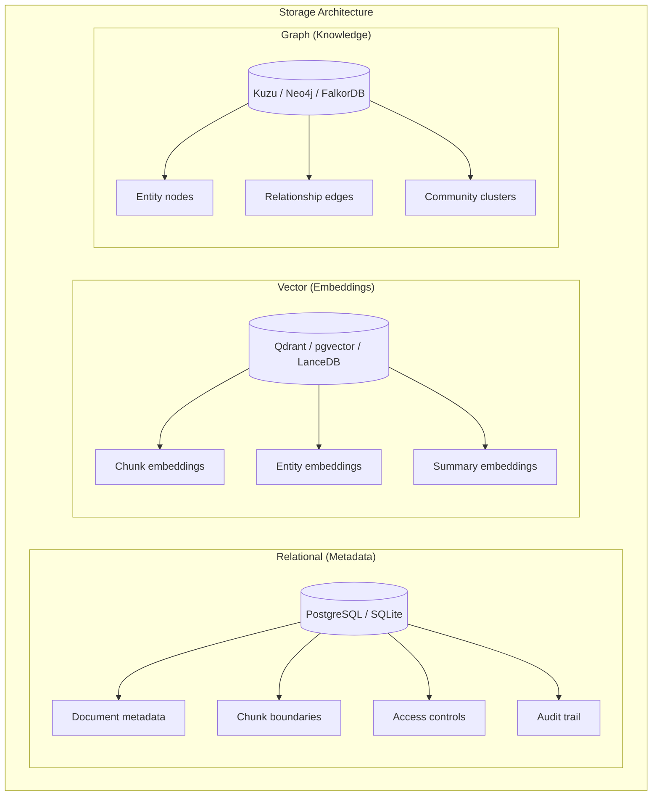
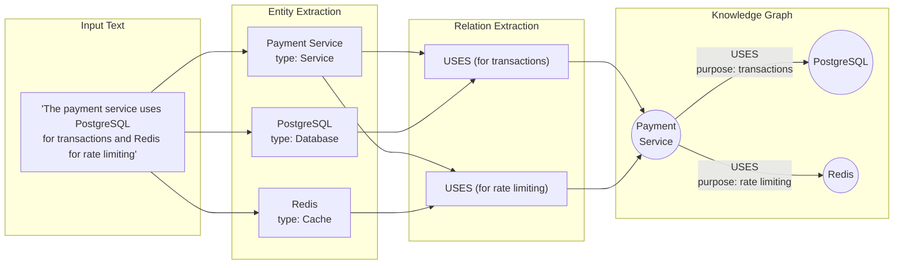

# Cognee — 深入解析

**官网:** [cognee.ai](https://cognee.ai) | **GitHub:** [topoteretes/cognee](https://github.com/topoteretes/cognee) (12K+ stars) | **许可证:** Apache 2.0 | **融资:** 750万美元种子轮

> 知识图谱与向量检索的混合引擎。六阶段流水线将原始数据锻造为结构化、可查询的知识，同时提供本体定义、14 种搜索模式和可插拔的存储后端。

---

## 架构概览

Cognee 的核心是一条 **ECL 流水线**（add → cognify → memify）：先摄取原始数据，再构建带向量嵌入的知识图谱，最后随时间不断修剪与丰富图谱。整个架构围绕这三个阶段层层展开。



---

## ECL 流水线详解

### 第一阶段：Add（数据摄取）

`add` 阶段负责统一入口——它接收来自 **38+ 种数据源类型** 的数据，将它们归一化为统一的文档格式。

```python
import cognee
import asyncio

async def ingest_data():
    # Add text content
    await cognee.add(
        "Kubernetes uses etcd for cluster state storage. "
        "Pods are the smallest deployable units.",
        dataset_name="infrastructure_docs"
    )
    
    # Add a file
    await cognee.add(
        "path/to/architecture-doc.pdf",
        dataset_name="infrastructure_docs"
    )
    
    # Add from URL
    await cognee.add(
        "https://docs.example.com/api-reference",
        dataset_name="api_docs"
    )
    
    # Add structured data
    await cognee.add(
        "path/to/tickets.csv",
        dataset_name="support_tickets"
    )

asyncio.run(ingest_data())
```

| 支持的数据源类型 | 示例 |
|----------------------|----------|
| **文档** | PDF, DOCX, PPTX, TXT, Markdown |
| **结构化数据** | CSV, JSON, JSONL, Parquet |
| **代码** | Python, JavaScript, TypeScript, Go, Rust, Java |
| **网页** | URLs, HTML, sitemaps |
| **媒体** | 图片（含 OCR）、音频转录 |
| **数据库** | SQL 查询结果、数据库导出 |

### 第二阶段：Cognify（六阶段处理）

`cognify` 是整条流水线的智能核心——原始文档在这里被逐层拆解、理解、抽取、压缩、嵌入，最终蜕变为结构化的知识图谱。



#### 阶段详情

| 阶段 | 目的 | 关键操作 |
|-------|---------|---------------|
| **1. Classify** | 弄清楚在处理什么 | 文档类型检测、语言识别、领域分类 |
| **2. Permissions** | 控制谁能看到这些知识 | ACL 标记、租户分配、访问范围划定 |
| **3. Chunks** | 切分为可消化的片段 | 语义分块（含重叠）、层次结构保留 |
| **4. Entity/Relation** | 挖掘结构化知识 | 命名实体识别、关系抽取、共指消解 |
| **5. Summaries** | 生成压缩表示 | 分块级摘要、文档摘要、跨文档综合 |
| **6. Embed** | 赋予检索能力 | 为分块、节点和摘要生成密集向量 |

### 第三阶段：Memify（持续丰富）

知识图谱构建完成并非终点。`memify` 阶段在后台持续运行，负责"保鲜"——修剪过期节点、调整边权重、推导新的事实关联：



---

## 14 种搜索类型

Cognee 内置 **14 种专用搜索类型**，覆盖从简单检索到复杂推理的各类查询场景：

```python
from cognee import SearchType

# Available search types
results = await cognee.search("query", query_type=SearchType.GRAPH_COMPLETION)
```

| # | 搜索类型 | 描述 | 最佳适用场景 |
|---|-------------|-------------|----------|
| 1 | `SUMMARIES` | 搜索文档和分块摘要 | 快速了解全貌 |
| 2 | `GRAPH_COMPLETION` | 图遍历 + LLM 补全 | 需要推理的复杂问题 |
| 3 | `CHUNKS` | 直接分块检索（向量相似度） | 经典 RAG 场景 |
| 4 | `TEMPORAL` | 时间感知的事件与变更搜索 | "上个月以来有什么变化？" |
| 5 | `CODE` | AST 感知的代码搜索 | 查找函数、类、设计模式 |
| 6 | `ENTITIES` | 搜索提取的实体 | "找出所有提到 Kubernetes 的地方" |
| 7 | `RELATIONS` | 搜索实体间关系 | "X 依赖了哪些组件？" |
| 8 | `INSIGHTS` | 跨文档推导洞察 | 发现隐藏模式 |
| 9 | `NATURAL_LANGUAGE` | 完整的自然语言问答 | 面向终端用户的查询 |
| 10 | `HYBRID` | 向量 + 关键词混合搜索 | 通用检索 |
| 11 | `GRAPH_TRAVERSAL` | 纯图遍历（不经过 LLM） | 结构化查询 |
| 12 | `COMMUNITY` | 在检测到的社区内搜索 | 主题聚类 |
| 13 | `RAW` | 直接访问原始文档 | 审计、合规 |
| 14 | `METADATA` | 按元数据字段搜索 | 按来源、日期、类型过滤 |

---

## 三层存储架构

Cognee 的存储层由 **三个可插拔后端** 组成，各司其职：



| 层级 | 用途 | 默认 | 可选方案 |
|-------|---------|---------|-------------|
| **关系型** | 文档元数据、访问控制、审计 | SQLite | PostgreSQL |
| **向量** | 密集嵌入，支撑相似度搜索 | Qdrant | pgvector, LanceDB |
| **图** | 实体-关系知识图谱 | Kuzu | Neo4j, FalkorDB |

这种可插拔设计意味着你不必迁就 Cognee——它反过来适配你现有的基础设施。

---

## 本体支持

在通用场景下，Cognee 的抽取能力已经不错。但面对专业领域，**自定义本体**才是真正的杀手锏——预先定义实体类型和关系模式，抽取质量将大幅跃升。

```python
import cognee

# Define a custom ontology for a healthcare domain
ontology = {
    "entity_types": [
        {"name": "Patient", "attributes": ["age", "condition", "risk_level"]},
        {"name": "Medication", "attributes": ["name", "dosage", "frequency"]},
        {"name": "Condition", "attributes": ["name", "severity", "icd_code"]},
        {"name": "Procedure", "attributes": ["name", "cpt_code", "duration"]},
    ],
    "relationship_types": [
        {"name": "DIAGNOSED_WITH", "from": "Patient", "to": "Condition"},
        {"name": "PRESCRIBED", "from": "Patient", "to": "Medication"},
        {"name": "TREATS", "from": "Medication", "to": "Condition"},
        {"name": "CONTRAINDICATED_WITH", "from": "Medication", "to": "Medication"},
        {"name": "UNDERWENT", "from": "Patient", "to": "Procedure"},
    ]
}

# Apply ontology before cognifying
await cognee.set_ontology(ontology)
await cognee.add("patient_records/*.pdf", dataset_name="patient_data")
await cognee.cognify(dataset_names=["patient_data"])

# Now entity extraction follows the defined schema
results = await cognee.search(
    "Which medications are contraindicated for patients with condition X?",
    query_type=SearchType.GRAPH_COMPLETION
)
```

不用本体时，抽取器只能"猜"——领域特定的关系容易被漏掉，实体也可能被归错类别。定义了本体之后，抽取过程就有了明确的模式引导，生成的知识图谱无论准确性还是实用性都会显著提升。

---

## 代码示例

### 基本流水线：Add → Cognify → Search

```python
import cognee
import asyncio
from cognee import SearchType

async def main():
    # Reset (for clean demo)
    await cognee.prune.prune_data()
    await cognee.prune.prune_system(metadata=True)
    
    # Phase 1: Add documents
    await cognee.add(
        "Kubernetes orchestrates containerized applications across clusters. "
        "It uses etcd for state storage, kubelet for node management, "
        "and kube-proxy for networking. Pods are the smallest deployable units. "
        "Services provide stable endpoints for pod groups.",
        dataset_name="k8s_docs"
    )
    
    await cognee.add(
        "Docker containers package applications with their dependencies. "
        "Images are built from Dockerfiles using layers. "
        "Docker Compose manages multi-container applications.",
        dataset_name="docker_docs"
    )
    
    # Phase 2: Cognify — builds the knowledge graph
    await cognee.cognify(dataset_names=["k8s_docs", "docker_docs"])
    
    # Phase 3: Search with different query types
    
    # Graph completion: complex reasoning
    results = await cognee.search(
        "How do Kubernetes and Docker relate to each other?",
        query_type=SearchType.GRAPH_COMPLETION
    )
    print("=== Graph Completion ===")
    for r in results:
        print(f"  {r}")
    
    # Entity search: find specific entities
    results = await cognee.search(
        "etcd",
        query_type=SearchType.ENTITIES
    )
    print("\n=== Entities ===")
    for r in results:
        print(f"  {r}")
    
    # Summary search: high-level understanding
    results = await cognee.search(
        "container orchestration overview",
        query_type=SearchType.SUMMARIES
    )
    print("\n=== Summaries ===")
    for r in results:
        print(f"  {r}")

asyncio.run(main())
```

### 多数据集知识图谱

```python
import cognee
import asyncio

async def build_engineering_knowledge():
    # Ingest from multiple sources into separate datasets
    await cognee.add("docs/architecture/*.md", dataset_name="architecture")
    await cognee.add("docs/runbooks/*.md", dataset_name="runbooks")
    await cognee.add("postmortems/*.md", dataset_name="incidents")
    await cognee.add("rfcs/*.md", dataset_name="rfcs")
    
    # Cognify all datasets — Cognee builds cross-dataset connections
    await cognee.cognify(
        dataset_names=["architecture", "runbooks", "incidents", "rfcs"]
    )
    
    # Now you can query across all knowledge
    results = await cognee.search(
        "What are the recurring causes of database outages "
        "and which runbooks address them?",
        query_type=SearchType.GRAPH_COMPLETION
    )
    
    # Temporal search: track changes over time
    results = await cognee.search(
        "How has our database architecture evolved?",
        query_type=SearchType.TEMPORAL
    )
    
    return results

asyncio.run(build_engineering_knowledge())
```

### 持续记忆化

```python
import cognee
import asyncio

async def maintain_knowledge():
    # After adding new data, run cognify to update the graph
    await cognee.add("new_incident_report.md", dataset_name="incidents")
    await cognee.cognify(dataset_names=["incidents"])
    
    # Run memify to prune stale data and derive new facts
    await cognee.memify(
        dataset_names=["architecture", "runbooks", "incidents"],
        prune_stale_days=90,       # Remove nodes not accessed in 90 days
        derive_cross_links=True,    # Find connections between datasets
        reweight_by_access=True     # Boost frequently-accessed knowledge
    )

asyncio.run(maintain_knowledge())
```

---

## 分步实战：构建工程知识库

### 场景

假设你的团队积累了大量架构文档、运维手册、RFC 和事故报告，散落在各处。你想构建一套系统，让工程师用自然语言就能跨所有知识源提问，不必再挨个翻文档。

### 步骤 1：摄取数据源

```python
import cognee, asyncio

async def setup():
    # Architecture documentation
    await cognee.add(
        "Our payment service uses PostgreSQL for transactions, Redis for "
        "rate limiting, and communicates with the billing service via gRPC. "
        "The payment service is deployed on Kubernetes with 3 replicas.",
        dataset_name="architecture"
    )
    
    # Incident report
    await cognee.add(
        "Incident #1042 (2026-02-15): Payment service experienced 5 minutes "
        "of downtime due to PostgreSQL connection pool exhaustion. Root cause: "
        "connection leak in the retry logic. Fix: added connection timeout and "
        "pool monitoring. Action item: add PgBouncer.",
        dataset_name="incidents"
    )
    
    # Runbook
    await cognee.add(
        "Runbook: Payment Service Recovery. Step 1: Check PostgreSQL connection "
        "count via pg_stat_activity. Step 2: If connections > 80% of max, "
        "restart the payment-service pods. Step 3: Check Redis connectivity. "
        "Step 4: Verify gRPC health checks to billing service.",
        dataset_name="runbooks"
    )

asyncio.run(setup())
```

### 步骤 2：构建知识图谱

```python
async def build():
    await cognee.cognify(
        dataset_names=["architecture", "incidents", "runbooks"]
    )
    # Cognee now has a graph with entities like:
    # - Payment Service (Service)
    # - PostgreSQL (Database) 
    # - Redis (Cache)
    # - Billing Service (Service)
    # - Incident #1042 (Event)
    # And relationships like:
    # - Payment Service USES PostgreSQL
    # - Payment Service USES Redis
    # - Payment Service COMMUNICATES_WITH Billing Service
    # - Incident #1042 AFFECTED Payment Service
    # - Incident #1042 CAUSED_BY PostgreSQL connection leak

asyncio.run(build())
```

### 步骤 3：跨知识源查询

```python
async def query():
    # Cross-dataset reasoning
    answer = await cognee.search(
        "If PostgreSQL goes down, which services are affected "
        "and what runbook should I follow?",
        query_type=SearchType.GRAPH_COMPLETION
    )
    # Cognee traverses: PostgreSQL → USED_BY → Payment Service
    #                   Payment Service → HAS_RUNBOOK → Payment Service Recovery
    # And returns a synthesized answer with citations
    
    # Temporal query
    incidents = await cognee.search(
        "What database incidents have occurred this year?",
        query_type=SearchType.TEMPORAL
    )
    
    # Relationship query
    deps = await cognee.search(
        "payment service dependencies",
        query_type=SearchType.RELATIONS
    )

asyncio.run(query())
```

---

## 知识图谱构建过程

来看一个具体例子——Cognee 是怎样把一段原始文本变成结构化知识图谱的：



---

## 优势

- **严谨的六阶段流水线**：从分类到嵌入层层递进，确保知识图谱质量过硬
- **14 种搜索类型**：从简单向量检索到复杂图推理，查询能力全覆盖
- **可插拔存储**：向量、图、关系型后端任你组合——拒绝供应商锁定
- **本体支持**：预定义领域模式，让专业场景的抽取精度大幅跃升
- **开源透明**：Apache 2.0 许可证，GitHub 12K+ stars，社区活跃
- **持续记忆化**：自动修剪陈旧节点、调整边权重，让图谱始终鲜活

## 局限性

- **流水线复杂度高**：六阶段处理虽强大，但也带来更高的延迟和运维负担
- **仅异步 API**：所有核心操作都是 async 的，与同步代码库集成时需要额外适配
- **Cognify 阶段的 LLM 开销**：实体抽取和摘要生成会消耗大量 token，成本不容忽视
- **图谱质量波动大**：产出质量高度依赖源文档的结构化程度和所选 LLM 的能力
- **学习曲线陡峭**：14 种搜索类型 + 3 层存储架构，上手需要不少时间投入
- **偏批处理模式**：更擅长文档级别的数据摄取，实时对话记忆并非强项

## 最佳适用场景

- **机构知识库**：文档、Wiki、运维手册需要打通关联、统一检索的场景
- **受监管行业**：医疗、金融、法律等需要本体驱动精准抽取的领域
- **工程团队**：想跨架构文档、事故报告、运维手册做统一查询
- **多源 RAG 应用**：需要比单纯向量搜索更丰富的结构化支撑
- **已有基础设施的团队**（Postgres、Neo4j、Qdrant）：想接入一个兼容的记忆层

---

## 延伸阅读

- [Cognee 文档](https://docs.cognee.ai)
- [GitHub 仓库](https://github.com/topoteretes/cognee)
- [ECL 流水线技术指南](https://docs.cognee.ai/concepts/ecl)
- [本体配置指南](https://docs.cognee.ai/guides/ontology)
- 相关论文：[Knowledge Graphs for LLMs Survey](https://arxiv.org/abs/2306.08302)
