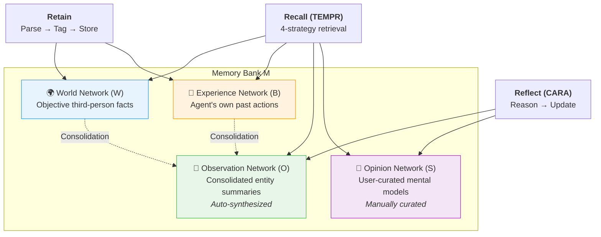
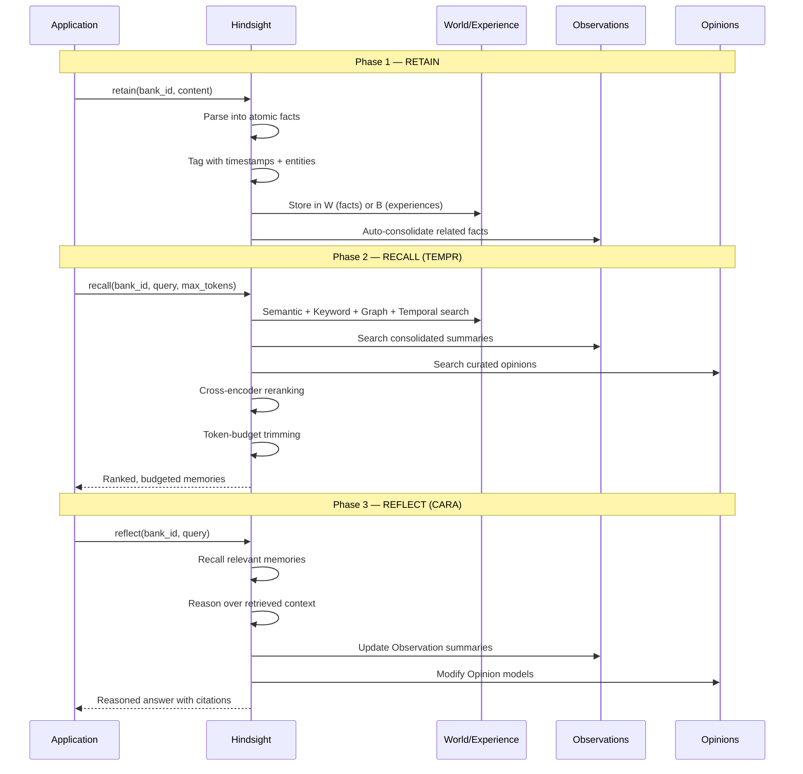
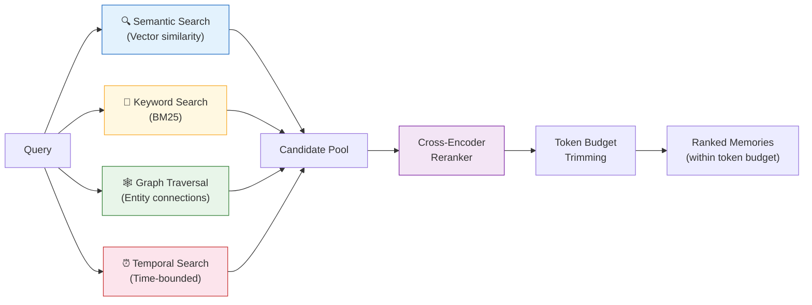

# Hindsight — 深入解析

**四张独立知识网络，认知结构化的智能体记忆**

| | |
|---|---|
| **网站** | [hindsight.vectorize.io](https://hindsight.vectorize.io) |
| **GitHub** | 9K+ stars |
| **许可证** | MIT |
| **论文** | [arXiv:2512.12818](https://arxiv.org/abs/2512.12818)（2025 年 12 月） |
| **开发者** | Vectorize |
| **SDK** | Python、TypeScript、Go、REST、CLI |

---

## 核心理念

多数记忆系统对所有知识一视同仁：事实进去，事实出来。Hindsight 不这么干。它把记忆拆成四张认知上完全不同的网络——客观事实、智能体的亲身经验、综合后的观察、策划的观点——再用三个核心动词来操作它们：**保留（Retain）**、**回忆（Recall）**、**反思（Reflect）**。

这样做的结果是：一个编程助手可以区分出"用户在 Google 工作"（世界事实）、"我上周给用户推荐了 Python"（经验）、"用户正在从 React 转向 Vue"（从多条事实综合出的观察）和"对这个用户，始终优先建议 TypeScript 方案"（策划的观点）。

---

## 架构

### 四个记忆网络

每个 Hindsight **记忆库（Memory Bank）** 由四张网络组成，各自承载不同认知类别的知识：

| 网络 | 符号 | 认知角色 | 示例 |
|---------|--------|---------------|---------|
| **World** | W | 客观的第三人称事实 | "Alice works at Google" |
| **Experience** | B | 智能体自身过去的行动和观察 | "I recommended Python to Bob on March 3rd" |
| **Observation** | O | 整合后的实体摘要，自动综合生成 | "User was a React enthusiast but has now switched to Vue" |
| **Opinion** | S | 用户策划的常见查询摘要 | "For frontend questions, always suggest TypeScript first" |

World 和 Experience 在保留阶段**写入**。Observation 在保留之后由系统**自动综合生成**。Opinion 则在反思阶段由**用户或智能体主动策划**。



### 三个核心操作



---

## TEMPR：时间实体记忆启动检索

TEMPR 是 Hindsight 的回忆引擎。它不押注在单一检索策略上，而是同时跑四条策略，再用交叉编码器重排序来合并结果。



### 为什么要跑四种策略？

每种策略都能捞到其他策略漏掉的东西：

| 策略 | 能捕获 | 可能遗漏 |
|----------|---------|--------|
| **语义搜索** | 措辞不同但概念相关的事实 | 精确的名称、日期、数字 |
| **关键词搜索（BM25）** | 精确的实体名称、技术术语 | 改写或概念相关的内容 |
| **图遍历** | 多跳关系（Alice → Google → Cloud team） | 与查询实体不相连的事实 |
| **时间搜索** | 近期或有时间范围的事实（"上周"、"第一季度"） | 没有时间锚点的永恒事实 |

交叉编码器重排序器会对每个候选项和原始查询做精排打分，Token 预算则保证最终拼出的上下文不超出模型容量。

---

## CARA：上下文自适应推理智能体

CARA 是 Hindsight 的反思引擎。被调用时，它做以下几件事：

1. 用 TEMPR 先把相关记忆捞出来
2. 在检索到的上下文上做推理
3. 必要时用新的综合结果更新 Observation 摘要
4. 必要时根据新证据修改 Opinion 模型
5. 返回一个可追溯的答案，引用了具体记忆作为来源

CARA 是以智能体循环的方式运行的——如果第一轮检索不够回答问题，它会自主发起更多搜索。所以反思操作可能走多步，而不只是做一次推理。

---

## Observation 整合

自动 Observation 整合是 Hindsight 最有特色的能力之一。每次保留操作之后，系统都会检查：新存入的事实和已有事实放在一起，是否需要更新 Observation 摘要。

### 具体示例：从 React 迁移到 Vue

假设有一个基于 Hindsight 的编程助手。在几周时间里，下面这些对话内容被陆续保留：

**第 1 周 — 作为 World 事实（W）保留：**
```
"User has 3 years of React experience."
"User's current project uses React 18 with Next.js."
```

**第 2 周 — 作为 World 事实（W）和 Experience（B）保留：**
```
W: "User mentioned frustration with React's bundle size."
W: "User started a side project in Vue 3."
B: "I helped the user set up a Vue 3 + Vite project."
```

**第 3 周 — 作为 World 事实（W）和 Experience（B）保留：**
```
W: "User is migrating their main project from React to Vue."
W: "User praised Vue's Composition API as 'more intuitive'."
B: "I provided a React-to-Vue component migration guide."
```

**第 3 周后 — 自动 Observation 整合（O）：**

系统把跟这个实体（用户的前端框架偏好）相关的所有事实综合成一条整合后的 Observation：

> "User was a React enthusiast with 3 years of experience but has been progressively shifting to Vue 3, citing frustration with React's bundle size and preference for Vue's Composition API. The migration is now active on their main project."

这条 Observation 存在 O 网络里，Recall 时可以被检索到。当智能体后来被问"该给用户的新项目推荐什么框架？"时，TEMPR 会同时检索出这条整合后的 Observation 和原始事实，让智能体既看到综合轨迹，也能查细粒度的证据。

如果用户后来又回到了 React，新事实会触发重新整合：

> "User experimented extensively with Vue 3 but ultimately returned to React after encountering ecosystem compatibility issues. Currently using React 19 with RSC."

---

## 记忆库配置

Hindsight 里每个记忆库都可以从三个行为维度来配置：

### 使命（Mission）

一段自然语言写的身份声明，影响智能体保留和反思的行为方式：

```python
mission = "I am a research assistant specializing in ML papers and experimental design."
```

使命会影响系统在回忆时判断哪些事实相关，以及反思时怎么组织思路。

### 指令（Directives）

智能体必须遵守的硬性行为约束：

```python
directives = [
    "Never share user data between banks",
    "Always cite source conversations when reflecting",
    "Treat contradictory facts as a signal to update Observations"
]
```

### 性格倾向（Disposition）

1–5 分打分的软性人格特质：

| 特质 | 低（1） | 高（5） |
|-------|---------|----------|
| **同理心** | 中性、以数据为导向的回应 | 有情感意识、支持性语气 |
| **怀疑度** | 按表面意思接受陈述 | 质疑假设、标记矛盾 |
| **字面性** | 宽泛解读、推断意图 | 严格按字面意思理解 |

```python
disposition = {
    "empathy": 4,
    "skepticism": 2,
    "literalism": 3
}
```

研究助手可能会把怀疑度和字面性调高。个人陪伴型智能体则可能高同理心、低字面性。

---

## 代码示例

### 设置与基本使用

```python
from hindsight import Hindsight

client = Hindsight()

# Create a memory bank with full configuration
bank = client.create_bank(
    name="coding-assistant",
    mission="I am a coding assistant that remembers developer preferences and project context.",
    directives=["Never share user data between banks"],
    disposition={"empathy": 4, "skepticism": 2, "literalism": 3}
)
```

### 保留：将对话存储为记忆

```python
# World facts are extracted automatically from conversation content
client.retain(
    bank_id=bank.id,
    content="The user prefers Python for data science but is switching to Rust for systems work."
)

# Agent experiences are also retained
client.retain(
    bank_id=bank.id,
    content="User asked about async patterns in Python. I recommended asyncio with structured concurrency."
)
```

调用之后，Hindsight 会做这几件事：
1. 把内容拆解成原子事实
2. 给每条事实打上时间戳、提取实体（如 "Python"、"Rust"、"asyncio"）
3. 把事实分别存入 World（W）或 Experience（B）网络
4. 对受影响的实体触发 Observation 整合

### 回忆：跨所有网络搜索

```python
# TEMPR runs 4 parallel strategies and reranks results
memories = client.recall(
    bank_id=bank.id,
    query="What programming languages does the user prefer?",
    max_tokens=2000  # Token budget for the returned context
)

for mem in memories:
    print(f"[{mem.type}] {mem.content}")
    # [world] The user prefers Python for data science.
    # [world] The user is switching to Rust for systems work.
    # [observation] User is a Python-first developer exploring Rust for performance-critical work.
    # [experience] I recommended asyncio with structured concurrency for their Python async questions.
```

### 反思：对记忆进行推理

```python
# CARA retrieves relevant memories, reasons over them, and may update Observations
answer = client.reflect(
    bank_id=bank.id,
    query="What project would be a good fit for this user?"
)

print(answer.content)
# "Based on the user's Python data science background and growing interest in Rust
#  for systems work, a data pipeline project using Python for orchestration and Rust
#  for performance-critical data transformations would align well with their skill
#  trajectory. They're also comfortable with async patterns (asyncio), suggesting
#  they could handle concurrent pipeline stages."
```

### 自托管部署

```bash
docker run --rm -it --pull always -p 8888:8888 -p 9999:9999 \
  -e HINDSIGHT_API_LLM_API_KEY=$OPENAI_API_KEY \
  ghcr.io/vectorize-io/hindsight-api:latest
```

端口 8888 提供 API 服务。端口 9999 提供仪表板 UI。

---

## 演练：处理偏好随时间的演变

这个演练跟踪 Hindsight 如何在多次对话中处理用户从 React 到 Vue 的渐进转变——保留、Observation 整合、回忆和反思是怎么协同运转的。

### 对话 1（1 月 15 日）

> **用户：** I'm building a dashboard with React and Next.js. Can you help with data fetching?

```python
client.retain(bank_id=bank.id, content="""
User is building a dashboard with React and Next.js.
User asked for help with data fetching patterns.
I showed them React Server Components for data fetching.
""")
```

**保留后的记忆状态：**

| 网络 | 内容 |
|---------|---------|
| W | "User is building a dashboard with React and Next.js"（1 月 15 日） |
| B | "I showed them React Server Components for data fetching"（1 月 15 日） |
| O | "User is a React/Next.js developer working on a dashboard project" |

### 对话 2（2 月 8 日）

> **用户：** I tried Vue 3 over the weekend. The Composition API is so much cleaner than hooks.

```python
client.retain(bank_id=bank.id, content="""
User tried Vue 3 over the weekend.
User finds the Composition API cleaner than React hooks.
""")
```

**保留后的记忆状态：**

| 网络 | 内容 |
|---------|---------|
| W | 之前的事实 + "User tried Vue 3" + "User finds Composition API cleaner than hooks"（2 月 8 日） |
| O | **已更新：** "User is a React/Next.js developer who has started exploring Vue 3, finding its Composition API preferable to React hooks" |

注意看 Observation 是怎么自动重新综合、把新信号纳入进来的。

### 对话 3（3 月 1 日）

> **用户：** I'm migrating my dashboard from React to Vue. Can you help with the component conversion?

```python
client.retain(bank_id=bank.id, content="""
User is migrating their dashboard from React to Vue.
User asked for help with component conversion.
I provided a migration guide covering component patterns, state management, and routing.
""")
```

**保留后的记忆状态：**

| 网络 | 内容 |
|---------|---------|
| W | 所有之前的 + "User is migrating dashboard from React to Vue"（3 月 1 日） |
| B | 之前的 + "I provided a React-to-Vue migration guide"（3 月 1 日） |
| O | **已更新：** "User was a React/Next.js developer but is actively migrating to Vue 3, citing preference for the Composition API over hooks. Dashboard project migration is underway." |

### 后续回忆查询

```python
memories = client.recall(
    bank_id=bank.id,
    query="What frontend framework does the user prefer?"
)
```

TEMPR 四条策略同时出结果：
- **语义搜索**命中 Vue/React 比较相关的事实
- **关键词搜索**匹配到 "React"、"Vue"、"framework" 的出现
- **图遍历**沿 User → React → Vue 实体链走了一遍
- **时间搜索**把最近的（3 月）事实排在前面

交叉编码器重排序之后，排在前面的结果既有整合后的 Observation 也有关键的原始事实，给下游 LLM 呈现出用户偏好变迁的清晰脉络。

### 反思演变过程

```python
answer = client.reflect(
    bank_id=bank.id,
    query="How have the user's frontend preferences changed over time?"
)
```

CARA 沿时间线追踪，产出一个带引用的答案：

> "The user started as a React/Next.js developer building a dashboard (January). After exploring Vue 3 and finding the Composition API cleaner than React hooks (February), they committed to migrating their main project from React to Vue (March). The migration is currently in progress."

---

## 基准测试

### LongMemEval

| 系统 | 模型 | 得分 |
|--------|-------|-------|
| **Hindsight** | OSS-20B | **91.4%** |
| **Hindsight** | OSS-120B | **89.0%** |
| Supermemory | GPT-4o | 85.2% |
| Full-context | GPT-4o | < 91.4% |

### LoCoMo

| 系统 | 模型 | 得分 |
|--------|-------|-------|
| **Hindsight** | Gemini-3 | **89.61%** |
| **Hindsight** | OSS-120B | **85.67%** |
| **Hindsight** | OSS-20B | **83.18%** |
| Mem0 | GPT-4o | 66.9% |

### 怎么看这些数字

Hindsight 用一个开源 20B 参数模型，在 LongMemEval 上打赢了全上下文的 GPT-4o。这件事值得注意：一个基于检索的系统搭配更小的模型，胜过了把整段对话塞进上下文的前沿模型，而且 Token 消耗少了一大截。

---

## 优势

- **认知维度分得清** — 事实、经验、观察、观点各住各的网络，能精确推理智能体知道什么、相信什么、做过什么。
- **准确率处于第一梯队** — LongMemEval（91.4%）和 LoCoMo（89.61%）基准上均为最高分段。
- **小模型打赢大模型** — OSS-20B 赢了全上下文 GPT-4o，说明结构化记忆确实能弥补模型规模上的差距。
- **Observation 自动整合** — 系统不需要显式指令就能把相关事实归纳成持续演变的摘要，偏好漂移和知识变化都能跟上。
- **可自托管** — 一条 Docker 命令就能跑起完整部署，除了 LLM API 密钥不需要别的外部依赖。
- **多策略检索（TEMPR）** — 四路并行搜索，不管查询怎么措辞都不容易漏掉相关记忆。
- **推理可追溯（CARA）** — 反思产出的答案带着具体记忆的引用来源，天然支持审计。
- **人格可配置** — 使命、指令、性格倾向提供对智能体行为的细粒度控制，不用去折腾提示工程。

## 局限性

- **概念复杂度偏高** — 四张记忆网络加三种操作，比简单的"存/搜"系统要多理解不少东西。
- **反思有延迟** — CARA 的智能体推理循环可能要走多轮检索，比单次回忆慢一截。
- **LLM 调用成本不低** — 保留（拆原子事实）、Observation 整合、反思都要调 LLM，每次操作的成本都在涨。
- **配置需要花心思** — 想要最佳效果，记忆库的配置（使命、指令、性格倾向）得认真设计。默认配置能用，但调过的配置效果好很多。
- **社区还不大** — 9K stars 跟 Mem0（38K）、Letta（40K）差了一个量级，社区资源和第三方集成都相对少。
- **Observation 的准确性靠 LLM** — 自动综合出来的 Observation 质量取决于底层 LLM。模型不行，整合结果就可能跑偏。

## 最佳适用场景

- **长生命周期的智能体** — 跨多个会话运行，需要持续追踪变化中的用户上下文（偏好、项目、关系）。
- **需要可追溯性的系统** — 智能体必须能解释*凭什么*它这么认为，并引用具体的过往交互（企业、医疗、法律场景）。
- **需要时间推理的应用** — 要回答"什么变了？"或"用户什么时候开始做 X？"这类问题。
- **开源部署需求** — 想用 MIT 许可、可自托管、不被供应商锁定的记忆系统的团队。
- **多人格智能体** — 记忆库的抽象让一个 Hindsight 实例可以服务多个智能体人格，记忆和配置彼此隔离。

---

## 链接

| 资源 | URL |
|----------|-----|
| 网站 | [hindsight.vectorize.io](https://hindsight.vectorize.io) |
| GitHub | [github.com/vectorize-io/hindsight](https://github.com/vectorize-io/hindsight) |
| 论文 | [arXiv:2512.12818](https://arxiv.org/abs/2512.12818) |
| 文档 | [docs.hindsight.vectorize.io](https://docs.hindsight.vectorize.io) |
| Docker 镜像 | `ghcr.io/vectorize-io/hindsight-api:latest` |
| Python SDK | `pip install hindsight` |

---

*← 返回 [第 3 章：服务商深入解析](../03_providers.md)*
