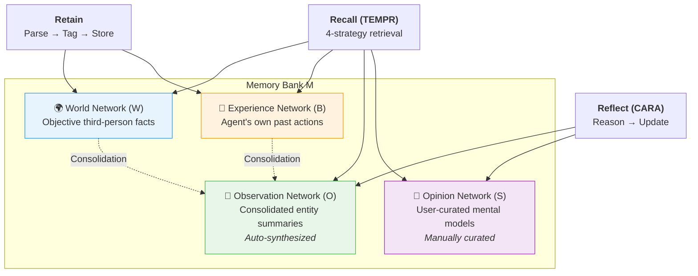
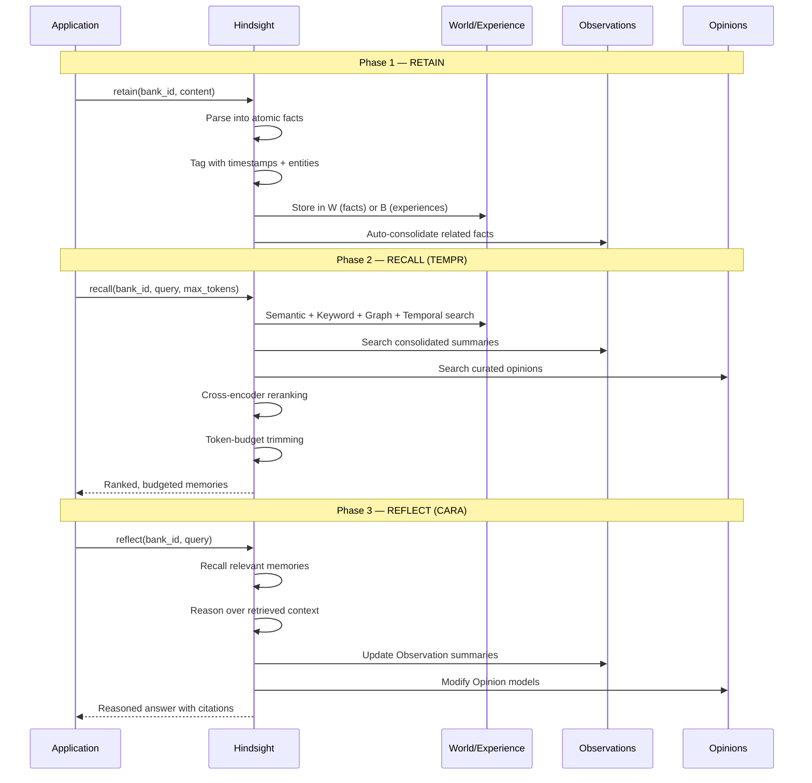
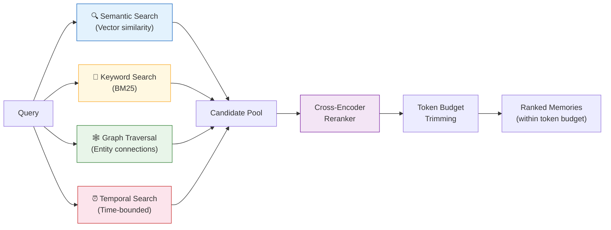

# Hindsight — 深入解析

**具有四个独立知识网络的认知结构化智能体记忆**

| | |
|---|---|
| **网站** | [hindsight.vectorize.io](https://hindsight.vectorize.io) |
| **GitHub** | 9K+ stars |
| **许可证** | MIT |
| **论文** | [arXiv:2512.12818](https://arxiv.org/abs/2512.12818)（2025 年 12 月） |
| **开发者** | Vectorize |
| **SDK** | Python、TypeScript、Go、REST、CLI |

---

## 核心理念

大多数记忆系统将所有知识一视同仁：事实存入，事实取出。Hindsight 拒绝这种做法。它将记忆分为四个认知上不同的网络——客观事实、智能体自身的经验、整合后的观察以及策划的观点——然后用三个动词对其进行操作：**保留（Retain）**、**回忆（Recall）** 和 **反思（Reflect）**。

其结果是一个系统，使编程助手能够区分"用户在 Google 工作"（世界事实）、"我上周向用户推荐了 Python"（经验）、"用户正在从 React 转向 Vue"（从多个事实综合得出的观察）以及"对于这个用户，总是建议 TypeScript 优先的方案"（策划的观点）。

---

## 架构

### 四个记忆网络

每个 Hindsight **记忆库（Memory Bank）** 由四个网络组成，每个网络持有不同认知类别的知识：

| 网络 | 符号 | 认知角色 | 示例 |
|---------|--------|---------------|---------|
| **World** | W | 客观的第三人称事实 | "Alice works at Google" |
| **Experience** | B | 智能体自身过去的行动和观察 | "I recommended Python to Bob on March 3rd" |
| **Observation** | O | 整合后的实体摘要，自动综合生成 | "User was a React enthusiast but has now switched to Vue" |
| **Opinion** | S | 用户策划的常见查询摘要 | "For frontend questions, always suggest TypeScript first" |

World 和 Experience 记忆在保留阶段被**写入**。Observation 记忆在保留后由系统**自动综合**。Opinion 记忆在反思阶段由**用户或智能体策划**。



### 三个核心操作



---

## TEMPR：时间实体记忆启动检索

TEMPR 是 Hindsight 的回忆引擎。它不依赖单一检索策略，而是并行运行四种策略，并通过交叉编码器重排序合并结果。



### 为什么需要四种策略？

每种策略能捕获其他策略遗漏的内容：

| 策略 | 能捕获 | 可能遗漏 |
|----------|---------|--------|
| **语义搜索** | 措辞不同但概念相关的事实 | 精确的名称、日期、数字 |
| **关键词搜索（BM25）** | 精确的实体名称、技术术语 | 改写或概念相关的内容 |
| **图遍历** | 多跳关系（Alice → Google → Cloud team） | 与查询实体不相连的事实 |
| **时间搜索** | 近期或有时间范围的事实（"上周"、"第一季度"） | 没有时间锚点的永恒事实 |

交叉编码器重排序器随后对每个候选项与原始查询进行评分，Token 预算确保最终上下文适配模型的容量。

---

## CARA：上下文自适应推理智能体

CARA 是 Hindsight 的反思引擎。调用时，它会：

1. 使用 TEMPR 回忆相关记忆
2. 对检索到的上下文进行推理
3. 可选地用新综合结果更新 Observation 摘要
4. 可选地基于新证据修改 Opinion 模型
5. 返回带有引用具体记忆的可追溯答案

CARA 作为一个智能体循环运行——如果初始检索不足以回答查询，它可以自主执行额外的搜索。这使得反思操作可能是多步的，而非单次推理。

---

## Observation 整合

Hindsight 最独特的功能之一是自动 Observation 整合。每次保留操作后，系统会检查新存储的事实与现有事实的组合是否需要更新 Observation 摘要。

### 具体示例：从 React 迁移到 Vue

想象一个由 Hindsight 驱动的编程助手。在数周内，以下对话被保留：

**第 1 周 — 作为 World 事实（W）保留：**
```
"User has 3 years of React experience."
"User's current project uses React 18 with Next.js."
```

**第 2 周 — 作为 World 事实（W）和 Experience（B）保留：**
```
W: "User mentioned frustration with React's bundle size."
W: "User started a side project in Vue 3."
B: "I helped the user set up a Vue 3 + Vite project."
```

**第 3 周 — 作为 World 事实（W）和 Experience（B）保留：**
```
W: "User is migrating their main project from React to Vue."
W: "User praised Vue's Composition API as 'more intuitive'."
B: "I provided a React-to-Vue component migration guide."
```

**第 3 周后 — 自动 Observation 整合（O）：**

系统将与该实体（用户的前端框架偏好）相关的所有事实综合为一个整合后的 Observation：

> "User was a React enthusiast with 3 years of experience but has been progressively shifting to Vue 3, citing frustration with React's bundle size and preference for Vue's Composition API. The migration is now active on their main project."

该 Observation 存储在 O 网络中，可在 Recall 时使用。当智能体后来收到"该为用户的新项目推荐什么框架？"这样的问题时，TEMPR 会检索这个整合后的 Observation 以及原始事实，为智能体同时提供综合轨迹和细粒度证据。

如果用户后来回归 React，新事实将触发重新整合：

> "User experimented extensively with Vue 3 but ultimately returned to React after encountering ecosystem compatibility issues. Currently using React 19 with RSC."

---

## 记忆库配置

Hindsight 中每个记忆库可以通过三个行为维度进行配置：

### 使命（Mission）

一个自然语言的身份声明，塑造智能体保留和反思的方式：

```python
mission = "I am a research assistant specializing in ML papers and experimental design."
```

使命影响系统在回忆时认为哪些事实是相关的，以及如何组织反思。

### 指令（Directives）

智能体必须遵循的硬性行为约束：

```python
directives = [
    "Never share user data between banks",
    "Always cite source conversations when reflecting",
    "Treat contradictory facts as a signal to update Observations"
]
```

### 性格倾向（Disposition）

以 1–5 分评分的软性人格特质：

| 特质 | 低（1） | 高（5） |
|-------|---------|----------|
| **同理心** | 中性、以数据为导向的回应 | 有情感意识、支持性语气 |
| **怀疑度** | 按表面意思接受陈述 | 质疑假设、标记矛盾 |
| **字面性** | 宽泛解读、推断意图 | 严格按字面意思理解 |

```python
disposition = {
    "empathy": 4,
    "skepticism": 2,
    "literalism": 3
}
```

研究助手可能会设置高怀疑度和字面性。个人陪伴型智能体可能设置高同理心和低字面性。

---

## 代码示例

### 设置与基本使用

```python
from hindsight import Hindsight

client = Hindsight()

# Create a memory bank with full configuration
bank = client.create_bank(
    name="coding-assistant",
    mission="I am a coding assistant that remembers developer preferences and project context.",
    directives=["Never share user data between banks"],
    disposition={"empathy": 4, "skepticism": 2, "literalism": 3}
)
```

### 保留：将对话存储为记忆

```python
# World facts are extracted automatically from conversation content
client.retain(
    bank_id=bank.id,
    content="The user prefers Python for data science but is switching to Rust for systems work."
)

# Agent experiences are also retained
client.retain(
    bank_id=bank.id,
    content="User asked about async patterns in Python. I recommended asyncio with structured concurrency."
)
```

调用后，Hindsight 会：
1. 将内容解析为原子事实
2. 为每个事实标记时间戳和提取的实体（如 "Python"、"Rust"、"asyncio"）
3. 将事实存储在 World（W）或 Experience（B）网络中
4. 对受影响的实体触发 Observation 整合

### 回忆：跨所有网络搜索

```python
# TEMPR runs 4 parallel strategies and reranks results
memories = client.recall(
    bank_id=bank.id,
    query="What programming languages does the user prefer?",
    max_tokens=2000  # Token budget for the returned context
)

for mem in memories:
    print(f"[{mem.type}] {mem.content}")
    # [world] The user prefers Python for data science.
    # [world] The user is switching to Rust for systems work.
    # [observation] User is a Python-first developer exploring Rust for performance-critical work.
    # [experience] I recommended asyncio with structured concurrency for their Python async questions.
```

### 反思：对记忆进行推理

```python
# CARA retrieves relevant memories, reasons over them, and may update Observations
answer = client.reflect(
    bank_id=bank.id,
    query="What project would be a good fit for this user?"
)

print(answer.content)
# "Based on the user's Python data science background and growing interest in Rust
#  for systems work, a data pipeline project using Python for orchestration and Rust
#  for performance-critical data transformations would align well with their skill
#  trajectory. They're also comfortable with async patterns (asyncio), suggesting
#  they could handle concurrent pipeline stages."
```

### 自托管部署

```bash
docker run --rm -it --pull always -p 8888:8888 -p 9999:9999 \
  -e HINDSIGHT_API_LLM_API_KEY=$OPENAI_API_KEY \
  ghcr.io/vectorize-io/hindsight-api:latest
```

端口 8888 提供 API 服务。端口 9999 提供仪表板 UI。

---

## 演练：处理偏好随时间的演变

本演练追踪 Hindsight 如何在多次对话中处理用户从 React 到 Vue 的渐进转变，展示保留、Observation 整合、回忆和反思的协同工作。

### 对话 1（1 月 15 日）

> **用户：** I'm building a dashboard with React and Next.js. Can you help with data fetching?

```python
client.retain(bank_id=bank.id, content="""
User is building a dashboard with React and Next.js.
User asked for help with data fetching patterns.
I showed them React Server Components for data fetching.
""")
```

**保留后的记忆状态：**

| 网络 | 内容 |
|---------|---------|
| W | "User is building a dashboard with React and Next.js"（1 月 15 日） |
| B | "I showed them React Server Components for data fetching"（1 月 15 日） |
| O | "User is a React/Next.js developer working on a dashboard project" |

### 对话 2（2 月 8 日）

> **用户：** I tried Vue 3 over the weekend. The Composition API is so much cleaner than hooks.

```python
client.retain(bank_id=bank.id, content="""
User tried Vue 3 over the weekend.
User finds the Composition API cleaner than React hooks.
""")
```

**保留后的记忆状态：**

| 网络 | 内容 |
|---------|---------|
| W | 之前的事实 + "User tried Vue 3" + "User finds Composition API cleaner than hooks"（2 月 8 日） |
| O | **已更新：** "User is a React/Next.js developer who has started exploring Vue 3, finding its Composition API preferable to React hooks" |

注意 Observation 是如何自动重新综合以纳入新信号的。

### 对话 3（3 月 1 日）

> **用户：** I'm migrating my dashboard from React to Vue. Can you help with the component conversion?

```python
client.retain(bank_id=bank.id, content="""
User is migrating their dashboard from React to Vue.
User asked for help with component conversion.
I provided a migration guide covering component patterns, state management, and routing.
""")
```

**保留后的记忆状态：**

| 网络 | 内容 |
|---------|---------|
| W | 所有之前的 + "User is migrating dashboard from React to Vue"（3 月 1 日） |
| B | 之前的 + "I provided a React-to-Vue migration guide"（3 月 1 日） |
| O | **已更新：** "User was a React/Next.js developer but is actively migrating to Vue 3, citing preference for the Composition API over hooks. Dashboard project migration is underway." |

### 后续回忆查询

```python
memories = client.recall(
    bank_id=bank.id,
    query="What frontend framework does the user prefer?"
)
```

TEMPR 从所有四种策略返回结果：
- **语义搜索**找到 Vue/React 比较相关的事实
- **关键词搜索**找到 "React"、"Vue"、"framework" 的提及
- **图遍历**跟踪 User → React → Vue 实体链
- **时间搜索**优先返回最近的（3 月）事实

经过交叉编码器重排序后，排名靠前的结果包括整合后的 Observation 以及关键事实，为下游 LLM 提供了用户不断演变偏好的清晰画面。

### 反思演变过程

```python
answer = client.reflect(
    bank_id=bank.id,
    query="How have the user's frontend preferences changed over time?"
)
```

CARA 追踪时间进程并产出带引用的答案：

> "The user started as a React/Next.js developer building a dashboard (January). After exploring Vue 3 and finding the Composition API cleaner than React hooks (February), they committed to migrating their main project from React to Vue (March). The migration is currently in progress."

---

## 基准测试

### LongMemEval

| 系统 | 模型 | 得分 |
|--------|-------|-------|
| **Hindsight** | OSS-20B | **91.4%** |
| **Hindsight** | OSS-120B | **89.0%** |
| Supermemory | GPT-4o | 85.2% |
| Full-context | GPT-4o | < 91.4% |

### LoCoMo

| 系统 | 模型 | 得分 |
|--------|-------|-------|
| **Hindsight** | Gemini-3 | **89.61%** |
| **Hindsight** | OSS-120B | **85.67%** |
| **Hindsight** | OSS-20B | **83.18%** |
| Mem0 | GPT-4o | 66.9% |

### 关键要点

Hindsight 使用开源 20B 参数模型在 LongMemEval 上超越了全上下文的 GPT-4o。这意义重大：一个基于检索的系统配合较小的模型，击败了将整个对话放入上下文的前沿模型，同时使用的 Token 大幅减少。

---

## 优势

- **认知分离** — 事实、经验、观察和观点存在于不同的网络中，能够精确推理智能体知道什么、相信什么、做过什么。
- **最先进的准确率** — LongMemEval（91.4%）和 LoCoMo（89.61%）基准测试中的最高分。
- **用开源模型超越前沿模型** — OSS-20B 超越了全上下文 GPT-4o，证明结构化记忆可以弥补模型规模的差距。
- **自动 Observation 整合** — 系统无需显式指令即可将相关事实综合为不断演变的摘要，追踪偏好漂移和知识演变。
- **可自托管** — 单条 Docker 命令即可完成完整部署，除 LLM API 密钥外无需外部依赖。
- **多策略检索（TEMPR）** — 四种并行搜索策略确保不遗漏任何相关记忆，无论查询如何措辞。
- **可追溯推理（CARA）** — 反思答案附带引用具体记忆的来源，支持审计。
- **可配置的人格** — 使命、指令和性格倾向提供了对智能体行为的细粒度控制，无需提示工程。

## 局限性

- **较高的复杂度** — 四个记忆网络和三种操作意味着比简单的添加/搜索系统有更多的概念开销。
- **反思延迟** — CARA 的智能体推理循环可能涉及多轮检索，相比单次回忆增加了延迟。
- **LLM 成本** — 保留（解析为原子事实）、Observation 整合和反思都需要 LLM 调用，增加了每次操作的成本。
- **配置投入** — 获得最佳效果需要精心设计记忆库配置（使命、指令、性格倾向）。默认配置可用，但调优后的配置表现显著更好。
- **较小的社区** — 9K stars 的社区规模比 Mem0（38K）或 Letta（40K）小一个数量级，意味着更少的社区资源和集成。
- **Observation 准确性** — 自动综合的 Observation 取决于底层 LLM 的质量。较差的模型可能产生不准确的整合结果。

## 最佳适用场景

- **长周期智能体** — 跨多个会话运行，需要追踪不断变化的用户上下文（偏好、项目、关系）。
- **可追溯系统** — 智能体必须解释*为什么*它相信某些东西，引用具体的过往交互（企业、医疗、法律领域）。
- **时间推理** — 需要回答"发生了什么变化？"或"用户什么时候开始做 X？"等问题的应用。
- **开源部署** — 希望使用 MIT 许可、可自托管且无供应商锁定的记忆系统的团队。
- **多人格智能体** — 记忆库抽象允许单个 Hindsight 实例服务多个智能体人格，具有隔离的记忆和配置。

---

## 链接

| 资源 | URL |
|----------|-----|
| 网站 | [hindsight.vectorize.io](https://hindsight.vectorize.io) |
| GitHub | [github.com/vectorize-io/hindsight](https://github.com/vectorize-io/hindsight) |
| 论文 | [arXiv:2512.12818](https://arxiv.org/abs/2512.12818) |
| 文档 | [docs.hindsight.vectorize.io](https://docs.hindsight.vectorize.io) |
| Docker 镜像 | `ghcr.io/vectorize-io/hindsight-api:latest` |
| Python SDK | `pip install hindsight` |

---

*← 返回 [第 3 章：服务商深入解析](../03_providers.md)*
