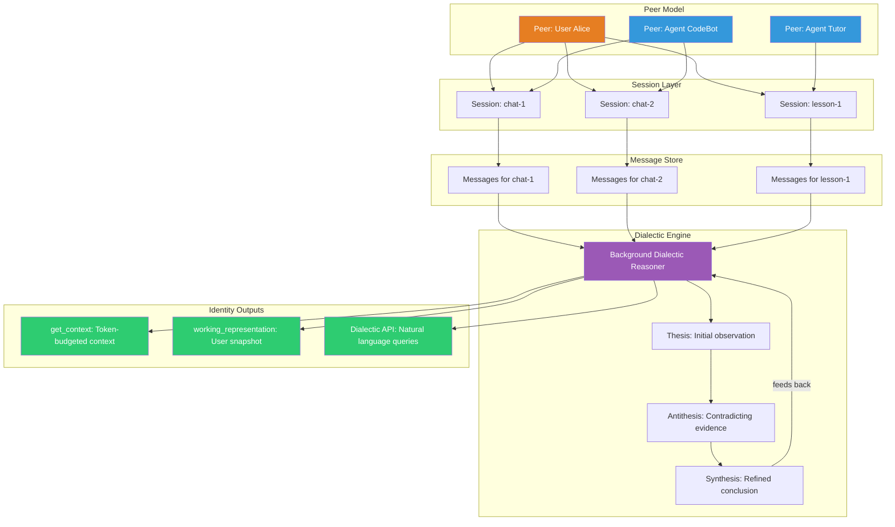
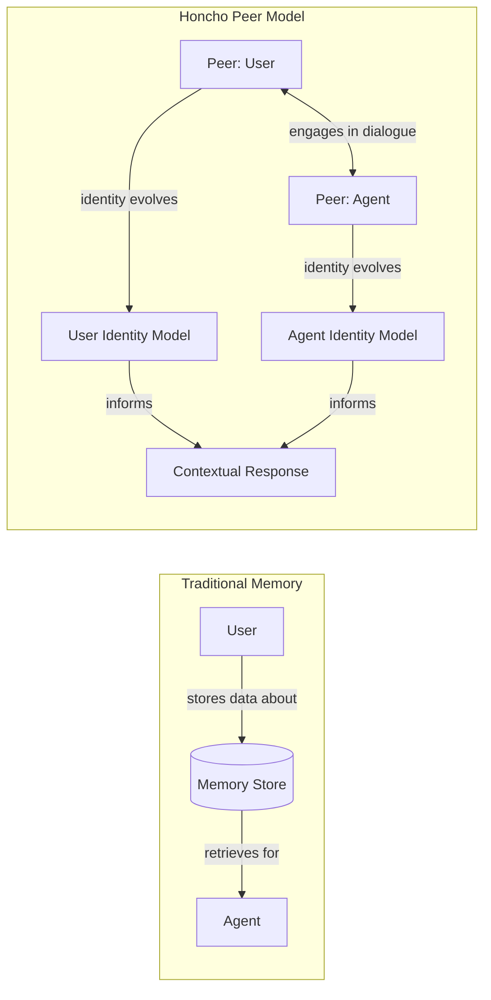
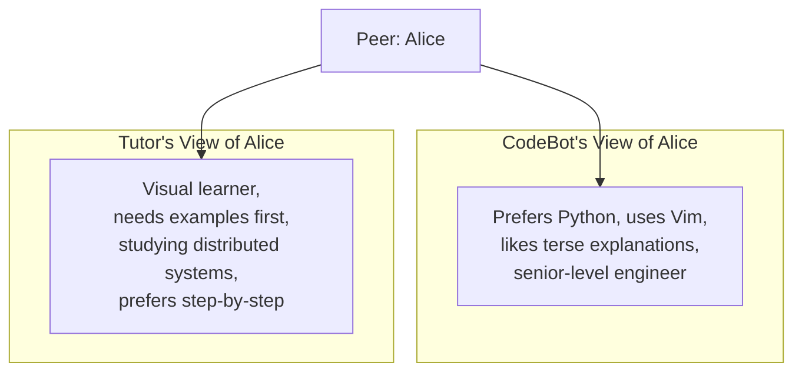
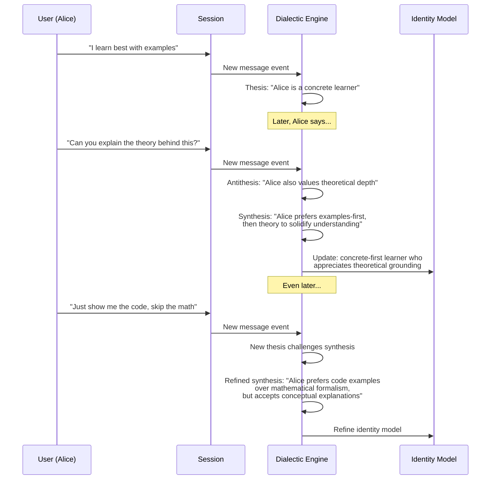

# Honcho — 深度解析

**官网：** [honcho.dev](https://honcho.dev) | **GitHub：** [plastic-labs/honcho](https://github.com/plastic-labs/honcho) | **开发者：** Plastic Labs | **融资：** 540 万美元 Pre-Seed 轮 | **许可协议：** 开源

> 一个面向 AI 的个人身份平台——它不满足于简单地存取记忆，而是通过辩证推理去主动推断和理解每一位用户。

---

## 架构概览

Honcho 跳出了传统"存进去、取出来"的记忆范式。它把用户和智能体都建模为对话中的**对等体（peer）**，并在后台持续运行**辩证推理**，不断生成和修正关于每位用户的认知。



---

## 核心概念

### 对等体模型

传统记忆系统把用户当作被动的数据源——提供信息，然后等着被查询。Honcho 的对等体模型完全不同：无论是人类还是 AI 智能体，每一个参与者都是拥有独立身份和视角的**对等体**。



| 概念 | 描述 |
|------|------|
| **对等体（Peer）** | 对话中的任意参与者——用户或智能体均可。每个对等体拥有独一无二的身份。 |
| **会话（Session）** | 对等体之间的对话线程，包含按序排列的消息。 |
| **消息（Message）** | 会话中的一条发言，归属于某个特定对等体。 |
| **身份（Identity）** | 辩证推理持续生成和更新的、关于对等体的动态认知模型。 |

### 多智能体隔离

这是 Honcho 的一个精妙设计：**每一对对等体之间都维护着独立的身份画像**。假如 Alice 同时在跟 CodeBot 和 Tutor 两个智能体对话，那么这两个智能体各自会形成对 Alice 的不同认知：



这样做的好处显而易见——每个智能体都能构建符合自身场景的用户认知，不会发生"串台"。Alice 和编程助手之间聊的内容不会跑到她的辅导课里去，除非你刻意这样设计。

---

## 辩证推理：Honcho 如何"读懂"用户

辩证引擎是 Honcho 最核心的创新。它不只是被动地记录用户说了什么，而是借鉴黑格尔辩证法中"正题→反题→合题"的思维框架，**主动推理**用户到底是怎样一个人。

用更直白的话说：当系统先观察到 Alice "喜欢看例子学习"，后来又发现她"也会主动追问背后的理论"，传统系统只会把这两条信息并列存起来。而 Honcho 的辩证引擎会把它们放在一起审视——第一个观察是正题，第二个构成反题，最终综合出一条更精准的认知："Alice 习惯先从具体例子入手，再用理论来巩固理解"。



### 运作机制

1. **观察**：辩证引擎捕捉会话中的每一条消息
2. **正题形成**：基于新证据得出初步判断
3. **矛盾发现**：当新证据与已有结论产生冲突时，一个"反题"随之而来
4. **合题生成**：把看似矛盾的观察调和成一个更加细腻、更接近真实的理解
5. **螺旋上升**：合题又成为新一轮推理的起点，循环往复、不断深化

这个过程最有价值的地方在于：Honcho 对用户的理解会随着时间变得**越来越深刻精准**，而不仅仅是知道的越来越多。粗放的事实堆砌和深刻的理解，差别就在这里。

---

## API 参考与代码示例

### 设置对等体和会话

```python
from honcho import Honcho

honcho = Honcho()

# Create peers
peer_alice = honcho.peer("alice")
peer_codebot = honcho.peer("codebot")

# Create a session between them
session = honcho.session("coding-help-1")

# Add messages to the session
msg1 = peer_alice.message("I learn best with examples")
msg2 = peer_codebot.message("Sure! Here's a code example for decorators...")
msg3 = peer_alice.message("That's perfect. Can you also explain the theory?")

session.add_messages([msg1, msg2, msg3])
# The dialectic engine begins reasoning about Alice in the background
```

### 获取上下文（`get_context`）

`get_context` 接口返回一段控制在 Token 预算以内的上下文，可以直接注入 LLM 的提示词中：

```python
# Get relevant context about Alice, fitting within a token budget
context = honcho.get_context(
    session_id="coding-help-1",
    peer_id="alice",
    max_tokens=2000
)

print(context)
# Returns a structured summary:
# {
#   "identity": "Alice is a concrete learner who prefers code examples
#                before theoretical explanations. She's an experienced
#                developer who values practical demonstrations.",
#   "relevant_memories": [
#       "Prefers examples-first learning approach",
#       "Asked for theoretical depth after seeing code",
#       "Experienced with Python decorators"
#   ],
#   "session_context": "Currently discussing Python decorator patterns"
# }

# Use this directly in your LLM prompt
prompt = f"""
{context['identity']}

Relevant memories:
{chr(10).join('- ' + m for m in context['relevant_memories'])}

User's question: How do async generators work?
"""
```

### 工作表示（用户快照）

`working_representation` 提供 Honcho 当前对用户认知的完整快照——辩证引擎迄今为止的全部推理成果都浓缩在这里：

```python
# Get the full working representation of Alice
representation = honcho.working_representation(peer_id="alice")

print(representation)
# {
#   "peer_id": "alice",
#   "summary": "Experienced developer, concrete learner, prefers examples
#               before theory. Values practical code demonstrations.
#               Comfortable with Python, exploring distributed systems.",
#   "traits": {
#       "learning_style": "concrete-first with theoretical follow-up",
#       "expertise_level": "senior",
#       "communication_preference": "code-heavy, concise"
#   },
#   "confidence": 0.82,
#   "last_updated": "2026-03-15T14:30:00Z",
#   "session_count": 12,
#   "synthesis_count": 47
# }
```

### 辩证 API（自然语言查询）

辩证 API 的独特之处在于：你可以用自然语言直接向系统提问关于用户的任何问题。

```python
# Ask natural language questions about Alice
answer = honcho.dialectic.query(
    peer_id="alice",
    question="What's the best way to explain a complex algorithm to Alice?"
)

print(answer)
# "Based on 12 sessions of interaction, Alice responds best to:
#  1. A concrete code example showing the algorithm in action
#  2. A brief conceptual explanation of why it works
#  3. Edge cases demonstrated through code modifications
#  She explicitly dislikes heavy mathematical notation and prefers
#  Python-based pseudocode over formal algorithmic notation."

# Ask about preferences for a specific domain
answer = honcho.dialectic.query(
    peer_id="alice",
    question="Would Alice prefer a video tutorial or written docs for Kubernetes?"
)

print(answer)
# "Alice has not explicitly discussed Kubernetes learning preferences,
#  but based on her demonstrated learning style across 12 sessions,
#  she would likely prefer written docs with embedded code examples
#  and kubectl command demonstrations, followed by a brief architectural
#  overview. Confidence: moderate (extrapolated from general patterns)."
```

---

## 分步演练：构建个性化辅导智能体

### 场景

假设你在构建一个 AI 辅导员，希望它能根据每位学生的特点调整教学方式。Honcho 的辩证推理正好派上用场。

### 步骤 1：初始化对等体

```python
from honcho import Honcho

honcho = Honcho()

# The student
student = honcho.peer("student_marcus")
# The tutor agent
tutor = honcho.peer("tutor_distributed_systems")
```

### 步骤 2：进行学习会话

```python
# Session 1: Introduction to Consensus
s1 = honcho.session("lesson-consensus-101")

messages = [
    student.message("I need to understand Raft consensus. I know basic networking."),
    tutor.message("Let's start with the leader election process..."),
    student.message("Wait, can you show me a simple simulation first? "
                    "I get confused with just descriptions."),
    tutor.message("Here's a Python simulation of 3-node Raft..."),
    student.message("Now I get it. So the heartbeat timeout triggers election?"),
    tutor.message("Exactly! And here's what happens during a network partition..."),
    student.message("The split-brain thing is tricky. Can you draw it out?"),
]
s1.add_messages(messages)
# Dialectic engine observes: Marcus needs visual/simulation aids,
# understands networking basics, struggles with abstract descriptions
```

### 步骤 3：下次上课前了解学生

```python
# Before the next lesson, check what Honcho has learned about Marcus
context = honcho.get_context(
    session_id="lesson-consensus-201",  # new session
    peer_id="student_marcus",
    max_tokens=1500
)

# Build an adaptive prompt
system_prompt = f"""You are a distributed systems tutor.

Student Profile (from Honcho):
{context['identity']}

Teaching guidelines based on this student:
- Lead with simulations and code examples
- Follow up with diagrams for complex concepts
- Avoid pure-description explanations
- Student has solid networking fundamentals
- Check understanding with "what happens if..." scenarios

Current topic: Log replication in Raft
"""
```

### 步骤 4：认知随课程不断深化

```python
# After several more sessions, ask the Dialectic API
insights = honcho.dialectic.query(
    peer_id="student_marcus",
    question="How has Marcus's learning style evolved over our sessions?"
)
# "Marcus initially required simulation-first teaching. Over 8 sessions,
#  he has developed the ability to reason abstractly about consensus
#  protocols when anchored by a prior concrete example. He now asks
#  'what if' questions proactively, suggesting readiness for more
#  theoretical content alongside practical demonstrations."
```

---

## 对比：Honcho 与传统记忆系统

| 维度 | 传统记忆（如向量存储） | Honcho |
|------|----------------------|--------|
| **存储模型** | 事实化作嵌入向量 | 身份化作持续演进的认知模型 |
| **推理方式** | 检索 → 呈现 | 辩证合题 → 理解 |
| **矛盾处理** | 最后写入胜出或手动干预 | 正题-反题-合题自动调和 |
| **用户模型深度** | 停留在表层偏好 | 深入到行为模式和认知特征 |
| **多智能体** | 共享同一个记忆池 | 按对等体配对隔离 |
| **查询类型** | 相似度搜索 | 自然语言提问 |
| **更新方式** | 需要显式调用添加/更新接口 | 后台持续自动推断 |
| **价值显现** | 即时（首次写入即可） | 随交互积累逐步加深 |

---

## 定价

| 方案 | 价格 | 详情 |
|------|------|------|
| **Free** | $100 额度 | API 入门体验 |
| **按量计费** | $2 / 100 万 tokens | 用多少付多少 |

---

## 优势

- **真正理解用户**：辩证推理产出的不是扁平的偏好标签，而是持续演进、越来越精准的用户认知模型
- **多智能体天然隔离**：每一对智能体-用户关系都有独立的身份画像，杜绝上下文互相污染
- **自然语言查询**：通过辩证 API，你可以用自由文本向系统提问关于用户的一切，远比键值查找灵活
- **Token 预算可控**：`get_context` 严格遵守 Token 上限，与 LLM 集成时不用担心上下文溢出
- **后台异步处理**：推理在后台默默进行，不拖累对话本身的响应速度

## 局限性

- **冷启动不可避免**：辩证推理需要足够多的对话作为素材，头几次会话时系统还"不太了解"用户
- **推理过程是黑箱**：辩证引擎得出某个结论的具体路径不够透明，调试起来比较费劲
- **合题有延迟**：后台推理意味着最新的洞察可能没那么快反映出来，存在一定时间差
- **生态集成偏少**：与 Supermemory 或 Mem0 这类平台相比，第三方连接器和集成明显不足
- **产品还很早期**：540 万美元 Pre-Seed 轮的体量说明产品仍处于探索阶段，大规模生产环境的稳定性有待验证

## 最佳适用场景

- **个性化教育平台**：每个学习者的风格和节奏都不一样，辩证推理能帮助智能体因材施教
- **陪伴型或心理辅导 AI**：需要对用户形成深度共情认知的场景
- **多智能体系统**：不同智能体需要从各自的角度理解同一位用户
- **重理解、轻记忆的产品**：当"用户是谁"比"用户说过什么"更重要时
- **长期陪伴关系**：用户会持续使用数周甚至数月的应用，辩证推理有充足的时间发挥价值

---

## 扩展阅读

- [Honcho 文档](https://docs.honcho.dev)
- [GitHub 仓库](https://github.com/plastic-labs/honcho)
- [Plastic Labs 博客——辩证推理](https://blog.plasticlabs.ai)
- [AI 中用户身份的必要性（Plastic Labs）](https://plasticlabs.ai/blog/identity)
