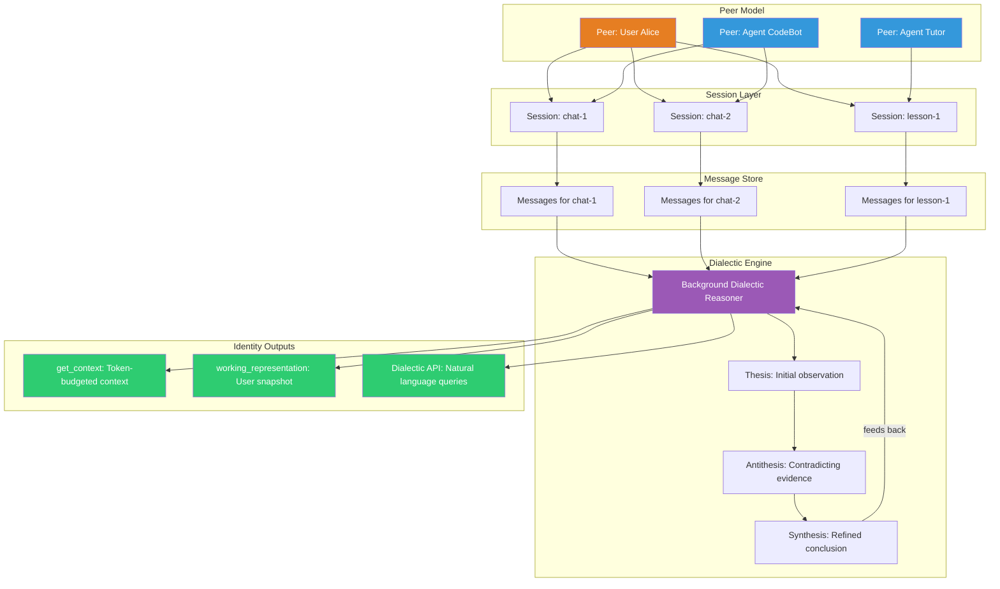
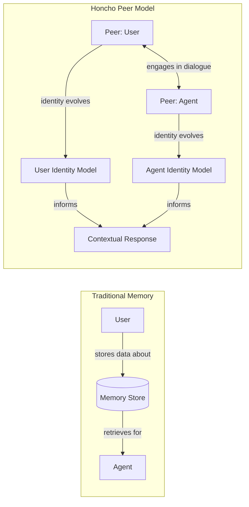
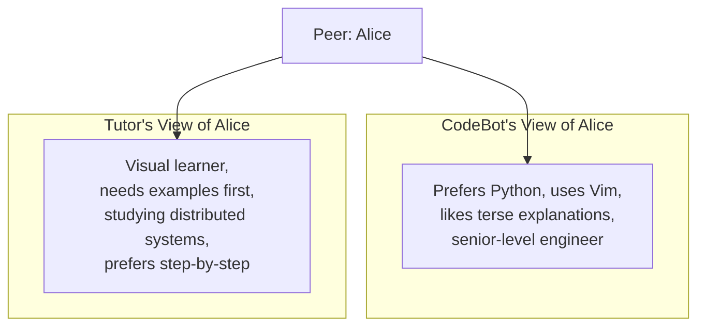
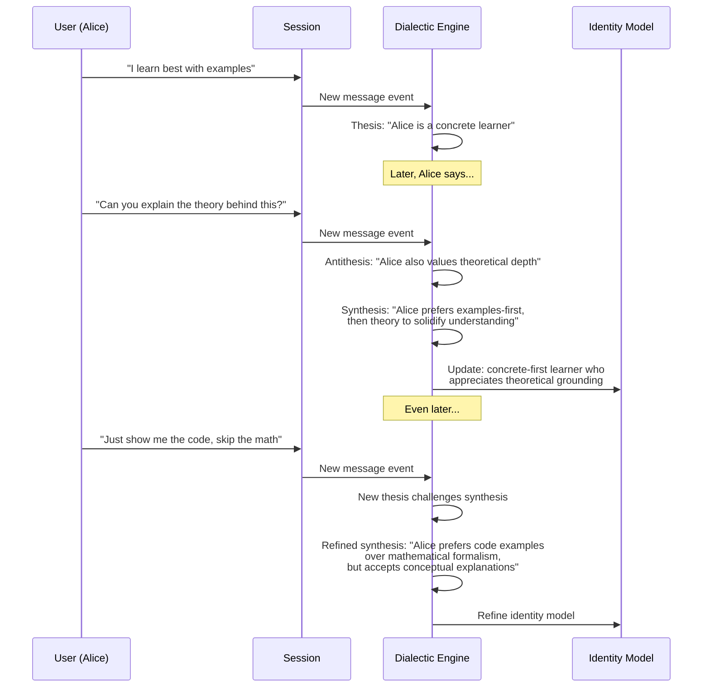

# Honcho — 深度解析

**官网：** [honcho.dev](https://honcho.dev) | **GitHub：** [plastic-labs/honcho](https://github.com/plastic-labs/honcho) | **开发者：** Plastic Labs | **融资：** 540 万美元 Pre-Seed 轮 | **许可协议：** 开源

> 面向 AI 的个人身份平台，使用辩证推理构建对用户的真正理解——不仅仅是记忆存储，而是对用户身份的主动推断。

---

## 架构概览

Honcho 打破了典型的"存储和检索"记忆范式。它将用户和智能体建模为参与对话的**对等体（peers）**，并运行**后台辩证推理**过程来生成关于每个用户的不断演化的结论。



---

## 核心概念

### 对等体模型

传统记忆系统将用户视为被动的数据源。Honcho 的对等体模型将每个参与者——无论是人类还是 AI——视为拥有自身身份和视角的主动**对等体**。



| 概念 | 描述 |
|------|------|
| **对等体（Peer）** | 对话中的任意参与者——用户或智能体。每个对等体都有唯一的身份。 |
| **会话（Session）** | 对等体之间的对话线程，包含有序的消息。 |
| **消息（Message）** | 会话中的单条发言，归属于特定的对等体。 |
| **身份（Identity）** | 由辩证推理生成的关于对等体身份的不断演化的模型。 |

### 多智能体隔离

一个关键特性：Honcho 为**每对对等体维护独立的身份画像**。如果 Alice 同时与 CodeBot 和 Tutor 交谈，每个智能体都会对 Alice 形成自己的理解：



这意味着每个智能体都可以构建与上下文相适应的模型，而不会交叉污染——Alice 与编程助手分享的内容不会泄露到她的辅导会话中，除非有意设计如此。

---

## 辩证推理：Honcho 如何"思考"用户

辩证引擎是 Honcho 的核心创新。它不仅存储用户所说的内容——还通过受黑格尔辩证法启发的正题-反题-合题循环主动推理用户。



### 工作原理

1. **观察**：辩证引擎观察会话中的每条消息
2. **正题生成**：从新证据中得出初步结论
3. **矛盾检测**：与现有结论冲突的新证据触发反题
4. **合题**：将冲突的观察调和为更细致入微的理解
5. **持续精炼**：合题成为新的正题，循环继续

这意味着 Honcho 对用户的理解会随着时间推移变得**更加细致入微**，而不仅仅是数量的增加。

---

## API 参考与代码示例

### 设置对等体和会话

```python
from honcho import Honcho

honcho = Honcho()

# Create peers
peer_alice = honcho.peer("alice")
peer_codebot = honcho.peer("codebot")

# Create a session between them
session = honcho.session("coding-help-1")

# Add messages to the session
msg1 = peer_alice.message("I learn best with examples")
msg2 = peer_codebot.message("Sure! Here's a code example for decorators...")
msg3 = peer_alice.message("That's perfect. Can you also explain the theory?")

session.add_messages([msg1, msg2, msg3])
# The dialectic engine begins reasoning about Alice in the background
```

### 获取上下文（`get_context`）

`get_context` 端点返回一个符合 Token 预算的上下文块，适合注入 LLM 提示词：

```python
# Get relevant context about Alice, fitting within a token budget
context = honcho.get_context(
    session_id="coding-help-1",
    peer_id="alice",
    max_tokens=2000
)

print(context)
# Returns a structured summary:
# {
#   "identity": "Alice is a concrete learner who prefers code examples
#                before theoretical explanations. She's an experienced
#                developer who values practical demonstrations.",
#   "relevant_memories": [
#       "Prefers examples-first learning approach",
#       "Asked for theoretical depth after seeing code",
#       "Experienced with Python decorators"
#   ],
#   "session_context": "Currently discussing Python decorator patterns"
# }

# Use this directly in your LLM prompt
prompt = f"""
{context['identity']}

Relevant memories:
{chr(10).join('- ' + m for m in context['relevant_memories'])}

User's question: How do async generators work?
"""
```

### 工作表示（用户快照）

`working_representation` 提供 Honcho 当前对用户理解的整体快照：

```python
# Get the full working representation of Alice
representation = honcho.working_representation(peer_id="alice")

print(representation)
# {
#   "peer_id": "alice",
#   "summary": "Experienced developer, concrete learner, prefers examples
#               before theory. Values practical code demonstrations.
#               Comfortable with Python, exploring distributed systems.",
#   "traits": {
#       "learning_style": "concrete-first with theoretical follow-up",
#       "expertise_level": "senior",
#       "communication_preference": "code-heavy, concise"
#   },
#   "confidence": 0.82,
#   "last_updated": "2026-03-15T14:30:00Z",
#   "session_count": 12,
#   "synthesis_count": 47
# }
```

### 辩证 API（自然语言查询）

辩证 API 允许你用自然语言提问关于用户的问题：

```python
# Ask natural language questions about Alice
answer = honcho.dialectic.query(
    peer_id="alice",
    question="What's the best way to explain a complex algorithm to Alice?"
)

print(answer)
# "Based on 12 sessions of interaction, Alice responds best to:
#  1. A concrete code example showing the algorithm in action
#  2. A brief conceptual explanation of why it works
#  3. Edge cases demonstrated through code modifications
#  She explicitly dislikes heavy mathematical notation and prefers
#  Python-based pseudocode over formal algorithmic notation."

# Ask about preferences for a specific domain
answer = honcho.dialectic.query(
    peer_id="alice",
    question="Would Alice prefer a video tutorial or written docs for Kubernetes?"
)

print(answer)
# "Alice has not explicitly discussed Kubernetes learning preferences,
#  but based on her demonstrated learning style across 12 sessions,
#  she would likely prefer written docs with embedded code examples
#  and kubectl command demonstrations, followed by a brief architectural
#  overview. Confidence: moderate (extrapolated from general patterns)."
```

---

## 分步演练：构建个性化辅导智能体

### 场景

你正在构建一个 AI 辅导员，它使用 Honcho 的辩证推理来适配每个学生的教学风格。

### 步骤 1：初始化对等体

```python
from honcho import Honcho

honcho = Honcho()

# The student
student = honcho.peer("student_marcus")
# The tutor agent
tutor = honcho.peer("tutor_distributed_systems")
```

### 步骤 2：进行学习会话

```python
# Session 1: Introduction to Consensus
s1 = honcho.session("lesson-consensus-101")

messages = [
    student.message("I need to understand Raft consensus. I know basic networking."),
    tutor.message("Let's start with the leader election process..."),
    student.message("Wait, can you show me a simple simulation first? "
                    "I get confused with just descriptions."),
    tutor.message("Here's a Python simulation of 3-node Raft..."),
    student.message("Now I get it. So the heartbeat timeout triggers election?"),
    tutor.message("Exactly! And here's what happens during a network partition..."),
    student.message("The split-brain thing is tricky. Can you draw it out?"),
]
s1.add_messages(messages)
# Dialectic engine observes: Marcus needs visual/simulation aids,
# understands networking basics, struggles with abstract descriptions
```

### 步骤 3：下次会话前查询理解情况

```python
# Before the next lesson, check what Honcho has learned about Marcus
context = honcho.get_context(
    session_id="lesson-consensus-201",  # new session
    peer_id="student_marcus",
    max_tokens=1500
)

# Build an adaptive prompt
system_prompt = f"""You are a distributed systems tutor.

Student Profile (from Honcho):
{context['identity']}

Teaching guidelines based on this student:
- Lead with simulations and code examples
- Follow up with diagrams for complex concepts
- Avoid pure-description explanations
- Student has solid networking fundamentals
- Check understanding with "what happens if..." scenarios

Current topic: Log replication in Raft
"""
```

### 步骤 4：持续精炼

```python
# After several more sessions, ask the Dialectic API
insights = honcho.dialectic.query(
    peer_id="student_marcus",
    question="How has Marcus's learning style evolved over our sessions?"
)
# "Marcus initially required simulation-first teaching. Over 8 sessions,
#  he has developed the ability to reason abstractly about consensus
#  protocols when anchored by a prior concrete example. He now asks
#  'what if' questions proactively, suggesting readiness for more
#  theoretical content alongside practical demonstrations."
```

---

## 对比：Honcho 与传统记忆系统

| 维度 | 传统记忆（如向量存储） | Honcho |
|------|----------------------|--------|
| **存储模型** | 事实作为嵌入 | 身份作为不断演化的模型 |
| **推理方式** | 检索 → 呈现 | 辩证合题 → 理解 |
| **矛盾处理** | 最后写入胜出或手动处理 | 正题-反题-合题 |
| **用户模型深度** | 表层偏好 | 深层行为模式 |
| **多智能体** | 共享记忆池 | 按对等体配对隔离 |
| **查询类型** | 相似度搜索 | 自然语言提问 |
| **更新方式** | 显式的添加/更新调用 | 持续的后台推断 |
| **价值产出时间** | 即时（首次添加即可） | 随交互增长 |

---

## 定价

| 方案 | 价格 | 详情 |
|------|------|------|
| **Free** | $100 额度 | API 入门体验 |
| **按量计费** | $2 / 100 万 tokens | 按使用量付费 |

---

## 优势

- **深度用户理解**：辩证推理产生细致入微、不断演化的用户模型，远超简单的偏好存储
- **多智能体隔离**：每个智能体-用户配对维护独立的身份模型，防止上下文泄露
- **自然语言查询**：辩证 API 支持关于用户的自由形式提问，比键值查找灵活得多
- **Token 预算控制**：`get_context` 遵守 Token 限制，便于与 LLM 集成
- **后台处理**：推理异步进行——不影响对话本身的延迟

## 局限性

- **冷启动问题**：辩证推理需要多次对话才能构建有用的模型；首次会话体验较薄弱
- **推理不透明**：辩证过程是黑箱——难以调试为何得出特定结论
- **合题延迟**：后台推理意味着洞察可能滞后于最近的对话
- **生态系统有限**：与 Supermemory 或 Mem0 等平台相比，集成和连接器较少
- **早期阶段**：540 万美元 Pre-Seed 融资表明产品处于非常早期；生产稳定性的实战记录有限

## 最佳适用场景

- **个性化教育平台**，需要理解每个学习者风格的场景
- **陪伴型/心理治疗 AI** 应用，需要深度的共情理解
- **多智能体系统**，不同智能体需要对同一用户有不同的视角
- **用户理解 > 记忆召回的产品** ——当你需要知道用户*是谁*而非仅仅他们说了什么
- **长期关系**：用户持续交互数周或数月的应用

---

## 扩展阅读

- [Honcho 文档](https://docs.honcho.dev)
- [GitHub 仓库](https://github.com/plastic-labs/honcho)
- [Plastic Labs 博客——辩证推理](https://blog.plasticlabs.ai)
- [AI 中用户身份的必要性（Plastic Labs）](https://plasticlabs.ai/blog/identity)
