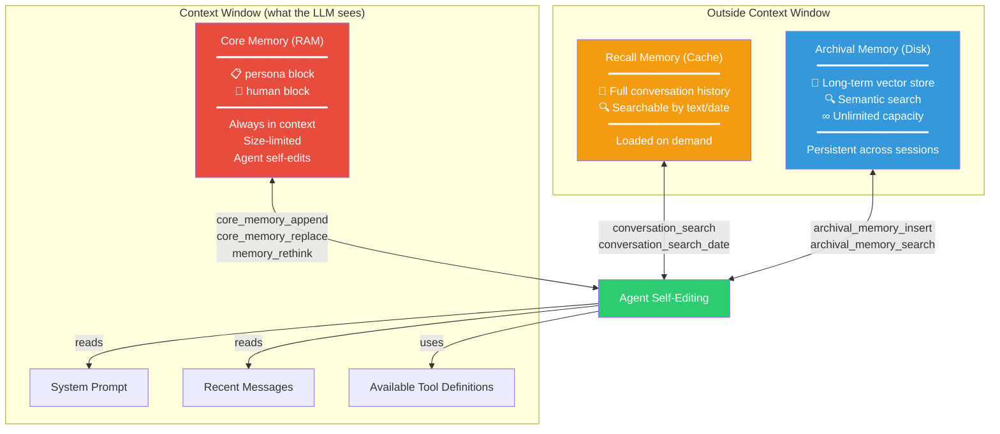
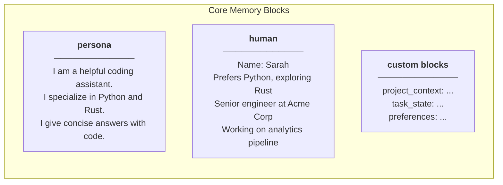
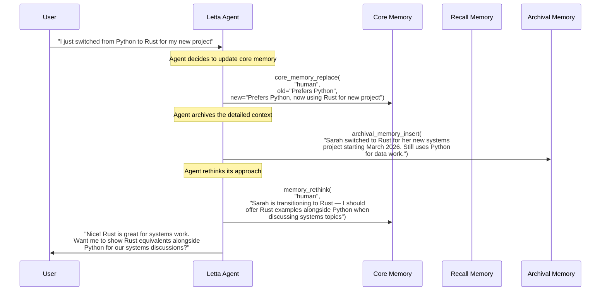
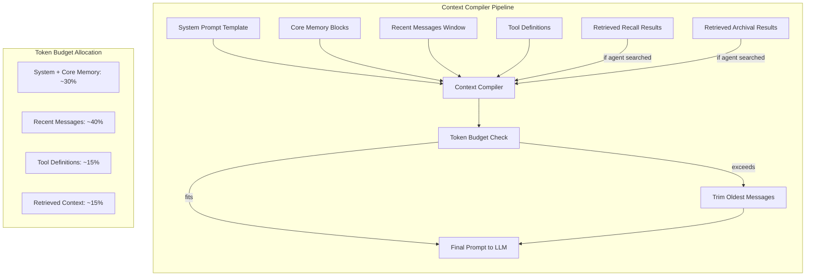
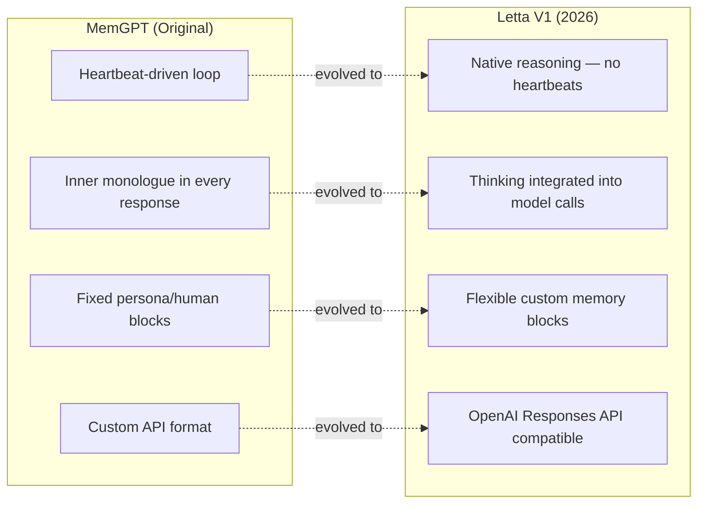

# Letta (MemGPT) — 深度解析

**官网：** [letta.com](https://letta.com) | **GitHub：** [letta-ai/letta](https://github.com/letta-ai/letta)（40K+ stars） | **许可协议：** Apache 2.0 | **论文：** [arXiv:2310.08560](https://arxiv.org/abs/2310.08560)（MemGPT，2023 年 10 月）

> 记忆即操作系统：一种让 LLM 智能体通过操作系统隐喻管理自身记忆的范式——包含 RAM（核心记忆，始终在上下文中）、缓存（可搜索的对话历史）和磁盘（长期归档存储）。

---

## 架构概览

Letta 将智能体记忆重新构想为类似计算机体系结构的**分层存储系统**。智能体自身控制各层之间的数据流动，使用自编辑记忆工具来管理自己的上下文窗口。



---

## 三层记忆层级

### 第一层：核心记忆（RAM）

核心记忆**始终存在于智能体的上下文窗口中**。它由命名块组成，智能体可以随时读取和修改。



| 属性 | 详情 |
|------|------|
| **始终在上下文中** | 每次 LLM 调用都包含核心记忆 |
| **大小受限** | 每个块有字符数限制（可配置） |
| **智能体可编辑** | 智能体通过工具调用修改自己的核心记忆 |
| **持久化** | 跨会话保留 |

**核心洞察**：由于核心记忆大小受限，智能体必须判断什么信息重要到值得保留。这迫使其进行优先级排序——智能体"思考"该记住什么，就像人类的工作记忆一样。

### 第二层：回忆记忆（缓存）

回忆记忆存储**完整的对话历史**，可搜索但默认不加载到上下文中。

| 属性 | 详情 |
|------|------|
| **内容** | 所有发送和接收的消息 |
| **搜索** | 文本搜索和日期范围搜索 |
| **加载** | 智能体在需要时显式搜索 |
| **容量** | 随对话长度增长 |

### 第三层：归档记忆（磁盘）

归档记忆是用于长期知识的**向量存储**，智能体希望保留但不需要在每个上下文窗口中加载的信息。

| 属性 | 详情 |
|------|------|
| **内容** | 智能体决定归档的任何文本 |
| **搜索** | 语义向量搜索 |
| **容量** | 事实上无限 |
| **持久性** | 永久保留（除非智能体删除） |

---

## 自编辑记忆工具

Letta 的标志性特征是**智能体通过工具调用控制自己的记忆**。以下是核心记忆工具：



### 工具参考

| 工具 | 用途 | 层级 |
|------|------|------|
| `core_memory_append` | 向核心记忆块追加文本 | 核心（RAM） |
| `core_memory_replace` | 替换核心记忆块中的文本 | 核心（RAM） |
| `memory_rethink` | 智能体反思并重组核心记忆 | 核心（RAM） |
| `conversation_search` | 按文本搜索对话历史 | 回忆（缓存） |
| `conversation_search_date` | 按日期范围搜索对话历史 | 回忆（缓存） |
| `archival_memory_insert` | 将文本存入长期向量存储 | 归档（磁盘） |
| `archival_memory_search` | 对归档记忆进行语义搜索 | 归档（磁盘） |

---

## 代码示例

### 创建带记忆块的智能体

```python
import os
from letta_client import Letta

client = Letta(api_key=os.getenv("LETTA_API_KEY"))

# Create an agent with initial core memory blocks
agent = client.agents.create(
    model="openai/gpt-4o-mini",
    memory_blocks=[
        {
            "label": "human",
            "value": "Name: Sarah. Senior engineer at Acme Corp. Prefers Python."
        },
        {
            "label": "persona",
            "value": "I am a helpful coding assistant. I give concise answers "
                     "with working code examples. I proactively update my memory "
                     "when I learn new things about the user."
        },
        {
            "label": "project_context",
            "value": "No active project context yet."
        }
    ]
)

print(f"Agent created: {agent.id}")
```

### 对话——智能体自编辑记忆

```python
# Send a message — the agent may self-edit memory as part of its response
response = client.agents.messages.create(
    agent_id=agent.id,
    input="Hey! I just started a new project using Rust and Tokio "
          "for building a high-throughput message broker."
)

# The response may include tool calls like:
# 1. core_memory_replace("human", 
#        old="Prefers Python.", 
#        new="Prefers Python. New project: Rust + Tokio message broker.")
# 2. archival_memory_insert("Sarah's new project (March 2026): 
#        High-throughput message broker using Rust and Tokio runtime. 
#        First Rust project — she may need help with ownership/borrowing.")
# 3. The actual text response to the user

for message in response.messages:
    if hasattr(message, 'content'):
        print(f"Agent: {message.content}")
    if hasattr(message, 'tool_call'):
        print(f"  [Tool: {message.tool_call.name}]")
```

### 直接管理归档记忆

```python
# Insert knowledge directly into archival memory (bypass agent)
client.agents.passages.insert(
    agent_id=agent.id,
    content="Sarah switched to Rust for systems work in March 2026. "
            "She's using Tokio for async runtime and considering "
            "tonic for gRPC services."
)

# Search archival memory
results = client.agents.passages.search(
    agent_id=agent.id,
    query="programming languages Sarah uses"
)

for passage in results:
    print(f"[{passage.score:.2f}] {passage.content}")
    # [0.91] Sarah switched to Rust for systems work...
    # [0.87] Sarah prefers Python for data analysis...
```

### 查看核心记忆状态

```python
# Read the current state of core memory
agent_state = client.agents.retrieve(agent_id=agent.id)

for block in agent_state.memory_blocks:
    print(f"\n=== {block.label} ===")
    print(block.value)
    # === human ===
    # Name: Sarah. Senior engineer at Acme Corp. 
    # Prefers Python. New project: Rust + Tokio message broker.
    # Exploring async patterns and ownership model.
    #
    # === persona ===
    # I am a helpful coding assistant. I give concise answers
    # with working code examples...
    #
    # === project_context ===
    # Active: Rust message broker (Tokio + tonic for gRPC).
    # Architecture: pub/sub with persistent queues.
    # Status: Early design phase.
```

---

## 上下文编译器

**上下文编译器**是在每轮对话中组装发送给 LLM 的最终提示词的引擎。它决定哪些内容被包含：



上下文编译器确保：
1. 核心记忆**始终**被包含（它是智能体的工作记忆）
2. 最近的消息优先于较早的消息
3. 如果智能体搜索了回忆或归档记忆，这些结果会被注入
4. 总上下文保持在模型窗口限制之内

---

## Letta V1（2026）架构变更

Letta V1 代表了从原始 MemGPT 设计的重大演进：



| 变更 | MemGPT（原版） | Letta V1 |
|------|---------------|----------|
| **推理循环** | 心跳机制：智能体发送空消息以持续思考 | 原生推理：模型在调用内进行思考，无心跳开销 |
| **内心独白** | 每次响应中都有显式的 `inner_thoughts` 字段 | 集成到模型的原生思考中（例如 `<thinking>` 标签） |
| **记忆块** | 仅固定的 `persona` 和 `human` 块 | 任意命名块（project、task、domain 等） |
| **API 格式** | 自定义 Letta 消息格式 | 兼容 OpenAI Responses API |
| **多智能体** | 每次对话单个智能体 | 原生多智能体编排 |
| **工具集成** | 自定义工具格式 | 兼容 OpenAI function-calling 的工具 |

---

## 分步演练：长期运行的编程智能体

### 场景

你正在构建一个编程智能体，帮助开发者完成数周的项目工作。该智能体需要记住项目上下文、不断演变的决策和开发者的习惯模式。

### 步骤 1：初始化智能体

```python
import os
from letta_client import Letta

client = Letta(api_key=os.getenv("LETTA_API_KEY"))

agent = client.agents.create(
    model="openai/gpt-4o-mini",
    memory_blocks=[
        {
            "label": "human",
            "value": "New user. No information yet."
        },
        {
            "label": "persona",
            "value": "I am a senior software architect assistant. "
                     "I remember everything about the user's project and preferences. "
                     "I proactively update my memory when I learn new information. "
                     "I flag when my memory conflicts with new information."
        },
        {
            "label": "project",
            "value": "No active project yet."
        },
        {
            "label": "decisions",
            "value": "No architectural decisions recorded yet."
        }
    ]
)
```

### 步骤 2：第 1 周——项目启动

```python
response = client.agents.messages.create(
    agent_id=agent.id,
    input="Hi! I'm Marcus. Starting a new project — a real-time collaborative "
          "editor like Google Docs but for code. Thinking Go backend, React frontend, "
          "CRDTs for conflict resolution."
)
# Agent internally calls:
#   core_memory_replace("human", old="New user...", 
#       new="Marcus. Building real-time collaborative code editor. Go+React+CRDTs.")
#   core_memory_replace("project", old="No active project...", 
#       new="Collaborative code editor. Go backend, React frontend, CRDT-based.")
#   archival_memory_insert("Project inception: Marcus is building a real-time 
#       collaborative code editor similar to Google Docs but for code. 
#       Tech stack: Go (backend), React (frontend), CRDTs for conflict resolution. 
#       Started March 2026.")
```

### 步骤 3：第 2 周——架构决策

```python
response = client.agents.messages.create(
    agent_id=agent.id,
    input="After researching, I'm going with Yjs for CRDTs instead of Automerge. "
          "Also switching to WebSockets over SSE for real-time sync."
)
# Agent internally calls:
#   core_memory_replace("decisions", old="No architectural decisions...", 
#       new="CRDT: Yjs (chosen over Automerge). Transport: WebSockets (over SSE).")
#   archival_memory_insert("Week 2 decision: Yjs chosen over Automerge for CRDTs. 
#       Reasons Marcus mentioned: better documentation, active maintenance, 
#       smaller bundle size. WebSockets chosen over SSE for bidirectional comm.")
```

### 步骤 4：第 4 周——智能体回忆上下文

```python
response = client.agents.messages.create(
    agent_id=agent.id,
    input="I'm hitting performance issues with large documents. "
          "What did we decide about the sync mechanism?"
)
# Agent searches recall and archival memory:
#   conversation_search("sync mechanism")  → finds Week 2 discussion
#   archival_memory_search("CRDT performance")  → finds archived research notes
# Then responds with full context about the Yjs + WebSocket decisions,
# plus suggestions for large-document optimization
```

---

## 优势

- **自管理记忆**：智能体自行决定记住什么、遗忘什么和如何重组——无需外部编排
- **直觉化的分层模型**：RAM/缓存/磁盘的隐喻对开发者而言一目了然
- **规模化验证**：40K+ GitHub stars，活跃社区，Apache 2.0 许可协议
- **学术基础**：基于经同行评审的 MemGPT 研究（ICLR 2024）
- **灵活的记忆块**：V1 的自定义块支持任意领域特定的记忆结构
- **完全控制**：开发者可以直接检查和修改所有记忆层级

## 局限性

- **Token 开销**：自编辑工具在每轮对话中都会消耗 Token（智能体需要"思考"记忆管理）
- **质量依赖模型**：较弱的模型会做出较差的记忆管理决策
- **无自动提取**：与 Mem0 或 Supermemory 不同，Letta 依赖智能体自行决定记忆什么
- **冷启动复杂性**：设置有效的初始记忆块需要精心的提示词工程
- **扩展性问题**：随着归档记忆的增长，如果没有适当的索引，搜索质量可能会下降

## 最佳适用场景

- **长期运行的自主智能体**，需要在多个会话中管理自身上下文
- **面向开发者的工具**，分层记忆模型提供直觉化的调试能力
- **研究与实验**，探索新型记忆架构（开源、可扩展）
- **具有复杂内部状态的智能体**（项目追踪器、具有不断演化知识的个人助手）
- **希望完全控制**记忆管理各个方面的团队

---

## 扩展阅读

- [Letta 文档](https://docs.letta.com)
- [GitHub 仓库](https://github.com/letta-ai/letta)
- [MemGPT 论文（arXiv:2310.08560）](https://arxiv.org/abs/2310.08560)
- [Letta V1 发布公告](https://www.letta.com/blog/letta-v1)
- [上下文编译器深度解析](https://docs.letta.com/architecture/context-compiler)
