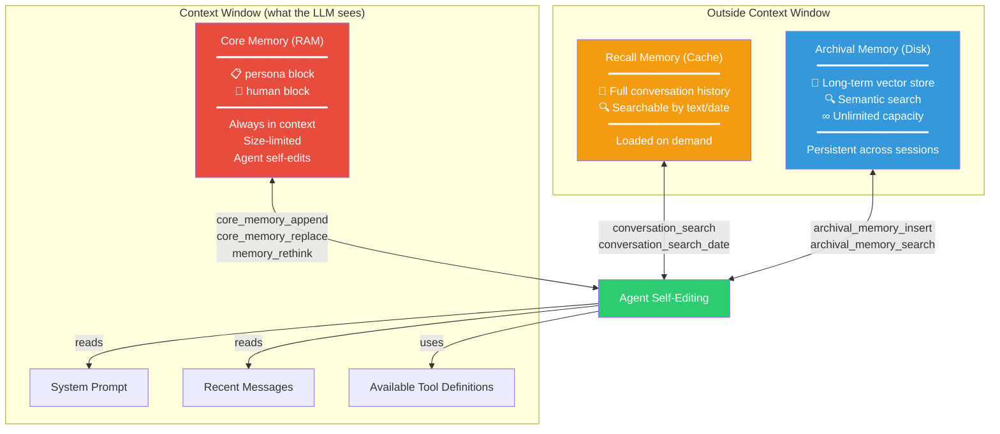
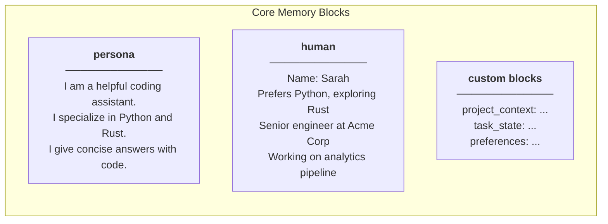
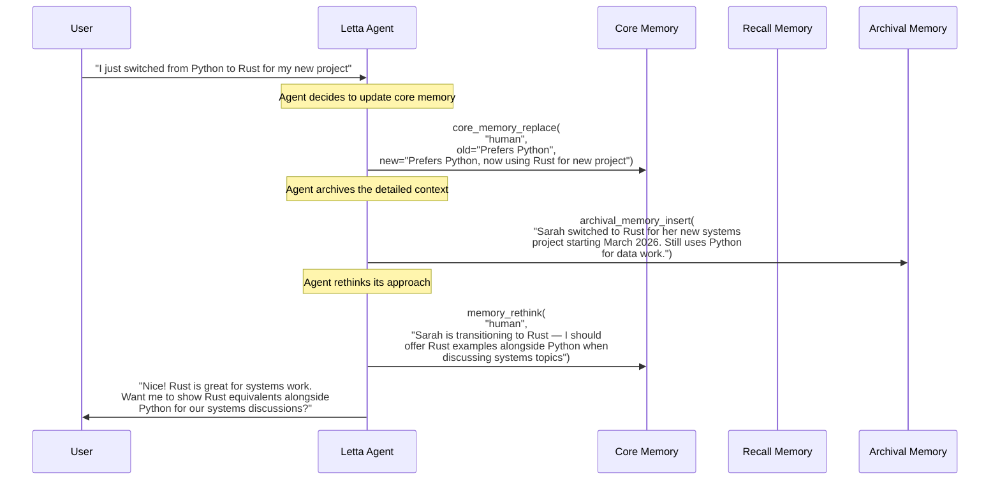
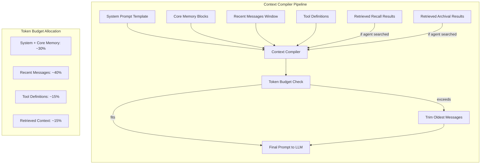
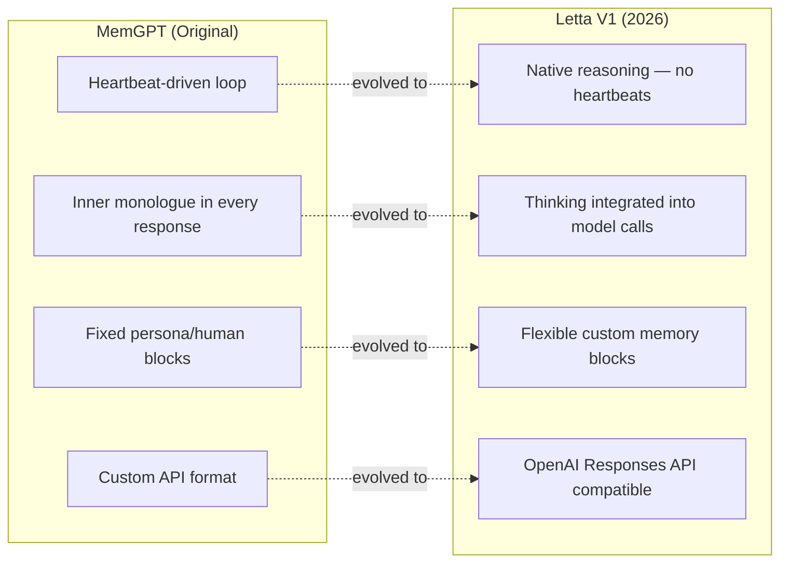

# Letta (MemGPT) — 深度解析

**官网：** [letta.com](https://letta.com) | **GitHub：** [letta-ai/letta](https://github.com/letta-ai/letta)（40K+ stars） | **许可协议：** Apache 2.0 | **论文：** [arXiv:2310.08560](https://arxiv.org/abs/2310.08560)（MemGPT，2023 年 10 月）

> 记忆即操作系统——让 LLM 智能体像操作系统管理存储那样管理自己的记忆：RAM 对应核心记忆（始终在上下文中），缓存对应可搜索的对话历史，磁盘对应长期归档。

---

## 架构概览

Letta 用一个计算机体系结构中人人熟知的概念重新定义了智能体记忆：**分层存储**。就像操作系统把数据分布在寄存器、内存和硬盘上一样，Letta 的智能体也拥有多层记忆，而且关键是——**智能体自己决定数据在各层之间怎么流动**，通过自编辑记忆工具来管理自己的上下文窗口。



---

## 三层记忆层级

### 第一层：核心记忆（RAM）

核心记忆**永远存在于智能体的上下文窗口里**。它由若干命名块组成，智能体随时可以读取和修改——就像程序直接访问 RAM 一样。



| 属性 | 详情 |
|------|------|
| **始终在上下文中** | 每次 LLM 调用都会带上核心记忆 |
| **容量有限** | 每个块有字符数上限（可配置） |
| **智能体可编辑** | 智能体通过工具调用自行修改 |
| **跨会话持久** | 会话结束后不会丢失 |

**这里暗藏了一个精妙的设计**：正因为核心记忆容量有限，智能体就不得不判断什么信息值得留下、什么可以放手。这迫使它像人类的工作记忆一样进行优先级取舍——智能体在"思考"该记住什么。

### 第二层：回忆记忆（缓存）

回忆记忆保存着**完整的对话历史**——可以搜索，但不会自动加载到上下文中。

| 属性 | 详情 |
|------|------|
| **内容** | 所有收发过的消息 |
| **搜索** | 支持文本搜索和日期范围搜索 |
| **加载** | 需要智能体主动搜索才会进入上下文 |
| **容量** | 随对话积累自然增长 |

### 第三层：归档记忆（磁盘）

归档记忆是一个**向量存储**，用来存放那些智能体希望长期保留、但不需要每次对话都带在身边的知识。

| 属性 | 详情 |
|------|------|
| **内容** | 智能体决定归档的任意文本 |
| **搜索** | 语义向量搜索 |
| **容量** | 近乎无限 |
| **持久性** | 永久保留（除非智能体主动删除） |

---

## 自编辑记忆工具

Letta 最引人注目的特性就是：**智能体通过工具调用来管理自己的记忆**。下面这个序列图展示了整个过程。



### 工具速查

| 工具 | 用途 | 层级 |
|------|------|------|
| `core_memory_append` | 向核心记忆块追加文本 | 核心（RAM） |
| `core_memory_replace` | 替换核心记忆块中的文本 | 核心（RAM） |
| `memory_rethink` | 智能体对核心记忆进行反思和重组 | 核心（RAM） |
| `conversation_search` | 按文本检索对话历史 | 回忆（缓存） |
| `conversation_search_date` | 按日期范围检索对话历史 | 回忆（缓存） |
| `archival_memory_insert` | 将文本写入长期向量存储 | 归档（磁盘） |
| `archival_memory_search` | 对归档记忆进行语义搜索 | 归档（磁盘） |

---

## 代码示例

### 创建带记忆块的智能体

```python
import os
from letta_client import Letta

client = Letta(api_key=os.getenv("LETTA_API_KEY"))

# Create an agent with initial core memory blocks
agent = client.agents.create(
    model="openai/gpt-4o-mini",
    memory_blocks=[
        {
            "label": "human",
            "value": "Name: Sarah. Senior engineer at Acme Corp. Prefers Python."
        },
        {
            "label": "persona",
            "value": "I am a helpful coding assistant. I give concise answers "
                     "with working code examples. I proactively update my memory "
                     "when I learn new things about the user."
        },
        {
            "label": "project_context",
            "value": "No active project context yet."
        }
    ]
)

print(f"Agent created: {agent.id}")
```

### 对话中的自编辑记忆

```python
# Send a message — the agent may self-edit memory as part of its response
response = client.agents.messages.create(
    agent_id=agent.id,
    input="Hey! I just started a new project using Rust and Tokio "
          "for building a high-throughput message broker."
)

# The response may include tool calls like:
# 1. core_memory_replace("human", 
#        old="Prefers Python.", 
#        new="Prefers Python. New project: Rust + Tokio message broker.")
# 2. archival_memory_insert("Sarah's new project (March 2026): 
#        High-throughput message broker using Rust and Tokio runtime. 
#        First Rust project — she may need help with ownership/borrowing.")
# 3. The actual text response to the user

for message in response.messages:
    if hasattr(message, 'content'):
        print(f"Agent: {message.content}")
    if hasattr(message, 'tool_call'):
        print(f"  [Tool: {message.tool_call.name}]")
```

### 直接操作归档记忆

```python
# Insert knowledge directly into archival memory (bypass agent)
client.agents.passages.insert(
    agent_id=agent.id,
    content="Sarah switched to Rust for systems work in March 2026. "
            "She's using Tokio for async runtime and considering "
            "tonic for gRPC services."
)

# Search archival memory
results = client.agents.passages.search(
    agent_id=agent.id,
    query="programming languages Sarah uses"
)

for passage in results:
    print(f"[{passage.score:.2f}] {passage.content}")
    # [0.91] Sarah switched to Rust for systems work...
    # [0.87] Sarah prefers Python for data analysis...
```

### 查看核心记忆的当前状态

```python
# Read the current state of core memory
agent_state = client.agents.retrieve(agent_id=agent.id)

for block in agent_state.memory_blocks:
    print(f"\n=== {block.label} ===")
    print(block.value)
    # === human ===
    # Name: Sarah. Senior engineer at Acme Corp. 
    # Prefers Python. New project: Rust + Tokio message broker.
    # Exploring async patterns and ownership model.
    #
    # === persona ===
    # I am a helpful coding assistant. I give concise answers
    # with working code examples...
    #
    # === project_context ===
    # Active: Rust message broker (Tokio + tonic for gRPC).
    # Architecture: pub/sub with persistent queues.
    # Status: Early design phase.
```

---

## 上下文编译器

**上下文编译器**负责在每轮对话中组装最终发给 LLM 的提示词，决定哪些内容该放进去、哪些该舍弃。



上下文编译器遵循几条核心原则：
1. 核心记忆**必定**被包含——它就是智能体的工作记忆，少了它智能体就"失忆"了
2. 最近的消息优先于更早的消息
3. 如果智能体搜索过回忆或归档记忆，搜索结果也会被注入
4. 总体上下文长度严格控制在模型窗口限制以内

---

## Letta V1（2026）架构变更

Letta V1 是对最初 MemGPT 设计的一次全面进化：



| 变更点 | MemGPT（原版） | Letta V1 |
|--------|---------------|----------|
| **推理循环** | 心跳机制：智能体通过发送空消息来持续思考 | 原生推理：模型在单次调用内完成思考，告别心跳开销 |
| **内心独白** | 每次响应都带一个显式的 `inner_thoughts` 字段 | 融入模型原生的思考能力（如 `<thinking>` 标签） |
| **记忆块** | 只有固定的 `persona` 和 `human` 两个块 | 任意命名、任意数量的自定义块（project、task、domain……） |
| **API 格式** | 自定义的 Letta 消息格式 | 兼容 OpenAI Responses API |
| **多智能体** | 每次对话只能有一个智能体 | 原生支持多智能体编排 |
| **工具集成** | 自定义工具格式 | 兼容 OpenAI function-calling 规范 |

---

## 分步演练：长周期编程智能体

### 场景

你正在构建一个编程智能体，它要在数周的项目周期中持续陪伴开发者——记住项目上下文、追踪不断演变的架构决策、适应开发者的习惯。

### 步骤 1：初始化智能体

```python
import os
from letta_client import Letta

client = Letta(api_key=os.getenv("LETTA_API_KEY"))

agent = client.agents.create(
    model="openai/gpt-4o-mini",
    memory_blocks=[
        {
            "label": "human",
            "value": "New user. No information yet."
        },
        {
            "label": "persona",
            "value": "I am a senior software architect assistant. "
                     "I remember everything about the user's project and preferences. "
                     "I proactively update my memory when I learn new information. "
                     "I flag when my memory conflicts with new information."
        },
        {
            "label": "project",
            "value": "No active project yet."
        },
        {
            "label": "decisions",
            "value": "No architectural decisions recorded yet."
        }
    ]
)
```

### 步骤 2：第 1 周——项目启动

```python
response = client.agents.messages.create(
    agent_id=agent.id,
    input="Hi! I'm Marcus. Starting a new project — a real-time collaborative "
          "editor like Google Docs but for code. Thinking Go backend, React frontend, "
          "CRDTs for conflict resolution."
)
# Agent internally calls:
#   core_memory_replace("human", old="New user...", 
#       new="Marcus. Building real-time collaborative code editor. Go+React+CRDTs.")
#   core_memory_replace("project", old="No active project...", 
#       new="Collaborative code editor. Go backend, React frontend, CRDT-based.")
#   archival_memory_insert("Project inception: Marcus is building a real-time 
#       collaborative code editor similar to Google Docs but for code. 
#       Tech stack: Go (backend), React (frontend), CRDTs for conflict resolution. 
#       Started March 2026.")
```

### 步骤 3：第 2 周——架构抉择

```python
response = client.agents.messages.create(
    agent_id=agent.id,
    input="After researching, I'm going with Yjs for CRDTs instead of Automerge. "
          "Also switching to WebSockets over SSE for real-time sync."
)
# Agent internally calls:
#   core_memory_replace("decisions", old="No architectural decisions...", 
#       new="CRDT: Yjs (chosen over Automerge). Transport: WebSockets (over SSE).")
#   archival_memory_insert("Week 2 decision: Yjs chosen over Automerge for CRDTs. 
#       Reasons Marcus mentioned: better documentation, active maintenance, 
#       smaller bundle size. WebSockets chosen over SSE for bidirectional comm.")
```

### 步骤 4：第 4 周——智能体调取历史上下文

```python
response = client.agents.messages.create(
    agent_id=agent.id,
    input="I'm hitting performance issues with large documents. "
          "What did we decide about the sync mechanism?"
)
# Agent searches recall and archival memory:
#   conversation_search("sync mechanism")  → finds Week 2 discussion
#   archival_memory_search("CRDT performance")  → finds archived research notes
# Then responds with full context about the Yjs + WebSocket decisions,
# plus suggestions for large-document optimization
```

---

## 优势

- **记忆完全自主管理**：智能体自行决定该记什么、该忘什么、该怎么重新组织——不需要外部编排介入
- **分层模型直觉友好**：RAM / 缓存 / 磁盘这套类比，做过开发的人一看就懂
- **大规模社区验证**：40K+ GitHub stars，活跃的开发者社区，Apache 2.0 许可协议
- **有扎实的学术根基**：源自经同行评审的 MemGPT 论文（ICLR 2024）
- **灵活的自定义记忆块**：V1 允许创建任意命名的记忆块，满足各种领域特定的记忆结构需求
- **全链路可观测**：开发者可以直接检查和修改每一层记忆的内容

## 局限性

- **Token 开销不小**：自编辑工具在每轮对话中都会消耗额外 Token——智能体需要"花时间思考"记忆管理
- **记忆质量受模型能力制约**：底层模型越弱，做出的记忆管理决策就越差
- **没有自动提取**：不像 Mem0 或 Supermemory 那样自动抽取信息，Letta 全靠智能体自行判断该记什么
- **冷启动需要下功夫**：要写出合适的初始记忆块，离不开精心的提示词设计
- **归档记忆的规模隐患**：随着归档数据越积越多，如果索引策略不当，搜索质量可能逐渐下滑

## 最佳适用场景

- **长周期自主智能体**：需要跨多个会话自行管理上下文的场景
- **面向开发者的工具**：分层记忆模型天然适合开发者理解和调试
- **研究与实验**：借助开源、可扩展的架构探索新型记忆机制
- **内部状态复杂的智能体**：项目追踪器、知识不断更新的个人助手等
- **需要对记忆拥有完全掌控权的团队**

---

## 扩展阅读

- [Letta 文档](https://docs.letta.com)
- [GitHub 仓库](https://github.com/letta-ai/letta)
- [MemGPT 论文（arXiv:2310.08560）](https://arxiv.org/abs/2310.08560)
- [Letta V1 发布公告](https://www.letta.com/blog/letta-v1)
- [上下文编译器深度解析](https://docs.letta.com/architecture/context-compiler)
