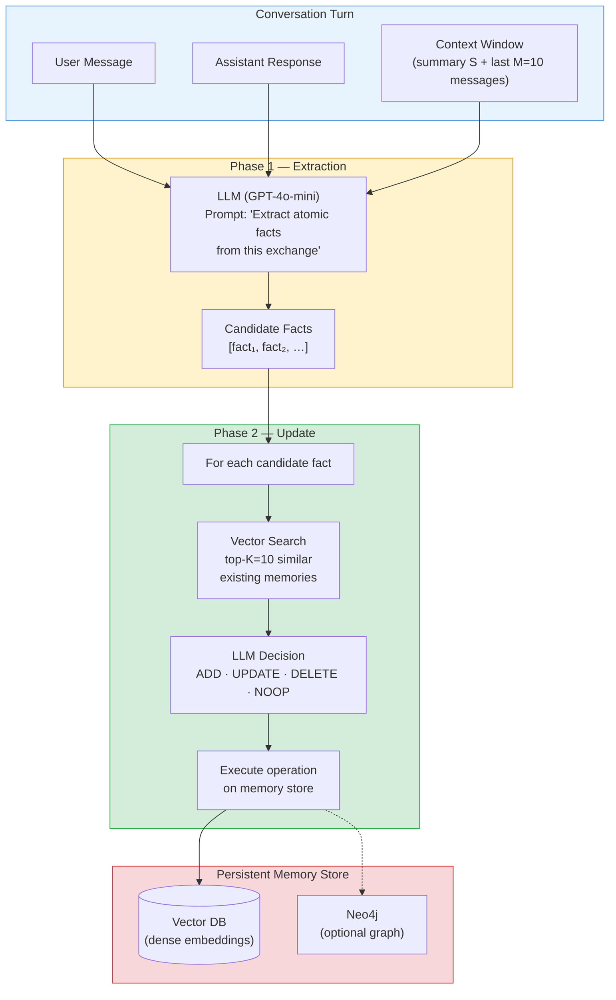
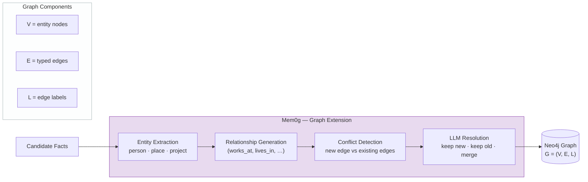
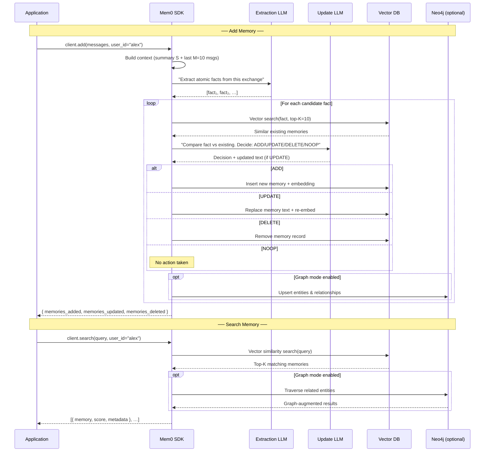
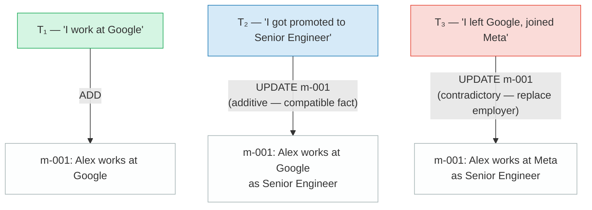

# Mem0 — 面向 AI 智能体的可扩展记忆中心架构

> **一句话概述：** 一个两阶段"提取-更新"流水线，为任何基于 LLM 的智能体提供持久化、自维护的长期记忆。

| 指标 | 值 |
|---|---|
| **GitHub Stars** | 38 000+ |
| **许可证** | Apache 2.0 |
| **论文** | [arXiv:2504.19413](https://arxiv.org/abs/2504.19413)（2025 年 4 月） |
| **默认 LLM** | GPT-4o-mini |
| **存储** | 向量数据库 + 可选 Neo4j（图数据库） |
| **p95 延迟降低** | 相比全上下文降低 91% |
| **Token 成本节省** | ≈ 90% |
| **LOCOMO 得分** | 66.9%（Mem0）· 68.4%（Mem0g） |

---

## 架构概览

Mem0 的核心洞察在于：*你不需要将整个对话历史塞进每一次提示中*。取而代之的是，一个轻量级流水线从每轮对话中**提取**原子事实，并将其**合并**到一个去重、冲突已解决的记忆存储中。在查询时，智能体仅检索少量相关记忆。

该架构包含两个必需阶段和一个可选的图层：



### Mem0g — 图变体

Mem0g 在基础架构之上扩展了一个有向标记图 **G = (V, E, L)**，存储在 Neo4j 中。在标准提取阶段之后，一个额外的子流水线将事实转化为结构化的实体和关系。



| 组件 | 作用 |
|---|---|
| **V（顶点）** | 实体节点 — 人物、地点、组织、项目 |
| **E（边）** | 有向、有类型的关系 — `works_at`、`lives_in`、`allergic_to` |
| **L（标签）** | 边上的可读标签，用于下游检索 |

---

## 工作原理 — 分步详解

让我们通过一个具体场景来演示：用户 **Alex** 与 AI 助手进行多轮对话，我们将追踪每一步记忆操作。

### 第 1 轮 — 首次介绍

**用户：** *"你好，我叫 Alex。我是素食主义者，对坚果过敏。"*
**助手：** *"你好 Alex！我已经记下你是素食主义者并且对坚果过敏。"*

#### 第 1 阶段 — 提取

LLM 接收当前对话轮次和上下文（目前为空），提取出：

| # | 候选事实 |
|---|---|
| 1 | Alex is a vegetarian |
| 2 | Alex is allergic to nuts |

#### 第 2 阶段 — 更新

对于**事实 1**（"Alex is a vegetarian"）：
1. 对现有记忆进行向量搜索 → **0 条结果**（存储为空）。
2. LLM 决策 → **ADD**。
3. 创建新的记忆记录并生成嵌入向量。

对于**事实 2**（"Alex is allergic to nuts"）：
1. 同样的流程 → **ADD**。

**第 1 轮后的记忆存储状态：**

| ID | 记忆 | 创建时间 |
|---|---|---|
| m-001 | Alex is a vegetarian | T₁ |
| m-002 | Alex is allergic to nuts | T₁ |

### 第 2 轮 — 新信息

**用户：** *"我刚在 Google 找到了一份软件工程师的新工作。"*

#### 提取 → 1 条候选事实："Alex works at Google as a software engineer"
#### 更新 → 向量搜索返回 0 条强匹配 → **ADD**

| ID | 记忆 | 创建时间 |
|---|---|---|
| m-001 | Alex is a vegetarian | T₁ |
| m-002 | Alex is allergic to nuts | T₁ |
| m-003 | Alex works at Google as a software engineer | T₂ |

### 第 3 轮 — 矛盾（见下方冲突解决）

**用户：** *"实际上我刚从 Google 跳槽到 Meta 了。"*

#### 提取 → 1 条候选事实："Alex works at Meta"
#### 更新 → 向量搜索返回 **m-003**（相似度 ≈ 0.92）→ LLM 决策：**UPDATE**

| ID | 记忆 | 更新时间 |
|---|---|---|
| m-003 | Alex works at Meta as a software engineer | T₃ *（已更新）* |

---

## 请求流程 — 时序图

以下时序图展示了一次 `add` 调用和一次 `search` 调用的完整生命周期：



---

## 代码示例

### Python — 托管云（MemoryClient）

```python
# pip install mem0ai
from mem0 import MemoryClient

# Initialize with your Mem0 Platform API key
client = MemoryClient(api_key="your_api_key")

# ── Add memories from a conversation turn ──
messages = [
    {"role": "user", "content": "Hi, I'm Alex. I'm a vegetarian and I'm allergic to nuts."},
    {"role": "assistant", "content": "Hello Alex! I've noted that you're a vegetarian and have a nut allergy."}
]
result = client.add(messages, user_id="alex")
# result contains IDs of memories created / updated

# ── Add more context in a later turn ──
messages = [
    {"role": "user", "content": "I just started a new job at Google as a software engineer."},
    {"role": "assistant", "content": "Congratulations on your new role at Google!"}
]
client.add(messages, user_id="alex")

# ── Semantic search over memories ──
results = client.search(query="What does Alex do for work?", user_id="alex")
for r in results:
    print(r["memory"])  # "Alex works at Google as a software engineer"

# ── List all memories for a user ──
all_memories = client.get_all(user_id="alex")
for m in all_memories:
    print(m["memory"])

# ── Automatic conflict resolution ──
# Alex changed jobs — Mem0 will UPDATE the existing memory, not duplicate it.
messages = [
    {"role": "user", "content": "I actually just moved from Google to Meta."}
]
client.add(messages, user_id="alex")
# The memory "Alex works at Google …" is updated to "Alex works at Meta …"
```

### Python — 开源本地使用

```python
from mem0 import Memory

# No API key needed — runs entirely locally
m = Memory()

# Add a memory with optional metadata
m.add(
    "I'm working on improving my tennis skills.",
    user_id="alice",
    metadata={"category": "hobbies"}
)

# Search for relevant memories
results = m.search(query="What are Alice's hobbies?", user_id="alice")
for r in results:
    print(r["memory"])  # "Alice is working on improving her tennis skills"
```

### TypeScript / REST API（概念示例）

```typescript
// Mem0 exposes a REST API; any HTTP client works.
const MEM0_API = "https://api.mem0.ai/v1";
const headers = {
  "Authorization": "Token your_api_key",
  "Content-Type": "application/json",
};

// Add a memory
const addRes = await fetch(`${MEM0_API}/memories/`, {
  method: "POST",
  headers,
  body: JSON.stringify({
    messages: [
      { role: "user", content: "I prefer dark mode in all my apps." },
      { role: "assistant", content: "Got it — dark mode preference saved!" },
    ],
    user_id: "alex",
  }),
});

// Search memories
const searchRes = await fetch(`${MEM0_API}/memories/search/`, {
  method: "POST",
  headers,
  body: JSON.stringify({
    query: "What are Alex's UI preferences?",
    user_id: "alex",
  }),
});
const { results } = await searchRes.json();
console.log(results[0].memory); // "Alex prefers dark mode in all apps"
```

---

## 冲突解决 — 具体示例

冲突解决是 Mem0 的核心价值：系统不会累积相互矛盾的事实，而是主动检测并解决冲突。

### 场景

Alex 在三轮不同的对话中告诉助手三件事：

| 轮次 | 陈述 |
|---|---|
| T₁ | "I work at Google." |
| T₂ | "I just got promoted to Senior Engineer." |
| T₃ | "I left Google and joined Meta last week." |

### 解决过程追踪



**LLM 在 T₃ 时"看到"的内容：**

| 输入 | 值 |
|---|---|
| 候选事实 | "Alex works at Meta" |
| Top-1 已有记忆（相似度 ≈ 0.93） | "Alex works at Google as Senior Engineer" |

更新阶段的 LLM 提示问道：*"根据新事实和已有记忆，你应该新增（ADD）一条记忆、更新（UPDATE）已有记忆、删除（DELETE）它，还是不做操作（NOTHING）？"*

LLM 识别出：
- **雇主**已变更（Google → Meta）— 矛盾，必须替换。
- **职位**（Senior Engineer）仍然有效 — 保留。
- 决策：**UPDATE** → `"Alex works at Meta as Senior Engineer"`

### 决策矩阵

| 场景 | LLM 决策 | 示例 |
|---|---|---|
| 全新信息 | **ADD** | "Alex has a pet dog named Buddy" |
| 与已有记忆兼容的细化 | **UPDATE**（合并） | "Alex is a *Senior* Engineer"（添加职位） |
| 矛盾性替换 | **UPDATE**（替换） | "Alex moved from Google to Meta" |
| 信息被明确撤回 | **DELETE** | "I'm no longer allergic to nuts" |
| 重复或无关 | **NOOP** | "I work at Google"（已存储） |

---

## 性能

| 指标 | Mem0 | Mem0g（图） | 全上下文基线 |
|---|---|---|---|
| **LOCOMO 准确率** | 66.9% | 68.4% | 各异 |
| **对比 OpenAI Memory** | 准确率高出 26% | — | — |
| **p95 延迟** | **降低 91%** | — | 基线 |
| **Token 成本** | **节省约 90%** | — | 基线 |

### 关键要点

- **延迟和成本：** 通过仅检索相关记忆而非传递完整历史，Mem0 在延迟和 Token 使用量上均实现了大幅降低——这对于长时间运行对话的生产部署至关重要。
- **准确率权衡：** 66.9% 的 LOCOMO 得分表现稳健但并非最先进；图变体（Mem0g）通过捕获结构关系将其提升至 68.4%。
- **与 OpenAI Memory 的对比：** 在 LOCOMO 基准测试中，Mem0 比 OpenAI 内置记忆高出 26%，这主要得益于 Mem0 显式的提取-更新流水线比 OpenAI 的隐式方法更加系统化。

---

## 优势

- **大规模经受考验** — 38K+ GitHub stars 和庞大的生产用户群为可靠性提供了信心。
- **简单的心智模型** — 两阶段"提取 → 更新"流水线易于理解、调试和扩展。
- **显著的效率提升** — 相比塞入全部上下文，p95 延迟降低 91%，Token 节省约 90%。
- **灵活部署** — 开源本地模式（Apache 2.0）或全托管云；可自带 LLM 和向量数据库。
- **自动去重与冲突解决** — 更新阶段防止记忆膨胀并保持事实的时效性。
- **图扩展** — Mem0g 为需要结构化实体-关系推理的领域增加了图能力。

## 局限性

- **冲突解决依赖 LLM** — 所有合并/更新决策均委托给 LLM，没有确定性回退机制；边界情况可能产生不一致的结果。
- **缺乏内置时间推理** — 记忆带有时间戳，但系统不能原生进行时间推理（如"Alex 去年的工作是什么？"）。
- **图功能需付费** — 基于 Neo4j 的 Mem0g 在托管平台上需要 Pro 方案（$249/月）。
- **LOCOMO 上限** — 基础变体 66.9% 的得分落后于较新的研究系统，尽管图变体缩小了部分差距。
- **单用户记忆作用域** — 记忆按 `user_id` 索引；多智能体或跨用户的共享记忆需要手动编排。

## 最佳适用场景

| 使用场景 | Mem0 适合的原因 |
|---|---|
| 需要按用户个性化的**生产聊天机器人** | SDK 简单、规模经受考验、低延迟 |
| 需要记住历史问题的**客服智能体** | 自动去重防止"记忆污染" |
| 记忆增强智能体的**快速原型开发** | 开源、pip 可安装、5 行代码集成 |
| 长对话场景下的**成本敏感部署** | 90% 的 Token 节省直接降低 API 费用 |
| 需要实体密集领域**图层**的团队 | Mem0g + Neo4j（Pro 层） |

---

## 定价

| 层级 | 价格 | 包含内容 |
|---|---|---|
| **开源版** | 免费 | 核心两阶段流水线、本地向量数据库 |
| **Cloud Free** | $0 | 托管服务、用量有限 |
| **Pro** | $249/月 | 图记忆（Mem0g）、优先支持、更高配额 |

---

## 链接

| 资源 | URL |
|---|---|
| **文档** | [docs.mem0.ai](https://docs.mem0.ai) |
| **GitHub** | [github.com/mem0ai/mem0](https://github.com/mem0ai/mem0) |
| **研究论文** | [arXiv:2504.19413](https://arxiv.org/abs/2504.19413) |
| **平台** | [app.mem0.ai](https://app.mem0.ai) |
| **PyPI 包** | [pypi.org/project/mem0ai](https://pypi.org/project/mem0ai/) |
