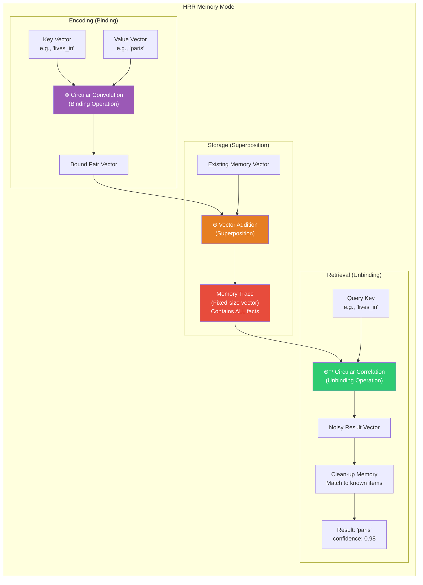
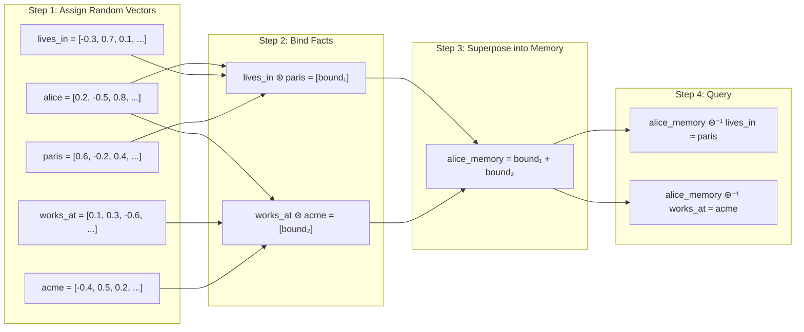
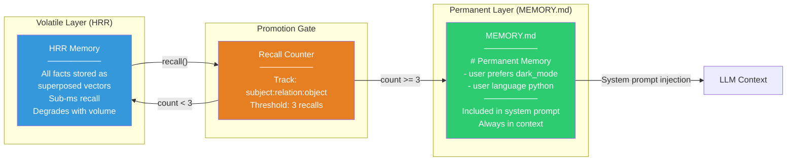
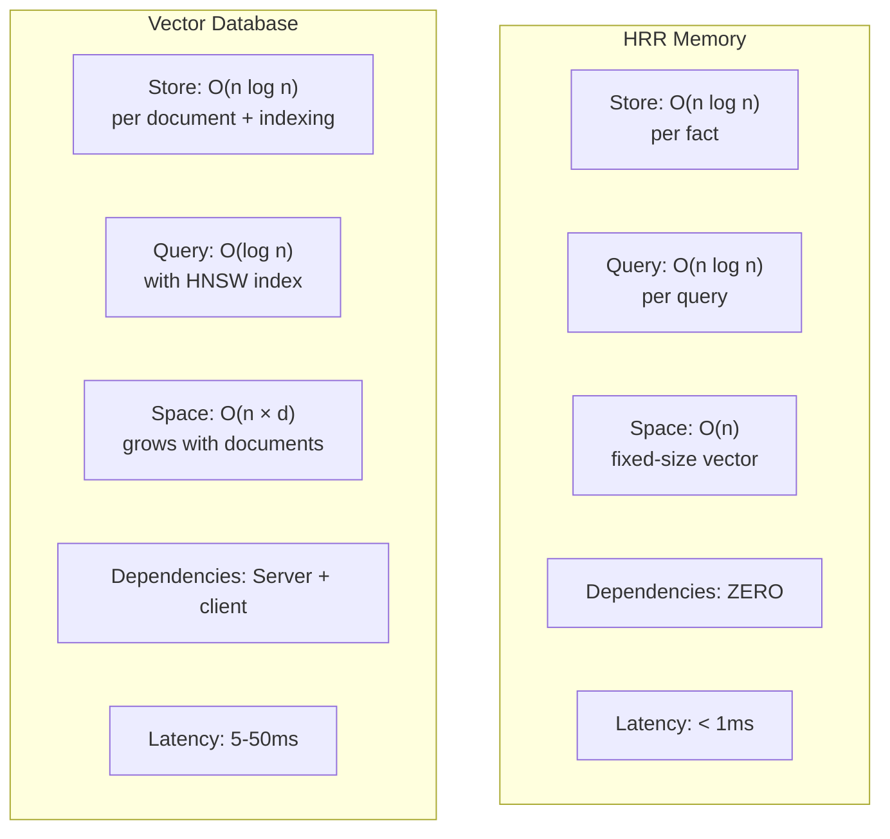

# Nuggets（全息记忆）— 深入解析

**GitHub:** [nicholasgriffintn/nuggets](https://github.com/nicholasgriffintn/nuggets) (233 stars) | **库:** [hrr-memory](https://www.npmjs.com/package/hrr-memory) | **许可证:** MIT | **语言:** 纯 TypeScript | **依赖:** 零

> 基于全息缩减表示（HRR）的 AI 记忆系统：事实通过循环卷积压缩为固定大小的复数向量，实现亚毫秒级召回，无需外部服务、无需数据库、无需 API 调用。

---

## 架构概览

Nuggets 采用了与本书中所有其他记忆系统截然不同的方法。它不使用向量数据库、知识图谱或托管 API，而是使用**全息缩减表示**——一种源自认知科学的数学技术，通过循环卷积将结构化事实编码为固定大小的向量。



---

## 全息缩减表示的工作原理

### 核心原理

HRR 利用了一个数学性质：**循环卷积**可以将两个向量绑定在一起，而**循环相关**（近似逆运算）可以将它们解绑。多个绑定对可以**叠加**（相加）到一个向量中，且各对仍可被单独恢复。



### 数学运算

| 运算 | 符号 | 目的 | 实现方式 |
|-----------|--------|---------|----------------|
| **绑定** | ⊛ | 将键与值关联 | 频域中的循环卷积（FFT 逐元素乘法） |
| **叠加** | ⊕ | 将多个绑定组合为一个向量 | 逐元素加法 |
| **解绑** | ⊛⁻¹ | 给定键检索值 | 循环相关（与近似逆进行卷积） |
| **清理** | — | 将含噪结果匹配到已知项 | 与词汇表做余弦相似度 |

### 为什么叫"全息"？

这个名称来自于与光学全息图的类比：正如全息图将三维图像编码到二维干涉图案中（全息图的任何碎片都能重建整个图像的模糊版本），HRR 将多个事实编码到单个向量中。每个事实都可以被恢复，但会带有一些噪声——存储的事实越多，恢复时的噪声越大。

---

## 代码示例

### `hrr-memory` 基本用法

```javascript
import { HRRMemory } from 'hrr-memory';

// Create a memory with default vector dimensions
const mem = new HRRMemory();

// Store facts as subject-relation-object triples
mem.store('alice', 'lives_in', 'paris');
mem.store('alice', 'works_at', 'acme');
mem.store('alice', 'speaks', 'french');
mem.store('bob', 'lives_in', 'london');
mem.store('bob', 'works_at', 'globex');

// Query: what does alice live in?
const result = mem.query('alice', 'lives_in');
console.log(result);
// { object: 'paris', confidence: 0.98, alternatives: [...] }

// Query: where does bob work?
const result2 = mem.query('bob', 'works_at');
console.log(result2);
// { object: 'globex', confidence: 0.95, alternatives: [...] }

// Query: what language does alice speak?
const result3 = mem.query('alice', 'speaks');
console.log(result3);
// { object: 'french', confidence: 0.93, alternatives: [...] }
```

### 单实体多事实记忆

```javascript
import { HRRMemory } from 'hrr-memory';

const mem = new HRRMemory({ dimensions: 1024 });

// Store a rich profile
mem.store('sarah', 'role', 'engineer');
mem.store('sarah', 'language', 'python');
mem.store('sarah', 'language', 'rust');
mem.store('sarah', 'editor', 'neovim');
mem.store('sarah', 'company', 'acme');
mem.store('sarah', 'project', 'analytics_pipeline');
mem.store('sarah', 'preference', 'dark_mode');

// Retrieve specific facts
console.log(mem.query('sarah', 'editor'));
// { object: 'neovim', confidence: 0.91 }

console.log(mem.query('sarah', 'company'));
// { object: 'acme', confidence: 0.89 }

// Note: multiple values for 'language' may return the most recent
// or highest-confidence one. Confidence degrades as more facts are added.
console.log(mem.query('sarah', 'language'));
// { object: 'rust', confidence: 0.72, alternatives: [{ object: 'python', confidence: 0.68 }] }
```

### 与 LLM 智能体集成

```javascript
import { HRRMemory } from 'hrr-memory';
import { readFileSync, writeFileSync, existsSync } from 'fs';

class AgentMemory {
  constructor() {
    this.hrr = new HRRMemory({ dimensions: 2048 });
    this.recallCount = {};  // track how often facts are recalled
    this.permanentPath = './MEMORY.md';
  }

  store(subject, relation, object) {
    this.hrr.store(subject, relation, object);
    console.log(`Stored: ${subject} ${relation} ${object}`);
  }

  recall(subject, relation) {
    const result = this.hrr.query(subject, relation);
    
    if (result && result.confidence > 0.5) {
      const key = `${subject}:${relation}:${result.object}`;
      this.recallCount[key] = (this.recallCount[key] || 0) + 1;

      // Memory promotion: facts recalled 3+ times → permanent context
      if (this.recallCount[key] >= 3) {
        this.promoteToPermament(subject, relation, result.object);
      }
      
      return result;
    }
    
    return null;
  }

  promoteToPermament(subject, relation, object) {
    const line = `- **${subject}** ${relation} **${object}**\n`;
    const existing = existsSync(this.permanentPath) 
      ? readFileSync(this.permanentPath, 'utf-8') 
      : '# Permanent Memory\n\n';
    
    if (!existing.includes(line.trim())) {
      writeFileSync(this.permanentPath, existing + line);
      console.log(`PROMOTED to MEMORY.md: ${subject} ${relation} ${object}`);
    }
  }
}

// Usage
const memory = new AgentMemory();

memory.store('user', 'prefers', 'dark_mode');
memory.store('user', 'language', 'python');
memory.store('user', 'project', 'ml_pipeline');

// First recall — count: 1
memory.recall('user', 'prefers');    // { object: 'dark_mode', confidence: 0.96 }

// Second recall — count: 2
memory.recall('user', 'prefers');    // { object: 'dark_mode', confidence: 0.96 }

// Third recall — PROMOTED to MEMORY.md
memory.recall('user', 'prefers');    // Writes to MEMORY.md
```

---

## 记忆晋升管线

Nuggets 实现了独特的**记忆晋升**系统：被频繁召回的事实（默认 3 次以上）会从易失性 HRR 存储晋升到持久化的 `MEMORY.md` 文件，该文件可以包含在智能体的系统提示词中。



### 为什么晋升很重要

HRR 记忆速度快但有损——随着存储的事实增多，置信度会下降。晋升机制通过将最重要的事实（智能体持续需要的那些）移至无损文本格式来解决此问题：

| 属性 | HRR（易失层） | MEMORY.md（持久层） |
|----------|----------------|----------------------|
| **召回速度** | 亚毫秒 | 文件读取（< 1ms） |
| **容量** | 约 100 个事实后开始退化 | 无限（文本） |
| **准确度** | 70–98%（置信度不等） | 100%（精确文本） |
| **持久性** | 内存中（重启后丢失） | 磁盘文件 |
| **上下文使用** | 不在 LLM 上下文中 | 始终在系统提示词中 |

---

## 性能特征

### 基准测试

| 操作 | 延迟 | 备注 |
|-----------|---------|-------|
| **存储（绑定 + 叠加）** | < 0.1ms | 基于 FFT，每维 O(n log n) |
| **查询（解绑 + 清理）** | < 0.5ms | 相关运算 + 词汇表扫描 |
| **存储 10 个事实** | ~0.97 平均置信度 | 出色的准确度 |
| **存储 50 个事实** | ~0.85 平均置信度 | 良好的准确度 |
| **存储 100 个事实** | ~0.72 平均置信度 | 可用，有些噪声 |
| **存储 200+ 个事实** | < 0.60 平均置信度 | 建议晋升到 MEMORY.md |

### 与向量搜索的对比



| 维度 | HRR Memory | 向量数据库 |
|-----------|-----------|-----------------|
| **延迟** | 亚毫秒 | 通常 5–50ms |
| **依赖** | 零（纯数学运算） | 服务器 + 客户端 + 网络 |
| **存储** | 固定大小向量（任意数量的事实） | 随文档线性增长 |
| **容量** | ~100 个高置信度事实 | 数百万文档 |
| **查询类型** | 精确键值查找 | 语义相似度 |
| **部署方式** | 进程内，无需服务 | 需要外部数据库 |
| **成本** | $0 | 数据库托管费用 |
| **大规模准确度** | 优雅退化 | 一致（需良好的嵌入） |

### HRR 胜出的场景

- **轻量级智能体**：需要快速、本地记忆而无需基础设施
- **边缘/嵌入式**部署：无外部服务可用的场景
- **小规模事实集**（每实体 < 100 个事实）：置信度保持较高
- **键值结构化**数据（主语-关系-宾语三元组）
- **隐私敏感**应用：数据不能发送到外部 API

### 向量搜索胜出的场景

- **大规模知识库**：包含数千以上的文档
- **语义查询**（"查找相似内容"）而非精确键查找
- **非结构化内容**（段落、文档、对话）
- **生产系统**：需要在任何规模下保持一致的准确度

---

## `hrr-memory` 独立库

`hrr-memory` 包是一个独立的 TypeScript 库，实现了 HRR 操作：

```javascript
import { HRRMemory } from 'hrr-memory';

// Configuration options
const mem = new HRRMemory({
  dimensions: 2048,    // Vector dimensionality (higher = more capacity)
  cleanupMethod: 'cosine',  // 'cosine' or 'dot' for clean-up matching
});

// Core API: store subject-relation-object triples
mem.store('subject', 'relation', 'object');

// Core API: query by subject and relation
const result = mem.query('subject', 'relation');
// → { object: string, confidence: number, alternatives: Array }

// Get all known subjects
const subjects = mem.getSubjects();

// Get all known relations for a subject
const relations = mem.getRelations('alice');

// Export/import memory state
const state = mem.export();
const restored = HRRMemory.import(state);
```

### API 参考

| 方法 | 描述 | 返回值 |
|--------|-------------|---------|
| `store(subject, relation, object)` | 绑定并叠加一个事实 | `void` |
| `query(subject, relation)` | 解绑并清理以检索 | `{ object, confidence, alternatives }` |
| `getSubjects()` | 列出所有已知主语 | `string[]` |
| `getRelations(subject)` | 列出主语的所有关系 | `string[]` |
| `export()` | 序列化记忆状态 | `object`（JSON 安全） |
| `HRRMemory.import(state)` | 从序列化状态恢复 | `HRRMemory` |

---

## 分步实战：轻量级本地智能体记忆

### 场景

你正在构建一个完全本地运行的 CLI 编程助手——记忆不需要 API 调用、不需要数据库、不需要云服务。智能体需要记住用户的偏好和项目上下文。

### 步骤 1：设置记忆

```javascript
import { HRRMemory } from 'hrr-memory';
import { readFileSync, writeFileSync, existsSync } from 'fs';

const MEMORY_FILE = './agent_memory.json';
const PERMANENT_FILE = './MEMORY.md';

// Load existing memory or create new
let mem;
if (existsSync(MEMORY_FILE)) {
  const state = JSON.parse(readFileSync(MEMORY_FILE, 'utf-8'));
  mem = HRRMemory.import(state);
  console.log('Loaded existing memory');
} else {
  mem = new HRRMemory({ dimensions: 2048 });
  console.log('Created new memory');
}
```

### 步骤 2：从对话中学习

```javascript
function learnFromMessage(userMessage) {
  // Simple extraction patterns (in production, use an LLM)
  const patterns = [
    { regex: /I (?:use|prefer|like) (\w+)/i, relation: 'prefers' },
    { regex: /(?:my|the) project is (\w+)/i, relation: 'project' },
    { regex: /I'm (?:a|an) (\w+)/i, relation: 'role' },
    { regex: /I work (?:at|for) (\w+)/i, relation: 'company' },
  ];
  
  for (const { regex, relation } of patterns) {
    const match = userMessage.match(regex);
    if (match) {
      mem.store('user', relation, match[1].toLowerCase());
      console.log(`Learned: user ${relation} ${match[1].toLowerCase()}`);
    }
  }
}

// User says various things over time
learnFromMessage("I use neovim for everything");
// Learned: user prefers neovim

learnFromMessage("I'm an engineer at Acme");
// Learned: user role engineer
// Learned: user company acme

learnFromMessage("My project is analytics_pipeline");
// Learned: user project analytics_pipeline
```

### 步骤 3：召回以构建上下文

```javascript
function buildContext() {
  const context = [];
  const relations = ['prefers', 'project', 'role', 'company', 'language'];
  
  for (const relation of relations) {
    const result = mem.query('user', relation);
    if (result && result.confidence > 0.6) {
      context.push(`User ${relation}: ${result.object} (confidence: ${result.confidence.toFixed(2)})`);
    }
  }
  
  // Include permanent memory if it exists
  if (existsSync(PERMANENT_FILE)) {
    context.push('\nPermanent memories:');
    context.push(readFileSync(PERMANENT_FILE, 'utf-8'));
  }
  
  return context.join('\n');
}

console.log(buildContext());
// User prefers: neovim (confidence: 0.94)
// User project: analytics_pipeline (confidence: 0.91)
// User role: engineer (confidence: 0.88)
// User company: acme (confidence: 0.85)
```

### 步骤 4：跨会话持久化

```javascript
// Save memory state to disk before exit
function saveMemory() {
  const state = mem.export();
  writeFileSync(MEMORY_FILE, JSON.stringify(state, null, 2));
  console.log('Memory saved to disk');
}

// Call on exit
process.on('beforeExit', saveMemory);
```

---

## 优势

- **零依赖**：纯 TypeScript，无外部服务、无 API 密钥、无数据库
- **亚毫秒性能**：基于 FFT 的运算极其快速
- **隐私优先设计**：所有数据留在进程内——不会离开机器
- **优雅的数学基础**：HRR 是认知科学中经过深入研究的技术，具有坚实的理论基础
- **记忆晋升**：重要事实自动升级到持久存储
- **极小的存储占用**：无论事实数量多少，向量大小固定——不会存储膨胀
- **离线可用**：无需互联网连接即可工作

## 局限性

- **容量上限**：每个实体超过约 100 个事实后置信度显著下降——不适合大型知识库
- **仅支持键值**：只能存储结构化三元组（主语-关系-宾语），不支持自由文本
- **无语义搜索**：查询必须指定精确的键——无法询问"与 X 相似的内容"
- **大规模噪声**：叠加本质上是有损的；事实越多 = 检索噪声越大
- **无内置抽取**：你必须自行结构化事实（或使用 LLM 抽取三元组）
- **社区较小**：233 个 GitHub stars——非常小众，生态系统和支持有限
- **仅限 JavaScript/TypeScript**：没有 Python、Go 或其他语言的 SDK

## 最佳适用场景

- **轻量级本地智能体**：需要记忆但不想要基础设施开销
- **CLI 工具和脚本**：跨调用记住用户偏好
- **边缘/嵌入式 AI**：无网络连接或外部服务可用的场景
- **隐私优先应用**：数据绝对不能离开设备
- **原型设计和实验**：在简单、自包含的包中使用结构化记忆
- **教学用途**：理解全息记忆在实践中的工作原理

---

## 延伸阅读

- [Nuggets GitHub 仓库](https://github.com/nicholasgriffintn/nuggets)
- [hrr-memory npm 包](https://www.npmjs.com/package/hrr-memory)
- [Holographic Reduced Representations (Plate, 1995)](https://doi.org/10.1109/72.377968) — 奠基性论文
- [Vector Symbolic Architectures Survey](https://arxiv.org/abs/2001.11797) — HRR 的更广泛背景
- [Kanerva's Hyperdimensional Computing](https://link.springer.com/article/10.1007/s12559-009-9009-8) — 相关方法
