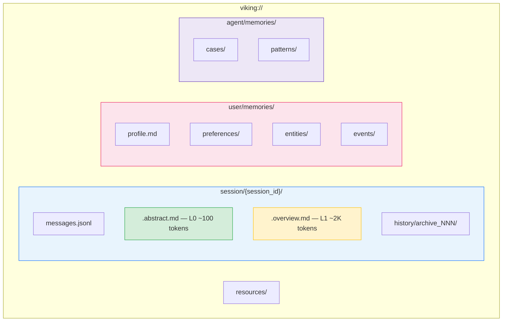
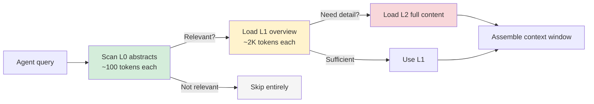
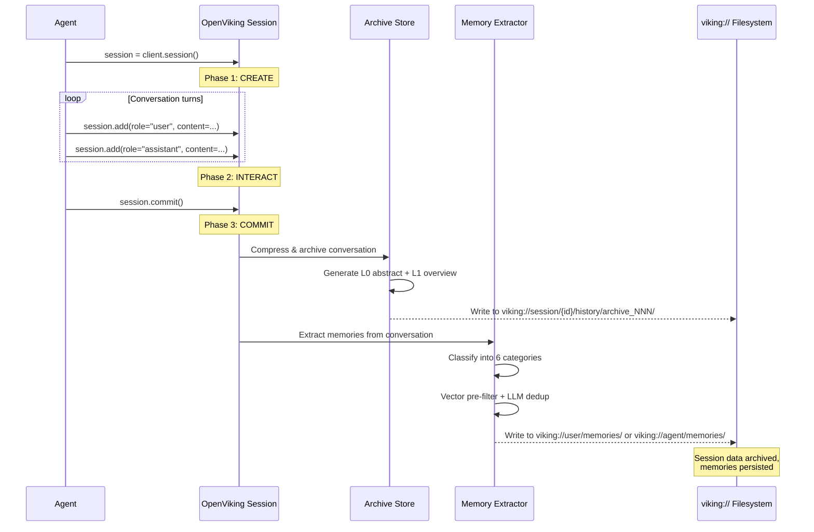

# OpenViking — 深入解析

**面向 AI 智能体的开源上下文数据库** | [GitHub](https://github.com/volcengine/OpenViking)（22K+ stars） | [文档](https://openviking.ai) | Apache 2.0 | 由 ByteDance/Volcengine 开发 | 创建于 2026 年 1 月

> OpenViking 将智能体上下文视为**文件系统**而非数据库。记忆、资源和技能都存放在以 `viking://` URI 组织的目录中，每条内容被总结为三个层级（L0/L1/L2），使智能体可以先浏览摘要，仅在需要时才深入查看细节。结果：在 LoCoMo10 基准测试中**任务完成率提升 52%**，**Token 成本降低 83%**。

---

## 架构

OpenViking 的核心洞察在于：智能体记忆的各种问题——检索、压缩、去重、上下文组装——天然地映射到文件系统上。文件在摄取时写入，并被总结为三个保真度层级。查询时系统像人类浏览目录列表一样导航树结构：先扫描名称和摘要，然后仅打开相关的文件夹。

### 文件系统范式



这棵树中的每个节点都是磁盘上的真实文件（或在运行时解析的虚拟路径）。`viking://` 方案是智能体的统一命名空间——它无需知道数据来自对话、导入的 PDF 还是提取的记忆。

### 分层上下文加载（L0 / L1 / L2）



| 层级 | 大小 | 内容 | 何时加载 |
|------|------|---------|-------------|
| **L0** | ~100 tokens | 一段话的摘要 | 始终加载——用于判断相关性 |
| **L1** | ~2K tokens | 包含关键细节的结构化概述 | 当 L0 表明相关时 |
| **L2** | 完整文档 | 完整内容 | 仅用于有针对性的深度检索 |

Token 节省源于大多数条目在 L0 阶段就被排除，不会进一步加载。在基准测试中，相比加载所有内容的全保真度方式，上下文窗口消耗降低了 **83–96%**。

---

## 会话生命周期

与 OpenViking 的每次交互都遵循三阶段生命周期。关键操作是 `commit()`，它触发归档和自动记忆提取。



**`commit()` 时发生了什么：**

1. **对话压缩** — 完整的消息日志被提炼为带有 L0/L1/L2 摘要的归档。
2. **归档创建** — 存储在 `viking://session/{id}/history/archive_NNN/` 下。
3. **记忆提取** — 一次 LLM 调用从对话中识别事实、偏好、实体、事件、案例和模式。
4. **去重** — 向量预过滤找到候选重复项，然后由 LLM 决定是合并、更新还是跳过。

---

## 六大记忆类别

OpenViking 将所有提取的记忆分为六个类别，分别归属于用户和智能体：

### 用户拥有的记忆

| 类别 | 合并策略 | 描述 | 示例 |
|----------|---------------|-------------|---------|
| **Profile** | 合并（覆盖） | 稳定的身份属性 | `"Name: Alice Chen, Role: Staff Engineer at Acme Corp"` |
| **Preferences** | 合并（追加/更新） | 选择、设置、风格 | `"Prefers pytest over unittest"`、`"Uses vim keybindings"` |
| **Entities** | 合并（更新） | 用户交互的人物、项目、组织 | `"Project Atlas: internal ML platform, launched Q1 2026"` |
| **Events** | 仅追加 | 带时间戳的事件 | `"2026-03-15: Deployed v2.1 to production"` |

### 智能体拥有的记忆

| 类别 | 合并策略 | 描述 | 示例 |
|----------|---------------|-------------|---------|
| **Cases** | 仅追加 | 智能体遇到过的问题-解决方案对 | `"User asked to optimize SQL query → suggested adding composite index on (user_id, created_at)"` |
| **Patterns** | 合并（精炼） | 跨会话发现的可复用模式 | `"When user says 'make it faster', they usually mean reduce API response time, not UI render speed"` |

这一区分很重要：**用户记忆**描述的是人类，**智能体记忆**描述的是智能体习得的专业知识。`preference` 表示"用户喜欢深色模式"；`pattern` 表示"当这位用户提到'部署'时，他们指的是 Kubernetes 集群，而不是 CI 流水线。"

---

## 代码示例

### 初始化和资源导入

```python
from openviking import OpenViking

# Initialize with a local data directory
client = OpenViking(path="./data")

# Ingest a GitHub repository — OpenViking crawls, chunks,
# and generates L0/L1/L2 summaries automatically
client.add_resource("https://github.com/volcengine/OpenViking")

# Ingest a local file
client.add_resource("/path/to/design-doc.pdf")
```

### 会话管理与提交

```python
# Create a new session
session = client.session()

# Add conversation turns
session.add(role="user", content="How do I configure OpenViking for a multi-agent setup?")
session.add(
    role="assistant",
    content="You can share a single viking:// store across agents by pointing "
            "them to the same data directory. Each agent writes to its own "
            "viking://agent/memories/ namespace."
)

# Commit: archives the conversation AND extracts memories
# - Conversation → compressed archive with L0/L1/L2 summaries
# - Memories → classified into the 6 categories, deduped, and stored
session.commit()
```

### 语义搜索与检索

```python
# Search across everything
results = client.find("what is openviking")

# Scoped search — only look in user memories
memories = client.find(
    "user preferences",
    scope="viking://user/memories/"
)

# Scoped search — only look in agent cases
cases = client.find(
    "SQL optimization",
    scope="viking://agent/memories/cases/"
)
```

### 文件系统操作

```python
# List directory contents (like `ls`)
client.ls("viking://resources/")
# → ['volcengine/', 'design-docs/', 'api-specs/']

# Tree view (like `tree` with depth limit)
client.tree("viking://resources/volcengine/OpenViking", depth=2)
# → resources/volcengine/OpenViking/
#   ├── README.md
#   ├── src/
#   │   ├── core/
#   │   └── retrieval/
#   └── docs/

# Read a specific file's content
content = client.read("viking://user/memories/profile.md")
```

### 带上下文的多部分消息

```python
from openviking.message import TextPart, ContextPart

# Retrieve relevant context, then attach it to a message
context = client.find("user's deployment setup")

session.add(
    role="user",
    content=[
        ContextPart(data=context),           # injected context
        TextPart(text="Help me deploy v3.0") # user's actual request
    ]
)
```

---

## 具体示例：编程智能体学习用户偏好

以下是 OpenViking 如何帮助编程助手在多个会话中逐步了解用户的分步演示。

### 会话 1 — 首次接触

```python
client = OpenViking(path="./agent_data")
session = client.session()

session.add(role="user", content="Can you write a Python function to parse CSV files?")
session.add(
    role="assistant",
    content="Sure! Here's a function using the csv module:\n\n"
            "```python\nimport csv\ndef parse_csv(path): ...\n```"
)
session.add(role="user", content="I'd prefer pandas actually, and type hints please.")
session.add(
    role="assistant",
    content="Of course:\n\n"
            "```python\nimport pandas as pd\n\ndef parse_csv(path: str) -> pd.DataFrame:\n"
            "    return pd.read_csv(path)\n```"
)

session.commit()
```

**提交后，OpenViking 提取出：**

| 类别 | 记忆 |
|----------|--------|
| Preference | `"Prefers pandas over stdlib csv module"` |
| Preference | `"Wants type hints in all Python code"` |
| Case | `"CSV parsing request → provided pandas-based solution with type hints"` |

### 会话 2 — 强化

```python
session = client.session()

session.add(role="user", content="Write me a function to read JSON config files.")
session.add(
    role="assistant",
    content="```python\nimport json\nfrom pathlib import Path\n\n"
            "def read_config(path: str) -> dict:\n"
            "    return json.loads(Path(path).read_text())\n```"
)
session.add(role="user", content="Can you use pydantic for validation? I always validate configs.")

session.commit()
```

**提交后，OpenViking 提取出：**

| 类别 | 记忆 |
|----------|--------|
| Preference | `"Uses pydantic for data validation"` |
| Preference | `"Always validates configuration files"` |
| Pattern | `"When user asks for data reading functions, they expect validation built in"` |

### 会话 3 — 主动个性化

```python
session = client.session()

# Before generating a response, the agent retrieves memories
preferences = client.find("user code preferences", scope="viking://user/memories/preferences/")
patterns = client.find("code generation patterns", scope="viking://agent/memories/patterns/")

# preferences now contains:
#   - "Prefers pandas over stdlib csv module"
#   - "Wants type hints in all Python code"
#   - "Uses pydantic for data validation"
#   - "Always validates configuration files"
#
# patterns now contains:
#   - "When user asks for data reading functions, they expect validation built in"

session.add(role="user", content="Write a function to load YAML settings.")

# The agent can now proactively include type hints + pydantic validation
# without the user having to ask, because it remembers.
session.add(
    role="assistant",
    content="Based on your preferences, here's a typed, validated loader:\n\n"
            "```python\nimport yaml\nfrom pydantic import BaseModel\n\n"
            "class Settings(BaseModel):\n"
            "    debug: bool = False\n"
            "    log_level: str = 'INFO'\n\n"
            "def load_settings(path: str) -> Settings:\n"
            "    with open(path) as f:\n"
            "        return Settings(**yaml.safe_load(f))\n```"
)

session.commit()
```

到第 3 个会话时，智能体已经了解了用户的风格，**无需再次被告知**。此时的文件系统结构：

```
viking://user/memories/
├── profile.md                         # (sparse — user hasn't shared much)
├── preferences/
│   ├── pandas_over_csv.md             # "Prefers pandas over stdlib csv"
│   ├── type_hints_always.md           # "Wants type hints in all Python code"
│   ├── pydantic_validation.md         # "Uses pydantic for data validation"
│   └── always_validate_configs.md     # "Always validates configuration files"
├── entities/                          # (empty — no projects mentioned yet)
└── events/                            # (empty — no specific events)

viking://agent/memories/
├── cases/
│   ├── csv_parsing_pandas.md          # CSV → pandas solution
│   └── json_config_pydantic.md        # JSON config → pydantic solution
└── patterns/
    └── data_reading_expects_validation.md
```

---

## 目录递归检索

当智能体调用 `client.find()` 时，OpenViking 不只是做向量搜索，而是智能地导航文件系统：

```
1. INTENT ANALYSIS
   "What is the user asking about? Which parts of viking:// are relevant?"
   → Determines target directories (e.g., viking://user/memories/preferences/)

2. DIRECTORY POSITIONING
   Scan L0 abstracts of candidate directories to find the right neighborhood.

3. FINE EXPLORATION
   Load L1 overviews of files in the selected directories.
   Score relevance against the query.

4. RECURSIVE DESCENT
   For high-scoring items, load L2 full content.
   Assemble the final context payload.
```

这个四步过程意味着 OpenViking 避免加载整个记忆存储。对于拥有数百条记忆和数十个已导入资源的智能体来说，这意味着每次查询消耗 3K tokens 和消耗 50K tokens 之间的差别。

---

## 性能

### LoCoMo10 基准测试

LoCoMo10 基准测试评估长上下文对话记忆——系统从扩展的多会话对话中回忆事实的能力。

| 系统 | 任务完成率 | Token 使用量 | 备注 |
|--------|----------------|-------------|-------|
| OpenClaw（基线） | 35.65% | 24.6M tokens | 原始 LLM，无记忆系统 |
| OpenClaw + LanceDB | 44.55% | 51.6M tokens | 向量 RAG 提升了召回率但 Token 成本翻倍 |
| **OpenClaw + OpenViking** | **52.08%** | **4.3M tokens** | **相比基线 +46%，Token 减少 83%** |

**关键要点：**

- OpenViking 将任务完成率相比基线提升了 **+46%**（35.65% → 52.08%）。
- 与简单添加向量数据库（LanceDB）相比，OpenViking 实现了**高出 17% 的完成率**，同时使用了**少 92% 的 Token**（51.6M → 4.3M）。
- 分层加载系统是 Token 节省的主要驱动因素——大多数检索条目在 L0（~100 tokens）阶段就被评估，从未被完整加载。

### Token 节省详情

| 场景 | 每次检索的 Token 数 | 相比完整加载的节省 |
|----------|---------------------|---------------------|
| 在 L0 被排除的条目 | ~100 tokens | **96%** |
| 在 L1 被接受的条目 | ~2,100 tokens | **83%** |
| 完整加载的条目（L2） | ~12,000 tokens（平均） | 0% |
| 混合平均 | ~1,800 tokens | **约 85%** |

在实际中，大约 80% 的条目在 L0 被排除，15% 在 L1 层级提供，仅 5% 需要完整的 L2 加载。

---

## 优势

- **统一范式** — 记忆、资源、技能和会话历史都存放在一个 `viking://` 命名空间下。无需集成多个独立系统。
- **显著的 Token 节省** — 分层上下文加载（L0/L1/L2）相比全上下文方式减少 83–96% 的 Token 消耗。
- **人类可读的结构** — 文件系统隐喻使得对智能体记忆执行 `ls`、`tree` 和 `read` 操作成为可能。调试和审计非常直接。
- **自动记忆生命周期** — `commit()` 在一次调用中完成归档、摘要、记忆提取和去重。
- **强大的技术背景** — ByteDance/Volcengine 的 VikingDB 团队基于生产基础设施构建了此项目。架构反映了真实的规模约束。
- **六类分类法** — 将用户记忆与智能体记忆分离，避免混淆"关于用户的事实"和"智能体学到的东西"。每个类别的不同合并策略减少了冲突。

## 局限性

- **Alpha 成熟度** — API 可能会变更。生产部署应仔细锁定版本并预期破坏性变更。
- **设置较重** — 相比 Mem0 的两行集成，OpenViking 需要理解文件系统范式和会话生命周期。
- **仅有 Python SDK** — 存在一个 Rust CLI，但主要 SDK 是 Python。TypeScript 和 Go 绑定尚不可用。
- **年轻的生态系统** — 创建于 2026 年 1 月，社区正在增长但规模较小，经受考验的程度不如 Mem0（38K stars）或 Letta（40K stars）。
- **提交时依赖 LLM** — 记忆提取和去重需要在 `commit()` 期间调用 LLM，增加了会话关闭时的延迟和成本。
- **缺乏内置时间查询** — 不同于 Zep/Graphiti 的双时间模型，OpenViking 不原生支持"在时间 T 时什么是正确的？"这类查询。事件有时间戳，但跨记忆的时间推理需要应用层逻辑。

## 最佳适用场景

- **需要统一上下文的复杂智能体** — 如果你的智能体需要消费外部资源、维护长期运行的会话并需要持久化记忆，OpenViking 的单命名空间方式消除了集成胶水代码。
- **成本敏感的部署** — 83–96% 的 Token 节省在规模化时非常显著。一个每月处理 100 万会话的部署可以节省数百万 Token。
- **ByteDance/Volcengine 生态系统** — 已经使用 VikingDB、Doubao 或其他 Volcengine 服务的团队可以自然集成。
- **编程智能体和开发者工具** — 文件系统范式很好地映射到代码仓库、文档和技术知识。
- **重视可调试性的团队** — 能够对智能体记忆执行 `ls` 并以纯 markdown 格式读取单个文件，这使得调试比查询不透明的向量存储容易得多。

---

## 链接

| 资源 | URL |
|----------|-----|
| GitHub | [github.com/volcengine/OpenViking](https://github.com/volcengine/OpenViking) |
| 文档 | [openviking.ai](https://openviking.ai) |
| PyPI | `pip install openviking` |
| 许可证 | Apache 2.0 |
| 母公司 | [ByteDance/Volcengine](https://www.volcengine.com) |

---

*返回 [第 3 章：服务商深入解析](../03_providers.md) | 下一章：[第 4 章：消费级 AI 记忆竞赛](../04_consumer_memory.md)*
