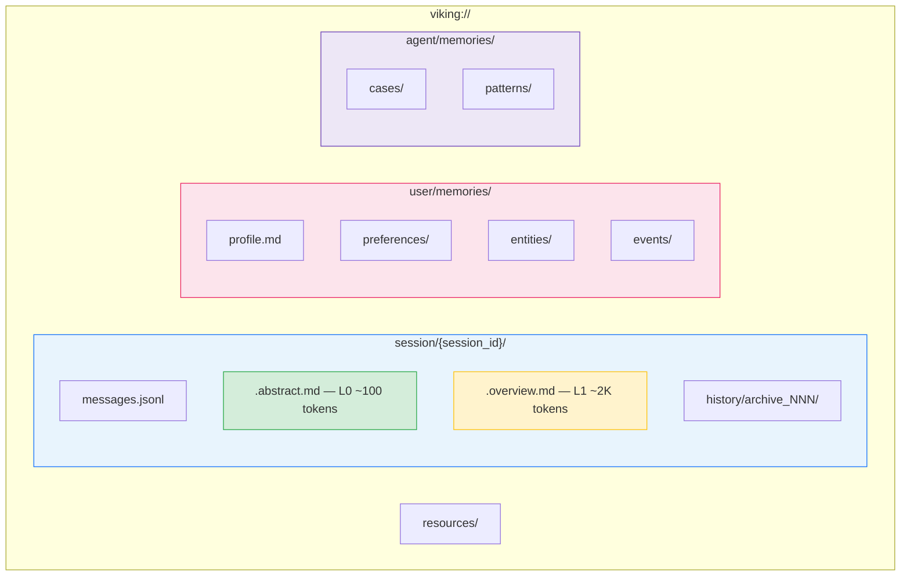
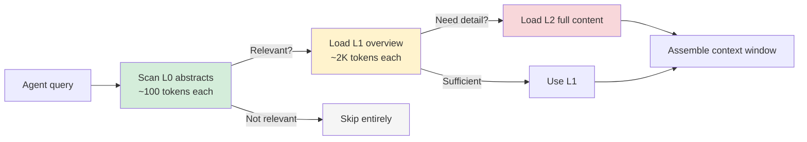
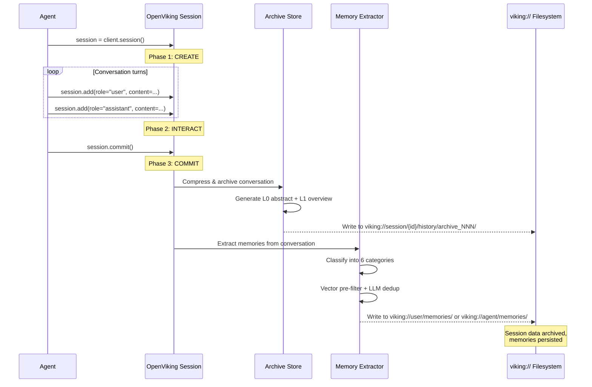

# OpenViking — 深入解析

**面向 AI 智能体的开源上下文数据库** | [GitHub](https://github.com/volcengine/OpenViking)（22K+ stars） | [文档](https://openviking.ai) | Apache 2.0 | 由 ByteDance/Volcengine 开发 | 创建于 2026 年 1 月

> OpenViking 的做法是把智能体上下文当**文件系统**来管，而不是当数据库。记忆、资源、技能全放在 `viking://` URI 组织的目录里，每条内容自动生成三级摘要（L0/L1/L2），让智能体先扫一眼摘要，需要的时候再往下钻取细节。效果：LoCoMo10 基准上**任务完成率提升 52%**，**Token 成本降低 83%**。

---

## 架构

OpenViking 背后的核心想法是：智能体记忆面临的那些问题——检索、压缩、去重、上下文拼装——天然可以映射到文件系统上。文件在摄入时写入，同时生成三个保真度级别的摘要。查询时，系统像人类浏览目录一样沿树结构导航：先扫一遍文件名和摘要，然后只打开相关的文件夹。

### 文件系统范式



这棵树里的每个节点要么是磁盘上的真实文件，要么是运行时才解析的虚拟路径。`viking://` 是智能体的统一命名空间——它不需要关心数据来自对话、导入的 PDF 还是提取出的记忆。

### 分层上下文加载（L0 / L1 / L2）



| 层级 | 大小 | 内容 | 何时加载 |
|------|------|---------|-------------|
| **L0** | ~100 tokens | 一段话的摘要 | 始终加载——用于判断相关性 |
| **L1** | ~2K tokens | 包含关键细节的结构化概述 | 当 L0 表明相关时 |
| **L2** | 完整文档 | 完整内容 | 仅用于有针对性的深度检索 |

Token 省在哪？大多数条目在 L0 阶段就被排除了，根本不会往下加载。基准测试显示，相比把所有内容全量塞进去，上下文窗口的消耗降低了 **83–96%**。

---

## 会话生命周期

跟 OpenViking 的每次交互都走一个三阶段生命周期。核心操作是 `commit()`——它触发归档和自动记忆提取。



**`commit()` 的时候到底发生了什么：**

1. **对话压缩** — 完整消息日志被提炼成带 L0/L1/L2 摘要的归档。
2. **归档写入** — 落盘到 `viking://session/{id}/history/archive_NNN/`。
3. **记忆提取** — 一次 LLM 调用，从对话中识别出事实、偏好、实体、事件、案例和模式。
4. **去重** — 先用向量预过滤找出疑似重复项，再由 LLM 裁定是合并、更新还是跳过。

---

## 六大记忆类别

OpenViking 把提取出的记忆分成六个类别，分属用户和智能体两方：

### 用户拥有的记忆

| 类别 | 合并策略 | 描述 | 示例 |
|----------|---------------|-------------|---------|
| **Profile** | 合并（覆盖） | 稳定的身份属性 | `"Name: Alice Chen, Role: Staff Engineer at Acme Corp"` |
| **Preferences** | 合并（追加/更新） | 选择、设置、风格 | `"Prefers pytest over unittest"`、`"Uses vim keybindings"` |
| **Entities** | 合并（更新） | 用户交互的人物、项目、组织 | `"Project Atlas: internal ML platform, launched Q1 2026"` |
| **Events** | 仅追加 | 带时间戳的事件 | `"2026-03-15: Deployed v2.1 to production"` |

### 智能体拥有的记忆

| 类别 | 合并策略 | 描述 | 示例 |
|----------|---------------|-------------|---------|
| **Cases** | 仅追加 | 智能体遇到过的问题-解决方案对 | `"User asked to optimize SQL query → suggested adding composite index on (user_id, created_at)"` |
| **Patterns** | 合并（精炼） | 跨会话发现的可复用模式 | `"When user says 'make it faster', they usually mean reduce API response time, not UI render speed"` |

这个区分很关键：**用户记忆**描述的是人，**智能体记忆**描述的是智能体自己学到的经验。`preference` 记的是"用户喜欢深色模式"；`pattern` 记的是"当这位用户说'部署'的时候，他说的是 Kubernetes 集群，不是 CI 流水线"。

---

## 代码示例

### 初始化和资源导入

```python
from openviking import OpenViking

# Initialize with a local data directory
client = OpenViking(path="./data")

# Ingest a GitHub repository — OpenViking crawls, chunks,
# and generates L0/L1/L2 summaries automatically
client.add_resource("https://github.com/volcengine/OpenViking")

# Ingest a local file
client.add_resource("/path/to/design-doc.pdf")
```

### 会话管理与提交

```python
# Create a new session
session = client.session()

# Add conversation turns
session.add(role="user", content="How do I configure OpenViking for a multi-agent setup?")
session.add(
    role="assistant",
    content="You can share a single viking:// store across agents by pointing "
            "them to the same data directory. Each agent writes to its own "
            "viking://agent/memories/ namespace."
)

# Commit: archives the conversation AND extracts memories
# - Conversation → compressed archive with L0/L1/L2 summaries
# - Memories → classified into the 6 categories, deduped, and stored
session.commit()
```

### 语义搜索与检索

```python
# Search across everything
results = client.find("what is openviking")

# Scoped search — only look in user memories
memories = client.find(
    "user preferences",
    scope="viking://user/memories/"
)

# Scoped search — only look in agent cases
cases = client.find(
    "SQL optimization",
    scope="viking://agent/memories/cases/"
)
```

### 文件系统操作

```python
# List directory contents (like `ls`)
client.ls("viking://resources/")
# → ['volcengine/', 'design-docs/', 'api-specs/']

# Tree view (like `tree` with depth limit)
client.tree("viking://resources/volcengine/OpenViking", depth=2)
# → resources/volcengine/OpenViking/
#   ├── README.md
#   ├── src/
#   │   ├── core/
#   │   └── retrieval/
#   └── docs/

# Read a specific file's content
content = client.read("viking://user/memories/profile.md")
```

### 带上下文的多部分消息

```python
from openviking.message import TextPart, ContextPart

# Retrieve relevant context, then attach it to a message
context = client.find("user's deployment setup")

session.add(
    role="user",
    content=[
        ContextPart(data=context),           # injected context
        TextPart(text="Help me deploy v3.0") # user's actual request
    ]
)
```

---

## 具体示例：编程智能体学习用户偏好

下面一步步演示 OpenViking 怎样帮一个编程助手在多个会话中逐渐摸清用户的偏好。

### 会话 1 — 首次接触

```python
client = OpenViking(path="./agent_data")
session = client.session()

session.add(role="user", content="Can you write a Python function to parse CSV files?")
session.add(
    role="assistant",
    content="Sure! Here's a function using the csv module:\n\n"
            "```python\nimport csv\ndef parse_csv(path): ...\n```"
)
session.add(role="user", content="I'd prefer pandas actually, and type hints please.")
session.add(
    role="assistant",
    content="Of course:\n\n"
            "```python\nimport pandas as pd\n\ndef parse_csv(path: str) -> pd.DataFrame:\n"
            "    return pd.read_csv(path)\n```"
)

session.commit()
```

**提交后，OpenViking 提取出：**

| 类别 | 记忆 |
|----------|--------|
| Preference | `"Prefers pandas over stdlib csv module"` |
| Preference | `"Wants type hints in all Python code"` |
| Case | `"CSV parsing request → provided pandas-based solution with type hints"` |

### 会话 2 — 强化

```python
session = client.session()

session.add(role="user", content="Write me a function to read JSON config files.")
session.add(
    role="assistant",
    content="```python\nimport json\nfrom pathlib import Path\n\n"
            "def read_config(path: str) -> dict:\n"
            "    return json.loads(Path(path).read_text())\n```"
)
session.add(role="user", content="Can you use pydantic for validation? I always validate configs.")

session.commit()
```

**提交后，OpenViking 提取出：**

| 类别 | 记忆 |
|----------|--------|
| Preference | `"Uses pydantic for data validation"` |
| Preference | `"Always validates configuration files"` |
| Pattern | `"When user asks for data reading functions, they expect validation built in"` |

### 会话 3 — 主动个性化

```python
session = client.session()

# Before generating a response, the agent retrieves memories
preferences = client.find("user code preferences", scope="viking://user/memories/preferences/")
patterns = client.find("code generation patterns", scope="viking://agent/memories/patterns/")

# preferences now contains:
#   - "Prefers pandas over stdlib csv module"
#   - "Wants type hints in all Python code"
#   - "Uses pydantic for data validation"
#   - "Always validates configuration files"
#
# patterns now contains:
#   - "When user asks for data reading functions, they expect validation built in"

session.add(role="user", content="Write a function to load YAML settings.")

# The agent can now proactively include type hints + pydantic validation
# without the user having to ask, because it remembers.
session.add(
    role="assistant",
    content="Based on your preferences, here's a typed, validated loader:\n\n"
            "```python\nimport yaml\nfrom pydantic import BaseModel\n\n"
            "class Settings(BaseModel):\n"
            "    debug: bool = False\n"
            "    log_level: str = 'INFO'\n\n"
            "def load_settings(path: str) -> Settings:\n"
            "    with open(path) as f:\n"
            "        return Settings(**yaml.safe_load(f))\n```"
)

session.commit()
```

到第 3 个会话，智能体已经摸清了用户的风格，**不用再反复告诉它了**。此时文件系统长这样：

```
viking://user/memories/
├── profile.md                         # (sparse — user hasn't shared much)
├── preferences/
│   ├── pandas_over_csv.md             # "Prefers pandas over stdlib csv"
│   ├── type_hints_always.md           # "Wants type hints in all Python code"
│   ├── pydantic_validation.md         # "Uses pydantic for data validation"
│   └── always_validate_configs.md     # "Always validates configuration files"
├── entities/                          # (empty — no projects mentioned yet)
└── events/                            # (empty — no specific events)

viking://agent/memories/
├── cases/
│   ├── csv_parsing_pandas.md          # CSV → pandas solution
│   └── json_config_pydantic.md        # JSON config → pydantic solution
└── patterns/
    └── data_reading_expects_validation.md
```

---

## 目录递归检索

智能体调用 `client.find()` 时，OpenViking 并不只是做一次向量搜索，而是沿着文件系统智能导航：

```
1. INTENT ANALYSIS
   "What is the user asking about? Which parts of viking:// are relevant?"
   → Determines target directories (e.g., viking://user/memories/preferences/)

2. DIRECTORY POSITIONING
   Scan L0 abstracts of candidate directories to find the right neighborhood.

3. FINE EXPLORATION
   Load L1 overviews of files in the selected directories.
   Score relevance against the query.

4. RECURSIVE DESCENT
   For high-scoring items, load L2 full content.
   Assemble the final context payload.
```

这四步走下来，OpenViking 避免了一次性加载整个记忆库。对于坐拥数百条记忆和几十个已导入资源的智能体来说，差别很直接：每次查询消耗 3K tokens 还是 50K tokens。

---

## 性能

### LoCoMo10 基准测试

LoCoMo10 基准测试考察的是长上下文对话记忆——也就是系统从多轮、多会话的长对话中回忆事实的能力。

| 系统 | 任务完成率 | Token 使用量 | 备注 |
|--------|----------------|-------------|-------|
| OpenClaw（基线） | 35.65% | 24.6M tokens | 原始 LLM，无记忆系统 |
| OpenClaw + LanceDB | 44.55% | 51.6M tokens | 向量 RAG 提升了召回率但 Token 成本翻倍 |
| **OpenClaw + OpenViking** | **52.08%** | **4.3M tokens** | **相比基线 +46%，Token 减少 83%** |

**怎么看这些数字：**

- OpenViking 把任务完成率从基线的 35.65% 拉到了 52.08%，提升 **+46%**。
- 跟单纯加一个向量库（LanceDB）比，完成率高出 **17%**，Token 消耗却**少了 92%**（51.6M → 4.3M）。
- Token 节省的主要功臣就是分层加载——大多数条目在 L0（约 100 tokens）阶段就被筛掉了，压根没机会被完整加载。

### Token 节省详情

| 场景 | 每次检索的 Token 数 | 相比完整加载的节省 |
|----------|---------------------|---------------------|
| 在 L0 被排除的条目 | ~100 tokens | **96%** |
| 在 L1 被接受的条目 | ~2,100 tokens | **83%** |
| 完整加载的条目（L2） | ~12,000 tokens（平均） | 0% |
| 混合平均 | ~1,800 tokens | **约 85%** |

实际运行中，大约 80% 的条目在 L0 就被排除了，15% 在 L1 层级就够用，只有 5% 需要完整拉取 L2。

---

## 优势

- **统一的范式** — 记忆、资源、技能、会话历史全放在一个 `viking://` 命名空间下，不用集成一堆分散的系统。
- **Token 节省实实在在** — 分层上下文加载（L0/L1/L2）相比全量加载减少 83–96% 的 Token 消耗。
- **人类看得懂** — 文件系统隐喻让你可以对智能体记忆跑 `ls`、`tree`、`read`。调试和审计非常直观。
- **记忆生命周期自动化** — `commit()` 一次调用搞定归档、摘要、记忆提取和去重。
- **技术底子扎实** — ByteDance/Volcengine 的 VikingDB 团队在生产基础设施上造的，架构带着真实规模下的设计考量。
- **六类分类体系** — 用户记忆和智能体记忆分开存放，不会把"关于用户的事实"和"智能体学到的经验"搅在一起。每个类别各有自己的合并策略，冲突更少。

## 局限性

- **还在 Alpha 阶段** — API 随时可能变。生产部署务必锁定版本，做好应对 breaking change 的准备。
- **上手成本较高** — Mem0 两行代码就能集成，OpenViking 得先理解文件系统范式和会话生命周期。
- **只有 Python SDK** — 虽然有个 Rust CLI，但主力 SDK 是 Python。TypeScript 和 Go 绑定目前还没有。
- **生态还很年轻** — 2026 年 1 月才创建，社区在涨但体量还小，比起 Mem0（38K stars）和 Letta（40K stars）经受的锤炼少得多。
- **提交时要调 LLM** — 记忆提取和去重都在 `commit()` 时发生，需要调用 LLM，会给会话结束环节增加延迟和成本。
- **没有内置的时间查询** — 不像 Zep/Graphiti 有双时间模型，OpenViking 不原生支持"在 T 时刻什么是对的？"这类查询。事件有时间戳，但跨记忆的时间推理得靠应用层自己搞。

## 最佳适用场景

- **需要统一上下文的复杂智能体** — 如果你的智能体既要消费外部资源、又要维护长生命周期的会话、还需要持久化记忆，OpenViking 的单命名空间方式省掉了一堆集成胶水代码。
- **成本敏感的部署** — 83–96% 的 Token 节省在规模上很可观。一个月百万级会话的部署，能省下数百万 Token。
- **ByteDance/Volcengine 生态内的团队** — 已经在用 VikingDB、Doubao 或其他火山引擎服务的团队，接入起来很自然。
- **编程智能体和开发者工具** — 文件系统范式天然映射到代码仓库、文档和技术知识。
- **看重可调试性的团队** — 能对智能体记忆跑 `ls`，以纯 markdown 格式读单个文件，调试起来比面对一个不透明的向量库要轻松太多。

---

## 链接

| 资源 | URL |
|----------|-----|
| GitHub | [github.com/volcengine/OpenViking](https://github.com/volcengine/OpenViking) |
| 文档 | [openviking.ai](https://openviking.ai) |
| PyPI | `pip install openviking` |
| 许可证 | Apache 2.0 |
| 母公司 | [ByteDance/Volcengine](https://www.volcengine.com) |

---

*返回 [第 3 章：服务商深入解析](../03_providers.md) | 下一章：[第 4 章：消费级 AI 记忆竞赛](../04_consumer_memory.md)*
