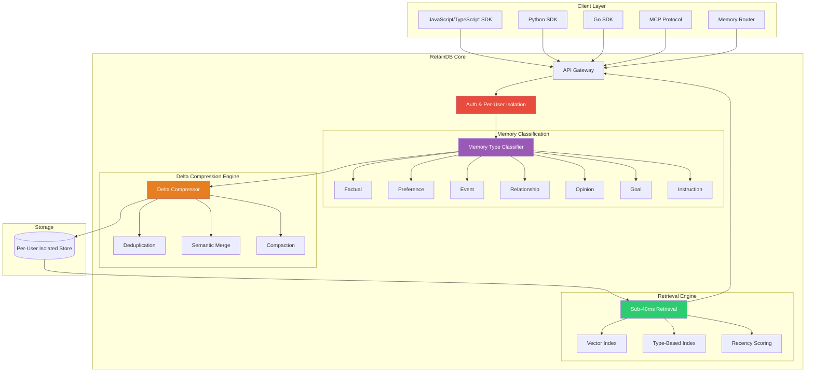
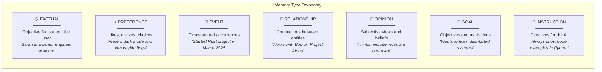
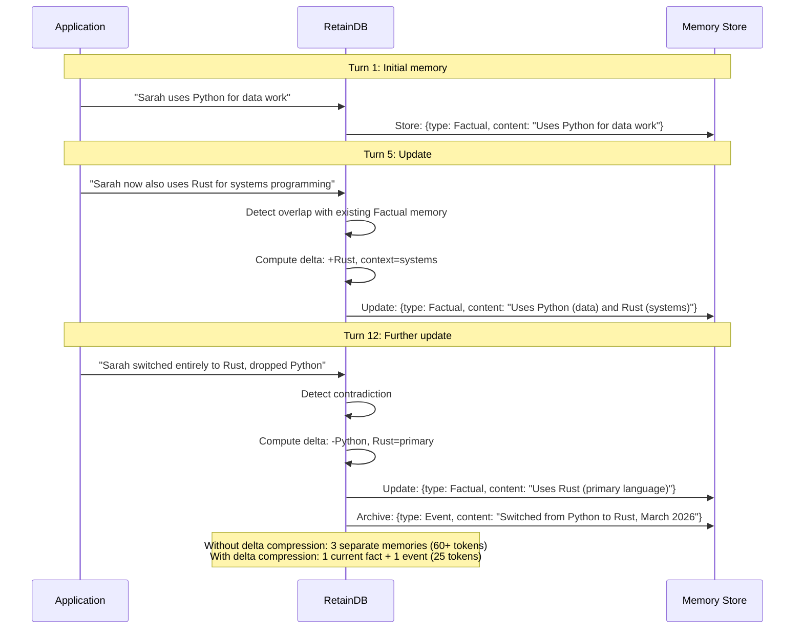
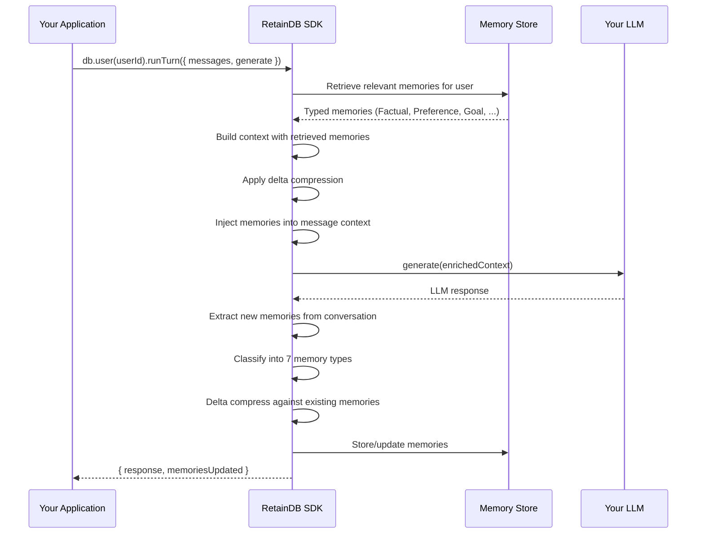

# RetainDB — 深入解析

**官网:** [retaindb.com](https://retaindb.com) | **许可证:** 专有（SaaS） | **基准测试:** LongMemEval SOTA（自报）

> 托管式记忆 SaaS：七种类型化记忆分类、增量压缩带来 50–90% 的 token 节省、亚 40ms 检索——几行代码接入，开箱即用。

---

## 架构概览

RetainDB 是一个全托管的记忆服务，核心卖点有两个：**类型化记忆分类**（7 种语义类型）和**增量压缩**（50–90% token 节省）。架构上为生产环境量身打造：按用户隔离、SOC 2 就绪、多语言 SDK 全覆盖。



---

## 7 种记忆类型

RetainDB 会自动将每条存入的信息归入七种语义类型之一。有了类型标签，检索策略就能按需调整，上下文构建也更加精准。



| 记忆类型 | 描述 | 检索优先级 | 示例 |
|-------------|-------------|-------------------|---------|
| **Factual** | 关于实体的客观事实 | 身份类问题优先级高 | "Sarah is a senior engineer at Acme Corp" |
| **Preference** | 喜好、厌恶、默认偏好 | 个性化场景优先级高 | "Prefers dark mode, Vim keybindings, terse answers" |
| **Event** | 带时间戳的事件 | 时间相关查询优先级高 | "Started Rust project in March 2026" |
| **Relationship** | 人或事物间的关联 | 社交上下文优先级高 | "Works with Bob on the analytics pipeline" |
| **Opinion** | 主观看法与判断 | 中等（视上下文而定） | "Thinks microservices add unnecessary complexity" |
| **Goal** | 目标、计划、志向 | 主动建议时优先级高 | "Wants to get Kubernetes certified by June" |
| **Instruction** | 给 AI 的行为指令 | 最高（始终相关） | "Always provide code examples, never use emojis" |

### 为什么类型化记忆如此关键

没有类型标签时，检索系统会把 "Sarah lives in Seattle" 和 "Sarah wants to move to Austin" 当成同等重要的信息一股脑塞进上下文。而有了类型区分：

- **Factual**（"lives in Seattle"）在回答当前状态问题时被优先返回
- **Goal**（"wants to move to Austin"）在讨论未来规划时才会浮出水面
- 当两条信息看似矛盾，类型信号帮助模型分辨：哪个是当前事实，哪个是未来意图

---

## 增量压缩

增量压缩是 RetainDB 保持记忆精简的秘诀。它不会傻傻存下事实的每个历史版本，而是只保留记忆状态之间的**变更量（delta）**——用最少的 token 表达最新的真相。



### Token 节省一览

| 场景 | 无压缩 | 增量压缩后 | 节省比例 |
|----------|-------------------|------------|---------|
| 用户偏好（20 次更新） | ~400 tokens | ~80 tokens | **80%** |
| 项目上下文（50 次更新） | ~1,200 tokens | ~180 tokens | **85%** |
| 关系图谱（30 次更新） | ~600 tokens | ~60 tokens | **90%** |
| 混合记忆（100 轮次） | ~2,500 tokens | ~500 tokens | **80%** |

根据信息更新频率的不同，增量压缩可实现 **50–90% 的 token 节省**。这笔账很实在——既意味着更低的 LLM 成本，也意味着上下文窗口里能塞下更多有用的信息。

---

## `runTurn` 流程

RetainDB 最核心的集成点就是 `runTurn` 方法——一次调用搞定记忆检索、上下文注入和记忆更新，把整个对话轮次包圆了。



---

## 代码示例

### TypeScript / JavaScript

```typescript
import { RetainDB } from "@retaindb/sdk";

const db = new RetainDB({ apiKey: process.env.RETAINDB_KEY });

// The simplest integration: wrap your LLM call with runTurn
const userId = "user_sarah_42";
const messages = [
  { role: "user", content: "I just started learning Rust. Can you help?" }
];

const { response, memoriesUpdated } = await db.user(userId).runTurn({
  messages,
  generate: async (ctx) => {
    // ctx.messages includes injected memory context
    return await openai.chat.completions.create({
      model: "gpt-4o-mini",
      messages: ctx.messages,
    });
  },
});

console.log(response);       // LLM response personalized with user memories
console.log(memoriesUpdated); // [ { type: "Goal", content: "Learning Rust" } ]
```

就这么几行代码，你的 LLM 调用就拥有了跨会话记忆能力。RetainDB 在幕后完成了记忆检索、上下文注入、新记忆抽取和增量压缩的全部工作。

### 直接记忆操作

```typescript
const user = db.user("user_sarah_42");

// Manually add a memory
await user.addMemory({
  type: "Preference",
  content: "Prefers concise code examples over verbose explanations"
});

// Query specific memory types
const goals = await user.getMemories({ type: "Goal" });
console.log(goals);
// [{ type: "Goal", content: "Learning Rust", created: "2026-03-15", confidence: 0.92 }]

// Get all memories for context injection
const allMemories = await user.getMemories();
console.log(allMemories);
// Returns typed memories sorted by relevance + recency

// Search memories
const results = await user.searchMemories("programming languages");
console.log(results);
// [{ type: "Factual", content: "Uses Rust (primary language)", score: 0.94 },
//  { type: "Goal", content: "Learning Rust", score: 0.87 }]
```

### Python SDK

```python
from retaindb import RetainDB

db = RetainDB(api_key=os.environ["RETAINDB_KEY"])

user = db.user("user_sarah_42")

# Run a turn with memory
result = user.run_turn(
    messages=[{"role": "user", "content": "Help me with async Rust patterns"}],
    generate=lambda ctx: openai_client.chat.completions.create(
        model="gpt-4o-mini",
        messages=ctx["messages"]
    )
)

print(result["response"])
print(result["memories_updated"])
```

### Memory Router 集成

Memory Router 能自动分析对话内容、将记忆路由到合适的类型，并处理去重——省去手动归类的麻烦：

```typescript
import { RetainDB, MemoryRouter } from "@retaindb/sdk";

const db = new RetainDB({ apiKey: process.env.RETAINDB_KEY });
const router = new MemoryRouter(db);

// The router analyzes conversation and auto-classifies memories
await router.processConversation("user_sarah_42", [
  { role: "user", content: "I'm Sarah, I work at Acme Corp as a senior engineer" },
  { role: "assistant", content: "Nice to meet you, Sarah!" },
  { role: "user", content: "I prefer Python but I'm learning Rust. My goal is to build a game engine." },
  { role: "assistant", content: "That's exciting! Rust is great for game engines." },
]);

// The router automatically creates:
// - Factual: "Sarah is a senior engineer at Acme Corp"
// - Preference: "Prefers Python"
// - Goal: "Learning Rust to build a game engine"
// All delta-compressed against any existing memories
```

### MCP 集成

```typescript
// RetainDB also exposes an MCP (Model Context Protocol) server
// for integration with MCP-compatible AI frameworks

// In your MCP client configuration:
const mcpConfig = {
  servers: [{
    name: "retaindb",
    url: "https://mcp.retaindb.com",
    auth: { apiKey: process.env.RETAINDB_KEY }
  }]
};

// MCP tools exposed:
// - retaindb_add_memory(userId, content, type?)
// - retaindb_search_memories(userId, query, type?)
// - retaindb_get_context(userId, maxTokens)
```

---

## 分步实战：带记忆的客服智能体

### 场景

你要做一个客服聊天机器人，不仅要当场解决问题，还要跨会话记住每位客户的历史、偏好和待办事项。

### 步骤 1：初始化 RetainDB

```typescript
import { RetainDB } from "@retaindb/sdk";
import OpenAI from "openai";

const db = new RetainDB({ apiKey: process.env.RETAINDB_KEY });
const openai = new OpenAI();
```

### 步骤 2：首次客户交互

```typescript
const customerId = "customer_12345";

const { response } = await db.user(customerId).runTurn({
  messages: [
    { role: "user", content: "Hi, I'm having trouble with my billing. I was charged twice for my Pro plan. My email is alice@example.com" }
  ],
  generate: async (ctx) => {
    return await openai.chat.completions.create({
      model: "gpt-4o-mini",
      messages: [
        { role: "system", content: "You are a helpful customer support agent." },
        ...ctx.messages
      ]
    });
  }
});

// RetainDB automatically extracts and stores:
// - Factual: "Email is alice@example.com"
// - Factual: "Has Pro plan"
// - Event: "Double-charged for Pro plan (March 2026)"
// - Goal: "Wants billing issue resolved"
```

### 步骤 3：后续跟进（几天后）

```typescript
// Alice comes back — RetainDB remembers everything
const { response } = await db.user(customerId).runTurn({
  messages: [
    { role: "user", content: "Hi, following up on my issue" }
  ],
  generate: async (ctx) => {
    // ctx.messages now includes injected memory:
    // "Customer alice@example.com, Pro plan, had double-charge issue in March"
    return await openai.chat.completions.create({
      model: "gpt-4o-mini",
      messages: [
        { role: "system", content: "You are a helpful customer support agent. Use the customer's history to provide personalized support." },
        ...ctx.messages
      ]
    });
  }
});

// Agent can immediately reference the billing issue without Alice repeating it
```

Alice 不用重复说明自己是谁、遇到了什么问题。智能体已经记得一切，直接切入正题。

### 步骤 4：记忆随时间演进

```typescript
// After the issue is resolved
const { response } = await db.user(customerId).runTurn({
  messages: [
    { role: "user", content: "The refund came through, thanks! Also, can I upgrade to the Enterprise plan?" }
  ],
  generate: async (ctx) => {
    return await openai.chat.completions.create({
      model: "gpt-4o-mini",
      messages: [
        { role: "system", content: "You are a helpful customer support agent." },
        ...ctx.messages
      ]
    });
  }
});

// Delta compression updates:
// - Event: "Double-charge resolved, refund processed" (updated, not duplicated)
// - Goal: "Wants to upgrade from Pro to Enterprise" (new)
// - Factual: "Has Pro plan" → delta-compressed when upgrade completes
```

注意这里增量压缩的精妙之处——退款事件不会被新增为一条独立记忆，而是合并到已有的事件记录中；而"想升级 Enterprise"则被识别为一个全新的 Goal 类型记忆。

---

## 性能与合规

| 指标 | 值 |
|--------|-------|
| **检索延迟** | < 40ms (p95) |
| **LongMemEval 分数** | SOTA（自报） |
| **Token 节省** | 50–90%（增量压缩） |
| **用户隔离** | 按用户数据分区 |
| **合规性** | SOC 2 就绪 |
| **SDK** | JavaScript/TypeScript, Python, Go |
| **集成协议** | REST API, SDK, MCP |

---

## 优势

- **接入成本极低**：`runTurn` 包裹你现有的 LLM 调用——改动量可以忽略不计
- **7 种类型化记忆**：语义分类让检索精度远超无类型的粗放存储
- **增量压缩**：50–90% 的 token 节省，在生产级工作负载下效果立竿见影
- **亚 40ms 检索**：生产级延迟，不会拖慢你的应用响应
- **多语言 SDK 全覆盖**：原生 JS/TS、Python、Go SDK，外加 MCP 协议支持
- **SOC 2 就绪**：企业级数据隔离与合规保障

## 局限性

- **闭源无自托管**：你的数据完全托管在第三方——供应商依赖不可避免
- **基准测试透明度不足**：SOTA 声明为自报，既没公开方法论，也无法复现验证
- **定价不够透明**：按量计费的模式下，高流量应用的成本可能难以预估
- **类型体系固定**：7 种记忆类型无法扩展——想加自定义类型？不支持
- **没有图谱能力**：不像 Cognee 或 Supermemory 那样能构建知识图谱
- **入场较晚**：相比成熟竞品，生产环境的验证案例还不够多

## 最佳适用场景

- **急需快速集成的生产应用**——`runTurn` 用最小的工程投入换来 80% 的效果
- **面向客户的产品**——按用户隔离的记忆是刚需
- **注重成本的团队**——增量压缩省下的 token 开支足以覆盖 SaaS 费用
- **多语言技术栈的团队**——JS、Python、Go 的服务都能原生接入
- **企业客户**——需要 SOC 2 合规就绪

---

## 延伸阅读

- [RetainDB 文档](https://docs.retaindb.com)
- [SDK 快速入门指南](https://docs.retaindb.com/quickstart)
- [增量压缩技术概述](https://retaindb.com/blog/delta-compression)
- [MCP 集成指南](https://docs.retaindb.com/integrations/mcp)
- 相关基准测试：[LongMemEval](https://arxiv.org/abs/2410.10813)
