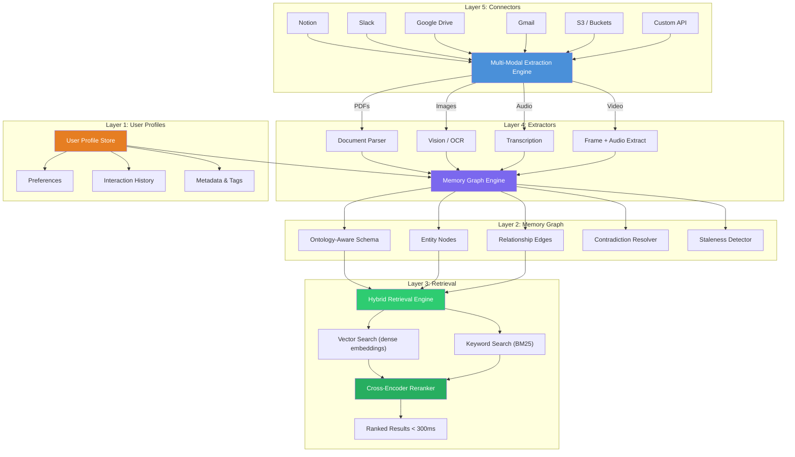
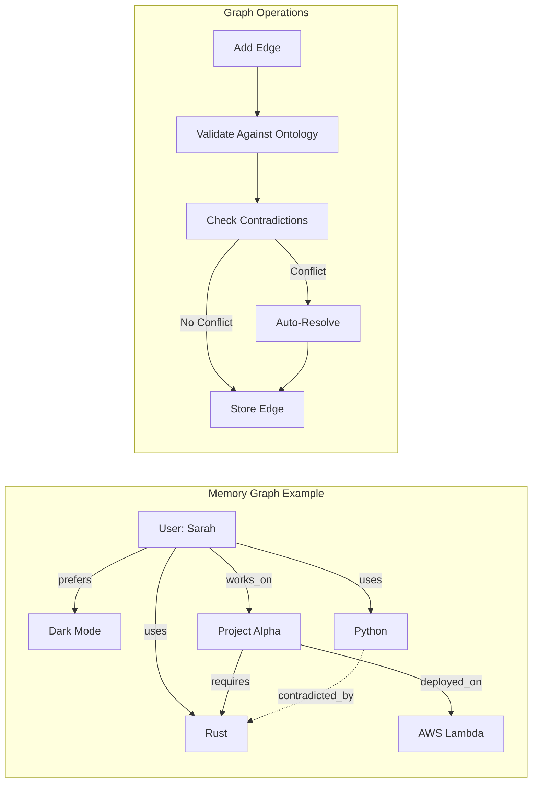
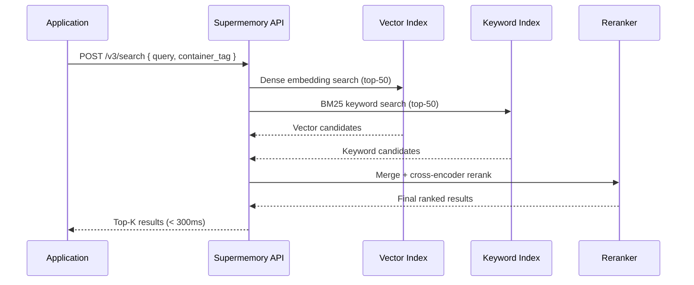
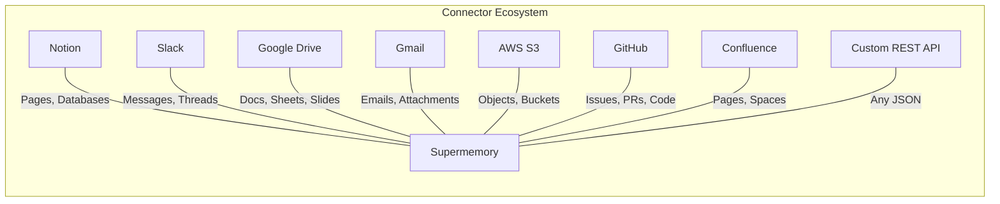

# Supermemory — 深度解析

**官网：** [supermemory.ai](https://supermemory.ai) | **GitHub：** [supermemory-ai/supermemory](https://github.com/supermemory-ai/supermemory) | **许可协议：** 开源引擎 | **融资：** 260 万美元种子轮

> 一体化上下文平台，将记忆图谱、混合检索、多模态提取器和广泛的连接器生态系统整合为单一托管服务。

---

## 架构概览

Supermemory 围绕**五个相互连接的层**构建，形成完整的记忆管线——从数十个来源的原始内容摄入，经过智能提取和图谱构建，到亚 300 毫秒的混合检索。



---

## 五层架构详解

### 第一层：用户画像

用户画像是 Supermemory 个性化的基础。每个用户（通过 `container_tag` 标识）都拥有一个隔离的画像，随时间积累偏好、交互模式和元数据。

| 功能 | 描述 |
|------|------|
| **容器隔离** | 每个 `container_tag` 创建一个独立的记忆空间 |
| **偏好追踪** | 从内容和查询中自动检测 |
| **交互历史** | 完整的添加和搜索操作审计追踪 |
| **元数据索引** | 用于过滤的自定义键值对 |

### 第二层：记忆图谱

记忆图谱是 Supermemory 的核心差异化特性。与纯向量存储不同，它维护一个**本体感知图谱**，其中实体是节点，关系是类型化的边。



**矛盾解决：** 当新信息与现有记忆冲突时（例如"用户偏好浅色模式"与"用户偏好深色模式"），Supermemory 会自动：
1. 通过对立边上的语义相似度检测矛盾
2. 比较时间戳和置信度分数
3. 保留更近期/更高置信度的事实
4. 将被矛盾的事实归档，并附带 `superseded_by` 引用

**过期失效：** 在可配置的 TTL 窗口内未被访问或强化的记忆会被自动降权，减少检索结果中的噪声。

### 第三层：检索引擎

Supermemory 的检索结合了**向量搜索**和**关键词搜索**，配合交叉编码器重排序器，实现亚 300 毫秒的延迟：



| 检索方法 | 角色 | 优势 |
|----------|------|------|
| **向量（稠密）** | 语义相似度匹配 | 捕捉语义，处理同义改写 |
| **关键词（BM25）** | 精确词条匹配 | 精确匹配名称、代码、ID |
| **交叉编码器重排序器** | 最终相关性评分 | 显著提升精度 |

### 第四层：提取器

多模态提取引擎处理多样化的内容类型：

| 内容类型 | 提取方法 | 输出 |
|----------|----------|------|
| **PDF** | 版面感知解析器 + OCR 回退 | 带章节层级的结构化文本 |
| **图片** | 视觉模型 + OCR | 标题、文本内容、元数据 |
| **音频** | Whisper 级转录 | 带时间戳的转录文本 |
| **视频** | 帧采样 + 音频提取 | 关键帧 + 完整转录文本 |
| **网页** | HTML 转文本（去除样板内容） | 干净的正文内容 |
| **代码文件** | AST 感知解析 | 函数、类、文档字符串 |

### 第五层：连接器

连接器提供与外部数据源的**双向同步**：



连接器支持：
- **增量同步**：仅重新索引新增/变更的内容
- **权限映射**：源级别的 ACL 可反映在检索过滤器中
- **Webhook 触发器**：源数据变更时实时更新

---

## API 参考

Supermemory 的 API 围绕两个主要端点：

### 添加记忆

```python
from supermemory import SuperMemory

client = SuperMemory(api_key="sm_...")

# Add a simple text memory
client.add(
    content="User prefers dark mode and uses Vim keybindings",
    container_tag="user_123"
)

# Add with metadata for filtering
client.add(
    content="Project Alpha deadline is March 2026",
    container_tag="user_123",
    metadata={"type": "project", "priority": "high"}
)

# Add a document (extractor auto-detects type)
client.add(
    content="https://docs.example.com/api-spec.pdf",
    container_tag="user_123",
    metadata={"source": "confluence"}
)
```

**`POST /v3/add`** — 摄入内容，运行提取，更新记忆图谱并建立检索索引。幂等性：重复内容会自动去重。

### 搜索记忆

```python
# Basic search
results = client.search.memories(
    query="What are the user's editor preferences?",
    container_tag="user_123"
)

for memory in results:
    print(f"[{memory.score:.2f}] {memory.content}")
    # [0.94] User prefers dark mode and uses Vim keybindings

# Filtered search with metadata
results = client.search.memories(
    query="upcoming deadlines",
    container_tag="user_123",
    filters={"type": "project"}
)

# Search with token budget
results = client.search.memories(
    query="everything about the user",
    container_tag="user_123",
    max_tokens=2000  # Fit within context window
)
```

**`POST /v3/search`** — 执行混合向量+关键词搜索、重排序并返回结果。支持元数据过滤和 Token 预算。

---

## 分步演练：构建个性化编程助手

### 场景

你正在构建一个编程助手，它需要跨会话记住每个用户的技术栈、偏好和项目上下文。

### 步骤 1：初始化并填充记忆

```python
from supermemory import SuperMemory

client = SuperMemory(api_key="sm_...")
USER = "dev_sarah_42"

# After the first conversation, store learned facts
client.add(
    content="Sarah is a senior backend engineer who primarily uses Python and FastAPI. "
            "She prefers type hints everywhere and uses Black for formatting.",
    container_tag=USER
)

client.add(
    content="Sarah's current project is a real-time analytics pipeline using "
            "Apache Kafka and ClickHouse. Deployed on AWS EKS.",
    container_tag=USER
)

client.add(
    content="Sarah prefers concise explanations with code examples. "
            "She dislikes verbose documentation-style responses.",
    container_tag=USER
)
```

### 步骤 2：连接外部数据源

```python
# Sync Sarah's relevant Notion workspace
client.connectors.create(
    type="notion",
    container_tag=USER,
    config={
        "workspace_id": "notion_ws_...",
        "page_filter": ["Engineering Wiki", "Project Alpha Docs"]
    }
)

# Sync her GitHub repos
client.connectors.create(
    type="github",
    container_tag=USER,
    config={
        "repos": ["sarahdev/analytics-pipeline", "sarahdev/shared-libs"],
        "include": ["README.md", "docs/**", "*.py"]
    }
)
```

### 步骤 3：查询时检索上下文

```python
def get_personalized_context(user_id: str, user_query: str) -> str:
    """Build a personalized context block for the LLM."""
    results = client.search.memories(
        query=user_query,
        container_tag=user_id,
        max_tokens=3000
    )
    
    context_parts = []
    for memory in results:
        context_parts.append(f"- {memory.content}")
    
    return "## What I Know About This User\n" + "\n".join(context_parts)

# When Sarah asks: "How should I handle backpressure in my pipeline?"
context = get_personalized_context(USER, "backpressure handling in pipeline")
# Returns relevant memories about her Kafka + ClickHouse stack,
# her preference for concise code examples, and any relevant
# content synced from her Notion docs or GitHub repos.
```

### 步骤 4：对话后更新记忆

```python
# After Sarah mentions she's switching from ClickHouse to DuckDB
client.add(
    content="Sarah is migrating the analytics pipeline from ClickHouse to DuckDB "
            "for cost reasons. Migration started February 2026.",
    container_tag=USER
)
# Supermemory auto-detects the contradiction with the earlier ClickHouse mention
# and updates the memory graph accordingly, archiving the old fact.
```

---

## 基准测试

| 基准测试 | 得分 | 排名 |
|----------|------|------|
| **LongMemEval** | 85.2% | 顶级水平 |
| **LoCoMo** | — | 第一名（自行报告） |
| **ConvoMem** | — | 第一名（自行报告） |

LongMemEval 衡量系统在长对话历史中回忆和推理分布式信息的能力。Supermemory 85.2% 的得分反映了其混合检索 + 记忆图谱组合的实力。

---

## 定价

| 方案 | 价格 | Token 额度 | 功能 |
|------|------|-----------|------|
| **Free** | $0/月 | 100 万 tokens/月 | 核心 API，1 个连接器 |
| **Pro** | $19/月 | 1000 万 tokens/月 | 全部连接器，优先支持 |
| **Scale** | $399/月 | 无限制 | 自定义本体，SLA，专属基础设施 |

---

## 优势

- **一体化平台**：连接器、提取器、图谱和检索集成于单一服务——无需拼接多个独立工具
- **亚 300 毫秒混合检索**：向量 + 关键词 + 重排序在生产级延迟下同时提供精度和召回率
- **自动矛盾解决**：记忆图谱无需开发者干预即可处理冲突事实
- **多模态提取**：原生处理 PDF、图片、音频和视频，无需外部预处理
- **开源引擎**：核心开源可自托管；托管云服务用于生产环境

## 局限性

- **托管服务依赖**：完整功能集（特别是连接器）需要云服务
- **图谱不透明**：记忆图谱的构建基本是自动的——较低层级方案对本体的控制有限
- **基准测试透明度**：LoCoMo 和 ConvoMem 第一名的声称是自行报告的，未公布方法论
- **连接器深度**：虽然广度令人印象深刻，但部分连接器可能缺乏细粒度的同步控制
- **较新的入局者**：260 万美元种子轮阶段——与 Mem0（38K+ stars）或 Letta（40K+ stars）相比，实战验证较少

## 最佳适用场景

- **希望获得即开即用记忆解决方案**且需要广泛数据源覆盖的团队
- **多模态应用**，需要摄入多样化内容类型
- **需要快速混合检索**且不想自行管理独立的向量和关键词索引的产品
- **初创和成长期公司**，希望避免从零构建记忆基础设施

---

## 扩展阅读

- [Supermemory 文档](https://docs.supermemory.ai)
- [GitHub 仓库](https://github.com/supermemory-ai/supermemory)
- [记忆图谱技术概览](https://supermemory.ai/blog/memory-graph)
- 相关基准测试论文：[LongMemEval](https://arxiv.org/abs/2410.10813)、[LoCoMo](https://arxiv.org/abs/2402.10790)
