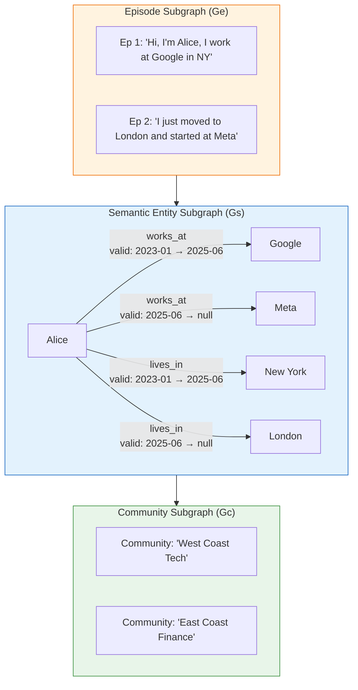
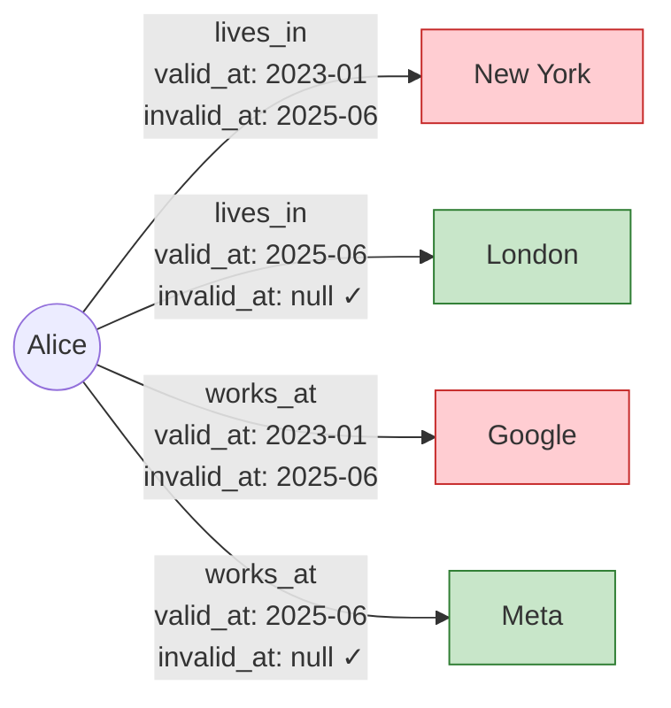
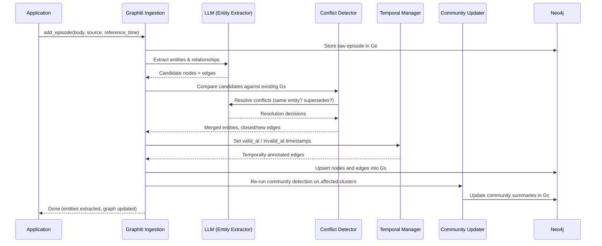
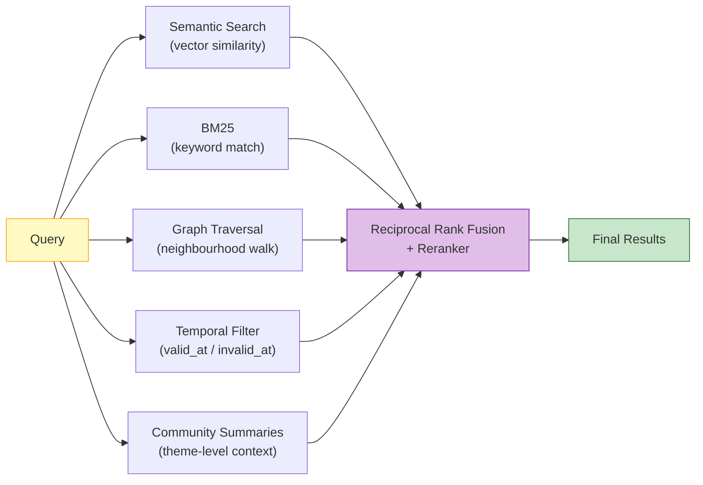

# Zep / Graphiti — 深度解析

**面向智能体的时序知识图谱记忆系统**

| 项目 | 信息 |
|------|------|
| **官网** | [getzep.com](https://getzep.com) |
| **开源引擎** | [Graphiti](https://github.com/getzep/graphiti) — 24K+ GitHub stars |
| **许可协议** | Graphiti: Apache 2.0（Zep Cloud: 专有协议） |
| **论文** | [arXiv:2501.13956](https://arxiv.org/abs/2501.13956)（2025 年 1 月） |
| **后端存储** | Neo4j（必需） |
| **核心差异化特性** | 双时序边——每条关系都记录了*何时为真*以及*何时被取代* |
| **DMR 基准测试** | 94.8%（对比 MemGPT 93.4%） |

---

## 1. 架构概览

Graphiti 将知识组织为三个层级化的子图，从底层的原始出处到顶层的高级摘要。



| 层级 | 名称 | 用途 | 内容 |
|------|------|------|------|
| **Ge** | 事件子图 | 溯源 | 原始消息、文本片段、结构化数据。每个事实都可以追溯到引入它的事件。 |
| **Gs** | 语义实体子图 | 推理 | 实体作为节点，关系作为有向边。每条边携带双时序元数据（`valid_at`、`invalid_at`）。 |
| **Gc** | 社区子图 | 摘要生成 | 由社区检测算法生成的实体聚类高级摘要，用于主题级别的宽泛查询。 |

### 为什么需要三个层级？

- **Ge** 保留原始记录，便于审计*系统为何相信某件事*。
- **Gs** 将原始事件提炼为结构化图，支持精确的时序查询。
- **Gc** 提供全局上下文（例如"总结 Alice 的职业生涯"），无需遍历整个图。

---

## 2. 双时序模型

双时序模型是 Graphiti 的标志性创新。每条关系边都携带两个时间戳：

| 字段 | 含义 |
|------|------|
| `valid_at` | 该关系在现实世界中变为真实的时刻 |
| `invalid_at` | 该关系在现实世界中被取代的时刻（如果仍然有效则为 `null`） |



> 红色 = 已被取代的边，绿色 = 当前有效的边。

### 时序查询示例

| 查询 | 解析结果 |
|------|----------|
| "Alice 住在哪里？" | 查找 `invalid_at IS NULL` 的 `lives_in` 边 → **London** |
| "Alice 在 2024 年住在哪里？" | 查找 `valid_at ≤ 2024 AND (invalid_at > 2024 OR invalid_at IS NULL)` 的 `lives_in` 边 → **New York** |
| "Alice 在 2025 年 6 月有什么变化？" | 查找所有 `valid_at = 2025-06 OR invalid_at = 2025-06` 的边 → 搬到了 London，加入了 Meta |
| "展示 Alice 的完整职业历史" | 返回所有 `works_at` 边（不考虑 `invalid_at`） → Google（2023–2025）、Meta（2025 至今） |

### 为什么双时序优于简单更新

大多数记忆系统（例如 Mem0）通过*替换*旧事实来解决冲突，这会破坏时序历史。Graphiti 则是*关闭*旧边（设置 `invalid_at`）并*打开*新边，从而保留完整的时间线。

```
# Simple upsert (e.g., Mem0):
Alice --lives_in--> New York   →   DELETE
Alice --lives_in--> London     →   INSERT
# History is lost. "Where did Alice live in 2024?" → No answer.

# Bi-temporal (Graphiti):
Alice --lives_in--> New York   [valid_at: 2023-01, invalid_at: 2025-06]  ← closed
Alice --lives_in--> London     [valid_at: 2025-06, invalid_at: null]     ← opened
# Both edges survive. Temporal queries work.
```

---

## 3. 事件摄入管线

每条新信息以**事件（episode）**的形式进入 Graphiti。摄入管线通过五个阶段处理事件。



### 阶段详解

1. **事件存储（Ge）：** 原始输入被完整地持久化保存。这是不可变的审计追踪。
2. **实体与关系提取：** LLM 解析事件主体，输出结构化三元组（主语、谓语、宾语），并根据 `reference_time` 和文本线索推断候选 `valid_at` 时间戳。
3. **冲突检测：** 候选边与同一实体对上的现有边进行比较。LLM 判断新边是*取代*、*矛盾*、*细化*还是*独立于*现有边。
4. **时序边管理：** 被取代的边将其 `invalid_at` 设置为新边的 `valid_at`。新边以 `invalid_at = null` 插入。
5. **社区更新：** 受影响的实体聚类被重新评估，社区摘要被重新生成以反映新信息。

---

## 4. 检索架构

Graphiti 的检索是一个混合管线，在返回结果之前融合五种信号。



| 信号 | 功能 | 适用场景 |
|------|------|----------|
| **语义搜索** | 对实体/边嵌入进行余弦相似度计算 | "介绍一下 Alice 的职业生涯" |
| **BM25** | 全文关键词匹配 | "查找提到 Neo4j 的内容" |
| **图遍历** | 从匹配的实体出发走 1–2 跳 | "还有什么与 Alice 相关的？" |
| **时序过滤** | 将边限制在特定时间窗口内有效的范围 | "2024 年 Q1 的情况是什么？" |
| **社区摘要** | 注入聚类级别的摘要以获得广度 | "总结 Alice 的职业人脉" |

五种信号的结果通过**倒数排名融合**合并，并可选择性地通过交叉编码器进行重排序。

---

## 5. 社区检测与高级摘要

社区子图（Gc）使用图社区检测（受 Leiden 算法启发）对密集连接的实体进行聚类。每个聚类会获得一个 LLM 生成的摘要。

### 工作原理

1. 图发生变更后，Graphiti 对 Gs 受影响的区域运行社区检测。
2. 紧密互联的实体（拥有许多共享边）被分组到一个社区中。
3. LLM 通过阅读成员实体及其关系，为每个社区生成自然语言摘要。
4. 摘要被嵌入并存储在 Gc 中。

### 示例

假设图中包含：
- Alice → works_at → Meta
- Alice → collaborates_with → Bob
- Bob → works_at → Meta
- Meta → headquartered_in → Menlo Park

社区检测将 {Alice, Bob, Meta, Menlo Park} 分组为一个聚类。生成的摘要：

> *"Alice 和 Bob 都在 Meta 工作，Meta 总部位于 Menlo Park。Alice 之前在 New York 的 Google 工作，于 2025 年 6 月加入 Meta。"*

### 社区的重要性

- **宽泛查询：** "介绍一下 Alice 的职业生涯"可以直接从社区摘要中得到回答，无需遍历每条边。
- **Token 效率：** 一条摘要替代数十条独立的三元组。
- **上下文注入：** 社区为 LLM 提供了单独的边所缺乏的主题上下文。

---

## 6. SDK 用法——实际代码示例

### 基本设置与事件摄入

```python
from graphiti_core import Graphiti
from graphiti_core.nodes import EpisodeType
from datetime import datetime, timezone
import asyncio

async def main():
    # Connect to Neo4j
    graphiti = Graphiti("bolt://localhost:7687", "neo4j", "password")

    # Create indices on first run
    await graphiti.build_indices_and_constraints()

    # Ingest a sequence of messages as episodes
    episodes = [
        ("Chat 1", "User: Hi, I'm Alice and I work at Google in New York."),
        ("Chat 2", "Assistant: Nice to meet you Alice! How can I help?"),
        ("Chat 3", "User: I'm looking for restaurants near my office."),
        ("Chat 4", "User: Actually, I just moved to London and started at Meta."),
    ]

    for name, body in episodes:
        await graphiti.add_episode(
            name=name,
            episode_body=body,
            source=EpisodeType.message,
            source_description="Support chat",
            reference_time=datetime.now(timezone.utc),
        )

    # Search: "Where does Alice work?" returns the *current* edge
    results = await graphiti.search("Where does Alice work?")
    for r in results:
        print(f"  {r.fact} (valid: {r.valid_at} → {r.invalid_at})")
    # Output: Alice works at Meta (valid: 2025-06 → None)

    await graphiti.close()

asyncio.run(main())
```

### 时序查询

```python
async def temporal_query(graphiti: Graphiti):
    # Point-in-time query
    results = await graphiti.search("Where did Alice live in 2024?")
    for r in results:
        print(f"  {r.fact} (valid: {r.valid_at} → {r.invalid_at})")
    # Output: Alice lives in New York (valid: 2023-01 → 2025-06)

    # "What changed?" query
    results = await graphiti.search("What changed about Alice recently?")
    for r in results:
        if r.invalid_at:
            print(f"  [SUPERSEDED] {r.fact}")
        else:
            print(f"  [CURRENT]    {r.fact}")
```

### 摄入结构化数据（不仅限于聊天）

```python
import json

async def ingest_crm_record(graphiti: Graphiti):
    crm_event = {
        "type": "deal_update",
        "account": "Acme Corp",
        "stage": "Closed Won",
        "value": "$240K",
        "rep": "Bob Smith",
        "closed_date": "2025-03-15",
    }

    await graphiti.add_episode(
        name="CRM Deal: Acme Corp",
        episode_body=json.dumps(crm_event),
        source=EpisodeType.json,
        source_description="Salesforce CRM export",
        reference_time=datetime(2025, 3, 15, tzinfo=timezone.utc),
    )
```

---

## 7. 演练：追踪 Alice 的职业变迁

本端到端演练展示了 Graphiti 的双时序模型如何处理不断演变的真实场景。

### 时间线

| 日期 | 事件 |
|------|------|
| **2023-01** | Alice 以工程师身份加入 Google，地点在 New York |
| **2024-06** | Alice 在 Google 晋升为高级工程师 |
| **2025-06** | Alice 离开 Google，加入 London 的 Meta |
| **2025-11** | Alice 成为 Meta 的技术主管 |

### 步骤 1：初始状态（2023 年 1 月）

摄入以下内容后：*"Hi, I'm Alice and I work at Google in New York as an engineer."*

```
Graph edges in Gs:
  Alice --works_at--> Google        [valid_at: 2023-01, invalid_at: null]
  Alice --lives_in--> New York      [valid_at: 2023-01, invalid_at: null]
  Alice --has_role--> Engineer      [valid_at: 2023-01, invalid_at: null]
```

### 步骤 2：晋升（2024 年 6 月）

摄入以下内容后：*"I just got promoted to Senior Engineer at Google!"*

冲突检测发现现有的 `has_role → Engineer` 边。LLM 判定这是一次*取代*（晋升替代了旧角色）。

```
Graph edges in Gs:
  Alice --works_at--> Google        [valid_at: 2023-01, invalid_at: null]
  Alice --lives_in--> New York      [valid_at: 2023-01, invalid_at: null]
  Alice --has_role--> Engineer      [valid_at: 2023-01, invalid_at: 2024-06]  ← closed
  Alice --has_role--> Sr. Engineer  [valid_at: 2024-06, invalid_at: null]     ← new
```

### 步骤 3：换公司（2025 年 6 月）

摄入以下内容后：*"I just moved to London and started at Meta."*

三条边受到影响：`works_at`、`lives_in` 和 `has_role`。

```
Graph edges in Gs:
  Alice --works_at--> Google        [valid_at: 2023-01, invalid_at: 2025-06]  ← closed
  Alice --works_at--> Meta          [valid_at: 2025-06, invalid_at: null]     ← new
  Alice --lives_in--> New York      [valid_at: 2023-01, invalid_at: 2025-06]  ← closed
  Alice --lives_in--> London        [valid_at: 2025-06, invalid_at: null]     ← new
  Alice --has_role--> Engineer      [valid_at: 2023-01, invalid_at: 2024-06]
  Alice --has_role--> Sr. Engineer  [valid_at: 2024-06, invalid_at: 2025-06]  ← closed
```

### 步骤 4：新角色（2025 年 11 月）

摄入以下内容后：*"Great news — I've been made Tech Lead at Meta!"*

```
Graph edges in Gs:
  Alice --works_at--> Meta          [valid_at: 2025-06, invalid_at: null]
  Alice --lives_in--> London        [valid_at: 2025-06, invalid_at: null]
  Alice --has_role--> Tech Lead     [valid_at: 2025-11, invalid_at: null]     ← new
  # ... plus all historical closed edges preserved
```

### 查询时间线

```python
# "What was Alice's role in March 2024?"
results = await graphiti.search("Alice's role in March 2024")
# → Engineer at Google (valid 2023-01 to 2024-06)

# "Show me Alice's complete work history"
results = await graphiti.search("Alice's career history")
# → Google Engineer (2023-01 to 2024-06)
# → Google Sr. Engineer (2024-06 to 2025-06)
# → Meta Tech Lead (2025-11 to present)

# "What changed in June 2025?"
results = await graphiti.search("What changed about Alice in June 2025?")
# → Left Google, joined Meta, moved from New York to London
```

---

## 8. 基准测试性能

| 基准测试 | Graphiti/Zep | 竞品 | 差异 |
|----------|-------------|------|------|
| **DMR** | **94.8%** | MemGPT: 93.4% | +1.4pp |
| **LongMemEval** | 准确率 +18.5% | 基线 | +18.5pp，延迟降低 90% |
| **LoCoMo** | **75.1%** | — | — |

### 基准测试衡量指标

- **DMR（动态记忆召回）：** 测试系统追踪和回忆随时间变化的事实的能力。Graphiti 的时序模型在这方面具有天然优势。
- **LongMemEval：** 衡量跨长多轮会话的准确率和延迟。准确率提升 18.5% 和延迟降低 90% 均源于无需重新读取完整的对话历史。
- **LoCoMo：** 长对话记忆基准测试。Graphiti 的 75.1% 得分虽然表现不错，但落后于一些竞品（例如 ByteRover 92.2%、Hindsight 89.6%）。这反映了 Graphiti 侧重时序精度而非原始召回量的设计取向。

### 解读

Graphiti 在时序/动态基准测试（DMR、LongMemEval）上表现卓越，其双时序模型是结构性优势。在静态长记忆基准测试（LoCoMo）上，采用更激进检索策略的系统可能得分更高。

---

## 9. 与 Microsoft GraphRAG 的对比

Graphiti 和 Microsoft 的 GraphRAG 都使用知识图谱，但它们服务于根本不同的用例。

| 维度 | Graphiti (Zep) | Microsoft GraphRAG |
|------|---------------|-------------------|
| **主要用例** | 对话智能体记忆 | 文档语料库问答 |
| **数据模型** | 双时序实体图 | 静态实体图 |
| **时序感知** | 一等公民（`valid_at`/`invalid_at`） | 无——仅为索引时刻的语料库快照 |
| **摄入模型** | 增量式（逐事件） | 批量式（整个语料库重新索引） |
| **社区摘要** | 动态的，每次变更时更新 | 静态的，索引时生成 |
| **更新成本** | O(1)/事件——局部图修补 | O(n)——需要完整重新索引 |
| **矛盾处理** | 双时序边关闭 | 最后写入胜出或手动处理 |
| **实时使用** | 为实时对话设计 | 为离线分析设计 |
| **检索** | 混合：语义 + BM25 + 图 + 时序 + 社区 | 基于社区摘要的 Map-Reduce |
| **后端存储** | Neo4j | Azure AI Search / 自定义 |
| **开源** | Graphiti 核心：Apache 2.0 | GraphRAG：MIT |

### 如何选择

- **选择 Graphiti**：当你的数据随时间变化，且需要推理*事物何时为真*——用户画像、CRM 数据、不断演变的业务上下文。
- **选择 GraphRAG**：当你拥有大型静态语料库，且需要全局上下文的回答——研究论文、法律文件、技术文档。

---

## 10. 优势

- **同类最佳的时序推理。** 没有其他记忆系统能以同样的结构优雅性处理"在时间 T 什么是真的？"。
- **溯源与可审计性。** 每个事实都可追溯至引入它的事件，具有不可变的事件子图记录。
- **增量更新。** 新信息的摄入无需重新索引整个图。
- **混合检索。** 五信号融合（语义、BM25、图、时序、社区）覆盖广泛的查询类型。
- **企业级就绪。** 跨会话综合、业务数据集成（JSON、CRM 记录）以及 Zep Cloud 托管部署。
- **开源核心。** Graphiti 无需 Zep Cloud 即可完全使用。
- **社区摘要。** Gc 提供高效的宽泛上下文回答，无需完整的图遍历。

---

## 11. 局限性

- **Neo4j 依赖。** 需要运行 Neo4j 实例。没有嵌入式或更轻量的图存储替代方案。与纯向量系统相比，这增加了基础设施的复杂性。
- **LLM 密集型摄入。** 每个事件都会触发实体提取、冲突检测和社区更新——全部需要 LLM 调用。成本随摄入量增长。
- **LoCoMo 差距。** 75.1% 的得分落后于 ByteRover（92.2%）和 Hindsight（89.6%）等竞品，表明在原始召回任务上仍有改进空间。
- **云端功能为专有。** Zep Cloud 增加了用户管理、认证和托管基础设施，但这些不是开源的。
- **图的复杂性。** 运维人员需要理解时序图语义才能调试或扩展系统。这比扁平记忆系统的学习曲线更陡。
- **社区检测开销。** 每次变更都重新运行社区检测可能会为高吞吐量摄入增加延迟。

---

## 12. 最佳适用场景

- **拥有不断演变业务数据的企业应用** ——CRM、客户支持、销售智能等事实随时间变化的场景。
- **需要时序推理的系统** ——"什么发生了变化？"、"Q3 的情况是什么？"、"展示该账户的历史记录。"
- **跨会话信息综合** ——在多次对话中积累知识并需要调和矛盾的智能体。
- **事实溯源至关重要的应用** ——需要审计追踪的受监管行业（金融、医疗、法律）。
- **动态知识库** ——任何真相不断演变且历史上下文具有价值的领域。

---

## 参考资料

- Graphiti 论文：[arXiv:2501.13956](https://arxiv.org/abs/2501.13956) — *"Graphiti: Building Real-Time, Temporally Aware Knowledge Graphs for AI Agents"*
- Graphiti GitHub：[github.com/getzep/graphiti](https://github.com/getzep/graphiti)
- Zep Cloud：[getzep.com](https://getzep.com)
- Microsoft GraphRAG（对比参考）：[github.com/microsoft/graphrag](https://github.com/microsoft/graphrag)
