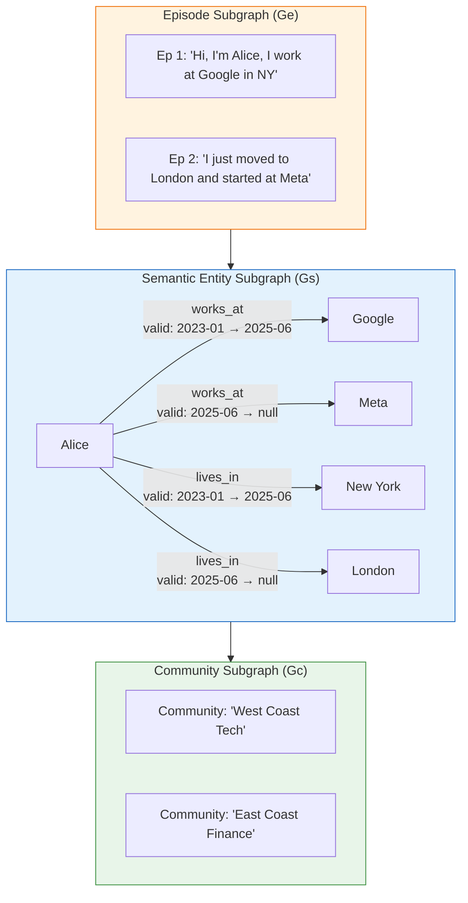
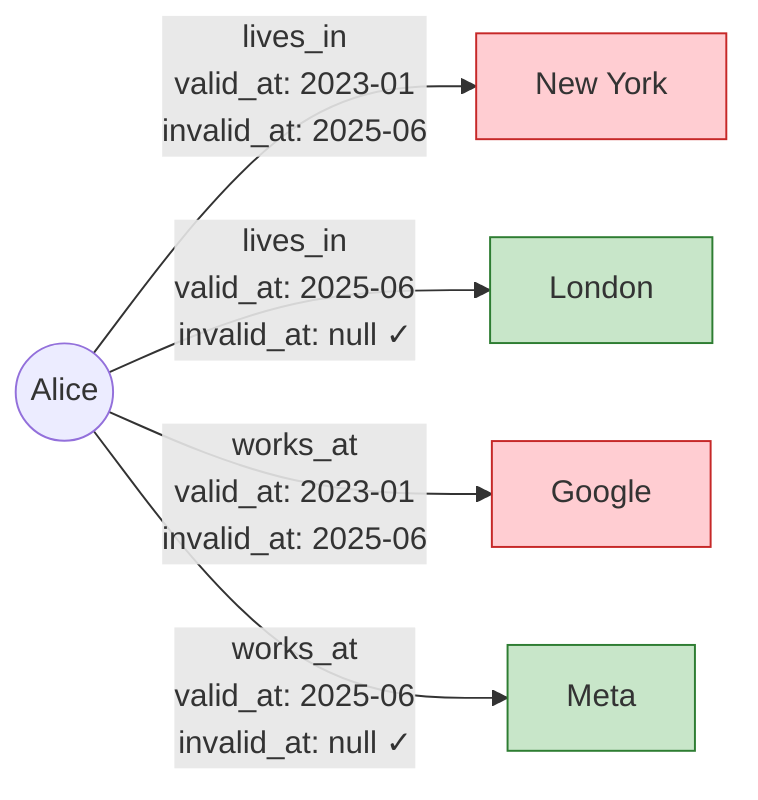
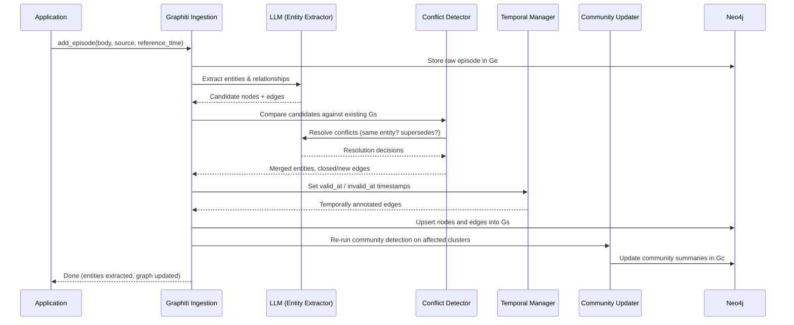
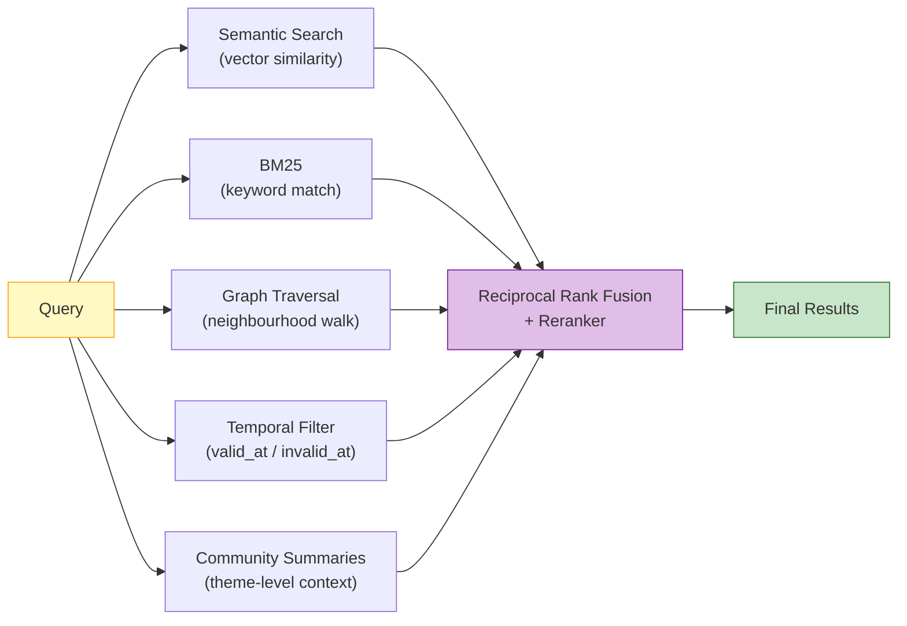

# Zep / Graphiti — 深度解析

**面向智能体的时序知识图谱记忆系统**

| 项目 | 信息 |
|------|------|
| **官网** | [getzep.com](https://getzep.com) |
| **开源引擎** | [Graphiti](https://github.com/getzep/graphiti) — 24K+ GitHub stars |
| **许可协议** | Graphiti: Apache 2.0（Zep Cloud: 专有协议） |
| **论文** | [arXiv:2501.13956](https://arxiv.org/abs/2501.13956)（2025 年 1 月） |
| **后端存储** | Neo4j（必需） |
| **核心亮点** | 双时序边——每条关系不仅记录了*何时成立*，还记录了*何时失效* |
| **DMR 基准测试** | 94.8%（对比 MemGPT 93.4%） |

---

## 1. 架构概览

Graphiti 把知识拆分成三个层层递进的子图：最底层保留原始出处，最顶层生成高级摘要。



| 层级 | 名称 | 用途 | 内容 |
|------|------|------|------|
| **Ge** | 事件子图 | 追根溯源 | 原始消息、文本片段和结构化数据一应俱全，每条事实都能回溯到引入它的那个事件。 |
| **Gs** | 语义实体子图 | 结构化推理 | 实体充当节点，关系化作有向边，每条边都带有双时序元数据（`valid_at`、`invalid_at`）。 |
| **Gc** | 社区子图 | 摘要生成 | 社区检测算法将紧密关联的实体聚合在一起并生成高级摘要，专为宽泛的主题级查询而设计。 |

### 为什么需要三个层级？

- **Ge** 保留了全部原始记录——当你想追问"系统凭什么这样认为"时，答案就在这里。
- **Gs** 把零散的事件提炼为结构化图谱，让精确的时序查询成为可能。
- **Gc** 提供全局视角——比如"帮我总结 Alice 的职业生涯"这类问题，无需遍历整张图就能得到答案。

---

## 2. 双时序模型

双时序模型是 Graphiti 最具辨识度的设计。核心思想很简洁：每条关系边都携带两个时间戳。

| 字段 | 含义 |
|------|------|
| `valid_at` | 该关系在现实世界中变为真实的时刻 |
| `invalid_at` | 该关系在现实世界中被取代的时刻（如果仍然有效则为 `null`） |



> 红色 = 已失效的边，绿色 = 当前有效的边。

### 时序查询示例

| 查询 | 解析结果 |
|------|----------|
| "Alice 住在哪里？" | 查找 `invalid_at IS NULL` 的 `lives_in` 边 → **London** |
| "Alice 在 2024 年住在哪里？" | 查找 `valid_at ≤ 2024 AND (invalid_at > 2024 OR invalid_at IS NULL)` 的 `lives_in` 边 → **New York** |
| "Alice 在 2025 年 6 月有什么变化？" | 查找所有 `valid_at = 2025-06 OR invalid_at = 2025-06` 的边 → 搬到了 London，加入了 Meta |
| "展示 Alice 的完整职业历史" | 返回所有 `works_at` 边（不考虑 `invalid_at`） → Google（2023–2025）、Meta（2025 至今） |

### 双时序凭什么比简单更新更好？

大多数记忆系统（比如 Mem0）处理冲突的方式很粗暴——直接*替换*旧事实，时序历史就此丢失。Graphiti 的做法优雅得多：它不删除旧边，而是*关闭*它（设置 `invalid_at`），同时*打开*一条新边，这样整条时间线就完整地保留了下来。

```
# Simple upsert (e.g., Mem0):
Alice --lives_in--> New York   →   DELETE
Alice --lives_in--> London     →   INSERT
# History is lost. "Where did Alice live in 2024?" → No answer.

# Bi-temporal (Graphiti):
Alice --lives_in--> New York   [valid_at: 2023-01, invalid_at: 2025-06]  ← closed
Alice --lives_in--> London     [valid_at: 2025-06, invalid_at: null]     ← opened
# Both edges survive. Temporal queries work.
```

---

## 3. 事件摄入管线

在 Graphiti 中，每条新信息都以**事件（episode）**的形式被接收，然后经过五个阶段的处理流水线。



### 阶段详解

1. **事件存储（Ge）：** 原始输入原封不动地写入存储，形成不可篡改的审计日志。
2. **实体与关系提取：** LLM 解析事件内容，输出结构化的三元组（主语、谓语、宾语），并结合 `reference_time` 和文本线索推断候选的 `valid_at` 时间戳。
3. **冲突检测：** 候选边与同一实体对上已有的边逐一比对。LLM 判断新边究竟是*取代*、*矛盾*、*细化*还是*独立于*现有边。
4. **时序边管理：** 被取代的旧边会将 `invalid_at` 设为新边的 `valid_at`；新边以 `invalid_at = null` 的状态插入。
5. **社区更新：** 受影响的实体聚类被重新评估，社区摘要随之更新以反映最新信息。

---

## 4. 检索架构

Graphiti 的检索并非依赖单一策略，而是一条混合管线，将五种不同的信号融合后才返回结果。



| 信号 | 功能 | 适用场景 |
|------|------|----------|
| **语义搜索** | 对实体/边嵌入进行余弦相似度计算 | "介绍一下 Alice 的职业生涯" |
| **BM25** | 全文关键词匹配 | "查找提到 Neo4j 的内容" |
| **图遍历** | 从匹配的实体出发走 1–2 跳 | "还有什么与 Alice 相关的？" |
| **时序过滤** | 将边限制在特定时间窗口内有效的范围 | "2024 年 Q1 的情况是什么？" |
| **社区摘要** | 注入聚类级别的摘要以获得更广的视野 | "总结 Alice 的职业人脉" |

五路信号的结果通过**倒数排名融合（Reciprocal Rank Fusion）**合并为统一排序，还可进一步借助交叉编码器做精排。

---

## 5. 社区检测与高级摘要

社区子图（Gc）借鉴 Leiden 算法的思路，对图中紧密连接的实体进行聚类，然后为每个聚类生成一段 LLM 撰写的自然语言摘要。

### 工作原理

1. 每当图谱发生变更，Graphiti 会在 Gs 的受影响区域重新运行社区检测。
2. 那些彼此紧密关联（共享大量边）的实体会被归入同一个社区。
3. LLM 阅读社区内的成员实体及其关系，为整个社区生成一段自然语言摘要。
4. 生成的摘要会被向量化后存入 Gc。

### 示例

举个例子，假设图中有这样几条关系：
- Alice → works_at → Meta
- Alice → collaborates_with → Bob
- Bob → works_at → Meta
- Meta → headquartered_in → Menlo Park

社区检测算法会把 {Alice, Bob, Meta, Menlo Park} 归为一个聚类，生成的摘要大致是：

> *"Alice 和 Bob 都在 Meta 工作，Meta 总部位于 Menlo Park。Alice 之前在 New York 的 Google 工作，于 2025 年 6 月加入 Meta。"*

### 社区摘要的价值

- **宽泛查询的利器：** 像"聊聊 Alice 的职业生涯"这样的开放式问题，直接从社区摘要就能得到不错的答案，根本不需要逐条遍历图中的边。
- **省 Token：** 一段摘要就能顶替几十条独立的三元组，大幅压缩上下文长度。
- **补充主题上下文：** 单条边只告诉你一个孤立的事实，而社区摘要能给 LLM 提供全局性的主题背景。

---

## 6. SDK 用法——实际代码示例

### 基本设置与事件摄入

```python
from graphiti_core import Graphiti
from graphiti_core.nodes import EpisodeType
from datetime import datetime, timezone
import asyncio

async def main():
    # Connect to Neo4j
    graphiti = Graphiti("bolt://localhost:7687", "neo4j", "password")

    # Create indices on first run
    await graphiti.build_indices_and_constraints()

    # Ingest a sequence of messages as episodes
    episodes = [
        ("Chat 1", "User: Hi, I'm Alice and I work at Google in New York."),
        ("Chat 2", "Assistant: Nice to meet you Alice! How can I help?"),
        ("Chat 3", "User: I'm looking for restaurants near my office."),
        ("Chat 4", "User: Actually, I just moved to London and started at Meta."),
    ]

    for name, body in episodes:
        await graphiti.add_episode(
            name=name,
            episode_body=body,
            source=EpisodeType.message,
            source_description="Support chat",
            reference_time=datetime.now(timezone.utc),
        )

    # Search: "Where does Alice work?" returns the *current* edge
    results = await graphiti.search("Where does Alice work?")
    for r in results:
        print(f"  {r.fact} (valid: {r.valid_at} → {r.invalid_at})")
    # Output: Alice works at Meta (valid: 2025-06 → None)

    await graphiti.close()

asyncio.run(main())
```

### 时序查询

```python
async def temporal_query(graphiti: Graphiti):
    # Point-in-time query
    results = await graphiti.search("Where did Alice live in 2024?")
    for r in results:
        print(f"  {r.fact} (valid: {r.valid_at} → {r.invalid_at})")
    # Output: Alice lives in New York (valid: 2023-01 → 2025-06)

    # "What changed?" query
    results = await graphiti.search("What changed about Alice recently?")
    for r in results:
        if r.invalid_at:
            print(f"  [SUPERSEDED] {r.fact}")
        else:
            print(f"  [CURRENT]    {r.fact}")
```

### 摄入结构化数据（不仅限于聊天）

```python
import json

async def ingest_crm_record(graphiti: Graphiti):
    crm_event = {
        "type": "deal_update",
        "account": "Acme Corp",
        "stage": "Closed Won",
        "value": "$240K",
        "rep": "Bob Smith",
        "closed_date": "2025-03-15",
    }

    await graphiti.add_episode(
        name="CRM Deal: Acme Corp",
        episode_body=json.dumps(crm_event),
        source=EpisodeType.json,
        source_description="Salesforce CRM export",
        reference_time=datetime(2025, 3, 15, tzinfo=timezone.utc),
    )
```

---

## 7. 演练：追踪 Alice 的职业变迁

下面通过一个完整的端到端示例，来看看 Graphiti 的双时序模型如何优雅地应对现实中不断变化的信息。

### 时间线

| 日期 | 事件 |
|------|------|
| **2023-01** | Alice 以工程师身份加入 Google，地点在 New York |
| **2024-06** | Alice 在 Google 晋升为高级工程师 |
| **2025-06** | Alice 离开 Google，加入 London 的 Meta |
| **2025-11** | Alice 成为 Meta 的技术主管 |

### 步骤 1：初始状态（2023 年 1 月）

摄入以下内容后：*"Hi, I'm Alice and I work at Google in New York as an engineer."*

```
Graph edges in Gs:
  Alice --works_at--> Google        [valid_at: 2023-01, invalid_at: null]
  Alice --lives_in--> New York      [valid_at: 2023-01, invalid_at: null]
  Alice --has_role--> Engineer      [valid_at: 2023-01, invalid_at: null]
```

### 步骤 2：晋升（2024 年 6 月）

摄入以下内容后：*"I just got promoted to Senior Engineer at Google!"*

冲突检测器发现图中已有 `has_role → Engineer` 这条边。LLM 判断这属于*取代*关系——晋升意味着新角色替代了旧角色。

```
Graph edges in Gs:
  Alice --works_at--> Google        [valid_at: 2023-01, invalid_at: null]
  Alice --lives_in--> New York      [valid_at: 2023-01, invalid_at: null]
  Alice --has_role--> Engineer      [valid_at: 2023-01, invalid_at: 2024-06]  ← closed
  Alice --has_role--> Sr. Engineer  [valid_at: 2024-06, invalid_at: null]     ← new
```

### 步骤 3：换公司（2025 年 6 月）

摄入以下内容后：*"I just moved to London and started at Meta."*

这一次变动波及三条边：`works_at`、`lives_in` 和 `has_role`。

```
Graph edges in Gs:
  Alice --works_at--> Google        [valid_at: 2023-01, invalid_at: 2025-06]  ← closed
  Alice --works_at--> Meta          [valid_at: 2025-06, invalid_at: null]     ← new
  Alice --lives_in--> New York      [valid_at: 2023-01, invalid_at: 2025-06]  ← closed
  Alice --lives_in--> London        [valid_at: 2025-06, invalid_at: null]     ← new
  Alice --has_role--> Engineer      [valid_at: 2023-01, invalid_at: 2024-06]
  Alice --has_role--> Sr. Engineer  [valid_at: 2024-06, invalid_at: 2025-06]  ← closed
```

### 步骤 4：新角色（2025 年 11 月）

摄入以下内容后：*"Great news — I've been made Tech Lead at Meta!"*

```
Graph edges in Gs:
  Alice --works_at--> Meta          [valid_at: 2025-06, invalid_at: null]
  Alice --lives_in--> London        [valid_at: 2025-06, invalid_at: null]
  Alice --has_role--> Tech Lead     [valid_at: 2025-11, invalid_at: null]     ← new
  # ... plus all historical closed edges preserved
```

### 查询时间线

```python
# "What was Alice's role in March 2024?"
results = await graphiti.search("Alice's role in March 2024")
# → Engineer at Google (valid 2023-01 to 2024-06)

# "Show me Alice's complete work history"
results = await graphiti.search("Alice's career history")
# → Google Engineer (2023-01 to 2024-06)
# → Google Sr. Engineer (2024-06 to 2025-06)
# → Meta Tech Lead (2025-11 to present)

# "What changed in June 2025?"
results = await graphiti.search("What changed about Alice in June 2025?")
# → Left Google, joined Meta, moved from New York to London
```

---

## 8. 基准测试性能

| 基准测试 | Graphiti/Zep | 竞品 | 差异 |
|----------|-------------|------|------|
| **DMR** | **94.8%** | MemGPT: 93.4% | +1.4pp |
| **LongMemEval** | 准确率 +18.5% | 基线 | +18.5pp，延迟降低 90% |
| **LoCoMo** | **75.1%** | — | — |

### 各项基准测试解读

- **DMR（动态记忆召回）：** 考核系统追踪和回忆随时间演变的事实的能力。双时序模型让 Graphiti 在这项测试中占尽先天优势。
- **LongMemEval：** 衡量长程多轮对话中的准确率和响应延迟。Graphiti 准确率高出 18.5%、延迟降低 90%，关键在于它不必每次都重新读取完整对话记录。
- **LoCoMo：** 长对话记忆基准测试。Graphiti 拿到 75.1%，成绩尚可，但明显落后于 ByteRover（92.2%）和 Hindsight（89.6%）等对手。这恰恰反映了 Graphiti 的设计取舍——它追求的是时序精度，而非不加区分的高召回。

### 总体评价

Graphiti 在时序和动态类基准（DMR、LongMemEval）上表现亮眼，双时序模型赋予它结构性优势。而在偏静态的长记忆基准（LoCoMo）上，那些采用更激进检索策略的系统可能会拿到更高分。

---

## 9. 与 Microsoft GraphRAG 的对比

Graphiti 和 Microsoft GraphRAG 虽然都以知识图谱为核心，但二者的设计目标截然不同。

| 维度 | Graphiti (Zep) | Microsoft GraphRAG |
|------|---------------|-------------------|
| **主要用例** | 对话智能体记忆 | 文档语料库问答 |
| **数据模型** | 双时序实体图 | 静态实体图 |
| **时序感知** | 一等公民（`valid_at`/`invalid_at`） | 无——仅为索引时刻的语料库快照 |
| **摄入模型** | 增量式（逐事件） | 批量式（整个语料库重新索引） |
| **社区摘要** | 动态更新，每次变更时刷新 | 静态生成，索引时一次性产出 |
| **更新成本** | O(1)/事件——局部图修补 | O(n)——需要完整重新索引 |
| **矛盾处理** | 双时序边关闭 | 最后写入胜出或手动处理 |
| **实时使用** | 为实时对话场景设计 | 为离线分析场景设计 |
| **检索** | 混合：语义 + BM25 + 图 + 时序 + 社区 | 基于社区摘要的 Map-Reduce |
| **后端存储** | Neo4j | Azure AI Search / 自定义 |
| **开源** | Graphiti 核心：Apache 2.0 | GraphRAG：MIT |

### 如何选择

- **选 Graphiti**：如果你的数据会随时间变化，而且需要回答"这件事在什么时候是成立的"——典型场景包括用户画像、CRM 数据、持续演变的业务上下文。
- **选 GraphRAG**：如果你面对的是大规模静态语料库，且需要带有全局视角的回答——比如研究论文、法律文件、技术文档。

---

## 10. 优势

- **时序推理能力首屈一指。** 目前没有哪个记忆系统能像它一样优雅地回答"在时间 T，什么是成立的？"。
- **可溯源、可审计。** 每条事实都能追溯到引入它的那个事件，事件子图的记录不可篡改。
- **增量更新。** 新信息进来时只需局部修补，无需对整张图重新索引。
- **五路混合检索。** 语义、BM25、图遍历、时序过滤、社区摘要五管齐下，几乎覆盖所有查询场景。
- **企业级就绪。** 支持跨会话信息综合、业务数据接入（JSON、CRM 记录），还有 Zep Cloud 提供的托管部署。
- **开源核心。** Graphiti 无需 Zep Cloud 即可完整使用。
- **社区摘要。** Gc 层让系统能高效地回答宽泛的上下文类问题，省去了遍历完整图谱的开销。

---

## 11. 局限性

- **绑定 Neo4j。** 必须部署 Neo4j 实例，没有嵌入式或更轻量的图存储可选。跟纯向量方案比，运维门槛明显更高。
- **摄入环节重度依赖 LLM。** 每个事件都要经过实体提取、冲突检测和社区更新——每一步都需要 LLM 参与。数据量一大，成本不容小觑。
- **LoCoMo 成绩有差距。** 75.1% 的得分明显落后于 ByteRover（92.2%）和 Hindsight（89.6%），说明在纯召回任务上还有提升余地。
- **云端功能闭源。** Zep Cloud 提供的用户管理、身份认证和托管基础设施都是专有的。
- **图谱本身有复杂度。** 运维人员需要理解时序图的语义才能有效调试和扩展系统，学习曲线比扁平记忆方案陡峭不少。
- **社区检测的额外开销。** 每次图谱变更都触发社区重检测，在高吞吐量场景下可能成为延迟瓶颈。

---

## 12. 最佳适用场景

- **业务数据持续变化的企业应用**——CRM、客户支持、销售智能这类事实会随时间更新的场景。
- **需要时序推理的系统**——用户会问"最近有什么变化？""Q3 的情况怎样？""给我看看这个账户的历史"。
- **需要跨会话综合信息的智能体**——在多次对话中持续积累知识，并自动调和前后矛盾。
- **对事实溯源有刚性需求的应用**——金融、医疗、法律等受监管行业，审计追踪是必选项。
- **动态知识库**——只要你所在的领域中事实在不断演变，而历史上下文本身也有价值。

---

## 参考资料

- Graphiti 论文：[arXiv:2501.13956](https://arxiv.org/abs/2501.13956) — *"Graphiti: Building Real-Time, Temporally Aware Knowledge Graphs for AI Agents"*
- Graphiti GitHub：[github.com/getzep/graphiti](https://github.com/getzep/graphiti)
- Zep Cloud：[getzep.com](https://getzep.com)
- Microsoft GraphRAG（对比参考）：[github.com/microsoft/graphrag](https://github.com/microsoft/graphrag)
