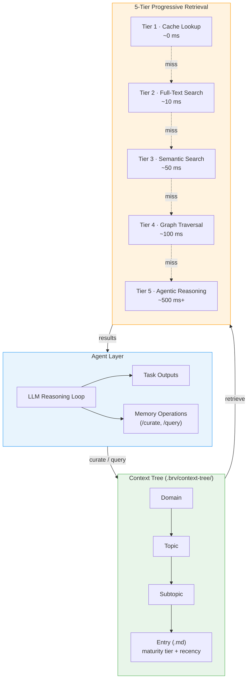
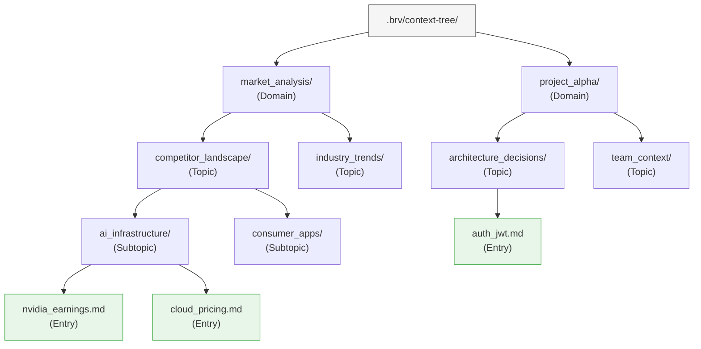
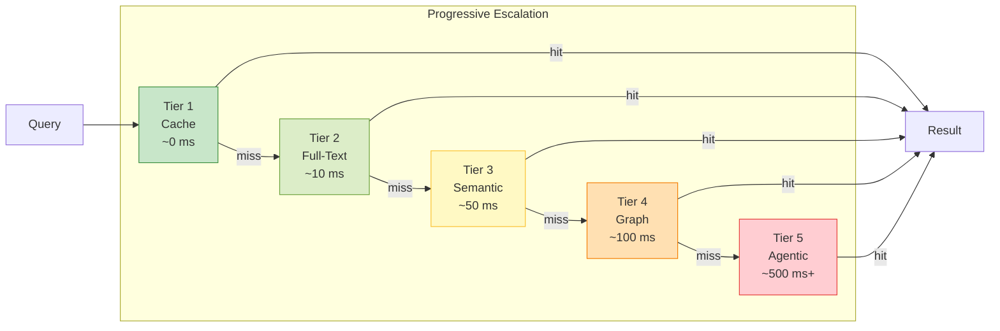

# ByteRover — Agent-Native Memory

**Website:** [byterover.dev](https://www.byterover.dev) | **GitHub:** 4.2K+ stars | **License:** Proprietary CLI, open docs | **Paper:** [arXiv:2604.01599](https://arxiv.org/html/2604.01599v1) (Apr 2026)

> The same LLM that reasons about your task also curates your memory — no separate extraction pipeline, no vector database, no graph store. Just markdown files in a tree.

---

## Architecture Overview

ByteRover inverts the conventional memory pipeline. Where most systems bolt a memory layer *onto* an agent, ByteRover makes the agent *itself* the memory curator. The architecture is organized into three logical layers: the Agent Layer (LLM reasoning loop), the Context Tree (file-based knowledge graph), and 5-Tier Progressive Retrieval.



The critical insight is the feedback loop: the agent writes to the Context Tree when it learns something, and reads from Progressive Retrieval when it needs context. There is no separate "memory service" — the LLM acts as both consumer and curator in a single reasoning loop.

---

## The Context Tree

The Context Tree is a file-based knowledge graph stored entirely in a `.brv/context-tree/` directory. It uses a four-level hierarchy: **Domain >> Topic >> Subtopic >> Entry**. Every entry is a plain markdown file annotated with maturity and recency metadata.



### Entry Format

Each entry is a markdown file. The frontmatter carries metadata that the retrieval system uses for ranking:

```markdown
---
maturity: established        # seed → growing → established → canonical
last_accessed: 2026-04-10
created: 2026-03-15
access_count: 12
tags: [auth, jwt, security]
---

# JWT Authentication

Auth uses JWT with 24h expiry, issued by `src/middleware/auth.ts`.
Refresh tokens stored in HTTP-only cookies with 7d TTL.
```

**Maturity tiers** let the system distinguish speculative notes from battle-tested knowledge:

| Tier | Meaning | Typical Age |
|------|---------|-------------|
| `seed` | Initial capture, unverified | < 1 day |
| `growing` | Accessed multiple times, partially validated | 1–7 days |
| `established` | Frequently referenced, stable | 1–4 weeks |
| `canonical` | Core knowledge, rarely changes | 4+ weeks |

Entries naturally promote through tiers as the agent accesses them. Stale entries that go unaccessed decay in retrieval priority without being deleted — the file system acts as a long-term archive.

### Why Files?

The all-markdown approach has three practical consequences:

1. **Auditability.** Any developer can open `.brv/context-tree/` and read exactly what the agent "knows." No opaque embeddings, no serialized graph dumps.
2. **Version control.** Standard `git diff` works on memory changes. Pull requests can include memory updates alongside code changes.
3. **Zero infrastructure.** No database process to manage, no embedding service to keep running, no schema migrations.

---

## 5-Tier Progressive Retrieval

When the agent issues a `/query`, ByteRover does not immediately fire an expensive LLM call. Instead, it escalates through five retrieval tiers, stopping as soon as it finds a sufficiently confident answer. Each tier is more powerful — and more expensive — than the last.



| Tier | Mechanism | Latency | Cost | When It Fires |
|------|-----------|---------|------|---------------|
| 1 | **Cache lookup** — In-memory LRU of recent queries and their results | ~0 ms | Free | Repeated or near-identical queries within the same session |
| 2 | **Full-text search** — Keyword matching against entry content and tags | ~10 ms | Free | Queries with specific terms (function names, config keys, error codes) |
| 3 | **Semantic search** — Embedding similarity over entry content | ~50 ms | Embedding call | Conceptual queries where exact keywords don't match |
| 4 | **Graph traversal** — Walk the Domain → Topic → Subtopic hierarchy to find related entries | ~100 ms | Free | Broad queries that span multiple topics |
| 5 | **Agentic reasoning** — Full LLM call to synthesize an answer from multiple retrieved entries | ~500 ms+ | LLM call | Complex or ambiguous queries requiring cross-referencing |

The practical effect: the majority of queries in a coding session resolve at Tiers 1–2 (cache and full-text), keeping latency and cost near zero. The expensive tiers only fire for genuinely novel or complex questions.

---

## CLI and Usage

### Installation

```bash
# Script install
curl -fsSL https://www.byterover.dev/install.sh | sh

# Or via npm
npm install -g byterover-cli
```

### Interactive REPL

```bash
cd your/project
brv                     # launches the REPL
```

Inside the REPL, two core commands drive all memory operations:

```bash
# Curate: teach the agent something
/curate "Auth uses JWT with 24h expiry, refresh via HTTP-only cookie" @src/middleware/auth.ts

# Query: ask the agent something
/query How is authentication implemented?
```

The `/curate` command accepts an optional file reference (`@path`) that links the memory entry to a specific source file. This creates a bidirectional link: the entry knows where it came from, and queries about that file surface the entry.

### Batch Import

Existing knowledge can be imported from markdown files or entire directories:

```bash
# Import a single file
brv curate -f ~/notes/MEMORY.md

# Import all files in a directory
brv curate --folder ~/project/docs/
```

The agent processes each file, extracts distinct facts, and places them into the appropriate Context Tree location.

### Provider Configuration

ByteRover supports 18 LLM providers. Configuration is interactive:

```bash
brv providers connect    # interactive provider setup
brv providers list       # show configured providers
```

---

## Walkthrough: Curating Auth Knowledge

To make the architecture concrete, let's trace a realistic scenario. A coding agent is working on a project and encounters the authentication system for the first time.

### Step 1 — The Agent Curates

The developer (or the agent itself, during a code review) runs:

```bash
/curate "Auth uses JWT with 24h expiry. Tokens issued by authMiddleware() \
in src/middleware/auth.ts. Refresh tokens stored in HTTP-only cookies with \
7d TTL. CSRF protection via double-submit cookie pattern." @src/middleware/auth.ts
```

ByteRover's agent layer processes this:

1. **Classify** — The LLM determines this belongs in `project/architecture_decisions/authentication/`.
2. **Create** — A new entry file is created:

```
.brv/context-tree/
└── project/
    └── architecture_decisions/
        └── authentication/
            └── jwt_auth_flow.md     ← new entry
```

3. **Annotate** — The entry is tagged `maturity: seed` with the current timestamp.

### Step 2 — Later, the Agent Queries

A week later, the agent is implementing a new API endpoint and needs auth context:

```bash
/query How should I protect the new /api/billing endpoint?
```

The 5-tier retrieval kicks in:

- **Tier 1 (cache):** Miss — this is a new query.
- **Tier 2 (full-text):** Hit — the term "auth" matches `jwt_auth_flow.md`. But the query is about *how to apply* auth, not *what* auth is.
- **Tier 3 (semantic):** Hit — embedding similarity surfaces `jwt_auth_flow.md` and a related `csrf_protection.md` entry.
- Result returned. Tiers 4–5 are never reached.

The agent responds with a synthesized answer grounded in retrieved entries:

> Apply `authMiddleware()` from `src/middleware/auth.ts`. The JWT has a 24h expiry. Ensure the endpoint also validates the CSRF double-submit cookie. See `.brv/context-tree/project/architecture_decisions/authentication/jwt_auth_flow.md`.

### Step 3 — Maturity Promotion

Because `jwt_auth_flow.md` has now been accessed multiple times across sessions, its maturity promotes from `seed` to `growing`. After several more accesses, it reaches `established` — the retrieval system now ranks it higher and the cache retains it longer.

---

## Git-Like Version Control for Memory

ByteRover treats the Context Tree as a first-class versioned artifact. The version control system mirrors Git's mental model but operates specifically on memory:

```bash
# Initialize version control for the context tree
brv vc init

# Stage changes (new, modified, or deleted entries)
brv vc add

# Commit with a message
brv vc commit -m "Added auth context and billing requirements"

# Push to a shared remote (team memory)
brv vc push

# Pull team updates
brv vc pull
```

### Branching and Merging

```bash
# Create a branch for experimental memory
brv vc branch feature/new-billing-context

# Work on that branch (curate, query, etc.)
/curate "Billing uses Stripe with webhook verification"

# Merge back to main when validated
brv vc checkout main
brv vc merge feature/new-billing-context
```

### Why This Matters

Version-controlled memory enables workflows that are impossible with traditional memory systems:

| Workflow | How It Works |
|----------|-------------|
| **Code review includes memory review** | A PR can show `git diff` of `.brv/context-tree/` alongside code changes |
| **Team knowledge sharing** | `brv vc push` / `brv vc pull` syncs curated knowledge across developers |
| **Memory rollback** | Bad curation? Roll back to a previous commit |
| **Branch-per-experiment** | Try different memory structures without polluting the main tree |
| **Onboarding** | New team members `brv vc pull` to inherit the team's accumulated project context |

Because the Context Tree is just files in a directory, it slots naturally into existing Git workflows. A team could even store `.brv/` inside their main repository and track memory changes in the same commit history as code changes.

---

## LLM-in-Sandbox Curation

A core architectural decision in ByteRover is that the *same LLM instance* that performs the agent's primary task also performs memory curation. This is what "agent-native" means in practice.

### How It Works

In a conventional memory system, the pipeline looks like:

```
Agent LLM → produces output → separate Memory LLM → extracts facts → stores
```

ByteRover collapses this into a single loop:

```
Agent LLM → produces output AND memory operations → stores directly
```

The LLM runs inside a sandboxed environment where it has access to both task tools (code editing, file reading, web search) and memory tools (`/curate`, `/query`). The sandbox ensures:

1. **Atomic operations.** A curation operation either fully completes or is rolled back. No partial writes.
2. **Isolation.** Memory operations from one session don't interfere with another until explicitly committed via version control.
3. **Cost awareness.** The LLM decides *when* to curate based on the novelty and importance of information. Not every line of conversation becomes a memory — only insights the agent judges worth preserving.

### Trade-Offs

The unified approach has clear benefits — no latency from a second extraction pipeline, no semantic drift between what the agent understands and what gets stored, no additional infrastructure. But it also means every curation operation consumes tokens from the primary LLM. For expensive models, this is a real cost consideration. ByteRover mitigates this by supporting 18 providers, allowing teams to use a cheaper model for memory-heavy workloads.

---

## MCP Integration

ByteRover exposes its memory operations via the [Model Context Protocol](https://modelcontextprotocol.io/), making it accessible from multiple AI-native editors and tools:

| Tool | Integration |
|------|-------------|
| **Cursor** | MCP server in project settings |
| **Claude Code** | Native MCP support |
| **OpenClaw** | MCP plugin |

With MCP, the `/curate` and `/query` commands are available as tool calls from any MCP-compatible agent. This means a developer can curate knowledge in Cursor, and a Claude Code agent working on the same project immediately has access to that knowledge.

---

## Benchmarks

ByteRover reports strong results on the LoCoMo benchmark, which tests long-conversation memory through single-hop, multi-hop, temporal, and open-domain questions:

| Configuration | LoCoMo Score | Notes |
|---------------|-------------|-------|
| Best run | **92.2%** | Full 5-tier retrieval |
| Lightweight run | **90.9%** | Tiers 1–3 only (no graph, no agentic) |
| Paper-reported | **96.1%** | arXiv:2604.01599 |

### Sub-Category Breakdown (Best Run)

| Category | Score |
|----------|-------|
| Single-Hop | **95.4%** |
| Multi-Hop | 88.1% |
| Temporal | **94.4%** |
| Open-Domain | 90.5% |

The system is particularly strong on single-hop retrieval (where the Context Tree hierarchy provides direct lookup paths) and temporal queries (where recency metadata gives a natural ordering).

### Context

For reference, here are nearby systems on the same benchmark:

| System | LoCoMo Score |
|--------|-------------|
| **ByteRover** (paper) | **96.1%** |
| **ByteRover** (best run) | **92.2%** |
| Hindsight (Gemini-3) | 89.6% |
| Mem0 | 66.9% |

---

## Strengths

- **Human-readable, auditable memory.** The Context Tree is just markdown files. Any developer can inspect, edit, or `grep` through the agent's knowledge base.
- **Zero infrastructure dependencies.** No vector database, no graph database, no embedding service to provision or maintain. Everything runs locally.
- **Strong benchmark performance.** 92.2–96.1% on LoCoMo places ByteRover at or near the top of current systems.
- **Git-native workflow.** Version control for memory integrates with existing developer workflows — PRs, branches, merges, and rollbacks all work.
- **Local-first, privacy-preserving.** All data stays on disk. No cloud sync unless the developer explicitly pushes.
- **Broad LLM support.** 18 providers means teams aren't locked into a single vendor.
- **Progressive retrieval.** The 5-tier system keeps most queries fast and cheap while still handling complex questions.

## Limitations

- **Coding-agent focus.** ByteRover is primarily designed and tested for coding workflows. Its effectiveness for general conversational agents or enterprise knowledge management is less proven.
- **CLI-first interface.** The system is built around a terminal REPL and MCP integration. Teams needing an embedded SDK for web applications may find the integration surface limited.
- **LLM cost per curation.** Every `/curate` operation involves an LLM call for classification and placement. High-volume curation can accumulate costs, especially with expensive models.
- **Smaller community.** At 4.2K GitHub stars, ByteRover has less community momentum than Mem0 (38K+) or Letta (40K+). Fewer community-contributed integrations and examples are available.
- **Proprietary CLI.** While the documentation and Context Tree format are open, the CLI itself is proprietary. Teams cannot fork or modify the core tooling.
- **Scaling ceiling.** The file-based approach works well for project-scale knowledge (hundreds to low thousands of entries). For massive knowledge bases, the lack of a proper database may become a bottleneck.

## Best For

- **Coding agents and developer tools.** The MCP integration, file-based storage, and Git workflows are purpose-built for software development contexts.
- **Privacy-conscious teams.** Local-first storage with no mandatory cloud component suits regulated industries and security-conscious organizations.
- **Teams that want auditable AI knowledge.** The markdown-based Context Tree is transparent in a way that vector databases and graph stores are not.
- **Multi-tool workflows.** Teams using Cursor, Claude Code, and/or OpenClaw can share a single memory layer across all tools.
- **Small-to-medium knowledge bases.** Projects where the total curated knowledge fits comfortably in a file tree (most software projects qualify).

---

**Back to: [Chapter 3 — Provider Deep Dives](../03_providers.md)**
