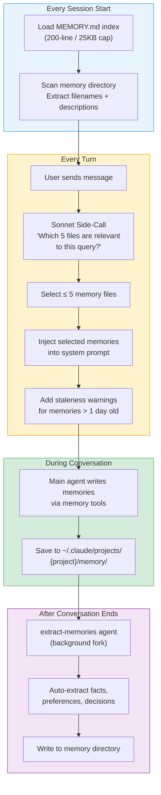
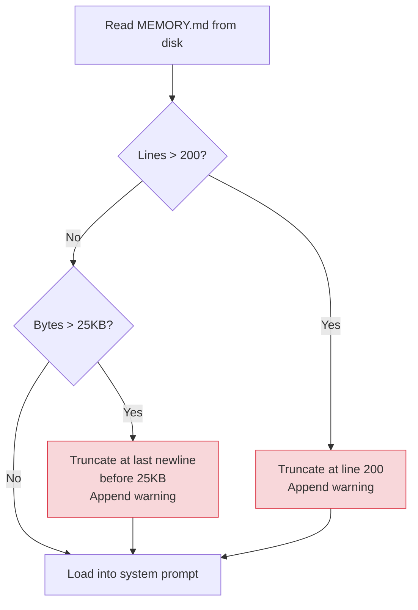
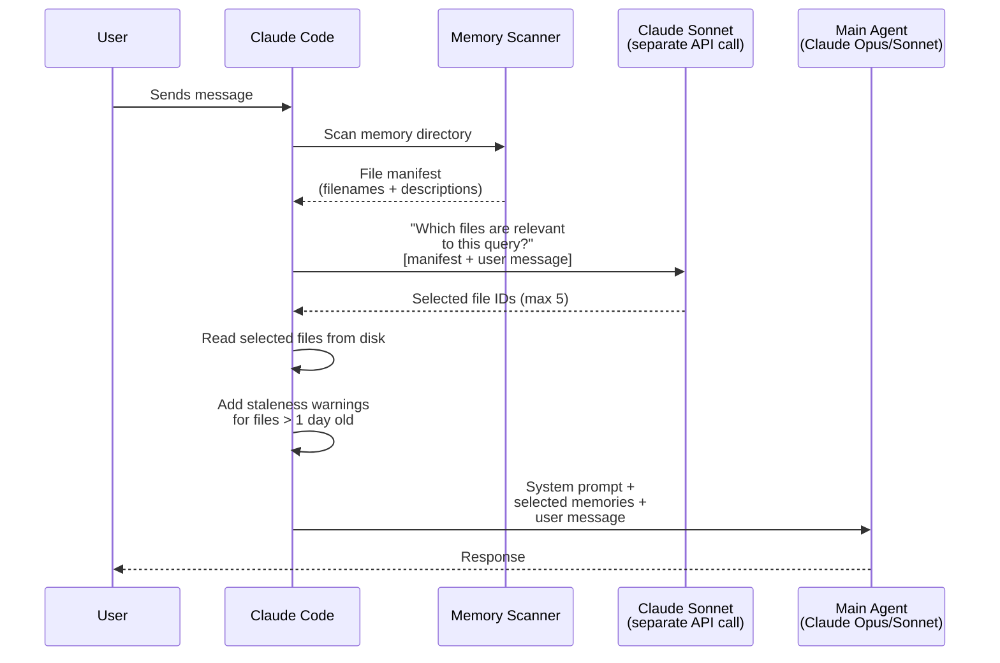
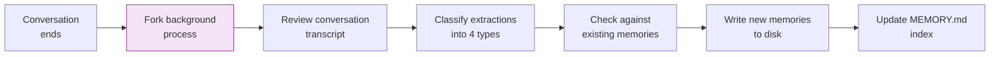
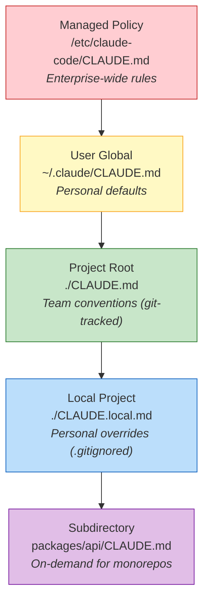
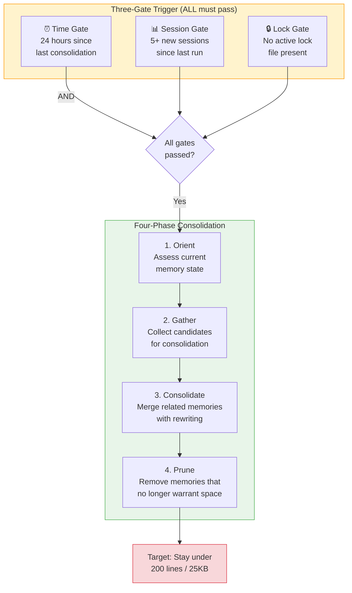
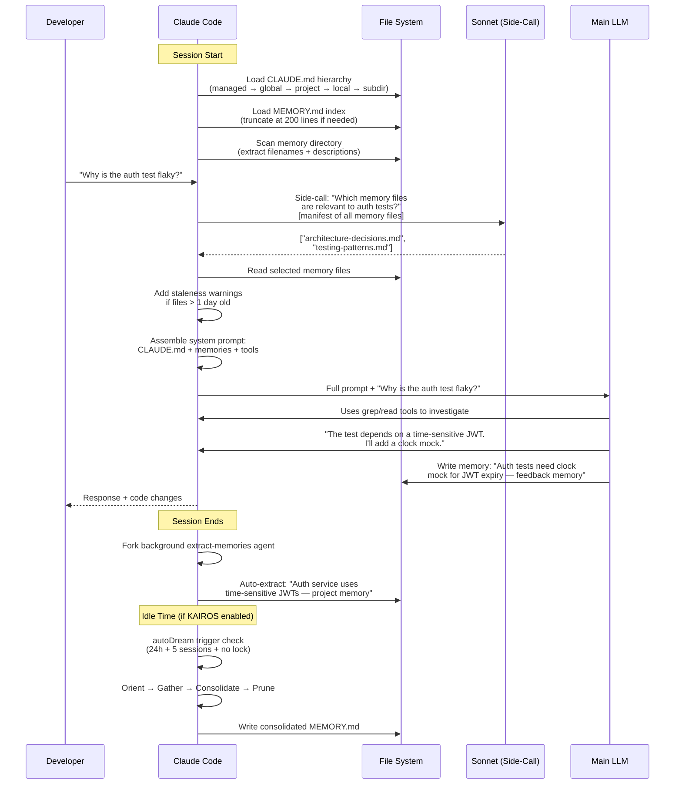

# Claude Code — Deep Dive (From the Leaked Source Code)

> **One-liner:** A file-based memory system with a 200-line index, Sonnet-powered retrieval side-calls, and an unreleased autonomous daemon — all revealed when 512,000 lines of TypeScript leaked via an npm source map.

| Stat | Value |
|------|-------|
| **Runtime** | 100% TypeScript, runs on Bun |
| **Source Size** | ~512,000 lines across ~1,900 files |
| **Leak Date** | March 31, 2026 (npm v2.1.88) |
| **Leak Cause** | Missing `.npmignore` entry + Bun bundler bug serving source maps in production |
| **Memory Source** | `src/memdir/` (7 files) |
| **Index Cap** | 200 lines / 25KB |
| **Retrieval Limit** | 5 files per turn |
| **Retrieval Method** | Sonnet side-call on filenames (no embeddings) |
| **Unreleased Systems** | KAIROS daemon, autoDream consolidation, TEAMMEM |

---

## The Leak: What Happened

On March 31, 2026, a security researcher named Chaofan Shou discovered that Claude Code's npm package (version 2.1.88) included a 59.8 MB source map file. Source maps decode minified production code back to the original readable source. The `.map` file contained the full TypeScript source — every module, every prompt, every feature flag.

The cause: a missing entry in `.npmignore` combined with a known Bun bundler bug where source maps are served in production mode. The code spread to GitHub mirrors within hours, with one fork reaching 75,700+ stars before Anthropic issued (and later partially retracted) DMCA takedowns.

Engineers immediately went for the interesting parts: prompts, billing logic, tool definitions. But the memory system — buried in just seven files under `src/memdir/` — turned out to be the most architecturally revealing component.

---

## Architecture Overview

Claude Code's memory is a **plain markdown file system** with an **LLM-powered retrieval layer** on top. There are no vector databases, no embeddings, no knowledge graphs. Just files on disk and a language model reading filenames.



### The Five Core Modules

The source reveals five modules that compose the full memory system:

| Module | Source File | Function |
|--------|------------|----------|
| **Path Resolution** | `src/memdir/paths.ts` | Computes memory storage directory with security validation |
| **Prompt Construction** | `src/memdir/memdir.ts` | Injects memory instructions and content into system prompt |
| **Memory Scanning** | `src/memdir/memoryScan.ts` | Scans directories, parses frontmatter from memory files |
| **Intelligent Retrieval** | `src/memdir/findRelevantMemories.ts` | Sonnet side-call to select relevant memory files |
| **Auto-Extraction** | `src/services/extractMemories/` | Background agent that extracts memories after sessions |

---

## Memory Directory Structure

Memories are stored as plain markdown files on disk:

```
~/.claude/
├── CLAUDE.md                          # Global instructions (loaded every session)
├── projects/
│   └── {sanitized-git-root}/
│       └── memory/
│           ├── MEMORY.md              # Index file (200-line cap)
│           ├── user-preferences.md    # User memories
│           ├── architecture-decisions.md  # Project memories
│           ├── testing-patterns.md    # Feedback memories
│           └── external-refs.md       # Reference memories
└── settings.json                      # Permissions, hooks, etc.
```

### Path Resolution Priority

The source (`paths.ts`) resolves the memory directory in this order:

1. `CLAUDE_COWORK_MEMORY_PATH_OVERRIDE` environment variable (highest priority)
2. `settings.json` → `autoMemoryDirectory` setting
3. Default: `~/.claude/projects/{sanitized-git-root}/memory/`

### Security Validation

The path resolver rejects:
- Relative paths (`../foo`)
- Root or near-root paths (`/`, `/a`)
- Windows drive roots (`C:\`)
- UNC network paths (`\\server\share`)
- Null bytes

Critically, **project-level** `.claude/settings.json` cannot set `autoMemoryDirectory`. This prevents malicious repositories from gaining write access to sensitive directories outside the project.

---

## The MEMORY.md Index: The 200-Line Cap

The `MEMORY.md` file is the entrypoint — an index that Claude reads at session start to know what memories exist. The source in `memdir.ts` enforces two hard limits:

| Limit | Value | Enforcement |
|-------|-------|-------------|
| **Line cap** | 200 lines | `truncateEntrypointContent()` |
| **Byte cap** | 25,000 bytes | Same function, secondary check |

### How Truncation Works



The truncation warning is appended to the content that Claude sees, but the user is never notified. The failure mode is **silent**: entry 201 falls off the index, Claude doesn't know the memory exists, and there's no error or log visible to the user.

### What This Means in Practice

A developer who has used Claude Code daily for three months may have accumulated hundreds of memories. When entry 201 is added:

1. Oldest memories silently disappear from the index
2. Claude loads a clean system prompt with no trace of those memories
3. Claude may contradict earlier architectural decisions
4. Claude may re-ask questions it already "learned" the answers to
5. No warning is shown to the user

The staleness warnings only fire for memories that *were* loaded. If a memory was truncated out of the index, it never gets loaded, so no warning fires.

---

## The Four Memory Types

The source constrains all memories to exactly four categories:

| Type | Owner | What It Stores | Example |
|------|-------|---------------|---------|
| **User** | Private | Your role, expertise, preferences, communication style | "Senior backend engineer, prefers concise code reviews" |
| **Feedback** | Private | Corrections, validated approaches, things to stop doing | "Don't use `any` type in TypeScript — use `unknown` instead" |
| **Project** | Shared | Codebase context, deadlines, architectural decisions | "Auth service uses JWT with 24h expiry, decided in Jan sprint" |
| **Reference** | Shared | Pointers to external systems | "Bug tracker: Linear. Deploy channel: #releases on Slack" |

### What Should NOT Be a Memory

The code is explicit: **if information is derivable from the current codebase through grep or git, it should NOT be saved as a memory.** Memories are for context that doesn't exist in the code itself — decisions, preferences, external pointers.

---

## Intelligent Retrieval: The Sonnet Side-Call

Every turn, Claude Code makes a **separate API call to Claude Sonnet** to decide which memory files are relevant. This is the most surprising design choice in the system.



### Key Design Decisions

1. **No embeddings.** The retrieval works entirely off filenames and one-line descriptions, not vector similarity. A language model reads a list and makes a judgment call.

2. **Max 5 files per turn.** Even if 20 memory files exist, only 5 can be loaded. This keeps the context window manageable but means relevant memories may be missed.

3. **Sonnet, not the main model.** The retrieval call uses Claude Sonnet (cheaper, faster) regardless of which model the user selected for the main agent. This is a cost optimization.

4. **Per-turn, not per-session.** The side-call happens on every message, not just at session start. This means retrieval adapts as the conversation topic shifts.

### Memory Freshness

The `memoryFreshnessText()` function generates staleness warnings:

> *"This memory is X days old. Memories are point-in-time observations, not live state. Claims about code behavior or file:line citations may be outdated."*

This warning is injected directly into the memory content before Claude sees it, making the model aware that old memories might be stale.

---

## Auto-Memory Extraction

After a conversation ends, a **background extract-memories agent** runs as a forked process. This agent reviews the conversation and automatically extracts memories.



### Feature Flags

The auto-extraction system is gated behind feature flags:
- `EXTRACT_MEMORIES` — primary toggle
- `tengu_passport_quail` — internal codename (obfuscated)

Not all users have this enabled. When disabled, only explicitly-created memories (via the agent's memory tools during conversation) are saved.

### Two Writers Problem

This creates a subtle issue: **two different processes write to the memory directory**. The main agent writes during the session, and the background extractor writes after. There's potential for race conditions or conflicting writes, though the source includes basic file locking.

---

## CLAUDE.md Hierarchy: The Static Context Layer

Separate from the dynamic memory system, Claude Code loads static instructions from `CLAUDE.md` files in a hierarchical cascade:



| Level | Path | Scope | Git-tracked? |
|-------|------|-------|-------------|
| Managed Policy | `/etc/claude-code/CLAUDE.md` | Enterprise-wide | N/A |
| User Global | `~/.claude/CLAUDE.md` | All projects | No |
| Project Root | `./CLAUDE.md` | Team-shared | Yes |
| Local Project | `./CLAUDE.local.md` | Personal | No (`.gitignore`) |
| Subdirectory | `packages/*/CLAUDE.md` | Sub-package | Yes |

More specific rules take precedence, though Claude may blend instructions from multiple levels.

### The Dynamic Boundary

The system prompt is split by a `__SYSTEM_PROMPT_DYNAMIC_BOUNDARY__` marker separating static, cacheable instructions from per-session context. Everything above the boundary (CLAUDE.md content, tool definitions, base instructions) can be cached across requests to reduce API costs via prompt caching. Everything below (memories, conversation context) changes per request.

---

## Unreleased Systems Found in the Source

The leak revealed three major unreleased systems:

### KAIROS: The Always-On Daemon

KAIROS is an autonomous daemon mode that transforms Claude Code from a request-response tool into a **persistent background process**. Key characteristics from the source:

- Runs as a long-lived process that survives individual conversation sessions
- Maintains persistent context across hours or days
- Proactively monitors and acts without user input
- Gated behind internal feature flags, disabled for all external users
- Addresses "context entropy" — the gradual loss of coherence during long interactions

KAIROS represents Anthropic's vision for Claude Code evolving from a chat-based tool to an always-on AI teammate.

### autoDream: Sleep-Time Memory Consolidation

autoDream is KAIROS's subsystem for consolidating memories during idle time, directly inspired by biological sleep-based memory consolidation. The source reveals a sophisticated trigger-and-execute pipeline:



The consolidation prompt (found in `src/services/autoDream/consolidationPrompt.ts`) instructs the agent to:
1. **Orient:** Read the current MEMORY.md and understand what's stored
2. **Gather:** Identify memories that are redundant, outdated, or can be merged
3. **Consolidate:** Rewrite related memories into more compact, higher-signal summaries
4. **Prune:** Delete memories that no longer justify their space within the 200-line budget

This is Anthropic's answer to the "memory cliff" problem — instead of silently truncating, autoDream proactively compresses and curates the memory store during idle time.

### TEAMMEM: Shared Team Memory

A `TEAMMEM` feature flag enables team-scoped memories:

- **Private memories:** User preferences, personal communication style — only visible to you
- **Team memories:** Project conventions, architectural decisions — shared across all team contributors
- When enabled, the memory system partitions writes into private vs. team directories

---

## Self-Healing Memory

The leaked code reveals a "self-healing memory" design pattern: Claude Code treats its own memory as a **hint, not truth**. Before acting on a memory, the agent is instructed to verify information against the current state of the codebase.

This means:
- A memory says "auth uses JWT tokens" → Claude checks the actual auth code before relying on this
- A memory says "tests are in `__tests__/`" → Claude verifies the directory still exists
- The staleness warnings reinforce this: "memories are point-in-time observations, not live state"

This is a deliberate architectural choice to prevent stale memories from causing hallucinations.

---

## How It All Fits Together: A Complete Session

Here's the full flow for a typical Claude Code session, as reconstructed from the source:



---

## Strengths

- **Radically simple.** Plain markdown files. No databases, no embedding pipelines, no infrastructure.
- **Human-readable and editable.** You can open `MEMORY.md` in any editor and see exactly what Claude remembers.
- **Git-trackable.** Memory files can be committed to version control for team sharing.
- **Self-healing pattern.** Treating memories as hints prevents stale-memory hallucinations.
- **CLAUDE.md hierarchy.** Elegant cascading system for enterprise → user → project → local → subdir context.
- **Cost-optimized.** Dynamic boundary enables prompt caching; Sonnet side-calls are cheap.

## Limitations

- **200-line hard cap** with silent truncation — the single most criticized design decision.
- **No embeddings / no vector search.** Retrieval relies on Sonnet reading filenames, not semantic similarity.
- **5-file limit per turn.** Relevant memories may be missed in large memory stores.
- **Two-writer race condition.** Main agent and background extractor both write to the same directory.
- **autoDream and KAIROS are unreleased.** The solutions to the memory cliff problem exist in the code but aren't available to users.
- **No cross-project memory.** Each project has its own isolated memory directory. Learnings from Project A don't transfer to Project B (unless using global `~/.claude/CLAUDE.md`).

## Best For

- **Individual developers** working on projects where 200 lines of memory is sufficient
- **Teams** using CLAUDE.md hierarchy for shared conventions (no memory system needed)
- **Privacy-conscious deployments** — all data stays on local disk
- **Users who supplement** with third-party memory plugins (Mem0, Supermemory, OpenViking) when they hit the ceiling

---

## Comparison with Other Memory Systems

| Aspect | Claude Code (Default) | Mem0 | Hindsight | OpenViking |
|--------|----------------------|------|-----------|------------|
| **Storage** | Markdown files on disk | Vector DB + optional graph | Embedded PostgreSQL | Virtual filesystem |
| **Retrieval** | Sonnet side-call on filenames | Vector similarity search | 4-strategy parallel + reranker | L0/L1/L2 tiered loading |
| **Index cap** | 200 lines / 25KB | None | None | None |
| **Files per turn** | 5 | Unlimited (token-budgeted) | Token-budgeted | Token-budgeted |
| **Embeddings** | No | Yes | Yes | Yes |
| **Temporal reasoning** | Staleness warnings | No | Yes (TEMPR) | No |
| **Auto-extraction** | Yes (background agent) | Yes (extraction phase) | Yes (retain) | Yes (session commit) |
| **Consolidation** | autoDream (unreleased) | LLM-driven update | Observation synthesis | Memory dedup on commit |

---

## Links

| Resource | URL |
|----------|-----|
| Claude Code Docs | [code.claude.com/docs](https://code.claude.com/docs) |
| Memory System Analysis | [mem0.ai/blog/how-memory-works-in-claude-code](https://mem0.ai/blog/how-memory-works-in-claude-code) |
| Source Leak Analysis (MindStudio) | [mindstudio.ai/blog/claude-code-source-leak-memory-architecture](https://www.mindstudio.ai/blog/claude-code-source-leak-memory-architecture) |
| Architecture Analysis (Victor Antos) | [victorantos.com/posts/i-pointed-claude-at-its-own-leaked-source](https://victorantos.com/posts/i-pointed-claude-at-its-own-leaked-source-heres-what-it-found/) |
| Leaked memdir.ts | [github (mirrors)](https://github.com/liuup/claude-code-analysis/blob/main/src/memdir/memdir.ts) |
| autoDream consolidation prompt | [github (mirrors)](https://github.com/zackautocracy/claude-code/blob/main/src/services/autoDream/consolidationPrompt.ts) |
