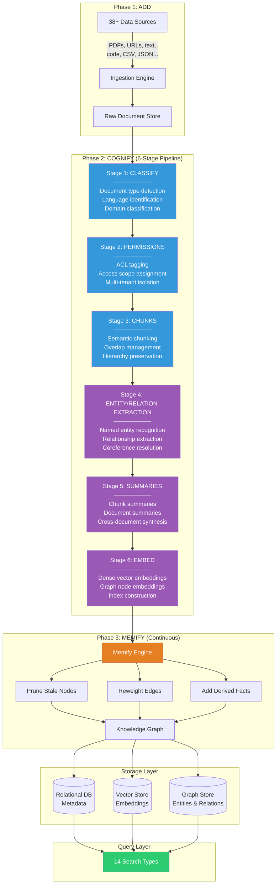
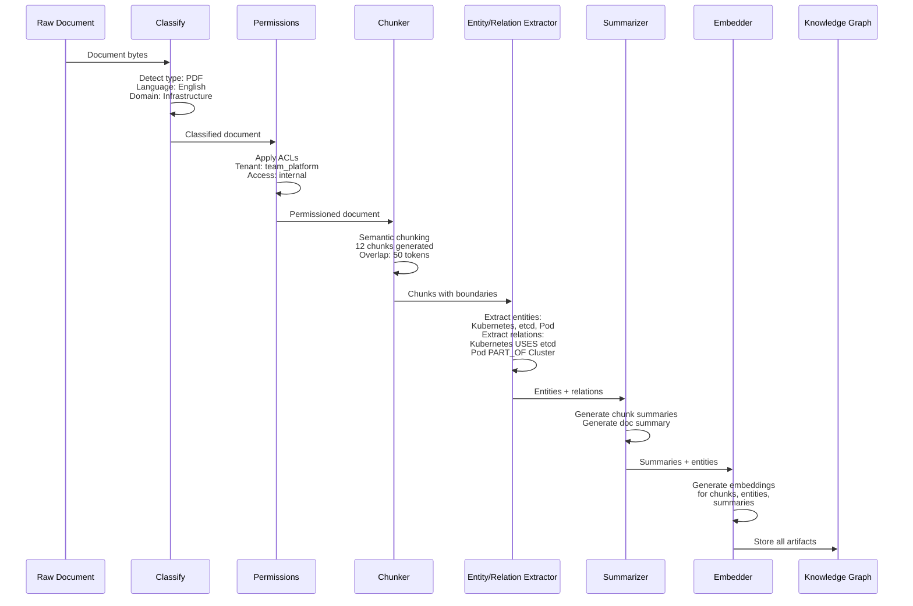
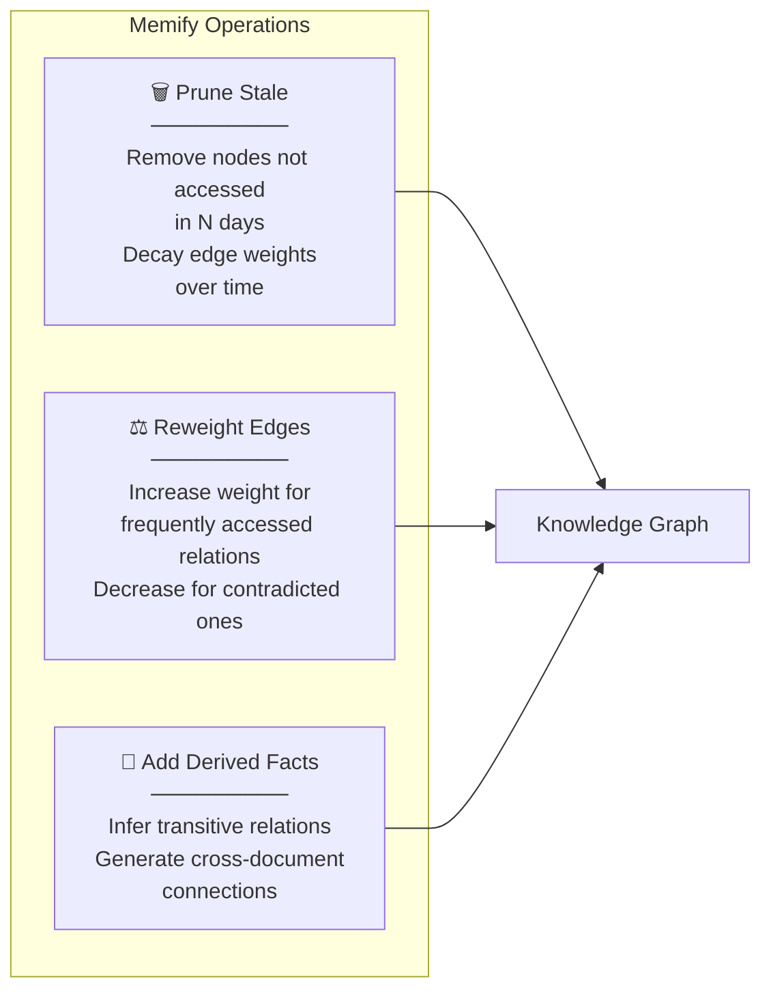
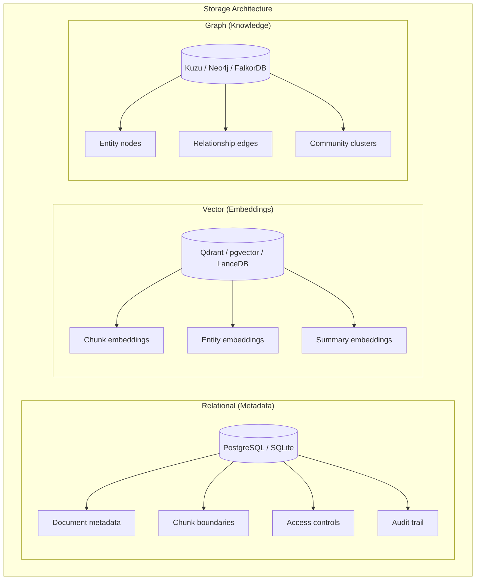
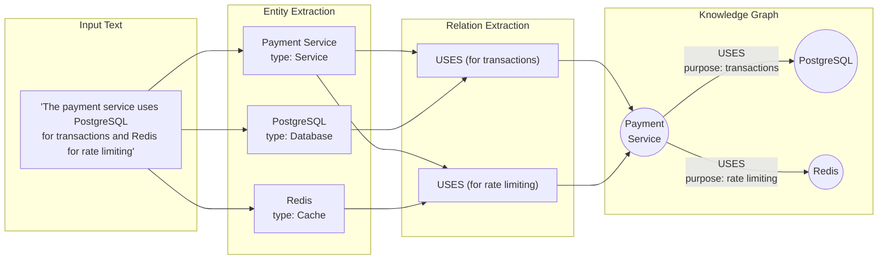

# Cognee — Deep Dive

**Website:** [cognee.ai](https://cognee.ai) | **GitHub:** [topoteretes/cognee](https://github.com/topoteretes/cognee) (12K+ stars) | **License:** Apache 2.0 | **Funding:** $7.5M seed

> Knowledge graph + vector hybrid engine that transforms raw data into structured, queryable knowledge through a rigorous six-stage pipeline — with ontology support, 14 search types, and pluggable storage backends.

---

## Architecture Overview

Cognee's architecture is built around the **ECL pipeline** (add → cognify → memify) — a three-phase process that ingests raw data, constructs a knowledge graph with vector embeddings, and continuously prunes and enriches the graph over time.



---

## The ECL Pipeline in Detail

### Phase 1: Add (Ingestion)

The `add` phase accepts data from **38+ source types** and normalizes them into a common document format.

```python
import cognee
import asyncio

async def ingest_data():
    # Add text content
    await cognee.add(
        "Kubernetes uses etcd for cluster state storage. "
        "Pods are the smallest deployable units.",
        dataset_name="infrastructure_docs"
    )
    
    # Add a file
    await cognee.add(
        "path/to/architecture-doc.pdf",
        dataset_name="infrastructure_docs"
    )
    
    # Add from URL
    await cognee.add(
        "https://docs.example.com/api-reference",
        dataset_name="api_docs"
    )
    
    # Add structured data
    await cognee.add(
        "path/to/tickets.csv",
        dataset_name="support_tickets"
    )

asyncio.run(ingest_data())
```

| Supported Source Types | Examples |
|----------------------|----------|
| **Documents** | PDF, DOCX, PPTX, TXT, Markdown |
| **Structured data** | CSV, JSON, JSONL, Parquet |
| **Code** | Python, JavaScript, TypeScript, Go, Rust, Java |
| **Web** | URLs, HTML, sitemaps |
| **Media** | Images (with OCR), audio transcripts |
| **Databases** | SQL query results, database dumps |

### Phase 2: Cognify (Six-Stage Processing)

The `cognify` phase is the core intelligence layer — it transforms raw documents into a structured knowledge graph.



#### Stage Details

| Stage | Purpose | Key Operations |
|-------|---------|---------------|
| **1. Classify** | Understand what we're processing | Document type detection, language ID, domain classification |
| **2. Permissions** | Who can access this knowledge | ACL tagging, tenant assignment, access scope |
| **3. Chunks** | Break into manageable pieces | Semantic chunking with overlap, hierarchy preservation |
| **4. Entity/Relation** | Extract structured knowledge | NER, relationship extraction, coreference resolution |
| **5. Summaries** | Create compressed representations | Chunk-level summaries, document summaries, cross-doc synthesis |
| **6. Embed** | Enable retrieval | Dense vectors for chunks, nodes, and summaries |

### Phase 3: Memify (Continuous Enrichment)

The `memify` phase runs continuously to keep the knowledge graph fresh and relevant:



---

## 14 Search Types

Cognee exposes **14 specialized search types**, each optimized for a different query pattern:

```python
from cognee import SearchType

# Available search types
results = await cognee.search("query", query_type=SearchType.GRAPH_COMPLETION)
```

| # | Search Type | Description | Best For |
|---|-------------|-------------|----------|
| 1 | `SUMMARIES` | Search over document and chunk summaries | High-level understanding |
| 2 | `GRAPH_COMPLETION` | Graph traversal + LLM completion | Complex questions requiring reasoning |
| 3 | `CHUNKS` | Direct chunk retrieval (vector similarity) | Traditional RAG |
| 4 | `TEMPORAL` | Time-aware search over events and changes | "What changed since last month?" |
| 5 | `CODE` | AST-aware code search | Finding functions, classes, patterns |
| 6 | `ENTITIES` | Search over extracted entities | "Find all mentions of Kubernetes" |
| 7 | `RELATIONS` | Search over entity relationships | "What does X depend on?" |
| 8 | `INSIGHTS` | Cross-document derived insights | Pattern discovery |
| 9 | `NATURAL_LANGUAGE` | Full natural language Q&A | End-user facing queries |
| 10 | `HYBRID` | Combined vector + keyword search | General-purpose retrieval |
| 11 | `GRAPH_TRAVERSAL` | Pure graph traversal (no LLM) | Structural queries |
| 12 | `COMMUNITY` | Search within detected communities | Topical clustering |
| 13 | `RAW` | Direct access to stored documents | Audit, compliance |
| 14 | `METADATA` | Search by metadata fields | Filtering by source, date, type |

---

## Three Storage Layers

Cognee uses **three pluggable storage backends**, each serving a different purpose:



| Layer | Purpose | Default | Alternatives |
|-------|---------|---------|-------------|
| **Relational** | Document metadata, access control, audit | SQLite | PostgreSQL |
| **Vector** | Dense embeddings for similarity search | Qdrant | pgvector, LanceDB |
| **Graph** | Entity-relation knowledge graph | Kuzu | Neo4j, FalkorDB |

This pluggable architecture means Cognee works with whatever infrastructure you already have.

---

## Ontology Support

Cognee supports **custom ontologies** that define domain-specific entity types and relationship schemas. This dramatically improves extraction quality for specialized domains.

```python
import cognee

# Define a custom ontology for a healthcare domain
ontology = {
    "entity_types": [
        {"name": "Patient", "attributes": ["age", "condition", "risk_level"]},
        {"name": "Medication", "attributes": ["name", "dosage", "frequency"]},
        {"name": "Condition", "attributes": ["name", "severity", "icd_code"]},
        {"name": "Procedure", "attributes": ["name", "cpt_code", "duration"]},
    ],
    "relationship_types": [
        {"name": "DIAGNOSED_WITH", "from": "Patient", "to": "Condition"},
        {"name": "PRESCRIBED", "from": "Patient", "to": "Medication"},
        {"name": "TREATS", "from": "Medication", "to": "Condition"},
        {"name": "CONTRAINDICATED_WITH", "from": "Medication", "to": "Medication"},
        {"name": "UNDERWENT", "from": "Patient", "to": "Procedure"},
    ]
}

# Apply ontology before cognifying
await cognee.set_ontology(ontology)
await cognee.add("patient_records/*.pdf", dataset_name="patient_data")
await cognee.cognify(dataset_names=["patient_data"])

# Now entity extraction follows the defined schema
results = await cognee.search(
    "Which medications are contraindicated for patients with condition X?",
    query_type=SearchType.GRAPH_COMPLETION
)
```

Without ontology: The extractor might miss domain-specific relationships or miscategorize entities.
With ontology: Extraction is guided by the schema, producing a much more accurate and useful knowledge graph.

---

## Code Examples

### Basic Pipeline: Add → Cognify → Search

```python
import cognee
import asyncio
from cognee import SearchType

async def main():
    # Reset (for clean demo)
    await cognee.prune.prune_data()
    await cognee.prune.prune_system(metadata=True)
    
    # Phase 1: Add documents
    await cognee.add(
        "Kubernetes orchestrates containerized applications across clusters. "
        "It uses etcd for state storage, kubelet for node management, "
        "and kube-proxy for networking. Pods are the smallest deployable units. "
        "Services provide stable endpoints for pod groups.",
        dataset_name="k8s_docs"
    )
    
    await cognee.add(
        "Docker containers package applications with their dependencies. "
        "Images are built from Dockerfiles using layers. "
        "Docker Compose manages multi-container applications.",
        dataset_name="docker_docs"
    )
    
    # Phase 2: Cognify — builds the knowledge graph
    await cognee.cognify(dataset_names=["k8s_docs", "docker_docs"])
    
    # Phase 3: Search with different query types
    
    # Graph completion: complex reasoning
    results = await cognee.search(
        "How do Kubernetes and Docker relate to each other?",
        query_type=SearchType.GRAPH_COMPLETION
    )
    print("=== Graph Completion ===")
    for r in results:
        print(f"  {r}")
    
    # Entity search: find specific entities
    results = await cognee.search(
        "etcd",
        query_type=SearchType.ENTITIES
    )
    print("\n=== Entities ===")
    for r in results:
        print(f"  {r}")
    
    # Summary search: high-level understanding
    results = await cognee.search(
        "container orchestration overview",
        query_type=SearchType.SUMMARIES
    )
    print("\n=== Summaries ===")
    for r in results:
        print(f"  {r}")

asyncio.run(main())
```

### Multi-Dataset Knowledge Graph

```python
import cognee
import asyncio

async def build_engineering_knowledge():
    # Ingest from multiple sources into separate datasets
    await cognee.add("docs/architecture/*.md", dataset_name="architecture")
    await cognee.add("docs/runbooks/*.md", dataset_name="runbooks")
    await cognee.add("postmortems/*.md", dataset_name="incidents")
    await cognee.add("rfcs/*.md", dataset_name="rfcs")
    
    # Cognify all datasets — Cognee builds cross-dataset connections
    await cognee.cognify(
        dataset_names=["architecture", "runbooks", "incidents", "rfcs"]
    )
    
    # Now you can query across all knowledge
    results = await cognee.search(
        "What are the recurring causes of database outages "
        "and which runbooks address them?",
        query_type=SearchType.GRAPH_COMPLETION
    )
    
    # Temporal search: track changes over time
    results = await cognee.search(
        "How has our database architecture evolved?",
        query_type=SearchType.TEMPORAL
    )
    
    return results

asyncio.run(build_engineering_knowledge())
```

### Continuous Memification

```python
import cognee
import asyncio

async def maintain_knowledge():
    # After adding new data, run cognify to update the graph
    await cognee.add("new_incident_report.md", dataset_name="incidents")
    await cognee.cognify(dataset_names=["incidents"])
    
    # Run memify to prune stale data and derive new facts
    await cognee.memify(
        dataset_names=["architecture", "runbooks", "incidents"],
        prune_stale_days=90,       # Remove nodes not accessed in 90 days
        derive_cross_links=True,    # Find connections between datasets
        reweight_by_access=True     # Boost frequently-accessed knowledge
    )

asyncio.run(maintain_knowledge())
```

---

## Step-by-Step Walkthrough: Building an Engineering Knowledge Base

### Scenario

You're building a system that ingests your team's architecture docs, runbooks, RFCs, and incident reports, then lets engineers ask natural language questions across all knowledge.

### Step 1: Ingest Sources

```python
import cognee, asyncio

async def setup():
    # Architecture documentation
    await cognee.add(
        "Our payment service uses PostgreSQL for transactions, Redis for "
        "rate limiting, and communicates with the billing service via gRPC. "
        "The payment service is deployed on Kubernetes with 3 replicas.",
        dataset_name="architecture"
    )
    
    # Incident report
    await cognee.add(
        "Incident #1042 (2026-02-15): Payment service experienced 5 minutes "
        "of downtime due to PostgreSQL connection pool exhaustion. Root cause: "
        "connection leak in the retry logic. Fix: added connection timeout and "
        "pool monitoring. Action item: add PgBouncer.",
        dataset_name="incidents"
    )
    
    # Runbook
    await cognee.add(
        "Runbook: Payment Service Recovery. Step 1: Check PostgreSQL connection "
        "count via pg_stat_activity. Step 2: If connections > 80% of max, "
        "restart the payment-service pods. Step 3: Check Redis connectivity. "
        "Step 4: Verify gRPC health checks to billing service.",
        dataset_name="runbooks"
    )

asyncio.run(setup())
```

### Step 2: Build the Knowledge Graph

```python
async def build():
    await cognee.cognify(
        dataset_names=["architecture", "incidents", "runbooks"]
    )
    # Cognee now has a graph with entities like:
    # - Payment Service (Service)
    # - PostgreSQL (Database) 
    # - Redis (Cache)
    # - Billing Service (Service)
    # - Incident #1042 (Event)
    # And relationships like:
    # - Payment Service USES PostgreSQL
    # - Payment Service USES Redis
    # - Payment Service COMMUNICATES_WITH Billing Service
    # - Incident #1042 AFFECTED Payment Service
    # - Incident #1042 CAUSED_BY PostgreSQL connection leak

asyncio.run(build())
```

### Step 3: Query Across All Knowledge

```python
async def query():
    # Cross-dataset reasoning
    answer = await cognee.search(
        "If PostgreSQL goes down, which services are affected "
        "and what runbook should I follow?",
        query_type=SearchType.GRAPH_COMPLETION
    )
    # Cognee traverses: PostgreSQL → USED_BY → Payment Service
    #                   Payment Service → HAS_RUNBOOK → Payment Service Recovery
    # And returns a synthesized answer with citations
    
    # Temporal query
    incidents = await cognee.search(
        "What database incidents have occurred this year?",
        query_type=SearchType.TEMPORAL
    )
    
    # Relationship query
    deps = await cognee.search(
        "payment service dependencies",
        query_type=SearchType.RELATIONS
    )

asyncio.run(query())
```

---

## Knowledge Graph Construction

Here's how Cognee transforms raw text into a structured knowledge graph:



---

## Strengths

- **Rigorous pipeline**: The six-stage cognify process produces high-quality, well-structured knowledge graphs
- **14 search types**: Comprehensive query capabilities cover everything from simple retrieval to complex graph reasoning
- **Pluggable storage**: Choose your own vector, graph, and relational backends — no vendor lock-in
- **Ontology support**: Domain-specific schemas dramatically improve extraction quality for specialized use cases
- **Open-source**: Apache 2.0 license with 12K+ GitHub stars and active community
- **Continuous memification**: Automatic staleness pruning and edge reweighting keep the graph relevant

## Limitations

- **Pipeline complexity**: Six-stage cognify is powerful but adds latency and operational complexity
- **Async-only API**: All core operations are async, which can complicate integration with synchronous codebases
- **LLM cost for cognify**: Entity extraction and summarization stages consume significant LLM tokens
- **Graph quality varies**: Extraction quality depends heavily on source document structure and chosen LLM
- **Learning curve**: 14 search types and 3 storage layers require significant investment to use effectively
- **Batch-oriented**: Better suited for document-level ingestion than real-time conversation memory

## Best For

- **Institutional knowledge bases** where documents, wikis, and runbooks need to be interconnected
- **Regulated industries** requiring ontology-driven extraction (healthcare, finance, legal)
- **Engineering teams** wanting to query across architecture docs, incidents, and runbooks
- **Multi-source RAG** applications that need more structure than simple vector search
- **Teams with existing infrastructure** (Postgres, Neo4j, Qdrant) who want a compatible memory layer

---

## Further Reading

- [Cognee Documentation](https://docs.cognee.ai)
- [GitHub Repository](https://github.com/topoteretes/cognee)
- [ECL Pipeline Technical Guide](https://docs.cognee.ai/concepts/ecl)
- [Ontology Configuration Guide](https://docs.cognee.ai/guides/ontology)
- Related: [Knowledge Graphs for LLMs Survey](https://arxiv.org/abs/2306.08302)
