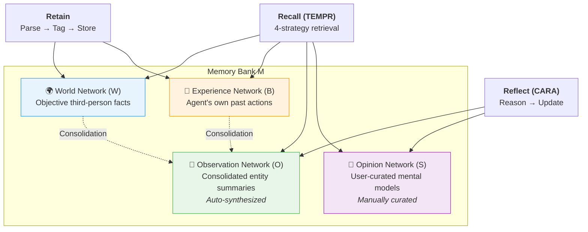
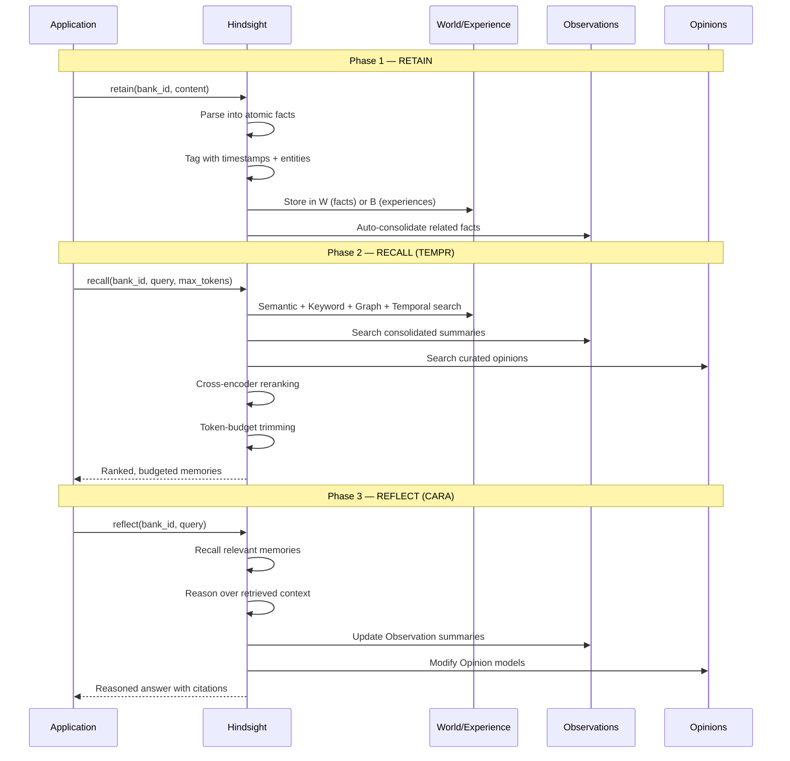
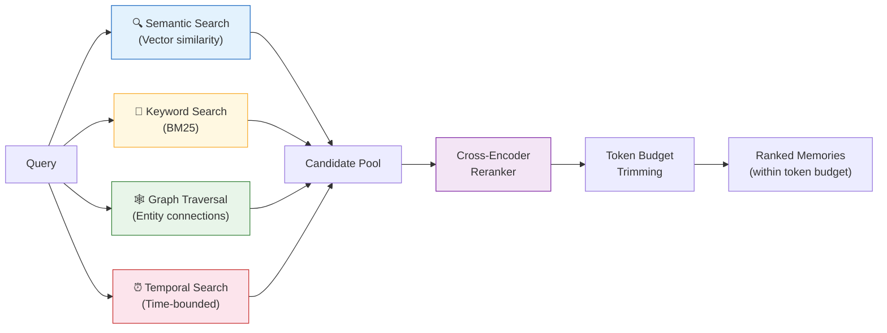

# Hindsight — Deep Dive

**Epistemically-structured agent memory with four distinct knowledge networks**

| | |
|---|---|
| **Website** | [hindsight.vectorize.io](https://hindsight.vectorize.io) |
| **GitHub** | 9K+ stars |
| **License** | MIT |
| **Paper** | [arXiv:2512.12818](https://arxiv.org/abs/2512.12818) (Dec 2025) |
| **By** | Vectorize |
| **SDK** | Python, TypeScript, Go, REST, CLI |

---

## Core Idea

Most memory systems treat all knowledge the same: facts go in, facts come out. Hindsight rejects this. It separates memory into four epistemically distinct networks — objective facts, the agent's own experiences, consolidated observations, and curated opinions — then operates on them with three verbs: **Retain**, **Recall**, and **Reflect**.

The result is a system where a coding assistant can distinguish between "the user works at Google" (world fact), "I recommended Python to the user last week" (experience), "the user is shifting from React to Vue" (observation synthesized from multiple facts), and "for this user, always suggest TypeScript-first approaches" (curated opinion).

---

## Architecture

### The Four Memory Networks

Every Hindsight **Memory Bank** is composed of four networks, each holding a different epistemic category of knowledge:

| Network | Symbol | Epistemic Role | Example |
|---------|--------|---------------|---------|
| **World** | W | Objective third-person facts | "Alice works at Google" |
| **Experience** | B | Agent's own past actions and observations | "I recommended Python to Bob on March 3rd" |
| **Observation** | O | Consolidated entity summaries, auto-synthesized | "User was a React enthusiast but has now switched to Vue" |
| **Opinion** | S | User-curated summaries for common queries | "For frontend questions, always suggest TypeScript first" |

World and Experience memories are **written** during the Retain phase. Observation memories are **automatically synthesized** by the system after Retain. Opinion memories are **curated by the user or agent** during Reflect.



### The Three Core Operations



---

## TEMPR: Temporal Entity Memory Priming Retrieval

TEMPR is Hindsight's recall engine. Instead of relying on a single retrieval strategy, it runs four strategies in parallel and merges the results through a cross-encoder reranker.



### Why Four Strategies?

Each strategy catches what the others miss:

| Strategy | Catches | Misses |
|----------|---------|--------|
| **Semantic** | Conceptually related facts even with different wording | Exact names, dates, numbers |
| **Keyword (BM25)** | Exact entity names, technical terms | Paraphrased or conceptually related content |
| **Graph Traversal** | Multi-hop relationships (Alice → Google → Cloud team) | Facts not connected to the query entity |
| **Temporal** | Recent or time-bounded facts ("last week", "in Q1") | Timeless facts with no temporal anchor |

The cross-encoder reranker then scores every candidate against the original query, and the token budget ensures the final context fits within the model's capacity.

---

## CARA: Contextual Adaptive Reasoning Agent

CARA is Hindsight's reflect engine. When called, it:

1. Recalls relevant memories using TEMPR
2. Reasons over the retrieved context
3. Optionally updates Observation summaries with new synthesis
4. Optionally modifies Opinion models based on new evidence
5. Returns a traceable answer with citations back to specific memories

CARA operates as an agentic loop — it can autonomously perform additional searches if its initial retrieval is insufficient to answer the query. This makes Reflect a potentially multi-step operation rather than a single-shot inference.

---

## Observation Consolidation

One of Hindsight's most distinctive features is automatic Observation consolidation. After every Retain operation, the system examines whether newly stored facts, combined with existing ones, warrant an updated Observation summary.

### Concrete Example: React to Vue Migration

Imagine a coding assistant powered by Hindsight. Over several weeks, the following conversations are retained:

**Week 1 — Retained as World facts (W):**
```
"User has 3 years of React experience."
"User's current project uses React 18 with Next.js."
```

**Week 2 — Retained as World facts (W) and Experience (B):**
```
W: "User mentioned frustration with React's bundle size."
W: "User started a side project in Vue 3."
B: "I helped the user set up a Vue 3 + Vite project."
```

**Week 3 — Retained as World facts (W) and Experience (B):**
```
W: "User is migrating their main project from React to Vue."
W: "User praised Vue's Composition API as 'more intuitive'."
B: "I provided a React-to-Vue component migration guide."
```

**After Week 3 — Automatic Observation Consolidation (O):**

The system synthesizes all related facts about this entity (the user's frontend framework preference) into a consolidated Observation:

> "User was a React enthusiast with 3 years of experience but has been progressively shifting to Vue 3, citing frustration with React's bundle size and preference for Vue's Composition API. The migration is now active on their main project."

This Observation is stored in the O network and is now available during Recall. When the agent later receives a question like "What framework should I recommend for the user's new project?", TEMPR retrieves this consolidated Observation alongside the raw facts, giving the agent both the synthesized trajectory and the granular evidence.

If the user later returns to React, new facts will trigger a re-consolidation:

> "User experimented extensively with Vue 3 but ultimately returned to React after encountering ecosystem compatibility issues. Currently using React 19 with RSC."

---

## Memory Bank Configuration

Each Memory Bank in Hindsight can be configured with three behavioral dimensions:

### Mission

A natural-language statement of identity that shapes how the agent retains and reflects:

```python
mission = "I am a research assistant specializing in ML papers and experimental design."
```

The mission influences which facts the system considers relevant during recall and how it frames reflections.

### Directives

Hard behavioral constraints that the agent must follow:

```python
directives = [
    "Never share user data between banks",
    "Always cite source conversations when reflecting",
    "Treat contradictory facts as a signal to update Observations"
]
```

### Disposition

Soft personality traits scored on a 1–5 scale:

| Trait | Low (1) | High (5) |
|-------|---------|----------|
| **Empathy** | Neutral, data-focused responses | Emotionally aware, supportive tone |
| **Skepticism** | Accepts claims at face value | Questions assumptions, flags contradictions |
| **Literalism** | Interprets loosely, infers intent | Interprets exactly as stated |

```python
disposition = {
    "empathy": 4,
    "skepticism": 2,
    "literalism": 3
}
```

A research assistant might set high skepticism and literalism. A personal companion might set high empathy and low literalism.

---

## Code Examples

### Setup and Basic Usage

```python
from hindsight import Hindsight

client = Hindsight()

# Create a memory bank with full configuration
bank = client.create_bank(
    name="coding-assistant",
    mission="I am a coding assistant that remembers developer preferences and project context.",
    directives=["Never share user data between banks"],
    disposition={"empathy": 4, "skepticism": 2, "literalism": 3}
)
```

### Retain: Storing Conversations as Memory

```python
# World facts are extracted automatically from conversation content
client.retain(
    bank_id=bank.id,
    content="The user prefers Python for data science but is switching to Rust for systems work."
)

# Agent experiences are also retained
client.retain(
    bank_id=bank.id,
    content="User asked about async patterns in Python. I recommended asyncio with structured concurrency."
)
```

After these calls, Hindsight:
1. Parses the content into atomic facts
2. Tags each fact with timestamps and extracted entities (e.g., "Python", "Rust", "asyncio")
3. Stores facts in the World (W) or Experience (B) network
4. Triggers Observation consolidation for affected entities

### Recall: Searching Across All Networks

```python
# TEMPR runs 4 parallel strategies and reranks results
memories = client.recall(
    bank_id=bank.id,
    query="What programming languages does the user prefer?",
    max_tokens=2000  # Token budget for the returned context
)

for mem in memories:
    print(f"[{mem.type}] {mem.content}")
    # [world] The user prefers Python for data science.
    # [world] The user is switching to Rust for systems work.
    # [observation] User is a Python-first developer exploring Rust for performance-critical work.
    # [experience] I recommended asyncio with structured concurrency for their Python async questions.
```

### Reflect: Reasoning Over Memories

```python
# CARA retrieves relevant memories, reasons over them, and may update Observations
answer = client.reflect(
    bank_id=bank.id,
    query="What project would be a good fit for this user?"
)

print(answer.content)
# "Based on the user's Python data science background and growing interest in Rust
#  for systems work, a data pipeline project using Python for orchestration and Rust
#  for performance-critical data transformations would align well with their skill
#  trajectory. They're also comfortable with async patterns (asyncio), suggesting
#  they could handle concurrent pipeline stages."
```

### Self-Hosted Deployment

```bash
docker run --rm -it --pull always -p 8888:8888 -p 9999:9999 \
  -e HINDSIGHT_API_LLM_API_KEY=$OPENAI_API_KEY \
  ghcr.io/vectorize-io/hindsight-api:latest
```

Port 8888 serves the API. Port 9999 serves the dashboard UI.

---

## Walkthrough: Handling Preference Evolution Over Time

This walkthrough traces how Hindsight handles a user's gradual shift from React to Vue across multiple conversations, demonstrating Retain, Observation Consolidation, Recall, and Reflect working together.

### Conversation 1 (January 15)

> **User:** I'm building a dashboard with React and Next.js. Can you help with data fetching?

```python
client.retain(bank_id=bank.id, content="""
User is building a dashboard with React and Next.js.
User asked for help with data fetching patterns.
I showed them React Server Components for data fetching.
""")
```

**Memory state after Retain:**

| Network | Content |
|---------|---------|
| W | "User is building a dashboard with React and Next.js" (Jan 15) |
| B | "I showed them React Server Components for data fetching" (Jan 15) |
| O | "User is a React/Next.js developer working on a dashboard project" |

### Conversation 2 (February 8)

> **User:** I tried Vue 3 over the weekend. The Composition API is so much cleaner than hooks.

```python
client.retain(bank_id=bank.id, content="""
User tried Vue 3 over the weekend.
User finds the Composition API cleaner than React hooks.
""")
```

**Memory state after Retain:**

| Network | Content |
|---------|---------|
| W | Previous facts + "User tried Vue 3" + "User finds Composition API cleaner than hooks" (Feb 8) |
| O | **Updated:** "User is a React/Next.js developer who has started exploring Vue 3, finding its Composition API preferable to React hooks" |

Note how the Observation was automatically re-synthesized to incorporate the new signal.

### Conversation 3 (March 1)

> **User:** I'm migrating my dashboard from React to Vue. Can you help with the component conversion?

```python
client.retain(bank_id=bank.id, content="""
User is migrating their dashboard from React to Vue.
User asked for help with component conversion.
I provided a migration guide covering component patterns, state management, and routing.
""")
```

**Memory state after Retain:**

| Network | Content |
|---------|---------|
| W | All previous + "User is migrating dashboard from React to Vue" (Mar 1) |
| B | Previous + "I provided a React-to-Vue migration guide" (Mar 1) |
| O | **Updated:** "User was a React/Next.js developer but is actively migrating to Vue 3, citing preference for the Composition API over hooks. Dashboard project migration is underway." |

### Later Recall Query

```python
memories = client.recall(
    bank_id=bank.id,
    query="What frontend framework does the user prefer?"
)
```

TEMPR returns results from all four strategies:
- **Semantic search** finds the Vue/React comparison facts
- **Keyword search** finds mentions of "React", "Vue", "framework"
- **Graph traversal** follows the User → React → Vue entity chain
- **Temporal search** prioritizes the most recent (March) facts

After cross-encoder reranking, the top results include the consolidated Observation alongside the key facts, giving any downstream LLM a clear picture of the user's evolving preference.

### Reflect on the Evolution

```python
answer = client.reflect(
    bank_id=bank.id,
    query="How have the user's frontend preferences changed over time?"
)
```

CARA traces the temporal progression and produces a cited answer:

> "The user started as a React/Next.js developer building a dashboard (January). After exploring Vue 3 and finding the Composition API cleaner than React hooks (February), they committed to migrating their main project from React to Vue (March). The migration is currently in progress."

---

## Benchmarks

### LongMemEval

| System | Model | Score |
|--------|-------|-------|
| **Hindsight** | OSS-20B | **91.4%** |
| **Hindsight** | OSS-120B | **89.0%** |
| Supermemory | GPT-4o | 85.2% |
| Full-context | GPT-4o | < 91.4% |

### LoCoMo

| System | Model | Score |
|--------|-------|-------|
| **Hindsight** | Gemini-3 | **89.61%** |
| **Hindsight** | OSS-120B | **85.67%** |
| **Hindsight** | OSS-20B | **83.18%** |
| Mem0 | GPT-4o | 66.9% |

### Key Takeaway

Hindsight with an open-source 20B-parameter model outperforms full-context GPT-4o on LongMemEval. This is significant: a retrieval-based system with a smaller model beats a frontier model with the entire conversation in context, while using dramatically fewer tokens.

---

## Strengths

- **Epistemic separation** — Facts, experiences, observations, and opinions live in distinct networks, enabling precise reasoning about what the agent knows vs. what it believes vs. what it has done.
- **State-of-the-art accuracy** — Top scores on LongMemEval (91.4%) and LoCoMo (89.61%) benchmarks.
- **Beats frontier models with open-source** — OSS-20B outperforms full-context GPT-4o, proving that structured memory can compensate for model scale.
- **Automatic Observation consolidation** — The system synthesizes related facts into evolving summaries without explicit instructions, tracking preference drift and knowledge evolution.
- **Self-hostable** — Single Docker command for full deployment, no external dependencies beyond an LLM API key.
- **Multi-strategy retrieval (TEMPR)** — Four parallel search strategies ensure no relevant memory is missed, regardless of how the query is phrased.
- **Traceable reasoning (CARA)** — Reflect answers come with citations back to specific memories, supporting auditability.
- **Configurable personality** — Mission, directives, and disposition give fine-grained control over agent behavior without prompt engineering.

## Limitations

- **Higher complexity** — Four memory networks and three operations mean more conceptual overhead than simpler add/search systems.
- **Reflection latency** — CARA's agentic reasoning loop can involve multiple retrieval rounds, adding latency compared to single-pass recall.
- **LLM cost** — Retain (parsing into atomic facts), Observation consolidation, and Reflect all require LLM calls, increasing per-operation cost.
- **Configuration investment** — Getting the best results requires thoughtful bank configuration (mission, directives, disposition). Defaults work, but tuned configurations perform significantly better.
- **Smaller community** — At 9K stars, the community is an order of magnitude smaller than Mem0 (38K) or Letta (40K), meaning fewer community resources and integrations.
- **Observation accuracy** — Auto-synthesized Observations depend on the quality of the underlying LLM. Poor models may produce inaccurate consolidations.

## Best For

- **Long-horizon agents** that operate across many sessions and must track evolving user context (preferences, projects, relationships).
- **Traceable systems** where the agent must explain *why* it believes something, citing specific past interactions (enterprise, healthcare, legal).
- **Temporal reasoning** — applications that need to answer "what changed?" or "when did the user start doing X?" questions.
- **Open-source deployments** — teams that want MIT-licensed, self-hostable memory with no vendor lock-in.
- **Multi-persona agents** — the Memory Bank abstraction lets a single Hindsight instance serve multiple agent personalities with isolated memory and configuration.

---

## Links

| Resource | URL |
|----------|-----|
| Website | [hindsight.vectorize.io](https://hindsight.vectorize.io) |
| GitHub | [github.com/vectorize-io/hindsight](https://github.com/vectorize-io/hindsight) |
| Paper | [arXiv:2512.12818](https://arxiv.org/abs/2512.12818) |
| Documentation | [docs.hindsight.vectorize.io](https://docs.hindsight.vectorize.io) |
| Docker Image | `ghcr.io/vectorize-io/hindsight-api:latest` |
| Python SDK | `pip install hindsight` |

---

*← Back to [Chapter 3: Provider Deep Dives](../03_providers.md)*
