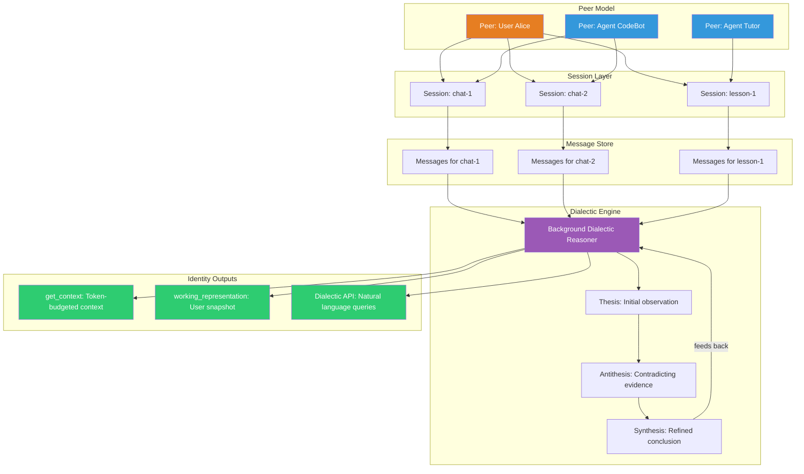
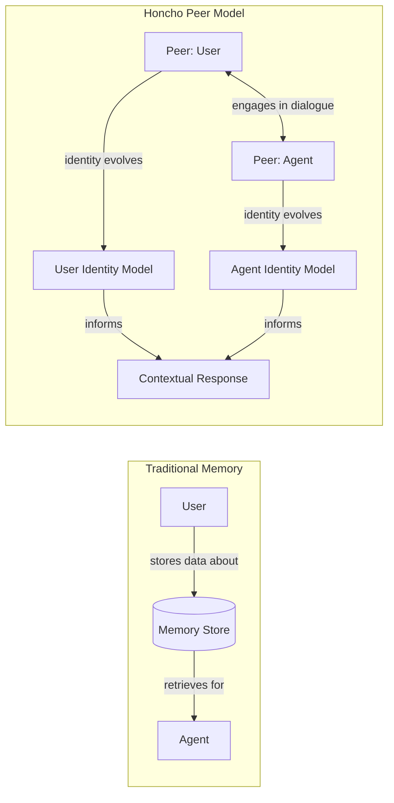
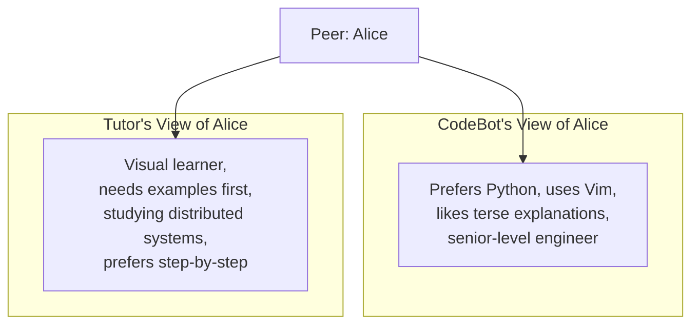
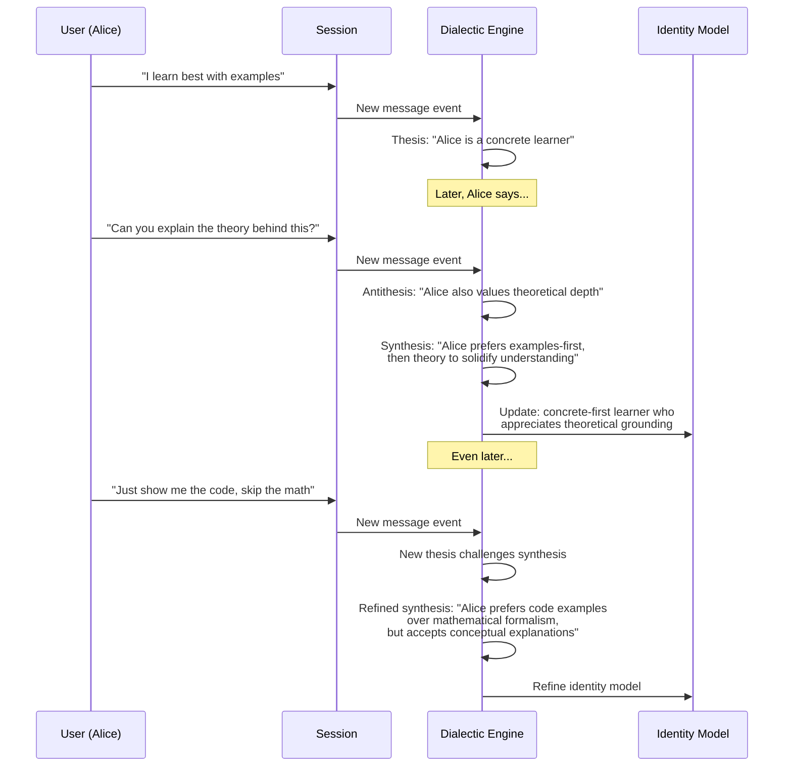

# Honcho — Deep Dive

**Website:** [honcho.dev](https://honcho.dev) | **GitHub:** [plastic-labs/honcho](https://github.com/plastic-labs/honcho) | **By:** Plastic Labs | **Funding:** $5.4M pre-seed | **License:** Open-source

> A personal identity platform for AI that uses dialectic reasoning to build genuine user understanding — not just memory storage, but active inference about who the user is.

---

## Architecture Overview

Honcho breaks from the typical "store and retrieve" memory paradigm. Instead, it models users and agents as **peers** engaged in dialogue, and runs a **background dialectic reasoning** process to generate evolving conclusions about each user.



---

## Core Concepts

### The Peer Model

Traditional memory systems treat users as passive data sources. Honcho's peer model treats every participant — human or AI — as an active **peer** with its own identity and perspective.



| Concept | Description |
|---------|-------------|
| **Peer** | Any participant in a conversation — user or agent. Each has a unique identity. |
| **Session** | A conversation thread between peers. Contains ordered messages. |
| **Message** | A single utterance within a session, attributed to a specific peer. |
| **Identity** | The evolving model of who a peer is, generated by dialectic reasoning. |

### Multi-Agent Isolation

A critical feature: Honcho maintains **separate identity profiles per peer pairing**. If Alice talks to CodeBot and Tutor, each agent develops its own understanding of Alice:



This means each agent can build a contextually appropriate model without cross-contamination — what Alice shares with her coding assistant doesn't leak into her tutoring sessions unless explicitly designed to.

---

## Dialectic Reasoning: How Honcho "Thinks" About Users

The dialectic engine is Honcho's core innovation. It doesn't just store what users say — it actively reasons about the user using a thesis-antithesis-synthesis loop inspired by Hegelian dialectics.



### How It Works

1. **Observation**: Every message in a session is observed by the dialectic engine
2. **Thesis generation**: An initial conclusion is drawn from new evidence
3. **Contradiction detection**: New evidence that conflicts with existing conclusions triggers antithesis
4. **Synthesis**: Conflicting observations are reconciled into a more nuanced understanding
5. **Continuous refinement**: The synthesis becomes the new thesis, and the cycle continues

This means Honcho's understanding of a user becomes **more nuanced over time**, not just more voluminous.

---

## API Reference & Code Examples

### Setting Up Peers and Sessions

```python
from honcho import Honcho

honcho = Honcho()

# Create peers
peer_alice = honcho.peer("alice")
peer_codebot = honcho.peer("codebot")

# Create a session between them
session = honcho.session("coding-help-1")

# Add messages to the session
msg1 = peer_alice.message("I learn best with examples")
msg2 = peer_codebot.message("Sure! Here's a code example for decorators...")
msg3 = peer_alice.message("That's perfect. Can you also explain the theory?")

session.add_messages([msg1, msg2, msg3])
# The dialectic engine begins reasoning about Alice in the background
```

### Retrieving Context (`get_context`)

The `get_context` endpoint returns a token-budgeted context block suitable for injection into an LLM prompt:

```python
# Get relevant context about Alice, fitting within a token budget
context = honcho.get_context(
    session_id="coding-help-1",
    peer_id="alice",
    max_tokens=2000
)

print(context)
# Returns a structured summary:
# {
#   "identity": "Alice is a concrete learner who prefers code examples
#                before theoretical explanations. She's an experienced
#                developer who values practical demonstrations.",
#   "relevant_memories": [
#       "Prefers examples-first learning approach",
#       "Asked for theoretical depth after seeing code",
#       "Experienced with Python decorators"
#   ],
#   "session_context": "Currently discussing Python decorator patterns"
# }

# Use this directly in your LLM prompt
prompt = f"""
{context['identity']}

Relevant memories:
{chr(10).join('- ' + m for m in context['relevant_memories'])}

User's question: How do async generators work?
"""
```

### Working Representation (User Snapshot)

The `working_representation` provides a holistic snapshot of Honcho's current understanding of a user:

```python
# Get the full working representation of Alice
representation = honcho.working_representation(peer_id="alice")

print(representation)
# {
#   "peer_id": "alice",
#   "summary": "Experienced developer, concrete learner, prefers examples
#               before theory. Values practical code demonstrations.
#               Comfortable with Python, exploring distributed systems.",
#   "traits": {
#       "learning_style": "concrete-first with theoretical follow-up",
#       "expertise_level": "senior",
#       "communication_preference": "code-heavy, concise"
#   },
#   "confidence": 0.82,
#   "last_updated": "2026-03-15T14:30:00Z",
#   "session_count": 12,
#   "synthesis_count": 47
# }
```

### Dialectic API (Natural Language Queries)

The Dialectic API lets you ask freeform questions about a user:

```python
# Ask natural language questions about Alice
answer = honcho.dialectic.query(
    peer_id="alice",
    question="What's the best way to explain a complex algorithm to Alice?"
)

print(answer)
# "Based on 12 sessions of interaction, Alice responds best to:
#  1. A concrete code example showing the algorithm in action
#  2. A brief conceptual explanation of why it works
#  3. Edge cases demonstrated through code modifications
#  She explicitly dislikes heavy mathematical notation and prefers
#  Python-based pseudocode over formal algorithmic notation."

# Ask about preferences for a specific domain
answer = honcho.dialectic.query(
    peer_id="alice",
    question="Would Alice prefer a video tutorial or written docs for Kubernetes?"
)

print(answer)
# "Alice has not explicitly discussed Kubernetes learning preferences,
#  but based on her demonstrated learning style across 12 sessions,
#  she would likely prefer written docs with embedded code examples
#  and kubectl command demonstrations, followed by a brief architectural
#  overview. Confidence: moderate (extrapolated from general patterns)."
```

---

## Step-by-Step Walkthrough: Building a Personalized Tutoring Agent

### Scenario

You're building an AI tutor that adapts its teaching style to each student using Honcho's dialectic reasoning.

### Step 1: Initialize Peers

```python
from honcho import Honcho

honcho = Honcho()

# The student
student = honcho.peer("student_marcus")
# The tutor agent
tutor = honcho.peer("tutor_distributed_systems")
```

### Step 2: Conduct Learning Sessions

```python
# Session 1: Introduction to Consensus
s1 = honcho.session("lesson-consensus-101")

messages = [
    student.message("I need to understand Raft consensus. I know basic networking."),
    tutor.message("Let's start with the leader election process..."),
    student.message("Wait, can you show me a simple simulation first? "
                    "I get confused with just descriptions."),
    tutor.message("Here's a Python simulation of 3-node Raft..."),
    student.message("Now I get it. So the heartbeat timeout triggers election?"),
    tutor.message("Exactly! And here's what happens during a network partition..."),
    student.message("The split-brain thing is tricky. Can you draw it out?"),
]
s1.add_messages(messages)
# Dialectic engine observes: Marcus needs visual/simulation aids,
# understands networking basics, struggles with abstract descriptions
```

### Step 3: Query Understanding Before Next Session

```python
# Before the next lesson, check what Honcho has learned about Marcus
context = honcho.get_context(
    session_id="lesson-consensus-201",  # new session
    peer_id="student_marcus",
    max_tokens=1500
)

# Build an adaptive prompt
system_prompt = f"""You are a distributed systems tutor.

Student Profile (from Honcho):
{context['identity']}

Teaching guidelines based on this student:
- Lead with simulations and code examples
- Follow up with diagrams for complex concepts
- Avoid pure-description explanations
- Student has solid networking fundamentals
- Check understanding with "what happens if..." scenarios

Current topic: Log replication in Raft
"""
```

### Step 4: Continuous Refinement

```python
# After several more sessions, ask the Dialectic API
insights = honcho.dialectic.query(
    peer_id="student_marcus",
    question="How has Marcus's learning style evolved over our sessions?"
)
# "Marcus initially required simulation-first teaching. Over 8 sessions,
#  he has developed the ability to reason abstractly about consensus
#  protocols when anchored by a prior concrete example. He now asks
#  'what if' questions proactively, suggesting readiness for more
#  theoretical content alongside practical demonstrations."
```

---

## Comparison: Honcho vs. Traditional Memory

| Aspect | Traditional Memory (e.g., vector store) | Honcho |
|--------|----------------------------------------|--------|
| **Storage model** | Facts as embeddings | Identity as evolving model |
| **Reasoning** | Retrieve → present | Dialectic synthesis → understand |
| **Contradiction handling** | Last-write-wins or manual | Thesis-antithesis-synthesis |
| **User model depth** | Surface preferences | Deep behavioral patterns |
| **Multi-agent** | Shared memory pool | Isolated per peer pairing |
| **Query type** | Similarity search | Natural language questions |
| **Updates** | Explicit add/update calls | Continuous background inference |
| **Time to value** | Immediate (first add) | Grows with interaction |

---

## Pricing

| Plan | Price | Details |
|------|-------|---------|
| **Free** | $100 in credits | Get started with the API |
| **Usage-based** | $2 / 1M tokens | Pay for what you use |

---

## Strengths

- **Deep user understanding**: Dialectic reasoning produces nuanced, evolving user models far beyond simple preference storage
- **Multi-agent isolation**: Each agent-user pairing maintains independent identity models, preventing context leakage
- **Natural language queries**: The Dialectic API enables freeform questions about users, far more flexible than key-value lookups
- **Token-budgeted context**: `get_context` respects token limits, making integration with LLMs straightforward
- **Background processing**: Reasoning happens asynchronously — no latency impact on the conversation itself

## Limitations

- **Cold start**: Dialectic reasoning needs several conversations to build useful models; first-session experience is thin
- **Reasoning opacity**: The dialectic process is a black box — difficult to debug why a specific conclusion was reached
- **Latency for synthesis**: Background reasoning means insights may lag behind recent conversations
- **Limited ecosystem**: Fewer integrations and connectors compared to platforms like Supermemory or Mem0
- **Early stage**: $5.4M pre-seed funding indicates a very early product; production stability track record is limited

## Best For

- **Personalized education platforms** where understanding each learner's style is critical
- **Companion / therapy AI** applications that need deep empathetic understanding
- **Multi-agent systems** where different agents need different views of the same user
- **Products where user understanding > memory recall** — when you need to know *who* the user is, not just what they said
- **Long-term relationships**: Applications where users interact over weeks or months

---

## Further Reading

- [Honcho Documentation](https://docs.honcho.dev)
- [GitHub Repository](https://github.com/plastic-labs/honcho)
- [Plastic Labs Blog — Dialectic Reasoning](https://blog.plasticlabs.ai)
- [The Case for User Identity in AI (Plastic Labs)](https://plasticlabs.ai/blog/identity)
