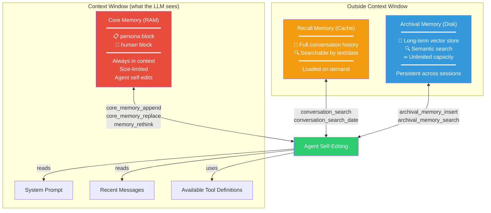
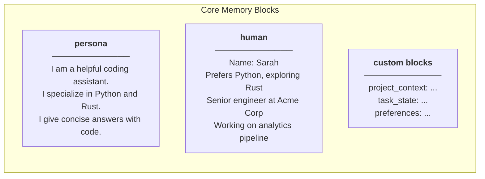
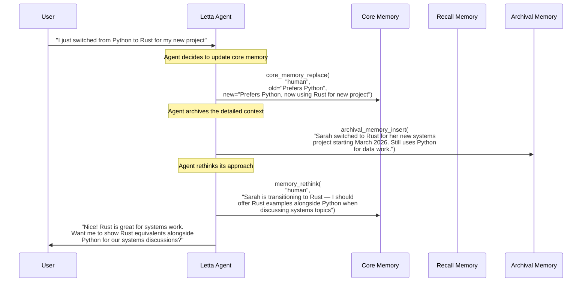
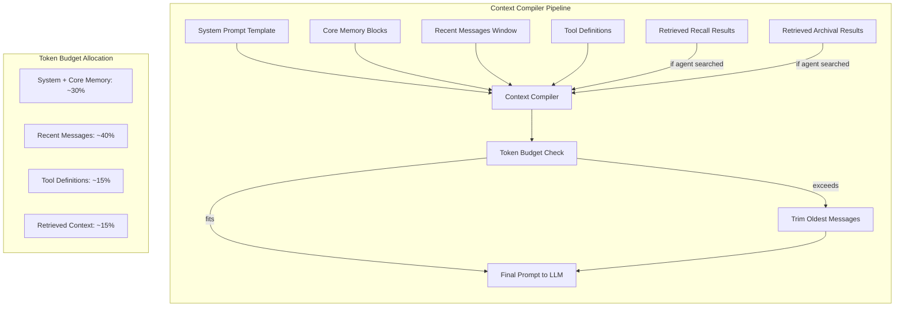
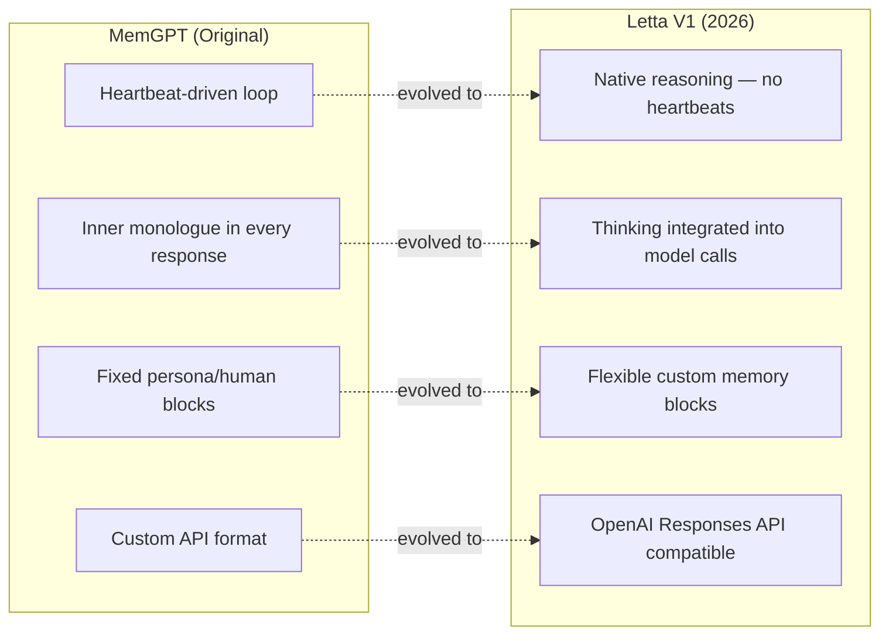

# Letta (MemGPT) — Deep Dive

**Website:** [letta.com](https://letta.com) | **GitHub:** [letta-ai/letta](https://github.com/letta-ai/letta) (40K+ stars) | **License:** Apache 2.0 | **Paper:** [arXiv:2310.08560](https://arxiv.org/abs/2310.08560) (MemGPT, Oct 2023)

> Memory-as-OS: a paradigm where LLM agents manage their own memory through an operating system metaphor — with RAM (core memory always in context), cache (searchable conversation history), and disk (long-term archival storage).

---

## Architecture Overview

Letta reimagines agent memory as a **tiered storage system** analogous to computer architecture. The agent itself controls what moves between tiers, using self-editing memory tools to manage its own context window.



---

## The Three Memory Tiers

### Tier 1: Core Memory (RAM)

Core memory is **always present in the agent's context window**. It consists of named blocks that the agent can read and modify at any time.



| Property | Detail |
|----------|--------|
| **Always in context** | Every LLM call includes core memory |
| **Size-limited** | Each block has a character limit (configurable) |
| **Agent-editable** | The agent modifies its own core memory via tool calls |
| **Persistent** | Survives across sessions |

**Key insight**: Because core memory is size-limited, the agent must decide what's important enough to keep. This forces prioritization — the agent "thinks about" what to remember, much like human working memory.

### Tier 2: Recall Memory (Cache)

Recall memory stores the **complete conversation history**, searchable but not loaded into context by default.

| Property | Detail |
|----------|--------|
| **Content** | Every message sent and received |
| **Search** | Text search and date-range search |
| **Loading** | Agent explicitly searches when needed |
| **Capacity** | Grows with conversation length |

### Tier 3: Archival Memory (Disk)

Archival memory is a **vector store** for long-term knowledge that the agent wants to preserve but doesn't need in every context window.

| Property | Detail |
|----------|--------|
| **Content** | Any text the agent decides to archive |
| **Search** | Semantic vector search |
| **Capacity** | Effectively unlimited |
| **Persistence** | Permanent (until agent deletes) |

---

## Self-Editing Memory Tools

The defining feature of Letta is that the **agent controls its own memory** through tool calls. Here are the core memory tools:



### Tool Reference

| Tool | Purpose | Tier |
|------|---------|------|
| `core_memory_append` | Add text to a core memory block | Core (RAM) |
| `core_memory_replace` | Replace text in a core memory block | Core (RAM) |
| `memory_rethink` | Agent reflects on and reorganizes core memory | Core (RAM) |
| `conversation_search` | Search conversation history by text | Recall (Cache) |
| `conversation_search_date` | Search conversation history by date range | Recall (Cache) |
| `archival_memory_insert` | Store text in long-term vector store | Archival (Disk) |
| `archival_memory_search` | Semantic search over archival memory | Archival (Disk) |

---

## Code Examples

### Creating an Agent with Memory Blocks

```python
import os
from letta_client import Letta

client = Letta(api_key=os.getenv("LETTA_API_KEY"))

# Create an agent with initial core memory blocks
agent = client.agents.create(
    model="openai/gpt-4o-mini",
    memory_blocks=[
        {
            "label": "human",
            "value": "Name: Sarah. Senior engineer at Acme Corp. Prefers Python."
        },
        {
            "label": "persona",
            "value": "I am a helpful coding assistant. I give concise answers "
                     "with working code examples. I proactively update my memory "
                     "when I learn new things about the user."
        },
        {
            "label": "project_context",
            "value": "No active project context yet."
        }
    ]
)

print(f"Agent created: {agent.id}")
```

### Conversing — Agent Self-Edits Memory

```python
# Send a message — the agent may self-edit memory as part of its response
response = client.agents.messages.create(
    agent_id=agent.id,
    input="Hey! I just started a new project using Rust and Tokio "
          "for building a high-throughput message broker."
)

# The response may include tool calls like:
# 1. core_memory_replace("human", 
#        old="Prefers Python.", 
#        new="Prefers Python. New project: Rust + Tokio message broker.")
# 2. archival_memory_insert("Sarah's new project (March 2026): 
#        High-throughput message broker using Rust and Tokio runtime. 
#        First Rust project — she may need help with ownership/borrowing.")
# 3. The actual text response to the user

for message in response.messages:
    if hasattr(message, 'content'):
        print(f"Agent: {message.content}")
    if hasattr(message, 'tool_call'):
        print(f"  [Tool: {message.tool_call.name}]")
```

### Directly Managing Archival Memory

```python
# Insert knowledge directly into archival memory (bypass agent)
client.agents.passages.insert(
    agent_id=agent.id,
    content="Sarah switched to Rust for systems work in March 2026. "
            "She's using Tokio for async runtime and considering "
            "tonic for gRPC services."
)

# Search archival memory
results = client.agents.passages.search(
    agent_id=agent.id,
    query="programming languages Sarah uses"
)

for passage in results:
    print(f"[{passage.score:.2f}] {passage.content}")
    # [0.91] Sarah switched to Rust for systems work...
    # [0.87] Sarah prefers Python for data analysis...
```

### Inspecting Core Memory State

```python
# Read the current state of core memory
agent_state = client.agents.retrieve(agent_id=agent.id)

for block in agent_state.memory_blocks:
    print(f"\n=== {block.label} ===")
    print(block.value)
    # === human ===
    # Name: Sarah. Senior engineer at Acme Corp. 
    # Prefers Python. New project: Rust + Tokio message broker.
    # Exploring async patterns and ownership model.
    #
    # === persona ===
    # I am a helpful coding assistant. I give concise answers
    # with working code examples...
    #
    # === project_context ===
    # Active: Rust message broker (Tokio + tonic for gRPC).
    # Architecture: pub/sub with persistent queues.
    # Status: Early design phase.
```

---

## Context Compiler

The **context compiler** is the engine that assembles the final prompt sent to the LLM on each turn. It determines what gets included:



The context compiler ensures that:
1. Core memory is **always** included (it's the agent's working memory)
2. Recent messages are prioritized over older ones
3. If the agent searched recall or archival memory, those results are injected
4. Total context stays within the model's window

---

## Letta V1 (2026) Architecture Changes

Letta V1 represents a significant evolution from the original MemGPT design:



| Change | MemGPT (Original) | Letta V1 |
|--------|-------------------|----------|
| **Reasoning loop** | Heartbeat mechanism: agent sends empty messages to keep thinking | Native reasoning: model thinks within the call, no heartbeat overhead |
| **Inner monologue** | Explicit `inner_thoughts` field in every response | Integrated into model's native thinking (e.g., `<thinking>` tags) |
| **Memory blocks** | Fixed `persona` and `human` blocks only | Arbitrary named blocks (project, task, domain, etc.) |
| **API format** | Custom Letta message format | Compatible with OpenAI Responses API |
| **Multi-agent** | Single agent per conversation | Native multi-agent orchestration |
| **Tool integration** | Custom tool format | OpenAI function-calling compatible tools |

---

## Step-by-Step Walkthrough: Long-Running Coding Agent

### Scenario

You're building a coding agent that helps a developer over weeks of work on a project. The agent needs to remember project context, evolving decisions, and the developer's patterns.

### Step 1: Initialize the Agent

```python
import os
from letta_client import Letta

client = Letta(api_key=os.getenv("LETTA_API_KEY"))

agent = client.agents.create(
    model="openai/gpt-4o-mini",
    memory_blocks=[
        {
            "label": "human",
            "value": "New user. No information yet."
        },
        {
            "label": "persona",
            "value": "I am a senior software architect assistant. "
                     "I remember everything about the user's project and preferences. "
                     "I proactively update my memory when I learn new information. "
                     "I flag when my memory conflicts with new information."
        },
        {
            "label": "project",
            "value": "No active project yet."
        },
        {
            "label": "decisions",
            "value": "No architectural decisions recorded yet."
        }
    ]
)
```

### Step 2: Week 1 — Project Kickoff

```python
response = client.agents.messages.create(
    agent_id=agent.id,
    input="Hi! I'm Marcus. Starting a new project — a real-time collaborative "
          "editor like Google Docs but for code. Thinking Go backend, React frontend, "
          "CRDTs for conflict resolution."
)
# Agent internally calls:
#   core_memory_replace("human", old="New user...", 
#       new="Marcus. Building real-time collaborative code editor. Go+React+CRDTs.")
#   core_memory_replace("project", old="No active project...", 
#       new="Collaborative code editor. Go backend, React frontend, CRDT-based.")
#   archival_memory_insert("Project inception: Marcus is building a real-time 
#       collaborative code editor similar to Google Docs but for code. 
#       Tech stack: Go (backend), React (frontend), CRDTs for conflict resolution. 
#       Started March 2026.")
```

### Step 3: Week 2 — Architecture Decisions

```python
response = client.agents.messages.create(
    agent_id=agent.id,
    input="After researching, I'm going with Yjs for CRDTs instead of Automerge. "
          "Also switching to WebSockets over SSE for real-time sync."
)
# Agent internally calls:
#   core_memory_replace("decisions", old="No architectural decisions...", 
#       new="CRDT: Yjs (chosen over Automerge). Transport: WebSockets (over SSE).")
#   archival_memory_insert("Week 2 decision: Yjs chosen over Automerge for CRDTs. 
#       Reasons Marcus mentioned: better documentation, active maintenance, 
#       smaller bundle size. WebSockets chosen over SSE for bidirectional comm.")
```

### Step 4: Week 4 — Agent Recalls Context

```python
response = client.agents.messages.create(
    agent_id=agent.id,
    input="I'm hitting performance issues with large documents. "
          "What did we decide about the sync mechanism?"
)
# Agent searches recall and archival memory:
#   conversation_search("sync mechanism")  → finds Week 2 discussion
#   archival_memory_search("CRDT performance")  → finds archived research notes
# Then responds with full context about the Yjs + WebSocket decisions,
# plus suggestions for large-document optimization
```

---

## Strengths

- **Self-managing memory**: The agent decides what to remember, forget, and reorganize — no external orchestration needed
- **Intuitive tiered model**: RAM/cache/disk metaphor is immediately understandable to developers
- **Proven at scale**: 40K+ GitHub stars, extensive community, Apache 2.0 license
- **Academic foundation**: Built on peer-reviewed MemGPT research (ICLR 2024)
- **Flexible memory blocks**: V1's custom blocks support arbitrary domain-specific memory structures
- **Full control**: Developers can directly inspect and modify all memory tiers

## Limitations

- **Token overhead**: Self-editing tools consume tokens on every turn (agent "thinks" about memory management)
- **Quality depends on model**: Weaker models make poor memory management decisions
- **No automatic extraction**: Unlike Mem0 or Supermemory, Letta relies on the agent to decide what to memorize
- **Cold start complexity**: Setting up effective initial memory blocks requires careful prompt engineering
- **Scaling concerns**: As archival memory grows, search quality may degrade without proper indexing

## Best For

- **Long-running autonomous agents** that need to manage their own context over many sessions
- **Developer-facing tools** where the tiered memory model provides intuitive debugging
- **Research and experimentation** with novel memory architectures (open-source, extensible)
- **Agents with complex inner states** (project trackers, personal assistants with evolving knowledge)
- **Teams that want full control** over every aspect of memory management

---

## Further Reading

- [Letta Documentation](https://docs.letta.com)
- [GitHub Repository](https://github.com/letta-ai/letta)
- [MemGPT Paper (arXiv:2310.08560)](https://arxiv.org/abs/2310.08560)
- [Letta V1 Announcement](https://www.letta.com/blog/letta-v1)
- [Context Compiler Deep Dive](https://docs.letta.com/architecture/context-compiler)
