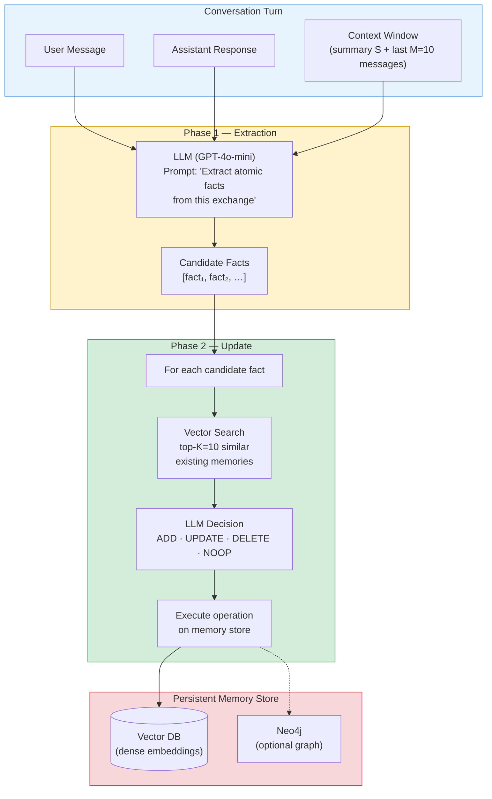
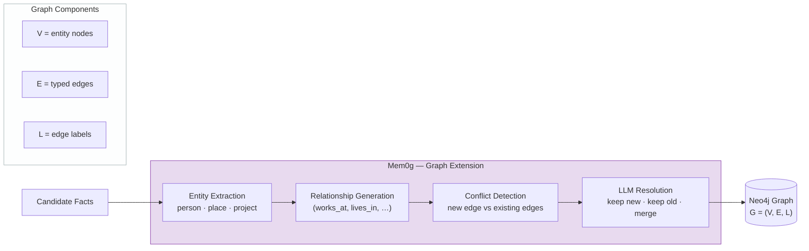
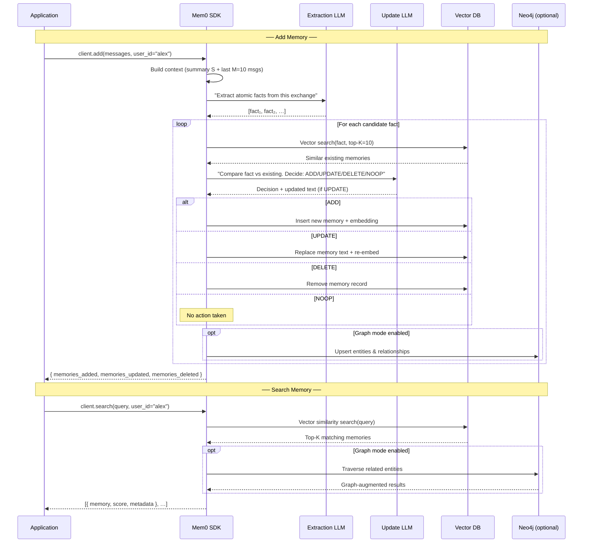
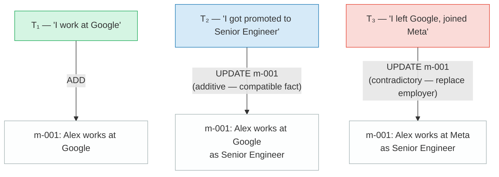

# Mem0 — Scalable Memory-Centric Architecture for AI Agents

> **One-liner:** A two-phase extract-then-update pipeline that gives any LLM-powered agent a persistent, self-curating long-term memory.

| Stat | Value |
|---|---|
| **GitHub Stars** | 38 000+ |
| **License** | Apache 2.0 |
| **Paper** | [arXiv:2504.19413](https://arxiv.org/abs/2504.19413) (Apr 2025) |
| **Default LLM** | GPT-4o-mini |
| **Storage** | Vector DB + optional Neo4j (graph) |
| **p95 Latency Reduction** | 91% vs full-context |
| **Token Cost Savings** | ≈ 90% |
| **LOCOMO Score** | 66.9% (Mem0) · 68.4% (Mem0g) |

---

## Architecture Overview

Mem0's core insight is that *you don't need to stuff the entire conversation history into every prompt*. Instead, a lightweight pipeline **extracts** atomic facts from each turn and **merges** them into a deduplicated, conflict-resolved memory store. At query time the agent retrieves only the handful of memories that are relevant.

The architecture has two mandatory phases and one optional graph layer:



### Mem0g — The Graph Variant

Mem0g extends the base architecture with a directed labeled graph **G = (V, E, L)** stored in Neo4j. After the standard extraction phase, an additional sub-pipeline converts facts into structured entities and relationships.



| Component | Role |
|---|---|
| **V (Vertices)** | Entity nodes — people, places, organizations, projects |
| **E (Edges)** | Directed, typed relationships — `works_at`, `lives_in`, `allergic_to` |
| **L (Labels)** | Human-readable labels on edges for downstream retrieval |

---

## How It Works — Step by Step

Let's walk through a concrete scenario where a user named **Alex** has a multi-turn conversation with an AI assistant. We'll trace every memory operation.

### Turn 1 — First Introduction

**User:** *"Hi, I'm Alex. I'm a vegetarian and I'm allergic to nuts."*
**Assistant:** *"Hello Alex! I've noted that you're a vegetarian and have a nut allergy."*

#### Phase 1 — Extraction

The LLM receives the turn plus context (empty so far) and extracts:

| # | Candidate Fact |
|---|---|
| 1 | Alex is a vegetarian |
| 2 | Alex is allergic to nuts |

#### Phase 2 — Update

For **fact 1** ("Alex is a vegetarian"):
1. Vector search against existing memories → **0 results** (store is empty).
2. LLM decision → **ADD**.
3. A new memory record is created and embedded.

For **fact 2** ("Alex is allergic to nuts"):
1. Same flow → **ADD**.

**Memory store after Turn 1:**

| ID | Memory | Created |
|---|---|---|
| m-001 | Alex is a vegetarian | T₁ |
| m-002 | Alex is allergic to nuts | T₁ |

### Turn 2 — New Information

**User:** *"I just started a new job at Google as a software engineer."*

#### Extraction → 1 candidate fact: "Alex works at Google as a software engineer"
#### Update → Vector search returns 0 strong matches → **ADD**

| ID | Memory | Created |
|---|---|---|
| m-001 | Alex is a vegetarian | T₁ |
| m-002 | Alex is allergic to nuts | T₁ |
| m-003 | Alex works at Google as a software engineer | T₂ |

### Turn 3 — Contradiction (see Conflict Resolution below)

**User:** *"I actually just moved from Google to Meta."*

#### Extraction → 1 candidate fact: "Alex works at Meta"
#### Update → Vector search returns **m-003** (similarity ≈ 0.92) → LLM decision: **UPDATE**

| ID | Memory | Updated |
|---|---|---|
| m-003 | Alex works at Meta as a software engineer | T₃ *(updated)* |

---

## Request Flow — Sequence Diagram

The following diagram shows the full lifecycle of an `add` call followed by a `search` call:



---

## Code Examples

### Python — Managed Cloud (MemoryClient)

```python
# pip install mem0ai
from mem0 import MemoryClient

# Initialize with your Mem0 Platform API key
client = MemoryClient(api_key="your_api_key")

# ── Add memories from a conversation turn ──
messages = [
    {"role": "user", "content": "Hi, I'm Alex. I'm a vegetarian and I'm allergic to nuts."},
    {"role": "assistant", "content": "Hello Alex! I've noted that you're a vegetarian and have a nut allergy."}
]
result = client.add(messages, user_id="alex")
# result contains IDs of memories created / updated

# ── Add more context in a later turn ──
messages = [
    {"role": "user", "content": "I just started a new job at Google as a software engineer."},
    {"role": "assistant", "content": "Congratulations on your new role at Google!"}
]
client.add(messages, user_id="alex")

# ── Semantic search over memories ──
results = client.search(query="What does Alex do for work?", user_id="alex")
for r in results:
    print(r["memory"])  # "Alex works at Google as a software engineer"

# ── List all memories for a user ──
all_memories = client.get_all(user_id="alex")
for m in all_memories:
    print(m["memory"])

# ── Automatic conflict resolution ──
# Alex changed jobs — Mem0 will UPDATE the existing memory, not duplicate it.
messages = [
    {"role": "user", "content": "I actually just moved from Google to Meta."}
]
client.add(messages, user_id="alex")
# The memory "Alex works at Google …" is updated to "Alex works at Meta …"
```

### Python — Open-Source Local Usage

```python
from mem0 import Memory

# No API key needed — runs entirely locally
m = Memory()

# Add a memory with optional metadata
m.add(
    "I'm working on improving my tennis skills.",
    user_id="alice",
    metadata={"category": "hobbies"}
)

# Search for relevant memories
results = m.search(query="What are Alice's hobbies?", user_id="alice")
for r in results:
    print(r["memory"])  # "Alice is working on improving her tennis skills"
```

### TypeScript / REST API (conceptual)

```typescript
// Mem0 exposes a REST API; any HTTP client works.
const MEM0_API = "https://api.mem0.ai/v1";
const headers = {
  "Authorization": "Token your_api_key",
  "Content-Type": "application/json",
};

// Add a memory
const addRes = await fetch(`${MEM0_API}/memories/`, {
  method: "POST",
  headers,
  body: JSON.stringify({
    messages: [
      { role: "user", content: "I prefer dark mode in all my apps." },
      { role: "assistant", content: "Got it — dark mode preference saved!" },
    ],
    user_id: "alex",
  }),
});

// Search memories
const searchRes = await fetch(`${MEM0_API}/memories/search/`, {
  method: "POST",
  headers,
  body: JSON.stringify({
    query: "What are Alex's UI preferences?",
    user_id: "alex",
  }),
});
const { results } = await searchRes.json();
console.log(results[0].memory); // "Alex prefers dark mode in all apps"
```

---

## Conflict Resolution — A Concrete Example

Conflict resolution is central to Mem0's value: instead of accumulating contradictory facts, the system actively detects and resolves them.

### Scenario

Alex tells the assistant three things over three separate turns:

| Turn | Statement |
|---|---|
| T₁ | "I work at Google." |
| T₂ | "I just got promoted to Senior Engineer." |
| T₃ | "I left Google and joined Meta last week." |

### Resolution Trace



**What the LLM "sees" at T₃:**

| Input | Value |
|---|---|
| Candidate fact | "Alex works at Meta" |
| Top-1 existing memory (sim ≈ 0.93) | "Alex works at Google as Senior Engineer" |

The update-phase LLM prompt asks: *"Given the new fact and the existing memory, should you ADD a new memory, UPDATE the existing one, DELETE it, or do NOTHING?"*

The LLM recognizes that:
- The **employer** has changed (Google → Meta) — contradictory, must replace.
- The **title** (Senior Engineer) is still valid — retain it.
- Decision: **UPDATE** → `"Alex works at Meta as Senior Engineer"`

### Decision Matrix

| Situation | LLM Decision | Example |
|---|---|---|
| Entirely new information | **ADD** | "Alex has a pet dog named Buddy" |
| Compatible refinement of existing memory | **UPDATE** (merge) | "Alex is a *Senior* Engineer" (adds title) |
| Contradictory replacement | **UPDATE** (replace) | "Alex moved from Google to Meta" |
| Information explicitly retracted | **DELETE** | "I'm no longer allergic to nuts" |
| Duplicate or irrelevant | **NOOP** | "I work at Google" (already stored) |

---

## Performance

| Metric | Mem0 | Mem0g (graph) | Full-Context Baseline |
|---|---|---|---|
| **LOCOMO Accuracy** | 66.9% | 68.4% | varies |
| **vs OpenAI Memory** | +26% accuracy | — | — |
| **p95 Latency** | **91% lower** | — | baseline |
| **Token Cost** | **≈ 90% savings** | — | baseline |

### Key Takeaways

- **Latency and cost:** By retrieving only relevant memories instead of passing the full history, Mem0 achieves dramatic reductions in both latency and token usage — critical for production deployments with long-running conversations.
- **Accuracy trade-off:** The 66.9% LOCOMO score is solid but not state-of-the-art; the graph variant (Mem0g) improves this to 68.4% by capturing structural relationships.
- **OpenAI Memory comparison:** On the LOCOMO benchmark Mem0 outperforms OpenAI's built-in memory by 26%, largely because Mem0's explicit extract-update pipeline is more systematic than OpenAI's implicit approach.

---

## Strengths

- **Battle-tested at scale** — 38K+ GitHub stars and a large production user base provide confidence in reliability.
- **Simple mental model** — The two-phase extract → update pipeline is easy to reason about, debug, and extend.
- **Massive efficiency gains** — 91% lower p95 latency and ≈90% token savings vs stuffing full context.
- **Flexible deployment** — Open-source local mode (Apache 2.0) or fully managed cloud; bring your own LLM and vector DB.
- **Automatic deduplication and conflict resolution** — The update phase prevents memory bloat and keeps facts current.
- **Graph extension** — Mem0g adds structured entity–relationship reasoning for domains that need it.

## Limitations

- **LLM-dependent conflict resolution** — All merge/update decisions are delegated to the LLM with no deterministic fallback; edge cases may produce inconsistent results.
- **No built-in temporal reasoning** — Memories have timestamps but the system doesn't natively reason about time ("What was Alex's job *last year*?").
- **Graph features are paywalled** — Neo4j-backed Mem0g requires the Pro plan ($249/mo) on the managed platform.
- **LOCOMO ceiling** — At 66.9%, the base variant lags behind newer research systems, though the graph variant closes some of the gap.
- **Single-user memory scoping** — Memories are keyed by `user_id`; multi-agent or cross-user shared memory requires manual orchestration.

## Best For

| Use Case | Why Mem0 Fits |
|---|---|
| **Production chatbots** needing per-user personalization | Simple SDK, proven at scale, low latency |
| **Customer support agents** that must remember past issues | Automatic dedup prevents "memory pollution" |
| **Rapid prototyping** of memory-augmented agents | Open-source, pip-installable, 5-line integration |
| **Cost-sensitive deployments** with long conversations | 90% token savings directly reduce API bills |
| **Teams that want a graph layer** for entity-rich domains | Mem0g with Neo4j (Pro tier) |

---

## Pricing

| Tier | Price | Includes |
|---|---|---|
| **Open-Source** | Free | Core two-phase pipeline, local vector DB |
| **Cloud Free** | $0 | Managed hosting, limited usage |
| **Pro** | $249/mo | Graph memory (Mem0g), priority support, higher limits |

---

## Links

| Resource | URL |
|---|---|
| **Documentation** | [docs.mem0.ai](https://docs.mem0.ai) |
| **GitHub** | [github.com/mem0ai/mem0](https://github.com/mem0ai/mem0) |
| **Research Paper** | [arXiv:2504.19413](https://arxiv.org/abs/2504.19413) |
| **Platform** | [app.mem0.ai](https://app.mem0.ai) |
| **PyPI Package** | [pypi.org/project/mem0ai](https://pypi.org/project/mem0ai/) |
