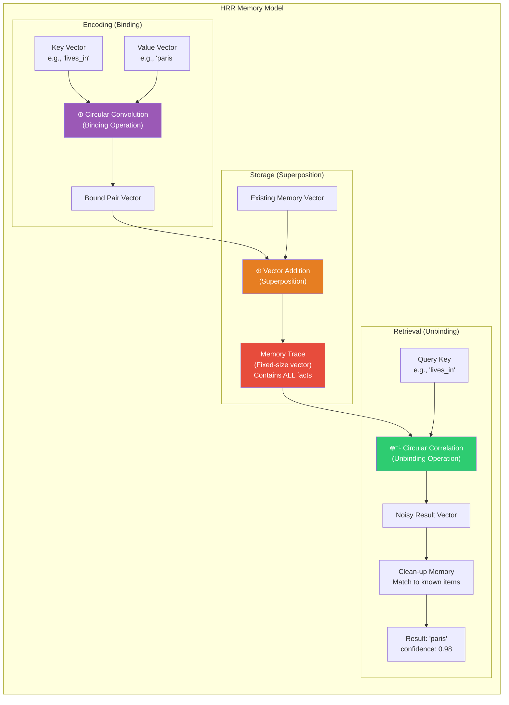
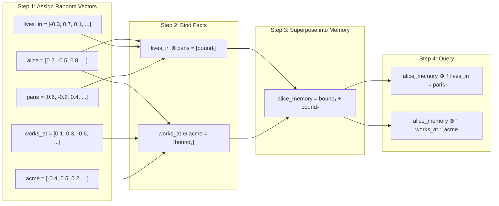
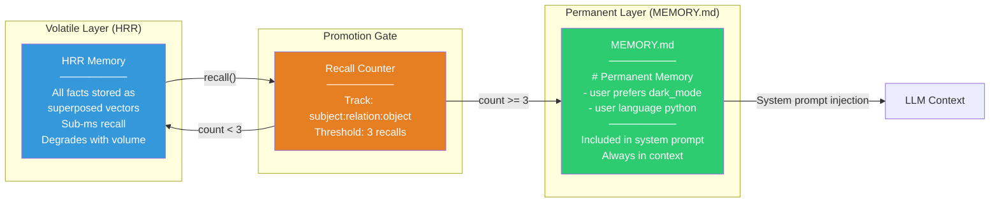
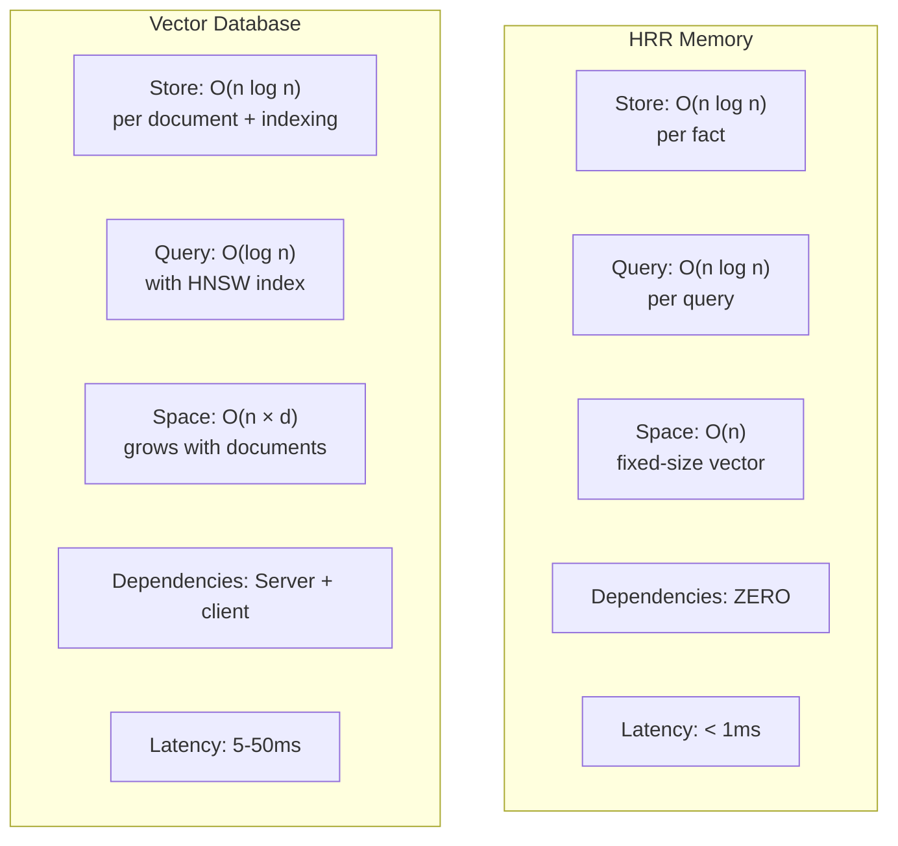

# Nuggets (Holographic Memory) — Deep Dive

**GitHub:** [nicholasgriffintn/nuggets](https://github.com/nicholasgriffintn/nuggets) (233 stars) | **Library:** [hrr-memory](https://www.npmjs.com/package/hrr-memory) | **License:** MIT | **Language:** Pure TypeScript | **Dependencies:** Zero

> Holographic Reduced Representations (HRR) for AI memory: facts compressed into fixed-size complex vectors via circular convolution, enabling sub-millisecond recall with no external services, no databases, and no API calls.

---

## Architecture Overview

Nuggets takes a radically different approach from every other memory system in this book. Instead of vector databases, knowledge graphs, or managed APIs, it uses **Holographic Reduced Representations** — a mathematical technique from cognitive science that encodes structured facts into fixed-size vectors using circular convolution.



---

## How Holographic Reduced Representations Work

### The Core Insight

HRR exploits a mathematical property: **circular convolution** can bind two vectors together, and **circular correlation** (the approximate inverse) can unbind them. Multiple bound pairs can be **superposed** (added) into a single vector, and individual pairs can still be recovered.



### Mathematical Operations

| Operation | Symbol | Purpose | Implementation |
|-----------|--------|---------|----------------|
| **Binding** | ⊛ | Associate key with value | Circular convolution in frequency domain (element-wise multiply of FFTs) |
| **Superposition** | ⊕ | Combine multiple bindings into one vector | Element-wise addition |
| **Unbinding** | ⊛⁻¹ | Retrieve value given key | Circular correlation (convolve with approximate inverse) |
| **Clean-up** | — | Match noisy result to known item | Cosine similarity against vocabulary |

### Why "Holographic"?

The name comes from the analogy with optical holograms: just as a hologram encodes a 3D image into a 2D interference pattern (and any piece of the hologram can reconstruct a blurry version of the whole image), HRR encodes multiple facts into a single vector. Each fact can be recovered, though with some noise — and the more facts stored, the noisier the recovery.

---

## Code Examples

### Basic Usage with `hrr-memory`

```javascript
import { HRRMemory } from 'hrr-memory';

// Create a memory with default vector dimensions
const mem = new HRRMemory();

// Store facts as subject-relation-object triples
mem.store('alice', 'lives_in', 'paris');
mem.store('alice', 'works_at', 'acme');
mem.store('alice', 'speaks', 'french');
mem.store('bob', 'lives_in', 'london');
mem.store('bob', 'works_at', 'globex');

// Query: what does alice live in?
const result = mem.query('alice', 'lives_in');
console.log(result);
// { object: 'paris', confidence: 0.98, alternatives: [...] }

// Query: where does bob work?
const result2 = mem.query('bob', 'works_at');
console.log(result2);
// { object: 'globex', confidence: 0.95, alternatives: [...] }

// Query: what language does alice speak?
const result3 = mem.query('alice', 'speaks');
console.log(result3);
// { object: 'french', confidence: 0.93, alternatives: [...] }
```

### Memory with Multiple Facts per Entity

```javascript
import { HRRMemory } from 'hrr-memory';

const mem = new HRRMemory({ dimensions: 1024 });

// Store a rich profile
mem.store('sarah', 'role', 'engineer');
mem.store('sarah', 'language', 'python');
mem.store('sarah', 'language', 'rust');
mem.store('sarah', 'editor', 'neovim');
mem.store('sarah', 'company', 'acme');
mem.store('sarah', 'project', 'analytics_pipeline');
mem.store('sarah', 'preference', 'dark_mode');

// Retrieve specific facts
console.log(mem.query('sarah', 'editor'));
// { object: 'neovim', confidence: 0.91 }

console.log(mem.query('sarah', 'company'));
// { object: 'acme', confidence: 0.89 }

// Note: multiple values for 'language' may return the most recent
// or highest-confidence one. Confidence degrades as more facts are added.
console.log(mem.query('sarah', 'language'));
// { object: 'rust', confidence: 0.72, alternatives: [{ object: 'python', confidence: 0.68 }] }
```

### Integration with an LLM Agent

```javascript
import { HRRMemory } from 'hrr-memory';
import { readFileSync, writeFileSync, existsSync } from 'fs';

class AgentMemory {
  constructor() {
    this.hrr = new HRRMemory({ dimensions: 2048 });
    this.recallCount = {};  // track how often facts are recalled
    this.permanentPath = './MEMORY.md';
  }

  store(subject, relation, object) {
    this.hrr.store(subject, relation, object);
    console.log(`Stored: ${subject} ${relation} ${object}`);
  }

  recall(subject, relation) {
    const result = this.hrr.query(subject, relation);
    
    if (result && result.confidence > 0.5) {
      const key = `${subject}:${relation}:${result.object}`;
      this.recallCount[key] = (this.recallCount[key] || 0) + 1;

      // Memory promotion: facts recalled 3+ times → permanent context
      if (this.recallCount[key] >= 3) {
        this.promoteToPermament(subject, relation, result.object);
      }
      
      return result;
    }
    
    return null;
  }

  promoteToPermament(subject, relation, object) {
    const line = `- **${subject}** ${relation} **${object}**\n`;
    const existing = existsSync(this.permanentPath) 
      ? readFileSync(this.permanentPath, 'utf-8') 
      : '# Permanent Memory\n\n';
    
    if (!existing.includes(line.trim())) {
      writeFileSync(this.permanentPath, existing + line);
      console.log(`PROMOTED to MEMORY.md: ${subject} ${relation} ${object}`);
    }
  }
}

// Usage
const memory = new AgentMemory();

memory.store('user', 'prefers', 'dark_mode');
memory.store('user', 'language', 'python');
memory.store('user', 'project', 'ml_pipeline');

// First recall — count: 1
memory.recall('user', 'prefers');    // { object: 'dark_mode', confidence: 0.96 }

// Second recall — count: 2
memory.recall('user', 'prefers');    // { object: 'dark_mode', confidence: 0.96 }

// Third recall — PROMOTED to MEMORY.md
memory.recall('user', 'prefers');    // Writes to MEMORY.md
```

---

## Memory Promotion Pipeline

Nuggets implements a unique **memory promotion** system: facts that are recalled frequently (3+ times by default) are promoted from the volatile HRR store to a persistent `MEMORY.md` file that can be included in the agent's system prompt.



### Why Promotion Matters

The HRR memory is fast but lossy — confidence degrades as more facts are stored. Promotion solves this by moving the most important facts (those the agent keeps needing) into a lossless text format:

| Property | HRR (Volatile) | MEMORY.md (Permanent) |
|----------|----------------|----------------------|
| **Recall speed** | Sub-millisecond | File read (< 1ms) |
| **Capacity** | Degrades after ~100 facts | Unlimited (text) |
| **Accuracy** | 70–98% (confidence varies) | 100% (exact text) |
| **Persistence** | In-memory (lost on restart) | File on disk |
| **Context usage** | Not in LLM context | Always in system prompt |

---

## Performance Characteristics

### Benchmarks

| Operation | Latency | Notes |
|-----------|---------|-------|
| **Store (bind + superpose)** | < 0.1ms | FFT-based, O(n log n) per dimension |
| **Query (unbind + clean-up)** | < 0.5ms | Correlation + vocabulary scan |
| **10 facts stored** | ~0.97 avg confidence | Excellent accuracy |
| **50 facts stored** | ~0.85 avg confidence | Good accuracy |
| **100 facts stored** | ~0.72 avg confidence | Usable, some noise |
| **200+ facts stored** | < 0.60 avg confidence | Promotion to MEMORY.md recommended |

### Comparison with Vector Search



| Dimension | HRR Memory | Vector Database |
|-----------|-----------|-----------------|
| **Latency** | Sub-millisecond | 5–50ms typical |
| **Dependencies** | Zero (pure math) | Server + client + network |
| **Storage** | Fixed-size vector (any # of facts) | Grows linearly with documents |
| **Capacity** | ~100 high-confidence facts | Millions of documents |
| **Query type** | Exact key-value lookup | Semantic similarity |
| **Hosting** | In-process, no services | External database required |
| **Cost** | $0 | Database hosting costs |
| **Accuracy at scale** | Degrades gracefully | Consistent (with good embeddings) |

### When HRR Wins

- **Lightweight agents** that need fast, local memory without infrastructure
- **Edge / embedded** deployments where no external services are available
- **Small fact sets** (< 100 facts per entity) where confidence stays high
- **Key-value structured** data (subject-relation-object triples)
- **Privacy-sensitive** applications that can't send data to external APIs

### When Vector Search Wins

- **Large-scale knowledge** bases with thousands+ documents
- **Semantic queries** ("find similar content") rather than exact key lookups
- **Unstructured content** (paragraphs, documents, conversations)
- **Production systems** requiring consistent accuracy at any scale

---

## The `hrr-memory` Standalone Library

The `hrr-memory` package is a standalone TypeScript library that implements HRR operations:

```javascript
import { HRRMemory } from 'hrr-memory';

// Configuration options
const mem = new HRRMemory({
  dimensions: 2048,    // Vector dimensionality (higher = more capacity)
  cleanupMethod: 'cosine',  // 'cosine' or 'dot' for clean-up matching
});

// Core API: store subject-relation-object triples
mem.store('subject', 'relation', 'object');

// Core API: query by subject and relation
const result = mem.query('subject', 'relation');
// → { object: string, confidence: number, alternatives: Array }

// Get all known subjects
const subjects = mem.getSubjects();

// Get all known relations for a subject
const relations = mem.getRelations('alice');

// Export/import memory state
const state = mem.export();
const restored = HRRMemory.import(state);
```

### API Reference

| Method | Description | Returns |
|--------|-------------|---------|
| `store(subject, relation, object)` | Bind and superpose a fact | `void` |
| `query(subject, relation)` | Unbind and clean up to retrieve | `{ object, confidence, alternatives }` |
| `getSubjects()` | List all known subjects | `string[]` |
| `getRelations(subject)` | List relations for a subject | `string[]` |
| `export()` | Serialize memory state | `object` (JSON-safe) |
| `HRRMemory.import(state)` | Restore from serialized state | `HRRMemory` |

---

## Step-by-Step Walkthrough: Lightweight Local Agent Memory

### Scenario

You're building a CLI-based coding assistant that runs entirely locally — no API calls for memory, no database, no cloud services. The agent needs to remember the user's preferences and project context.

### Step 1: Set Up Memory

```javascript
import { HRRMemory } from 'hrr-memory';
import { readFileSync, writeFileSync, existsSync } from 'fs';

const MEMORY_FILE = './agent_memory.json';
const PERMANENT_FILE = './MEMORY.md';

// Load existing memory or create new
let mem;
if (existsSync(MEMORY_FILE)) {
  const state = JSON.parse(readFileSync(MEMORY_FILE, 'utf-8'));
  mem = HRRMemory.import(state);
  console.log('Loaded existing memory');
} else {
  mem = new HRRMemory({ dimensions: 2048 });
  console.log('Created new memory');
}
```

### Step 2: Learn from Conversation

```javascript
function learnFromMessage(userMessage) {
  // Simple extraction patterns (in production, use an LLM)
  const patterns = [
    { regex: /I (?:use|prefer|like) (\w+)/i, relation: 'prefers' },
    { regex: /(?:my|the) project is (\w+)/i, relation: 'project' },
    { regex: /I'm (?:a|an) (\w+)/i, relation: 'role' },
    { regex: /I work (?:at|for) (\w+)/i, relation: 'company' },
  ];
  
  for (const { regex, relation } of patterns) {
    const match = userMessage.match(regex);
    if (match) {
      mem.store('user', relation, match[1].toLowerCase());
      console.log(`Learned: user ${relation} ${match[1].toLowerCase()}`);
    }
  }
}

// User says various things over time
learnFromMessage("I use neovim for everything");
// Learned: user prefers neovim

learnFromMessage("I'm an engineer at Acme");
// Learned: user role engineer
// Learned: user company acme

learnFromMessage("My project is analytics_pipeline");
// Learned: user project analytics_pipeline
```

### Step 3: Recall for Context

```javascript
function buildContext() {
  const context = [];
  const relations = ['prefers', 'project', 'role', 'company', 'language'];
  
  for (const relation of relations) {
    const result = mem.query('user', relation);
    if (result && result.confidence > 0.6) {
      context.push(`User ${relation}: ${result.object} (confidence: ${result.confidence.toFixed(2)})`);
    }
  }
  
  // Include permanent memory if it exists
  if (existsSync(PERMANENT_FILE)) {
    context.push('\nPermanent memories:');
    context.push(readFileSync(PERMANENT_FILE, 'utf-8'));
  }
  
  return context.join('\n');
}

console.log(buildContext());
// User prefers: neovim (confidence: 0.94)
// User project: analytics_pipeline (confidence: 0.91)
// User role: engineer (confidence: 0.88)
// User company: acme (confidence: 0.85)
```

### Step 4: Persist Between Sessions

```javascript
// Save memory state to disk before exit
function saveMemory() {
  const state = mem.export();
  writeFileSync(MEMORY_FILE, JSON.stringify(state, null, 2));
  console.log('Memory saved to disk');
}

// Call on exit
process.on('beforeExit', saveMemory);
```

---

## Strengths

- **Zero dependencies**: Pure TypeScript, no external services, no API keys, no database
- **Sub-millisecond performance**: FFT-based operations are extremely fast
- **Privacy by design**: All data stays in-process — nothing leaves the machine
- **Elegant math**: HRR is a well-studied technique from cognitive science with solid theoretical foundations
- **Memory promotion**: Automatic escalation of important facts to persistent storage
- **Tiny footprint**: Fixed-size vectors regardless of fact count — no storage bloat
- **Offline capable**: Works without internet connectivity

## Limitations

- **Capacity ceiling**: Confidence degrades significantly beyond ~100 facts per entity — not suitable for large knowledge bases
- **Key-value only**: Can only store structured triples (subject-relation-object), not free-form text
- **No semantic search**: Queries must specify exact keys — cannot ask "things similar to X"
- **Noise at scale**: Superposition is inherently lossy; more facts = more noise in retrieval
- **No built-in extraction**: You must structure facts yourself (or use an LLM to extract triples)
- **Small community**: 233 GitHub stars — very niche, limited ecosystem and support
- **JavaScript/TypeScript only**: No Python, Go, or other language SDKs

## Best For

- **Lightweight local agents** that need memory without infrastructure overhead
- **CLI tools and scripts** that remember user preferences across invocations
- **Edge / embedded AI** where no network connectivity or external services are available
- **Privacy-first applications** where data must never leave the device
- **Prototyping and experimentation** with structured memory in a simple, self-contained package
- **Educational use**: Understanding how holographic memory works in practice

---

## Further Reading

- [Nuggets GitHub Repository](https://github.com/nicholasgriffintn/nuggets)
- [hrr-memory npm Package](https://www.npmjs.com/package/hrr-memory)
- [Holographic Reduced Representations (Plate, 1995)](https://doi.org/10.1109/72.377968) — the foundational paper
- [Vector Symbolic Architectures Survey](https://arxiv.org/abs/2001.11797) — broader context for HRR
- [Kanerva's Hyperdimensional Computing](https://link.springer.com/article/10.1007/s12559-009-9009-8) — related approach
