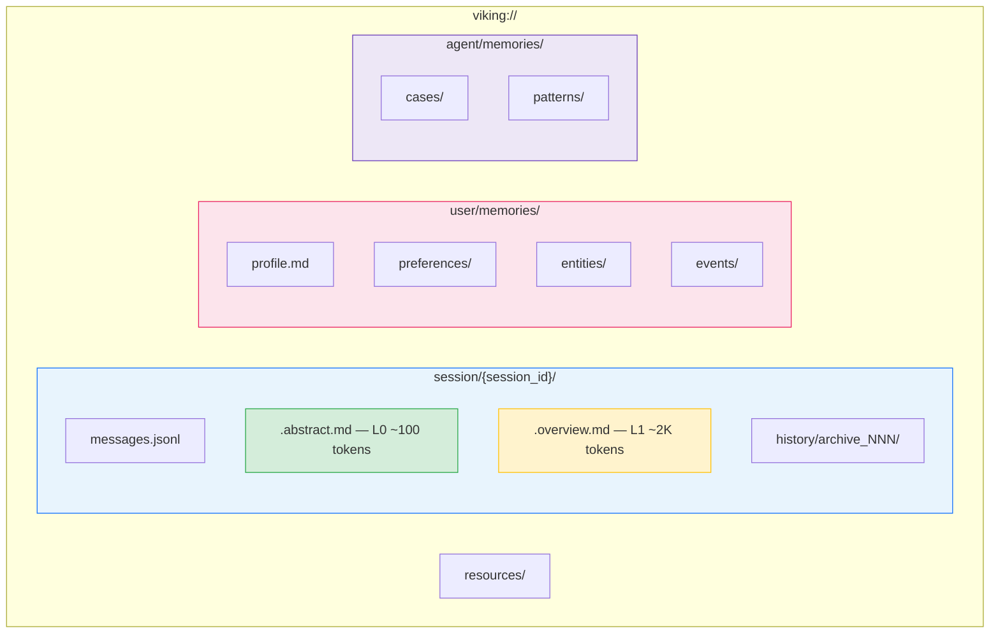
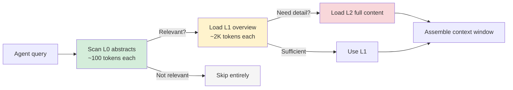
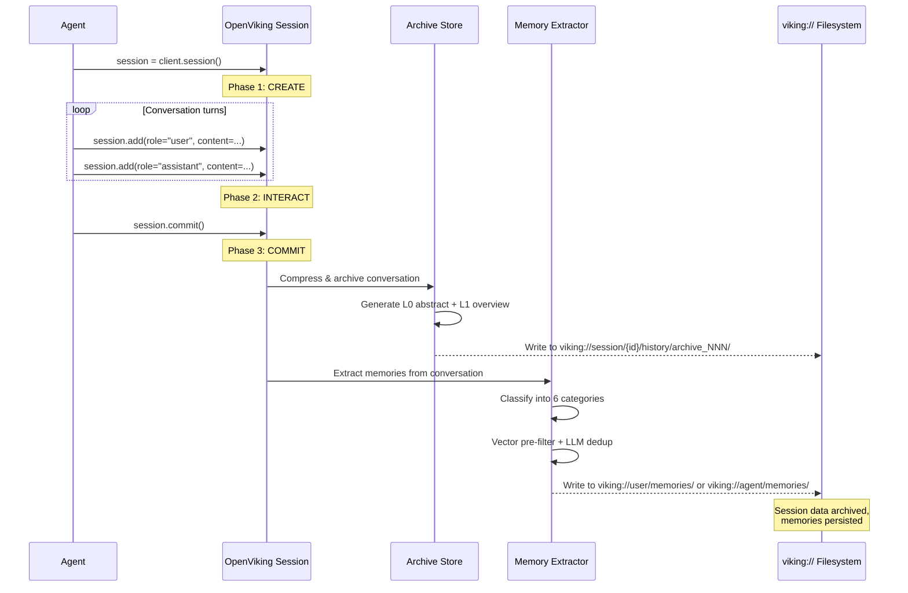

# OpenViking — Deep Dive

**Open-source context database for AI agents** | [GitHub](https://github.com/volcengine/OpenViking) (22K+ stars) | [Docs](https://openviking.ai) | Apache 2.0 | By ByteDance/Volcengine | Created Jan 2026

> OpenViking treats agent context as a **filesystem**, not a database. Memory, resources, and skills all live under `viking://` URIs organized into directories, with every piece of content summarized into three tiers (L0/L1/L2) so the agent can skim first and dive deep only when needed. The result: **+52% task completion** with **-83% token cost** on the LoCoMo10 benchmark.

---

## Architecture

OpenViking's central insight is that the problems of agent memory — retrieval, compression, deduplication, context assembly — map naturally onto a filesystem. Files are written at ingest time and summarized into three fidelity tiers. At query time the system navigates the tree like a human browsing a directory listing: scanning names and abstracts first, then opening only the folders that matter.

### Filesystem Paradigm



Every node in this tree is a real file on disk (or a virtual path resolved at runtime). The `viking://` scheme is the agent's single namespace — it never needs to know whether data came from a conversation, an ingested PDF, or an extracted memory.

### Tiered Context Loading (L0 / L1 / L2)



| Tier | Size | Content | When loaded |
|------|------|---------|-------------|
| **L0** | ~100 tokens | One-paragraph abstract | Always — used to decide relevance |
| **L1** | ~2K tokens | Structured overview with key details | When L0 signals relevance |
| **L2** | Full document | Complete content | Only for targeted deep retrieval |

Token savings come from the fact that most items are rejected at L0 and never loaded beyond that. In benchmarks, this reduces context window consumption by **83–96%** compared to loading everything at full fidelity.

---

## Session Lifecycle

Every interaction with OpenViking follows a three-phase lifecycle. The critical action is `commit()`, which triggers archiving and automatic memory extraction.



**What happens at `commit()`:**

1. **Conversation compression** — the full message log is distilled into an archive with L0/L1/L2 summaries.
2. **Archive creation** — stored under `viking://session/{id}/history/archive_NNN/`.
3. **Memory extraction** — an LLM pass identifies facts, preferences, entities, events, cases, and patterns from the conversation.
4. **Deduplication** — vector pre-filtering finds candidate duplicates, then an LLM decides whether to merge, update, or skip.

---

## The Six Memory Categories

OpenViking classifies all extracted memories into six categories, split between user-owned and agent-owned:

### User-Owned Memories

| Category | Merge Strategy | Description | Example |
|----------|---------------|-------------|---------|
| **Profile** | Merge (overwrite) | Stable identity attributes | `"Name: Alice Chen, Role: Staff Engineer at Acme Corp"` |
| **Preferences** | Merge (append/update) | Choices, settings, style | `"Prefers pytest over unittest"`, `"Uses vim keybindings"` |
| **Entities** | Merge (update) | People, projects, organizations the user interacts with | `"Project Atlas: internal ML platform, launched Q1 2026"` |
| **Events** | Append-only | Timestamped occurrences | `"2026-03-15: Deployed v2.1 to production"` |

### Agent-Owned Memories

| Category | Merge Strategy | Description | Example |
|----------|---------------|-------------|---------|
| **Cases** | Append-only | Problem-solution pairs the agent has seen | `"User asked to optimize SQL query → suggested adding composite index on (user_id, created_at)"` |
| **Patterns** | Merge (refine) | Reusable patterns discovered across sessions | `"When user says 'make it faster', they usually mean reduce API response time, not UI render speed"` |

The distinction matters: **user memories** describe the human, **agent memories** describe the agent's learned expertise. A `preference` says "the user likes dark mode"; a `pattern` says "when this user asks about 'deployment', they mean their Kubernetes cluster, not the CI pipeline."

---

## Code Examples

### Initialization and Resource Ingestion

```python
from openviking import OpenViking

# Initialize with a local data directory
client = OpenViking(path="./data")

# Ingest a GitHub repository — OpenViking crawls, chunks,
# and generates L0/L1/L2 summaries automatically
client.add_resource("https://github.com/volcengine/OpenViking")

# Ingest a local file
client.add_resource("/path/to/design-doc.pdf")
```

### Session Management and Commit

```python
# Create a new session
session = client.session()

# Add conversation turns
session.add(role="user", content="How do I configure OpenViking for a multi-agent setup?")
session.add(
    role="assistant",
    content="You can share a single viking:// store across agents by pointing "
            "them to the same data directory. Each agent writes to its own "
            "viking://agent/memories/ namespace."
)

# Commit: archives the conversation AND extracts memories
# - Conversation → compressed archive with L0/L1/L2 summaries
# - Memories → classified into the 6 categories, deduped, and stored
session.commit()
```

### Semantic Search and Retrieval

```python
# Search across everything
results = client.find("what is openviking")

# Scoped search — only look in user memories
memories = client.find(
    "user preferences",
    scope="viking://user/memories/"
)

# Scoped search — only look in agent cases
cases = client.find(
    "SQL optimization",
    scope="viking://agent/memories/cases/"
)
```

### Filesystem Operations

```python
# List directory contents (like `ls`)
client.ls("viking://resources/")
# → ['volcengine/', 'design-docs/', 'api-specs/']

# Tree view (like `tree` with depth limit)
client.tree("viking://resources/volcengine/OpenViking", depth=2)
# → resources/volcengine/OpenViking/
#   ├── README.md
#   ├── src/
#   │   ├── core/
#   │   └── retrieval/
#   └── docs/

# Read a specific file's content
content = client.read("viking://user/memories/profile.md")
```

### Multi-Part Messages with Context

```python
from openviking.message import TextPart, ContextPart

# Retrieve relevant context, then attach it to a message
context = client.find("user's deployment setup")

session.add(
    role="user",
    content=[
        ContextPart(data=context),           # injected context
        TextPart(text="Help me deploy v3.0") # user's actual request
    ]
)
```

---

## Concrete Example: A Coding Agent Learns User Preferences

Here is a step-by-step walkthrough of how OpenViking enables a coding assistant to build a picture of its user across multiple sessions.

### Session 1 — First Contact

```python
client = OpenViking(path="./agent_data")
session = client.session()

session.add(role="user", content="Can you write a Python function to parse CSV files?")
session.add(
    role="assistant",
    content="Sure! Here's a function using the csv module:\n\n"
            "```python\nimport csv\ndef parse_csv(path): ...\n```"
)
session.add(role="user", content="I'd prefer pandas actually, and type hints please.")
session.add(
    role="assistant",
    content="Of course:\n\n"
            "```python\nimport pandas as pd\n\ndef parse_csv(path: str) -> pd.DataFrame:\n"
            "    return pd.read_csv(path)\n```"
)

session.commit()
```

**After commit, OpenViking extracts:**

| Category | Memory |
|----------|--------|
| Preference | `"Prefers pandas over stdlib csv module"` |
| Preference | `"Wants type hints in all Python code"` |
| Case | `"CSV parsing request → provided pandas-based solution with type hints"` |

### Session 2 — Reinforcement

```python
session = client.session()

session.add(role="user", content="Write me a function to read JSON config files.")
session.add(
    role="assistant",
    content="```python\nimport json\nfrom pathlib import Path\n\n"
            "def read_config(path: str) -> dict:\n"
            "    return json.loads(Path(path).read_text())\n```"
)
session.add(role="user", content="Can you use pydantic for validation? I always validate configs.")

session.commit()
```

**After commit, OpenViking extracts:**

| Category | Memory |
|----------|--------|
| Preference | `"Uses pydantic for data validation"` |
| Preference | `"Always validates configuration files"` |
| Pattern | `"When user asks for data reading functions, they expect validation built in"` |

### Session 3 — Proactive Personalization

```python
session = client.session()

# Before generating a response, the agent retrieves memories
preferences = client.find("user code preferences", scope="viking://user/memories/preferences/")
patterns = client.find("code generation patterns", scope="viking://agent/memories/patterns/")

# preferences now contains:
#   - "Prefers pandas over stdlib csv module"
#   - "Wants type hints in all Python code"
#   - "Uses pydantic for data validation"
#   - "Always validates configuration files"
#
# patterns now contains:
#   - "When user asks for data reading functions, they expect validation built in"

session.add(role="user", content="Write a function to load YAML settings.")

# The agent can now proactively include type hints + pydantic validation
# without the user having to ask, because it remembers.
session.add(
    role="assistant",
    content="Based on your preferences, here's a typed, validated loader:\n\n"
            "```python\nimport yaml\nfrom pydantic import BaseModel\n\n"
            "class Settings(BaseModel):\n"
            "    debug: bool = False\n"
            "    log_level: str = 'INFO'\n\n"
            "def load_settings(path: str) -> Settings:\n"
            "    with open(path) as f:\n"
            "        return Settings(**yaml.safe_load(f))\n```"
)

session.commit()
```

By session 3, the agent knows the user's style **without being told again**. The filesystem structure at this point:

```
viking://user/memories/
├── profile.md                         # (sparse — user hasn't shared much)
├── preferences/
│   ├── pandas_over_csv.md             # "Prefers pandas over stdlib csv"
│   ├── type_hints_always.md           # "Wants type hints in all Python code"
│   ├── pydantic_validation.md         # "Uses pydantic for data validation"
│   └── always_validate_configs.md     # "Always validates configuration files"
├── entities/                          # (empty — no projects mentioned yet)
└── events/                            # (empty — no specific events)

viking://agent/memories/
├── cases/
│   ├── csv_parsing_pandas.md          # CSV → pandas solution
│   └── json_config_pydantic.md        # JSON config → pydantic solution
└── patterns/
    └── data_reading_expects_validation.md
```

---

## Directory Recursive Retrieval

When an agent calls `client.find()`, OpenViking doesn't just do vector search. It navigates the filesystem intelligently:

```
1. INTENT ANALYSIS
   "What is the user asking about? Which parts of viking:// are relevant?"
   → Determines target directories (e.g., viking://user/memories/preferences/)

2. DIRECTORY POSITIONING
   Scan L0 abstracts of candidate directories to find the right neighborhood.

3. FINE EXPLORATION
   Load L1 overviews of files in the selected directories.
   Score relevance against the query.

4. RECURSIVE DESCENT
   For high-scoring items, load L2 full content.
   Assemble the final context payload.
```

This four-step process means OpenViking avoids loading the entire memory store. For an agent with hundreds of memories and dozens of ingested resources, this is the difference between consuming 50K tokens and 3K tokens per query.

---

## Performance

### LoCoMo10 Benchmark

The LoCoMo10 benchmark tests long-context conversational memory — how well a system recalls facts from extended multi-session dialogues.

| System | Task Completion | Token Usage | Notes |
|--------|----------------|-------------|-------|
| OpenClaw (baseline) | 35.65% | 24.6M tokens | Raw LLM, no memory system |
| OpenClaw + LanceDB | 44.55% | 51.6M tokens | Vector RAG adds recall but doubles token cost |
| **OpenClaw + OpenViking** | **52.08%** | **4.3M tokens** | **+46% vs baseline, −83% tokens** |

**Key takeaways:**

- OpenViking improves task completion by **+46%** over the baseline (35.65% → 52.08%).
- Compared to naively adding a vector database (LanceDB), OpenViking achieves **+17% better completion** while using **92% fewer tokens** (51.6M → 4.3M).
- The tiered loading system is the primary driver of token savings — most retrieved items are evaluated at L0 (~100 tokens) and never fully loaded.

### Token Savings Breakdown

| Scenario | Tokens per retrieval | Savings vs full load |
|----------|---------------------|---------------------|
| Item rejected at L0 | ~100 tokens | **96%** |
| Item accepted at L1 | ~2,100 tokens | **83%** |
| Item fully loaded (L2) | ~12,000 tokens (avg) | 0% |
| Blended average | ~1,800 tokens | **~85%** |

In practice, approximately 80% of items are rejected at L0, 15% are served at L1, and only 5% require full L2 loading.

---

## Strengths

- **Unified paradigm** — Memory, resources, skills, and session history all live under one `viking://` namespace. No separate systems to integrate.
- **Dramatic token savings** — Tiered context loading (L0/L1/L2) cuts token consumption by 83–96% compared to full-context approaches.
- **Human-readable structure** — The filesystem metaphor makes it possible to `ls`, `tree`, and `read` the agent's memory. Debugging and auditing are straightforward.
- **Automatic memory lifecycle** — `commit()` handles archiving, summarization, memory extraction, and deduplication in one call.
- **Strong provenance** — ByteDance/Volcengine's VikingDB team built this on production infrastructure. The architecture reflects real-world scale constraints.
- **Six-category taxonomy** — Separating user memories from agent memories avoids conflating "facts about the user" with "things the agent learned." Different merge strategies per category reduce conflicts.

## Limitations

- **Alpha maturity** — The API may change. Production deployments should pin versions carefully and expect breaking changes.
- **Heavier setup** — Compared to Mem0's two-line integration, OpenViking requires understanding the filesystem paradigm and session lifecycle.
- **Python-only SDK** — A Rust CLI exists, but the primary SDK is Python. TypeScript and Go bindings are not yet available.
- **Young ecosystem** — Created January 2026, the community is growing but smaller and less battle-tested than Mem0 (38K stars) or Letta (40K stars).
- **LLM dependency at commit time** — Memory extraction and deduplication require LLM calls during `commit()`, adding latency and cost to session closure.
- **No built-in temporal queries** — Unlike Zep/Graphiti's bi-temporal model, OpenViking doesn't natively support "what was true at time T?" queries. Events are timestamped, but cross-memory temporal reasoning requires application-level logic.

## Best For

- **Complex agents needing unified context** — If your agent consumes external resources, maintains long-running sessions, and needs persistent memory, OpenViking's single-namespace approach eliminates integration glue.
- **Cost-sensitive deployments** — The 83–96% token savings are significant at scale. A deployment processing 1M sessions/month saves millions of tokens.
- **ByteDance/Volcengine ecosystem** — Teams already using VikingDB, Doubao, or other Volcengine services get natural integration.
- **Coding agents and developer tools** — The filesystem paradigm maps well to code repositories, documentation, and technical knowledge.
- **Teams that value debuggability** — Being able to `ls` an agent's memory and read individual files in plain markdown makes debugging drastically easier than querying opaque vector stores.

---

## Links

| Resource | URL |
|----------|-----|
| GitHub | [github.com/volcengine/OpenViking](https://github.com/volcengine/OpenViking) |
| Documentation | [openviking.ai](https://openviking.ai) |
| PyPI | `pip install openviking` |
| License | Apache 2.0 |
| Parent org | [ByteDance/Volcengine](https://www.volcengine.com) |

---

*Back to [Chapter 3: Provider Deep Dives](../03_providers.md) | Next: [Chapter 4: The Consumer AI Memory Race](../04_consumer_memory.md)*
