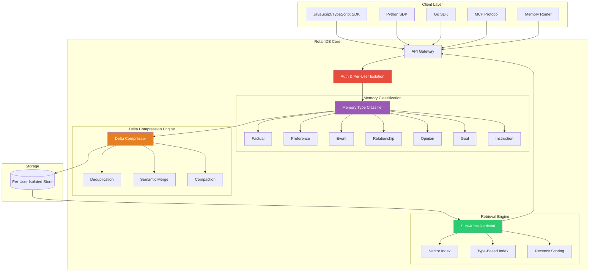
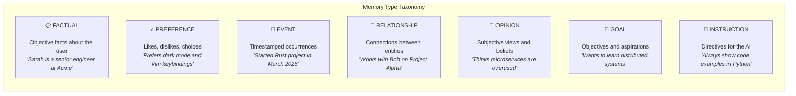
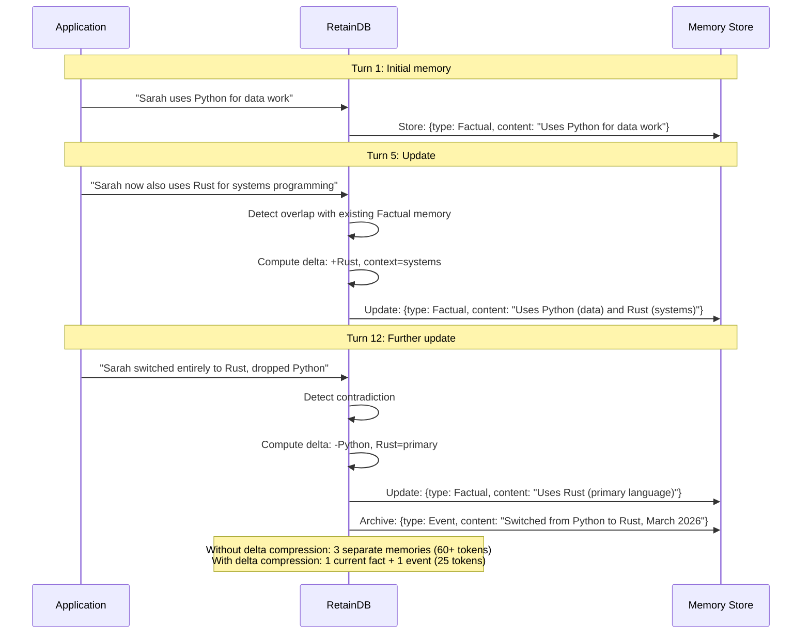
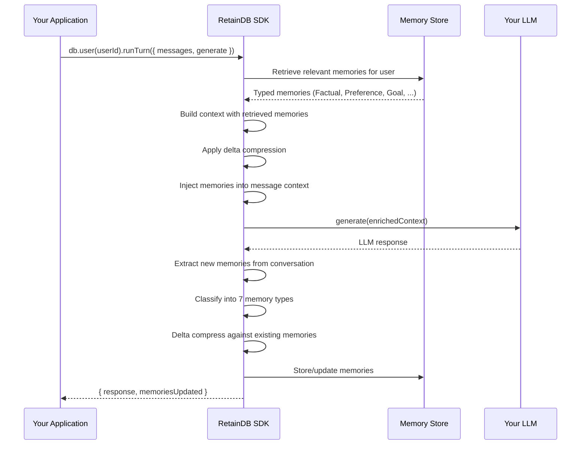

# RetainDB — Deep Dive

**Website:** [retaindb.com](https://retaindb.com) | **License:** Proprietary (SaaS) | **Benchmarks:** SOTA on LongMemEval (self-reported)

> Managed memory SaaS that delivers seven typed memory categories, delta compression for massive token savings, and sub-40ms retrieval — designed for production integration with minimal engineering effort.

---

## Architecture Overview

RetainDB is a fully managed service built around two key innovations: **typed memory classification** (7 distinct memory types) and **delta compression** (50–90% token savings). The architecture is designed for production: per-user isolation, SOC 2 readiness, and multi-SDK support.



---

## The 7 Memory Types

RetainDB classifies every piece of stored information into one of seven semantic types. This classification enables type-specific retrieval strategies and more precise context construction.



| Memory Type | Description | Retrieval Priority | Example |
|-------------|-------------|-------------------|---------|
| **Factual** | Objective facts about entities | High for identity questions | "Sarah is a senior engineer at Acme Corp" |
| **Preference** | Likes, dislikes, chosen defaults | High for personalization | "Prefers dark mode, Vim keybindings, terse answers" |
| **Event** | Time-stamped occurrences | High for temporal queries | "Started Rust project in March 2026" |
| **Relationship** | Connections between people/things | High for social context | "Works with Bob on the analytics pipeline" |
| **Opinion** | Subjective views and beliefs | Medium (context-dependent) | "Thinks microservices add unnecessary complexity" |
| **Goal** | Objectives, aspirations, plans | High for proactive suggestions | "Wants to get Kubernetes certified by June" |
| **Instruction** | Directives for the AI's behavior | Highest (always relevant) | "Always provide code examples, never use emojis" |

### Why Typed Memory Matters

Without types, a retrieval system treats "Sarah lives in Seattle" and "Sarah wants to move to Austin" identically. With types:

- **Factual** ("lives in Seattle") is returned for current-state questions
- **Goal** ("wants to move to Austin") is returned for aspiration questions
- When both conflict, the type signals which is current truth vs. future intent

---

## Delta Compression

Delta compression is RetainDB's approach to keeping memory stores lean. Instead of storing every version of a fact, RetainDB computes and stores only the **changes (deltas)** between memory states.



### Token Savings

| Scenario | Without Compression | With Delta | Savings |
|----------|-------------------|------------|---------|
| User preferences (20 updates) | ~400 tokens | ~80 tokens | **80%** |
| Project context (50 updates) | ~1,200 tokens | ~180 tokens | **85%** |
| Relationship graph (30 updates) | ~600 tokens | ~60 tokens | **90%** |
| Mixed memory (100 turns) | ~2,500 tokens | ~500 tokens | **80%** |

Delta compression delivers **50–90% token savings** depending on how frequently information is updated. This directly translates to lower LLM costs and more room in the context window for other content.

---

## The `runTurn` Flow

RetainDB's primary integration point is the `runTurn` method, which wraps an entire conversation turn — handling memory retrieval, context injection, and memory update in a single call.



---

## Code Examples

### TypeScript / JavaScript

```typescript
import { RetainDB } from "@retaindb/sdk";

const db = new RetainDB({ apiKey: process.env.RETAINDB_KEY });

// The simplest integration: wrap your LLM call with runTurn
const userId = "user_sarah_42";
const messages = [
  { role: "user", content: "I just started learning Rust. Can you help?" }
];

const { response, memoriesUpdated } = await db.user(userId).runTurn({
  messages,
  generate: async (ctx) => {
    // ctx.messages includes injected memory context
    return await openai.chat.completions.create({
      model: "gpt-4o-mini",
      messages: ctx.messages,
    });
  },
});

console.log(response);       // LLM response personalized with user memories
console.log(memoriesUpdated); // [ { type: "Goal", content: "Learning Rust" } ]
```

### Direct Memory Operations

```typescript
const user = db.user("user_sarah_42");

// Manually add a memory
await user.addMemory({
  type: "Preference",
  content: "Prefers concise code examples over verbose explanations"
});

// Query specific memory types
const goals = await user.getMemories({ type: "Goal" });
console.log(goals);
// [{ type: "Goal", content: "Learning Rust", created: "2026-03-15", confidence: 0.92 }]

// Get all memories for context injection
const allMemories = await user.getMemories();
console.log(allMemories);
// Returns typed memories sorted by relevance + recency

// Search memories
const results = await user.searchMemories("programming languages");
console.log(results);
// [{ type: "Factual", content: "Uses Rust (primary language)", score: 0.94 },
//  { type: "Goal", content: "Learning Rust", score: 0.87 }]
```

### Python SDK

```python
from retaindb import RetainDB

db = RetainDB(api_key=os.environ["RETAINDB_KEY"])

user = db.user("user_sarah_42")

# Run a turn with memory
result = user.run_turn(
    messages=[{"role": "user", "content": "Help me with async Rust patterns"}],
    generate=lambda ctx: openai_client.chat.completions.create(
        model="gpt-4o-mini",
        messages=ctx["messages"]
    )
)

print(result["response"])
print(result["memories_updated"])
```

### Memory Router Integration

The Memory Router automatically routes memories to the appropriate type and handles deduplication:

```typescript
import { RetainDB, MemoryRouter } from "@retaindb/sdk";

const db = new RetainDB({ apiKey: process.env.RETAINDB_KEY });
const router = new MemoryRouter(db);

// The router analyzes conversation and auto-classifies memories
await router.processConversation("user_sarah_42", [
  { role: "user", content: "I'm Sarah, I work at Acme Corp as a senior engineer" },
  { role: "assistant", content: "Nice to meet you, Sarah!" },
  { role: "user", content: "I prefer Python but I'm learning Rust. My goal is to build a game engine." },
  { role: "assistant", content: "That's exciting! Rust is great for game engines." },
]);

// The router automatically creates:
// - Factual: "Sarah is a senior engineer at Acme Corp"
// - Preference: "Prefers Python"
// - Goal: "Learning Rust to build a game engine"
// All delta-compressed against any existing memories
```

### MCP Integration

```typescript
// RetainDB also exposes an MCP (Model Context Protocol) server
// for integration with MCP-compatible AI frameworks

// In your MCP client configuration:
const mcpConfig = {
  servers: [{
    name: "retaindb",
    url: "https://mcp.retaindb.com",
    auth: { apiKey: process.env.RETAINDB_KEY }
  }]
};

// MCP tools exposed:
// - retaindb_add_memory(userId, content, type?)
// - retaindb_search_memories(userId, query, type?)
// - retaindb_get_context(userId, maxTokens)
```

---

## Step-by-Step Walkthrough: Customer Support Agent with Memory

### Scenario

You're building a customer support chatbot that remembers each customer's history, preferences, and ongoing issues across sessions.

### Step 1: Initialize RetainDB

```typescript
import { RetainDB } from "@retaindb/sdk";
import OpenAI from "openai";

const db = new RetainDB({ apiKey: process.env.RETAINDB_KEY });
const openai = new OpenAI();
```

### Step 2: First Customer Interaction

```typescript
const customerId = "customer_12345";

const { response } = await db.user(customerId).runTurn({
  messages: [
    { role: "user", content: "Hi, I'm having trouble with my billing. I was charged twice for my Pro plan. My email is alice@example.com" }
  ],
  generate: async (ctx) => {
    return await openai.chat.completions.create({
      model: "gpt-4o-mini",
      messages: [
        { role: "system", content: "You are a helpful customer support agent." },
        ...ctx.messages
      ]
    });
  }
});

// RetainDB automatically extracts and stores:
// - Factual: "Email is alice@example.com"
// - Factual: "Has Pro plan"
// - Event: "Double-charged for Pro plan (March 2026)"
// - Goal: "Wants billing issue resolved"
```

### Step 3: Follow-Up Session (Days Later)

```typescript
// Alice comes back — RetainDB remembers everything
const { response } = await db.user(customerId).runTurn({
  messages: [
    { role: "user", content: "Hi, following up on my issue" }
  ],
  generate: async (ctx) => {
    // ctx.messages now includes injected memory:
    // "Customer alice@example.com, Pro plan, had double-charge issue in March"
    return await openai.chat.completions.create({
      model: "gpt-4o-mini",
      messages: [
        { role: "system", content: "You are a helpful customer support agent. Use the customer's history to provide personalized support." },
        ...ctx.messages
      ]
    });
  }
});

// Agent can immediately reference the billing issue without Alice repeating it
```

### Step 4: Memory Evolves Over Time

```typescript
// After the issue is resolved
const { response } = await db.user(customerId).runTurn({
  messages: [
    { role: "user", content: "The refund came through, thanks! Also, can I upgrade to the Enterprise plan?" }
  ],
  generate: async (ctx) => {
    return await openai.chat.completions.create({
      model: "gpt-4o-mini",
      messages: [
        { role: "system", content: "You are a helpful customer support agent." },
        ...ctx.messages
      ]
    });
  }
});

// Delta compression updates:
// - Event: "Double-charge resolved, refund processed" (updated, not duplicated)
// - Goal: "Wants to upgrade from Pro to Enterprise" (new)
// - Factual: "Has Pro plan" → delta-compressed when upgrade completes
```

---

## Performance & Compliance

| Metric | Value |
|--------|-------|
| **Retrieval latency** | < 40ms (p95) |
| **LongMemEval score** | SOTA (self-reported) |
| **Token savings** | 50–90% via delta compression |
| **User isolation** | Per-user data partitioning |
| **Compliance** | SOC 2 ready |
| **SDKs** | JavaScript/TypeScript, Python, Go |
| **Integration protocols** | REST API, SDK, MCP |

---

## Strengths

- **Zero-effort integration**: `runTurn` wraps your existing LLM calls — minimal code changes required
- **7 typed memory categories**: Semantic classification enables much more precise retrieval than untyped stores
- **Delta compression**: 50–90% token savings compound significantly in production workloads
- **Sub-40ms retrieval**: Production-grade latency that won't slow down your application
- **Multi-SDK support**: Native SDKs for JS/TS, Python, and Go, plus MCP for framework integration
- **SOC 2 readiness**: Enterprise-grade data isolation and compliance posture

## Limitations

- **Proprietary / closed-source**: No self-hosting option — full vendor dependency
- **Benchmark transparency**: SOTA LongMemEval claim is self-reported without published methodology or reproducible benchmarks
- **Pricing opacity**: Usage-based pricing may be unpredictable for high-volume applications
- **Limited customization**: Memory type taxonomy is fixed at 7 types — cannot add custom types
- **No graph capabilities**: Unlike Cognee or Supermemory, RetainDB doesn't build knowledge graphs
- **New entrant**: Limited track record in production compared to established players

## Best For

- **Production applications needing fast integration** — `runTurn` gets you 80% of the value with minimal effort
- **Customer-facing products** where per-user memory isolation is a hard requirement
- **Cost-conscious teams** where delta compression's token savings justify the SaaS cost
- **Multi-language teams** with services in JS, Python, and Go
- **Enterprise environments** requiring SOC 2 compliance readiness

---

## Further Reading

- [RetainDB Documentation](https://docs.retaindb.com)
- [SDK Quickstart Guide](https://docs.retaindb.com/quickstart)
- [Delta Compression Technical Overview](https://retaindb.com/blog/delta-compression)
- [MCP Integration Guide](https://docs.retaindb.com/integrations/mcp)
- Related benchmark: [LongMemEval](https://arxiv.org/abs/2410.10813)
