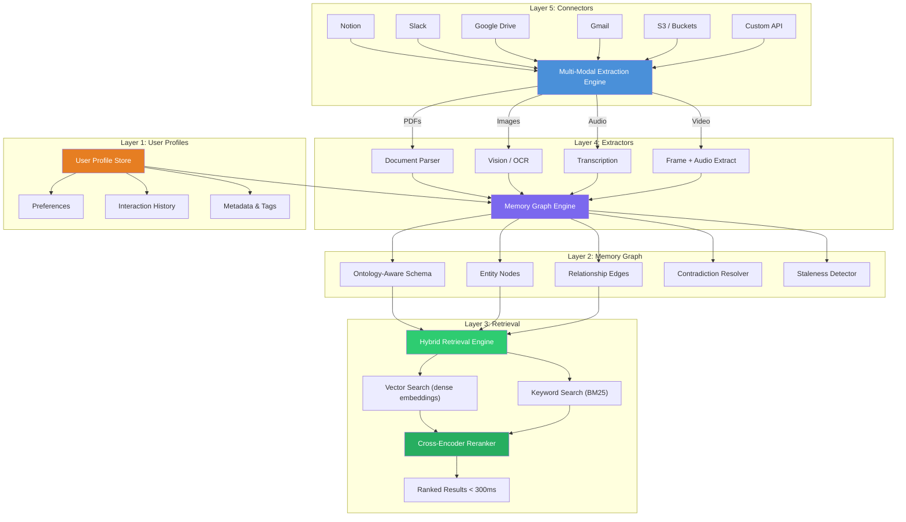
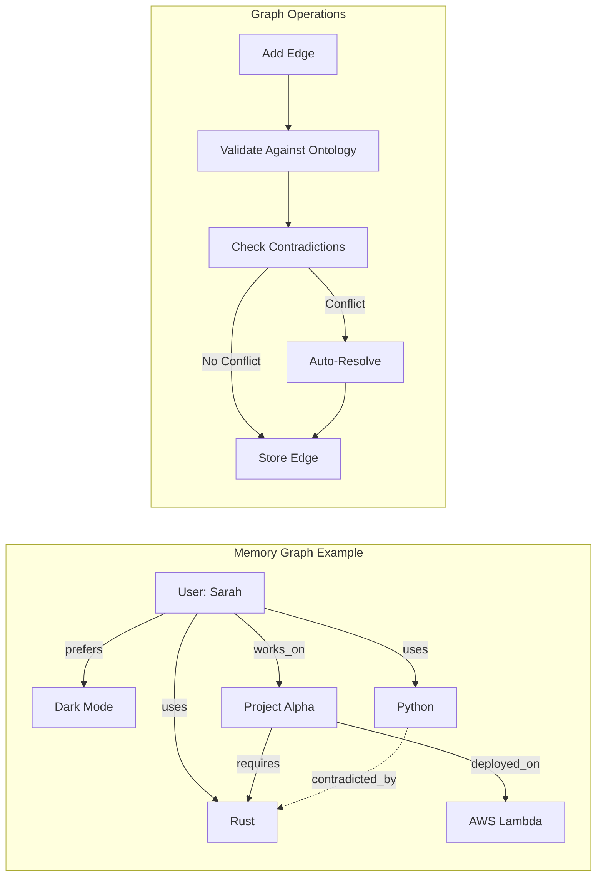
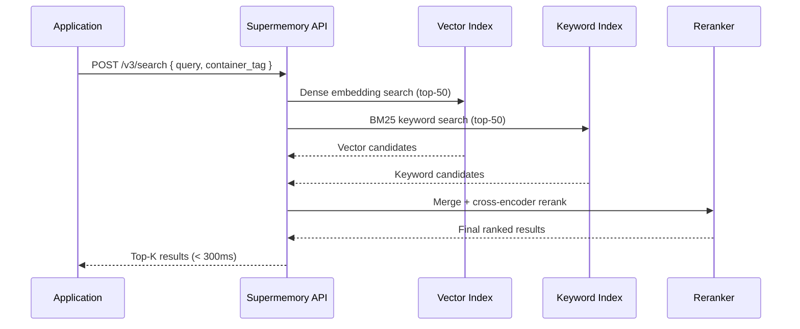
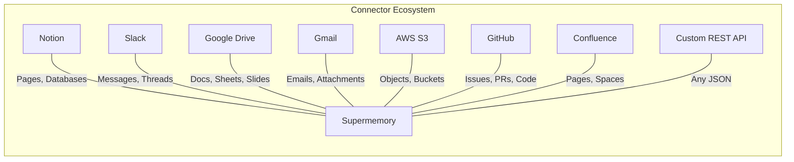

# Supermemory — Deep Dive

**Website:** [supermemory.ai](https://supermemory.ai) | **GitHub:** [supermemory-ai/supermemory](https://github.com/supermemory-ai/supermemory) | **License:** Open-source engine | **Funding:** $2.6M seed

> All-in-one context platform that combines a memory graph, hybrid retrieval, multi-modal extractors, and a broad connector ecosystem into a single managed service.

---

## Architecture Overview

Supermemory is built around **five interconnected layers** that form a complete memory pipeline — from ingestion of raw content across dozens of sources, through intelligent extraction and graph construction, to sub-300ms hybrid retrieval.



---

## The Five Layers Explained

### Layer 1: User Profiles

User profiles are the foundation of Supermemory's personalization. Each user (identified by a `container_tag`) gets an isolated profile that accumulates preferences, interaction patterns, and metadata over time.

| Feature | Description |
|---------|-------------|
| **Container isolation** | Each `container_tag` creates a walled-off memory space |
| **Preference tracking** | Auto-detected from content and queries |
| **Interaction history** | Full audit trail of adds and searches |
| **Metadata indexing** | Custom key-value pairs for filtering |

### Layer 2: Memory Graph

The memory graph is Supermemory's core differentiator. Unlike pure vector stores, it maintains an **ontology-aware graph** where entities are nodes and relationships are typed edges.



**Contradiction Resolution:** When new information conflicts with existing memories (e.g., "User prefers light mode" vs. "User prefers dark mode"), Supermemory automatically:
1. Detects the contradiction via semantic similarity on opposing edges
2. Compares timestamps and confidence scores
3. Keeps the more recent / higher-confidence fact
4. Archives the contradicted fact with a `superseded_by` reference

**Staleness Expiration:** Memories that haven't been accessed or reinforced within a configurable TTL window are automatically demoted, reducing noise in retrieval results.

### Layer 3: Retrieval Engine

Supermemory's retrieval combines **vector search** and **keyword search** with a cross-encoder reranker to deliver sub-300ms latency:



| Retrieval Method | Role | Strengths |
|------------------|------|-----------|
| **Vector (dense)** | Semantic similarity matching | Captures meaning, handles paraphrasing |
| **Keyword (BM25)** | Exact term matching | Precise for names, codes, IDs |
| **Cross-encoder reranker** | Final relevance scoring | Dramatically improves precision |

### Layer 4: Extractors

The multi-modal extraction engine handles diverse content types:

| Content Type | Extraction Method | Output |
|-------------|-------------------|--------|
| **PDFs** | Layout-aware parser + OCR fallback | Structured text with section hierarchy |
| **Images** | Vision model + OCR | Captions, text content, metadata |
| **Audio** | Whisper-class transcription | Timestamped transcript |
| **Video** | Frame sampling + audio extraction | Key frames + full transcript |
| **Web pages** | HTML-to-text with boilerplate removal | Clean content |
| **Code files** | AST-aware parsing | Functions, classes, docstrings |

### Layer 5: Connectors

Connectors provide **bidirectional sync** with external data sources:



Connectors support:
- **Incremental sync**: Only new/changed content is re-indexed
- **Permission mapping**: Source-level ACLs can be reflected in retrieval filters
- **Webhook triggers**: Real-time updates on source changes

---

## API Reference

Supermemory's API centers on two primary endpoints:

### Adding Memories

```python
from supermemory import SuperMemory

client = SuperMemory(api_key="sm_...")

# Add a simple text memory
client.add(
    content="User prefers dark mode and uses Vim keybindings",
    container_tag="user_123"
)

# Add with metadata for filtering
client.add(
    content="Project Alpha deadline is March 2026",
    container_tag="user_123",
    metadata={"type": "project", "priority": "high"}
)

# Add a document (extractor auto-detects type)
client.add(
    content="https://docs.example.com/api-spec.pdf",
    container_tag="user_123",
    metadata={"source": "confluence"}
)
```

**`POST /v3/add`** — Ingests content, runs extraction, updates the memory graph, and indexes for retrieval. Idempotent: duplicate content is deduplicated automatically.

### Searching Memories

```python
# Basic search
results = client.search.memories(
    query="What are the user's editor preferences?",
    container_tag="user_123"
)

for memory in results:
    print(f"[{memory.score:.2f}] {memory.content}")
    # [0.94] User prefers dark mode and uses Vim keybindings

# Filtered search with metadata
results = client.search.memories(
    query="upcoming deadlines",
    container_tag="user_123",
    filters={"type": "project"}
)

# Search with token budget
results = client.search.memories(
    query="everything about the user",
    container_tag="user_123",
    max_tokens=2000  # Fit within context window
)
```

**`POST /v3/search`** — Executes hybrid vector+keyword search, reranks, and returns results. Supports metadata filters and token budgets.

---

## Step-by-Step Walkthrough: Building a Personalized Coding Assistant

### Scenario

You're building a coding assistant that remembers each user's tech stack, preferences, and project context across sessions.

### Step 1: Initialize and Populate Memory

```python
from supermemory import SuperMemory

client = SuperMemory(api_key="sm_...")
USER = "dev_sarah_42"

# After the first conversation, store learned facts
client.add(
    content="Sarah is a senior backend engineer who primarily uses Python and FastAPI. "
            "She prefers type hints everywhere and uses Black for formatting.",
    container_tag=USER
)

client.add(
    content="Sarah's current project is a real-time analytics pipeline using "
            "Apache Kafka and ClickHouse. Deployed on AWS EKS.",
    container_tag=USER
)

client.add(
    content="Sarah prefers concise explanations with code examples. "
            "She dislikes verbose documentation-style responses.",
    container_tag=USER
)
```

### Step 2: Connect External Sources

```python
# Sync Sarah's relevant Notion workspace
client.connectors.create(
    type="notion",
    container_tag=USER,
    config={
        "workspace_id": "notion_ws_...",
        "page_filter": ["Engineering Wiki", "Project Alpha Docs"]
    }
)

# Sync her GitHub repos
client.connectors.create(
    type="github",
    container_tag=USER,
    config={
        "repos": ["sarahdev/analytics-pipeline", "sarahdev/shared-libs"],
        "include": ["README.md", "docs/**", "*.py"]
    }
)
```

### Step 3: Retrieve Context at Query Time

```python
def get_personalized_context(user_id: str, user_query: str) -> str:
    """Build a personalized context block for the LLM."""
    results = client.search.memories(
        query=user_query,
        container_tag=user_id,
        max_tokens=3000
    )
    
    context_parts = []
    for memory in results:
        context_parts.append(f"- {memory.content}")
    
    return "## What I Know About This User\n" + "\n".join(context_parts)

# When Sarah asks: "How should I handle backpressure in my pipeline?"
context = get_personalized_context(USER, "backpressure handling in pipeline")
# Returns relevant memories about her Kafka + ClickHouse stack,
# her preference for concise code examples, and any relevant
# content synced from her Notion docs or GitHub repos.
```

### Step 4: Update Memory After Conversations

```python
# After Sarah mentions she's switching from ClickHouse to DuckDB
client.add(
    content="Sarah is migrating the analytics pipeline from ClickHouse to DuckDB "
            "for cost reasons. Migration started February 2026.",
    container_tag=USER
)
# Supermemory auto-detects the contradiction with the earlier ClickHouse mention
# and updates the memory graph accordingly, archiving the old fact.
```

---

## Benchmarks

| Benchmark | Score | Ranking |
|-----------|-------|---------|
| **LongMemEval** | 85.2% | Top tier |
| **LoCoMo** | — | #1 (self-reported) |
| **ConvoMem** | — | #1 (self-reported) |

LongMemEval measures a system's ability to recall and reason over information distributed across long conversation histories. Supermemory's 85.2% score reflects the strength of its hybrid retrieval + memory graph combination.

---

## Pricing

| Plan | Price | Token Budget | Features |
|------|-------|-------------|----------|
| **Free** | $0/mo | 1M tokens/mo | Core API, 1 connector |
| **Pro** | $19/mo | 10M tokens/mo | All connectors, priority support |
| **Scale** | $399/mo | Unlimited | Custom ontologies, SLA, dedicated infra |

---

## Strengths

- **All-in-one platform**: Connectors, extractors, graph, and retrieval in a single service — no need to stitch together separate tools
- **Hybrid retrieval under 300ms**: Vector + keyword + reranking delivers both precision and recall at production latencies
- **Automatic contradiction resolution**: Memory graph handles conflicting facts without developer intervention
- **Multi-modal extraction**: Natively handles PDFs, images, audio, and video without external preprocessing
- **Open-source engine**: Core is open-source for self-hosting; managed cloud for production

## Limitations

- **Managed-service dependency**: Full feature set (especially connectors) requires the cloud service
- **Graph opacity**: Memory graph construction is largely automatic — limited control over ontology in lower tiers
- **Benchmark transparency**: LoCoMo and ConvoMem #1 claims are self-reported without published methodology
- **Connector depth**: While breadth is impressive, some connectors may lack fine-grained sync controls
- **Newer entrant**: $2.6M seed stage — less battle-tested than Mem0 (38K+ stars) or Letta (40K+ stars)

## Best For

- **Teams wanting a turnkey memory solution** with broad data source coverage
- **Multi-modal applications** that need to ingest diverse content types
- **Products requiring fast, hybrid retrieval** without managing separate vector and keyword indices
- **Startups and mid-stage companies** that want to avoid building memory infrastructure from scratch

---

## Further Reading

- [Supermemory Documentation](https://docs.supermemory.ai)
- [GitHub Repository](https://github.com/supermemory-ai/supermemory)
- [Memory Graph Technical Overview](https://supermemory.ai/blog/memory-graph)
- Related benchmark papers: [LongMemEval](https://arxiv.org/abs/2410.10813), [LoCoMo](https://arxiv.org/abs/2402.10790)
