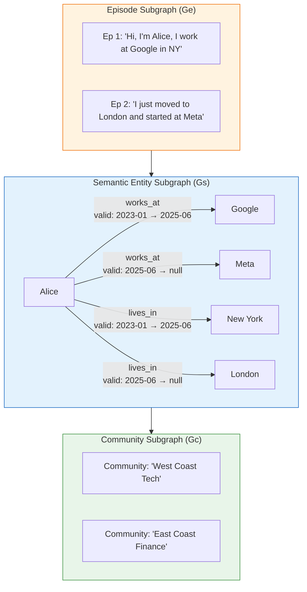
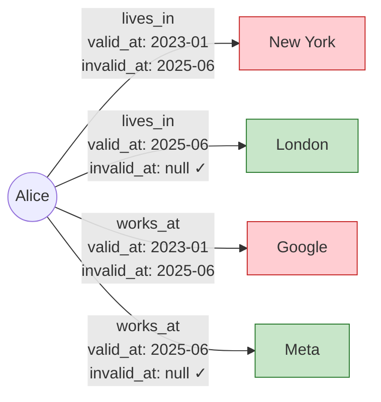
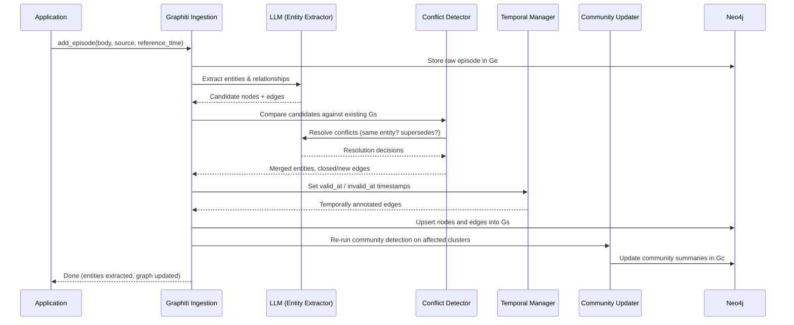
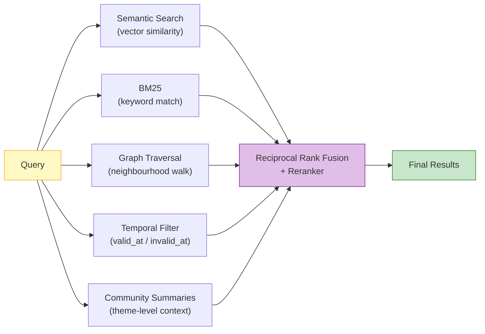

# Zep / Graphiti — Deep Dive

**Temporal Knowledge Graph Memory for Agents**

| Stat | Value |
|------|-------|
| **Website** | [getzep.com](https://getzep.com) |
| **Open-Source Engine** | [Graphiti](https://github.com/getzep/graphiti) — 24K+ GitHub stars |
| **License** | Graphiti: Apache 2.0 (Zep Cloud: proprietary) |
| **Paper** | [arXiv:2501.13956](https://arxiv.org/abs/2501.13956) (Jan 2025) |
| **Backing Store** | Neo4j (required) |
| **Key Differentiator** | Bi-temporal edges — every relationship knows *when* it was true and *when* it was superseded |
| **DMR Benchmark** | 94.8% (vs. MemGPT 93.4%) |

---

## 1. Architecture Overview

Graphiti organises knowledge into three hierarchical subgraphs that move from raw provenance at the bottom to high-level summaries at the top.



| Tier | Name | Purpose | Contents |
|------|------|---------|----------|
| **Ge** | Episode Subgraph | Provenance | Raw messages, text chunks, structured data. Every fact can be traced back to the episode that introduced it. |
| **Gs** | Semantic Entity Subgraph | Reasoning | Entities as nodes, relationships as directed edges. Each edge carries bi-temporal metadata (`valid_at`, `invalid_at`). |
| **Gc** | Community Subgraph | Summarisation | High-level summaries of entity clusters generated by community detection algorithms. Used for broad, theme-level queries. |

### Why Three Tiers?

- **Ge** preserves the raw record so you can audit *why* the system believes something.
- **Gs** distils raw episodes into a structured graph that supports precise temporal queries.
- **Gc** provides global context (e.g., "summarise everything about Alice's career") without traversing the entire graph.

---

## 2. The Bi-Temporal Model

The bi-temporal model is Graphiti's defining innovation. Every relationship edge carries two timestamps:

| Field | Meaning |
|-------|---------|
| `valid_at` | The real-world moment when this relationship became true |
| `invalid_at` | The real-world moment when this relationship was superseded (`null` if still current) |



> Red = superseded edge, Green = currently valid edge.

### Temporal Query Examples

| Query | Resolution |
|-------|------------|
| "Where does Alice live?" | Find `lives_in` edge where `invalid_at IS NULL` → **London** |
| "Where did Alice live in 2024?" | Find `lives_in` edge where `valid_at ≤ 2024 AND (invalid_at > 2024 OR invalid_at IS NULL)` → **New York** |
| "What changed about Alice in June 2025?" | Find all edges where `valid_at = 2025-06 OR invalid_at = 2025-06` → Moved to London, joined Meta |
| "Show Alice's complete career history" | Return all `works_at` edges regardless of `invalid_at` → Google (2023–2025), Meta (2025–present) |

### Why Bi-Temporal Beats Simple Upsert

Most memory systems (e.g., Mem0) resolve conflicts by *replacing* old facts. This destroys temporal history. Graphiti instead *closes* the old edge (sets `invalid_at`) and *opens* a new one, preserving the complete timeline.

```
# Simple upsert (e.g., Mem0):
Alice --lives_in--> New York   →   DELETE
Alice --lives_in--> London     →   INSERT
# History is lost. "Where did Alice live in 2024?" → No answer.

# Bi-temporal (Graphiti):
Alice --lives_in--> New York   [valid_at: 2023-01, invalid_at: 2025-06]  ← closed
Alice --lives_in--> London     [valid_at: 2025-06, invalid_at: null]     ← opened
# Both edges survive. Temporal queries work.
```

---

## 3. Episode Ingestion Pipeline

Every new piece of information enters Graphiti as an **episode**. The ingestion pipeline processes episodes through five stages.



### Stage Details

1. **Episode Storage (Ge):** The raw input is persisted verbatim. This is the immutable audit trail.
2. **Entity & Relationship Extraction:** An LLM parses the episode body and emits structured triples (subject, predicate, object) along with candidate `valid_at` timestamps inferred from the `reference_time` and text cues.
3. **Conflict Detection:** Candidate edges are compared to existing edges on the same entity pair. The LLM determines whether a new edge *supersedes*, *contradicts*, *refines*, or is *independent of* existing edges.
4. **Temporal Edge Management:** Superseded edges get their `invalid_at` set to the new edge's `valid_at`. New edges are inserted with `invalid_at = null`.
5. **Community Updates:** Affected entity clusters are re-evaluated. Community summaries are regenerated to reflect the new information.

---

## 4. Retrieval Architecture

Graphiti's retrieval is a hybrid pipeline that fuses five signals before returning results.



| Signal | What it does | When it helps |
|--------|-------------|---------------|
| **Semantic search** | Cosine similarity over entity/edge embeddings | "Tell me about Alice's career" |
| **BM25** | Full-text keyword matching | "Find mentions of Neo4j" |
| **Graph traversal** | Walks 1–2 hops from matched entities | "What else is related to Alice?" |
| **Temporal filter** | Restricts edges to those valid in a time window | "What was true in Q1 2024?" |
| **Community summaries** | Injects cluster-level summaries for breadth | "Summarise Alice's professional network" |

Results from all five signals are merged using **reciprocal rank fusion** and optionally reranked by a cross-encoder.

---

## 5. Community Detection & High-Level Summaries

The Community Subgraph (Gc) uses graph community detection (inspired by the Leiden algorithm) to cluster densely connected entities. Each cluster gets an LLM-generated summary.

### How It Works

1. After graph mutations, Graphiti runs community detection on the affected region of Gs.
2. Entities that are tightly interconnected (many shared edges) are grouped into a community.
3. An LLM generates a natural-language summary of each community by reading the member entities and their relationships.
4. Summaries are embedded and stored in Gc.

### Example

Given a graph with:
- Alice → works_at → Meta
- Alice → collaborates_with → Bob
- Bob → works_at → Meta
- Meta → headquartered_in → Menlo Park

Community detection groups {Alice, Bob, Meta, Menlo Park} into a cluster. The generated summary:

> *"Alice and Bob both work at Meta, headquartered in Menlo Park. Alice previously worked at Google in New York before joining Meta in June 2025."*

### Why Communities Matter

- **Broad queries:** "Tell me about Alice's professional life" can be answered from a community summary without traversing every edge.
- **Token efficiency:** One summary replaces dozens of individual triples.
- **Context injection:** Communities provide the LLM with thematic context that individual edges lack.

---

## 6. SDK Usage — Real Code Examples

### Basic Setup and Episode Ingestion

```python
from graphiti_core import Graphiti
from graphiti_core.nodes import EpisodeType
from datetime import datetime, timezone
import asyncio

async def main():
    # Connect to Neo4j
    graphiti = Graphiti("bolt://localhost:7687", "neo4j", "password")

    # Create indices on first run
    await graphiti.build_indices_and_constraints()

    # Ingest a sequence of messages as episodes
    episodes = [
        ("Chat 1", "User: Hi, I'm Alice and I work at Google in New York."),
        ("Chat 2", "Assistant: Nice to meet you Alice! How can I help?"),
        ("Chat 3", "User: I'm looking for restaurants near my office."),
        ("Chat 4", "User: Actually, I just moved to London and started at Meta."),
    ]

    for name, body in episodes:
        await graphiti.add_episode(
            name=name,
            episode_body=body,
            source=EpisodeType.message,
            source_description="Support chat",
            reference_time=datetime.now(timezone.utc),
        )

    # Search: "Where does Alice work?" returns the *current* edge
    results = await graphiti.search("Where does Alice work?")
    for r in results:
        print(f"  {r.fact} (valid: {r.valid_at} → {r.invalid_at})")
    # Output: Alice works at Meta (valid: 2025-06 → None)

    await graphiti.close()

asyncio.run(main())
```

### Temporal Querying

```python
async def temporal_query(graphiti: Graphiti):
    # Point-in-time query
    results = await graphiti.search("Where did Alice live in 2024?")
    for r in results:
        print(f"  {r.fact} (valid: {r.valid_at} → {r.invalid_at})")
    # Output: Alice lives in New York (valid: 2023-01 → 2025-06)

    # "What changed?" query
    results = await graphiti.search("What changed about Alice recently?")
    for r in results:
        if r.invalid_at:
            print(f"  [SUPERSEDED] {r.fact}")
        else:
            print(f"  [CURRENT]    {r.fact}")
```

### Ingesting Structured Data (Not Just Chat)

```python
import json

async def ingest_crm_record(graphiti: Graphiti):
    crm_event = {
        "type": "deal_update",
        "account": "Acme Corp",
        "stage": "Closed Won",
        "value": "$240K",
        "rep": "Bob Smith",
        "closed_date": "2025-03-15",
    }

    await graphiti.add_episode(
        name="CRM Deal: Acme Corp",
        episode_body=json.dumps(crm_event),
        source=EpisodeType.json,
        source_description="Salesforce CRM export",
        reference_time=datetime(2025, 3, 15, tzinfo=timezone.utc),
    )
```

---

## 7. Walkthrough: Tracking Alice's Career Over Time

This end-to-end walkthrough shows how Graphiti's bi-temporal model handles an evolving real-world scenario.

### Timeline

| Date | Event |
|------|-------|
| **2023-01** | Alice joins Google as an engineer in New York |
| **2024-06** | Alice gets promoted to Senior Engineer at Google |
| **2025-06** | Alice leaves Google, joins Meta in London |
| **2025-11** | Alice becomes a Tech Lead at Meta |

### Step 1: Initial State (Jan 2023)

After ingesting: *"Hi, I'm Alice and I work at Google in New York as an engineer."*

```
Graph edges in Gs:
  Alice --works_at--> Google        [valid_at: 2023-01, invalid_at: null]
  Alice --lives_in--> New York      [valid_at: 2023-01, invalid_at: null]
  Alice --has_role--> Engineer      [valid_at: 2023-01, invalid_at: null]
```

### Step 2: Promotion (Jun 2024)

After ingesting: *"I just got promoted to Senior Engineer at Google!"*

Conflict detection finds the existing `has_role → Engineer` edge. The LLM determines this is a *supersession* (promotion replaces old role).

```
Graph edges in Gs:
  Alice --works_at--> Google        [valid_at: 2023-01, invalid_at: null]
  Alice --lives_in--> New York      [valid_at: 2023-01, invalid_at: null]
  Alice --has_role--> Engineer      [valid_at: 2023-01, invalid_at: 2024-06]  ← closed
  Alice --has_role--> Sr. Engineer  [valid_at: 2024-06, invalid_at: null]     ← new
```

### Step 3: Company Change (Jun 2025)

After ingesting: *"I just moved to London and started at Meta."*

Three edges are affected: `works_at`, `lives_in`, and `has_role`.

```
Graph edges in Gs:
  Alice --works_at--> Google        [valid_at: 2023-01, invalid_at: 2025-06]  ← closed
  Alice --works_at--> Meta          [valid_at: 2025-06, invalid_at: null]     ← new
  Alice --lives_in--> New York      [valid_at: 2023-01, invalid_at: 2025-06]  ← closed
  Alice --lives_in--> London        [valid_at: 2025-06, invalid_at: null]     ← new
  Alice --has_role--> Engineer      [valid_at: 2023-01, invalid_at: 2024-06]
  Alice --has_role--> Sr. Engineer  [valid_at: 2024-06, invalid_at: 2025-06]  ← closed
```

### Step 4: New Role (Nov 2025)

After ingesting: *"Great news — I've been made Tech Lead at Meta!"*

```
Graph edges in Gs:
  Alice --works_at--> Meta          [valid_at: 2025-06, invalid_at: null]
  Alice --lives_in--> London        [valid_at: 2025-06, invalid_at: null]
  Alice --has_role--> Tech Lead     [valid_at: 2025-11, invalid_at: null]     ← new
  # ... plus all historical closed edges preserved
```

### Querying the Timeline

```python
# "What was Alice's role in March 2024?"
results = await graphiti.search("Alice's role in March 2024")
# → Engineer at Google (valid 2023-01 to 2024-06)

# "Show me Alice's complete work history"
results = await graphiti.search("Alice's career history")
# → Google Engineer (2023-01 to 2024-06)
# → Google Sr. Engineer (2024-06 to 2025-06)
# → Meta Tech Lead (2025-11 to present)

# "What changed in June 2025?"
results = await graphiti.search("What changed about Alice in June 2025?")
# → Left Google, joined Meta, moved from New York to London
```

---

## 8. Benchmark Performance

| Benchmark | Graphiti/Zep | Competitor | Delta |
|-----------|-------------|------------|-------|
| **DMR** | **94.8%** | MemGPT: 93.4% | +1.4pp |
| **LongMemEval** | +18.5% accuracy | Baseline | +18.5pp, 90% lower latency |
| **LoCoMo** | **75.1%** | — | — |

### What the Benchmarks Measure

- **DMR (Dynamic Memory Recall):** Tests a system's ability to track and recall facts that change over time. Graphiti's temporal model gives it a natural advantage here.
- **LongMemEval:** Measures accuracy and latency across long multi-session conversations. The +18.5% accuracy gain and 90% latency reduction both stem from not needing to re-read full conversation history.
- **LoCoMo:** Long conversation memory benchmark. Graphiti's 75.1% score, while strong, trails some competitors (e.g., ByteRover at 92.2%, Hindsight at 89.6%). This reflects Graphiti's emphasis on temporal precision over raw recall volume.

### Interpretation

Graphiti excels on temporal/dynamic benchmarks (DMR, LongMemEval) where its bi-temporal model is a structural advantage. On static long-memory benchmarks (LoCoMo), systems with more aggressive retrieval strategies can score higher.

---

## 9. Comparison with Microsoft GraphRAG

Graphiti and Microsoft's GraphRAG both use knowledge graphs, but they serve fundamentally different use cases.

| Dimension | Graphiti (Zep) | Microsoft GraphRAG |
|-----------|---------------|-------------------|
| **Primary use case** | Conversational agent memory | Document corpus Q&A |
| **Data model** | Bi-temporal entity graph | Static entity graph |
| **Temporal awareness** | First-class (`valid_at`/`invalid_at`) | None — snapshot of corpus at index time |
| **Ingestion model** | Incremental (episode-by-episode) | Batch (entire corpus re-indexed) |
| **Community summaries** | Dynamic, updated on each mutation | Static, generated at index time |
| **Update cost** | O(1) per episode — local graph patch | O(n) — full re-indexing required |
| **Contradiction handling** | Bi-temporal edge closure | Last-write-wins or manual |
| **Real-time use** | Designed for live conversations | Designed for offline analysis |
| **Retrieval** | Hybrid: semantic + BM25 + graph + temporal + community | Map-reduce over community summaries |
| **Backing store** | Neo4j | Azure AI Search / custom |
| **Open source** | Graphiti core: Apache 2.0 | GraphRAG: MIT |

### When to Choose Which

- **Choose Graphiti** when your data changes over time and you need to reason about *when* things were true — user profiles, CRM data, evolving business context.
- **Choose GraphRAG** when you have a large static corpus and need global-context answers — research papers, legal documents, technical documentation.

---

## 10. Strengths

- **Best-in-class temporal reasoning.** No other memory system handles "what was true at time T?" with the same structural elegance.
- **Provenance and auditability.** Every fact traces back to the episode that introduced it, with immutable Episode Subgraph records.
- **Incremental updates.** New information is ingested without re-indexing the entire graph.
- **Hybrid retrieval.** Five-signal fusion (semantic, BM25, graph, temporal, community) covers a wide range of query types.
- **Enterprise-ready.** Cross-session synthesis, business data integration (JSON, CRM records), and Zep Cloud for managed deployments.
- **Open-source core.** Graphiti is fully usable without Zep Cloud.
- **Community summaries.** Gc provides efficient broad-context answers without full graph traversal.

---

## 11. Limitations

- **Neo4j dependency.** Requires a running Neo4j instance. No embedded or lighter graph store alternative. This raises infrastructure complexity compared to vector-only systems.
- **LLM-intensive ingestion.** Every episode triggers entity extraction, conflict detection, and community updates — all requiring LLM calls. Costs scale with ingestion volume.
- **LoCoMo gap.** 75.1% trails competitors like ByteRover (92.2%) and Hindsight (89.6%) on the LoCoMo benchmark, indicating room for improvement on raw recall tasks.
- **Cloud features are proprietary.** Zep Cloud adds user management, auth, and hosted infrastructure, but these are not open-source.
- **Graph complexity.** Operators need to understand temporal graph semantics to debug or extend the system. This is a steeper learning curve than flat-memory systems.
- **Community detection overhead.** Re-running community detection on every mutation can add latency for high-throughput ingestion.

---

## 12. Best For

- **Enterprise applications with evolving business data** — CRM, customer support, sales intelligence where facts change over time.
- **Systems requiring temporal reasoning** — "What changed?", "What was true in Q3?", "Show me the history of this account."
- **Cross-session information synthesis** — Agents that accumulate knowledge over many conversations and must reconcile contradictions.
- **Applications where fact provenance matters** — Regulated industries (finance, healthcare, legal) that need audit trails.
- **Dynamic knowledge bases** — Any domain where the truth evolves and historical context has value.

---

## References

- Graphiti Paper: [arXiv:2501.13956](https://arxiv.org/abs/2501.13956) — *"Graphiti: Building Real-Time, Temporally Aware Knowledge Graphs for AI Agents"*
- Graphiti GitHub: [github.com/getzep/graphiti](https://github.com/getzep/graphiti)
- Zep Cloud: [getzep.com](https://getzep.com)
- Microsoft GraphRAG (for comparison): [github.com/microsoft/graphrag](https://github.com/microsoft/graphrag)
